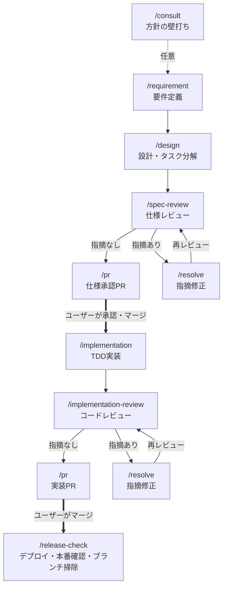
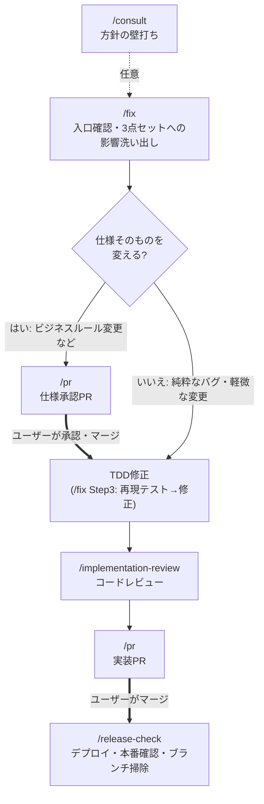

# Skill一覧と遷移図

このプロジェクトの開発作業はすべて `.claude/skills/` 配下のSkillとして手順化されている。各Skillは冒頭に「ワークフロー上の位置」を持ち、完了時に次のステップを案内する。

## まとめ表

### 機能開発フロー(工程Skill)

| Skill | 役割 | 使うタイミング | 完了後の遷移先 |
|---|---|---|---|
| [consult](consult/SKILL.md) | 方針の壁打ち。ファイルを変更せず論点整理と推奨案の提示に徹する | 作る前に方針・技術選定・機能の切り方を相談したいとき(任意) | /requirement または /fix |
| [requirement](requirement/SKILL.md) | 要件ヒアリング→requirements.md作成。spec分割・新規spec vs 既存spec更新の判断・`[n]`採番 | 新しい機能・アプリの要件定義を始めるとき | /design |
| [design](design/SKILL.md) | design.md(処理フロー中心)とtasks.md(TDDタスク分解)の作成 | requirements.md作成後 | /spec-review |
| [spec-review](spec-review/SKILL.md) | 3点セットの一括レビュー(チェックリスト・重要度・テンプレート付き)。実施はspec-reviewerエージェント | 3点セットが揃ったとき | 指摘あり: /resolve / なし: /pr(仕様承認PR) |
| [pr](pr/SKILL.md) | 仕様承認PR・実装PRの作成。承認ゲートの運用、spec-pr-reviewer・CIの確認 | レビュー通過後 | 仕様承認PR承認後: /implementation / 実装PRマージ後: /release-check |
| [implementation](implementation/SKILL.md) | TDD実装(Red→Green→Refactor)。テスト命名・仕様コメント・spec-coverage対応付け。並行開発時などはimplementerエージェントに委譲可 | 仕様承認PRのマージ後 | /implementation-review |
| [implementation-review](implementation-review/SKILL.md) | 実装のコードレビュー(仕様整合・テスト・品質のチェックリスト・重要度・テンプレート付き)。実施はcode-reviewerエージェント | 実装・動作確認の完了後 | 指摘あり: /resolve / なし: /pr(実装PR) |
| [resolve](resolve/SKILL.md) | レビュー指摘の修正。重要度順に対応し、対応結果を報告する | /spec-review・/implementation-review・PR上で指摘を受けたとき | 指摘元のレビューを再実行 → /pr |
| [fix](fix/SKILL.md) | バグ修正・既存機能の小規模改修の入口。既存spec更新の影響洗い出しと承認要否の判断 | 計算誤り・文言修正・スコープ外項目への対応など | 仕様変更あり: /pr(仕様承認PR) / 純粋なバグ: 修正後 /implementation-review |
| [release-check](release-check/SKILL.md) | Cloudflare Workersへのデプロイ確認、本番スモークチェック、マージ済みブランチ掃除。実施はrelease-checkerエージェント | 実装PRのマージ後(毎回) | 完了(問題があれば /fix) |

### 定期作業Skill(開発ループ外)

| Skill | 役割 | 頻度 | 異常時の遷移先 |
|---|---|---|---|
| [law-revision-check](law-revision-check/SKILL.md) | 給付率・上限額など法令由来の前提値を公式資料と突き合わせる | 毎年7月・4月+制度変更のニュース時 | /fix(仕様変更フロー) |
| [dependency-update](dependency-update/SKILL.md) | npm依存パッケージの更新と検証 | 月1回+脆弱性報告時 | /pr(実装PR) |
| [data-check](data-check/SKILL.md) | Supabase保存データの健全性確認(SQLを用意しダッシュボードで実行してもらう) | 月1回+DB機能リリース直後 | /fix |
| [spec-audit](spec-audit/SKILL.md) | 仕様書・skip.json・architecture.mdと実態の乖離の棚卸し | 四半期に1回 | /fix または修正PR |
| [retrospective](retrospective/SKILL.md) | ワークフローと実際の進め方のずれを振り返り、Skill側を更新する | 月1回〜四半期に1回 | /pr(Skill更新PR) |

### 知識Skill(工程から参照される)

| Skill | 役割 | 参照元 |
|---|---|---|
| [architecture-workflow](architecture-workflow/SKILL.md) | `specs/<アプリ名>/architecture.md`(アプリ全体像)の作成・更新 | /requirement、/design、/spec-audit |
| [claude-settings](claude-settings/SKILL.md) | `.claude/settings.json`のpermissions.allow変更時のpermissions.md同期 | /implementation-review |
| [parallel-work](parallel-work/SKILL.md) | git worktreeで作業ディレクトリを分けて複数機能を並行開発する手順と注意事項 | /requirement、/fix、/implementation、/pr、/release-check |
| [run-benriyatool](run-benriyatool/SKILL.md) | devサーバーを起動しheadless Chrome(driver.mjs)で実機操作・スクリーンショット確認する手順 | /implementation-review、「実機で確認して」等の依頼全般 |

### Agent(作業者)

Skill=手順・知識・テンプレート、Agent=別コンテキストで動く作業者、という役割分担。どの工程をAgent化するかの判断基準・今後の導入予定・モデル選定基準は [docs/adr/0002](../../docs/adr/0002-skill-agent-separation.md) を参照。

| Agent | 役割 | 起動元 | モデル |
|---|---|---|---|
| [spec-reviewer](../agents/spec-reviewer.md) | 仕様3点セットのレビュー。書き込みツールを持たず報告に徹する | /spec-review | inherit(判断が本体) |
| [code-reviewer](../agents/code-reviewer.md) | 実装コードのレビュー。テスト・lint等は実行するが修正はしない | /implementation-review | inherit(判断が本体) |
| [spec-pr-reviewer](../agents/spec-pr-reviewer.md) | PR作成前の横断チェック(承認ステータス・spec-coverage・permissions.md同期・CI) | /pr | haiku(機械的チェック) |
| [release-checker](../agents/release-checker.md) | デプロイ確認・本番スモークチェック・マージ済みブランチ掃除 | /release-check | haiku(機械的チェック) |
| [implementer](../agents/implementer.md) | 承認済み仕様のTDD実装。仕様との食い違い時は中断して報告 | /implementation(並行開発時などの委譲は任意) | sonnet(仕様に拘束された作業) |

## 遷移図1: 新機能開発の流れ

- 太線(=)はユーザーの承認・マージ待ち。仕様承認PRがマージされるまでコード(テスト含む)は書かない(仕様承認ゲート)
- mainへのマージは常にユーザーがGitHub UIで行う

## 遷移図2: バグ修正・既存機能改修の流れ

- レビューで指摘が出た場合の `/resolve` ループは遷移図1と同じ(省略)
- 本番(`/release-check`)で問題を見つけた場合もこの図の `/fix` から入る

## 定期作業の遷移

定期作業は独立して実行し、問題が見つかったときだけ上の2つの流れに合流する(合流先は[まとめ表](#定期作業skill開発ループ外)の「異常時の遷移先」列を参照)。問題がなければユーザーへの報告のみで完了する。

## この文書の保守

Skill・Agentの追加・削除・遷移の変更をしたら、このREADMEの表と遷移図も同じPRで更新する(/retrospective の確認対象)。Agentの追加・変更時は[docs/adr/0002](../../docs/adr/0002-skill-agent-separation.md)の判断基準・導入順との整合も確認する。