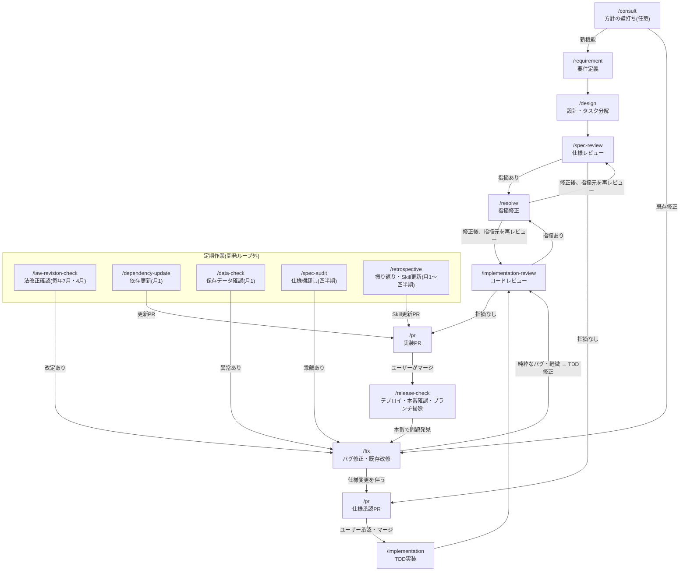

# Skill一覧と遷移図

このプロジェクトの開発作業はすべて `.claude/skills/` 配下のSkillとして手順化されている。各Skillは冒頭に「ワークフロー上の位置」を持ち、完了時に次のステップを案内する。

## まとめ表

### 機能開発フロー(工程Skill)

| Skill | 役割 | 使うタイミング | 完了後の遷移先 |
|---|---|---|---|
| [consult](consult/SKILL.md) | 方針の壁打ち。ファイルを変更せず論点整理と推奨案の提示に徹する | 作る前に方針・技術選定・機能の切り方を相談したいとき(任意) | /requirement または /fix |
| [requirement](requirement/SKILL.md) | 要件ヒアリング→requirements.md作成。spec分割・新規spec vs 既存spec更新の判断・`[n]`採番 | 新しい機能・アプリの要件定義を始めるとき | /design |
| [design](design/SKILL.md) | design.md(処理フロー中心)とtasks.md(TDDタスク分解)の作成 | requirements.md作成後 | /spec-review |
| [spec-review](spec-review/SKILL.md) | 3点セットの一括レビュー(チェックリスト・重要度・テンプレート付き) | 3点セットが揃ったとき | 指摘あり: /resolve / なし: /pr(仕様承認PR) |
| [pr](pr/SKILL.md) | 仕様承認PR・実装PRの作成。承認ゲートの運用、spec-pr-reviewer・CIの確認 | レビュー通過後 | 仕様承認PR承認後: /implementation / 実装PRマージ後: /release-check |
| [implementation](implementation/SKILL.md) | TDD実装(Red→Green→Refactor)。テスト命名・仕様コメント・spec-coverage対応付け | 仕様承認PRのマージ後 | /implementation-review |
| [implementation-review](implementation-review/SKILL.md) | 実装のコードレビュー(仕様整合・テスト・品質のチェックリスト・重要度・テンプレート付き) | 実装・動作確認の完了後 | 指摘あり: /resolve / なし: /pr(実装PR) |
| [resolve](resolve/SKILL.md) | レビュー指摘の修正。重要度順に対応し、対応結果を報告する | /spec-review・/implementation-review・PR上で指摘を受けたとき | 指摘元のレビューを再実行 → /pr |
| [fix](fix/SKILL.md) | バグ修正・既存機能の小規模改修の入口。既存spec更新の影響洗い出しと承認要否の判断 | 計算誤り・文言修正・スコープ外項目への対応など | 仕様変更あり: /pr(仕様承認PR) / 純粋なバグ: 修正後 /implementation-review |
| [release-check](release-check/SKILL.md) | Cloudflare Workersへのデプロイ確認、本番スモークチェック、マージ済みブランチ掃除 | 実装PRのマージ後(毎回) | 完了(問題があれば /fix) |

### 定期作業Skill(開発ループ外)

| Skill | 役割 | 頻度 | 異常時の遷移先 |
|---|---|---|---|
| [law-revision-check](law-revision-check/SKILL.md) | 給付率・上限額など法令由来の前提値を公式資料と突き合わせる | 毎年7月・4月+制度変更のニュース時 | /fix(仕様変更フロー) |
| [dependency-update](dependency-update/SKILL.md) | npm依存パッケージの更新と検証 | 月1回+脆弱性報告時 | /pr(実装PR) |
| [data-check](data-check/SKILL.md) | Supabase保存データの健全性確認(SQLを用意しダッシュボードで実行してもらう) | 月1回+DB機能リリース直後 | /fix |
| [spec-audit](spec-audit/SKILL.md) | 仕様書・skip.json・architecture.mdと実態の乖離の棚卸し | 四半期に1回 | /fix または修正PR |
| [retrospective](retrospective/SKILL.md) | ワークフローと実際の進め方のずれを振り返り、Skill側を更新する | 月1回〜四半期に1回 | /pr(Skill更新PR) |

### 知識Skill(工程から参照される)

| Skill | 役割 | 参照元 |
|---|---|---|
| [architecture-workflow](architecture-workflow/SKILL.md) | `specs/<アプリ名>/architecture.md`(アプリ全体像)の作成・更新 | /requirement、/design、/spec-audit |
| [claude-settings](claude-settings/SKILL.md) | `.claude/settings.json`のpermissions.allow変更時のpermissions.md同期 | /implementation-review |

## 遷移図

- 実線の本流: `/requirement → /design → /spec-review → /pr(仕様承認) → /implementation → /implementation-review → /pr(実装) → /release-check`
- 仕様承認PRがマージされるまでコード(テスト含む)は書かない(仕様承認ゲート)
- mainへのマージは常にユーザーがGitHub UIで行う

## この文書の保守

Skillの追加・削除・遷移の変更をしたら、このREADMEの表と遷移図も同じPRで更新する(/retrospective の確認対象)。