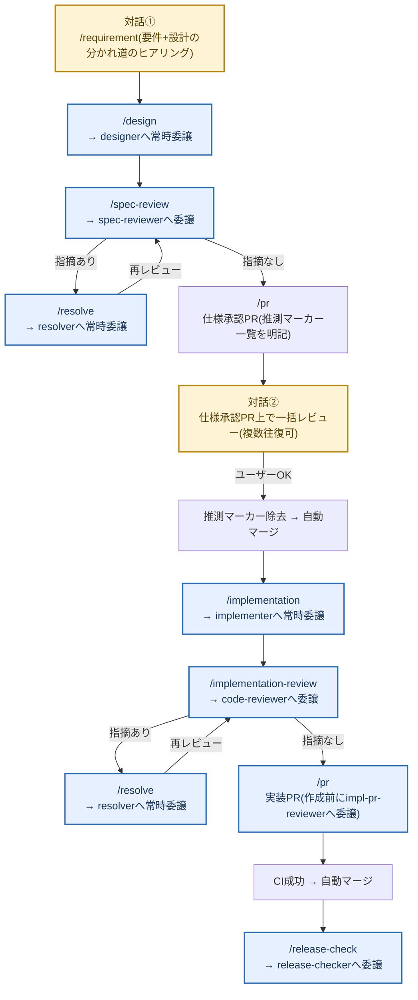
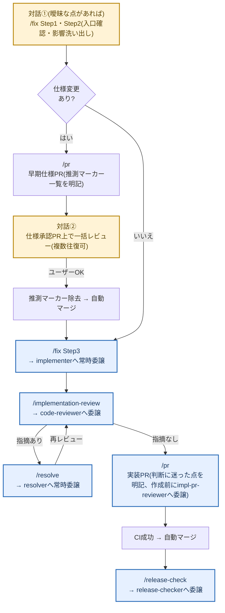
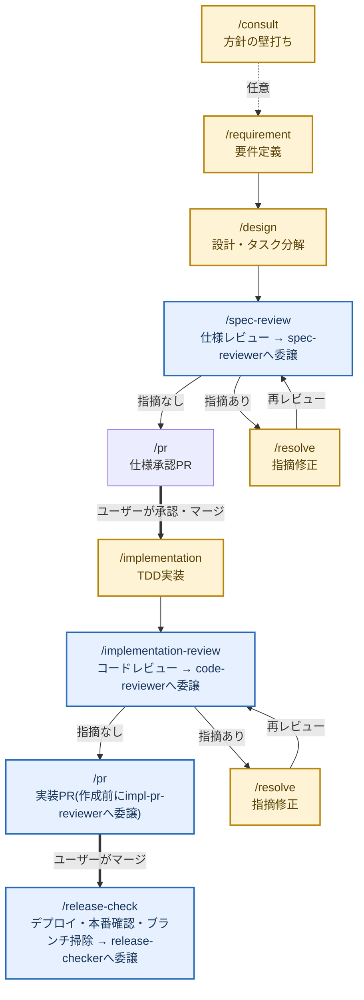
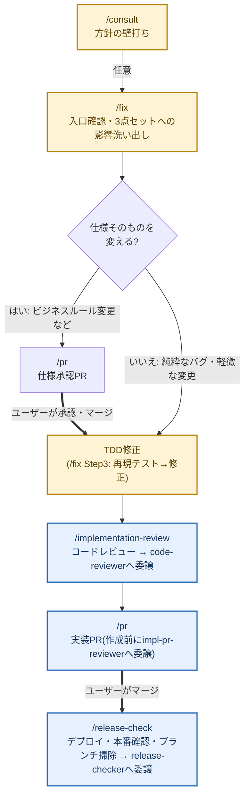

# Skill一覧と遷移図

このプロジェクトの開発作業はすべて `.claude/skills/` 配下のSkillとして手順化されている。各Skillは冒頭に「ワークフロー上の位置」(前工程の成果物が必要なものは「前提条件」も)を持ち、完了時に次のステップを案内する。

## ワークフローへの自動ルーティング

Skillを明示的に選ばない会話も、次の4層で必ずワークフローに合流する(背景・限界は[docs/adr/0002](../../docs/adr/0002-skill-agent-separation.md)の「ワークフローへの自動ルーティングと前提条件ゲート」を参照):

0. **セッション開始**: SessionStartフック(`../hooks/check-main-freshness.sh`)がorigin/mainをfetchし、ローカルmainが遅れていれば警告を注入する(別セッションでマージ済みの作業を、古いローカル状態のまま重複して始めるのを防ぐ)
1. **入口**: UserPromptSubmitフック(`../hooks/route-to-workflow.sh`)がユーザー入力に「開発作業なら該当する工程Skillを起動してから作業する」という指示を注入する(どの工程かの判定はモデルが行う。`/`で始まる明示的なSkill起動には注入しない。挨拶・雑談・単純な質問/調査依頼など明らかに非開発な入力は軽量なキーワード足切りで注入対象から外し、判断が曖昧な入力はfail-openで注入する)
2. **途中**: 前工程の成果物を必要とする工程Skillは冒頭の「前提条件」で確認し、満たしていなければ上流の工程Skillへ誘導する(例: requirements.mdなしで/designを始めない)。工程の起点となる4Skill(requirement/design/fix/implementation)は、あわせて「着手前チェック」(mainの最新化と、同じspecを扱う既存PRの確認)を行う(重複作業の防止。4Skillに同文で記載)
3. **出口**: 各Skill末尾の「完了時の次ステップ案内」で次の工程へ誘導する。成果物がコミット・pushされ次の工程に進んでよい地点では、新しいセッションの名称と次セッションにそのまま貼り付けられるプロンプトを**必ず**コードブロックで提示する(「セッションを閉じても大丈夫」で済ませない。design/pr/implementation/requirement/implementation-review/fix/spec-reviewの7Skillに同文で記載。変更時は揃って更新する)

## 起動者(誰がSkillを起動できるか)

Skillの`.claude/skills/`直下はフラット構造しか使えない(`<Skill名>/SKILL.md`の1階層のみ。分類用のフォルダを挟むと発見されない)ため、分類は以下の4カテゴリと、frontmatterの起動者フラグで表す。

| カテゴリ | ユーザーが`/xxx`で起動 | Claudeが自律起動 | frontmatter |
|---|---|---|---|
| 機能開発フロー(工程Skill) | ○ | ○ | (なし) |
| 定期作業Skill | ○ | **×** | `disable-model-invocation: true` |
| 自動運転モードSkill(autopilot) | ○ | **×** | `disable-model-invocation: true` |
| 知識Skill | ○ | ○ | (なし) |
| ユーティリティSkill | ○ | ○ | (なし) |

定期作業と自動運転モード(autopilot)はClaudeの自律起動を切っている。定期作業は**実行タイミングを人が決める作業**であり(月1回・年2回など)、autopilotは**確認を省く範囲をユーザーが意図的に選ぶモード**であるため、どちらも会話の流れでClaudeが勝手に始めてはいけない。このフラグを付けるとdescriptionもコンテキストに載らなくなるので、ユーザーが`/dependency-update`や`/autopilot`のように明示的に打つ必要がある(ルーティングフックもこれらを扱わない)。

## まとめ表

### 機能開発フロー(工程Skill)

| Skill | 役割 | 使うタイミング | 完了後の遷移先 |
|---|---|---|---|
| [consult](consult/SKILL.md) | 方針の壁打ち。ファイルを変更せず論点整理と推奨案の提示に徹する | 作る前に方針・技術選定・機能の切り方を相談したいとき(任意) | /requirement または /fix |
| [requirement](requirement/SKILL.md) | 要件ヒアリング→requirements.md作成。spec分割・新規spec vs 既存spec更新の判断・`[n]`採番。完了時に/prの「早期仕様PR」を作成する | 新しい機能・アプリの要件定義を始めるとき | /design |
| [design](design/SKILL.md) | design.md(処理フロー中心)とtasks.md(TDDタスク分解)の作成。完了時に早期仕様PRへ追加コミットする。並行開発時などはdesignerエージェントに委譲可 | requirements.md作成後 | /spec-review |
| [spec-review](spec-review/SKILL.md) | 3点セットの一括レビュー(チェックリスト・重要度・テンプレート付き)。実施はspec-reviewerエージェント | 3点セットが揃ったとき | 指摘あり: /resolve / なし: /pr(仕様承認PR) |
| [pr](pr/SKILL.md) | 早期仕様PR(要件定義完了時に作成)・仕様承認PR・実装PRの作成。承認ゲートの運用、impl-pr-reviewer・CIの確認 | requirements.md完了時(早期仕様PR)・レビュー通過後(仕様承認PR・実装PR) | 仕様承認PR承認後: /implementation / 実装PRマージ後: /release-check |
| [implementation](implementation/SKILL.md) | TDD実装(Red→Green→Refactor)。テスト命名・仕様コメント・spec-coverage対応付け。並行開発時などはimplementerエージェントに委譲可 | 仕様承認PRのマージ後 | /implementation-review |
| [implementation-review](implementation-review/SKILL.md) | 実装のコードレビュー(仕様整合・テスト・品質のチェックリスト・重要度・テンプレート付き)。実施はcode-reviewerエージェント | 実装・動作確認の完了後 | 指摘あり: /resolve / なし: /pr(実装PR) |
| [resolve](resolve/SKILL.md) | レビュー指摘の修正。重要度順に対応し、対応結果を報告する。並行開発時などはresolverエージェントに委譲可 | /spec-review・/implementation-review・PR上で指摘を受けたとき | 指摘元のレビューを再実行 → /pr |
| [fix](fix/SKILL.md) | バグ修正・既存機能の小規模改修の入口。既存spec更新の影響洗い出しと承認要否の判断。仕様変更ありの場合はrequirements.md更新時に/prの「早期仕様PR」を作成する | 計算誤り・文言修正・スコープ外項目への対応など | 仕様変更あり: /pr(仕様承認PR) / 純粋なバグ: 修正後 /implementation-review |
| [release-check](release-check/SKILL.md) | Cloudflare Workersへのデプロイ確認、本番スモークチェック、マージ済みブランチ掃除。実施はrelease-checkerエージェント | 実装PRのマージ後(毎回) | DB保存に関わるリリース: /data-check / それ以外: 完了(問題があれば /fix) |

### 自動運転モードSkill(ユーザーが`/autopilot`で明示起動)

| Skill | 役割 | 使うタイミング | 完了後の遷移先 |
|---|---|---|---|
| [autopilot](autopilot/SKILL.md) | 遷移図1・遷移図2を「対話最大2箇所だけで完走する」走らせ方に切り替えるモード。新機能起点はdesign以降、fix起点は仕様変更がなければ全工程を自走し(推測箇所は`【推測】`マーカーまたはPR本文の「判断に迷った点」で明示)、実装PRは条件付きで自動マージ、/release-checkまで実施する | 小規模・低リスクの新機能・バグ修正をお任せで進めたいとき | 完了(問題があれば/fix) |

#### 遷移図1a: 自動運転モード(autopilot、新機能起点)の流れ

- オレンジは開発者との対話ポイント(対話①・対話②)。青は常時Agentへ委譲され報告のみが返る工程。白は`prspec_a`(PR作成)と`automerge1`/`automerge2`(CI待ち・自動マージ)のみで、対話も委譲も伴わない機械的操作。遷移図1と比べ、通常は開発者が対話する設計・指摘対応・実装がAgent(designer/resolver/implementer)へ常時委譲されて青に変わる点が、対話を2箇所に絞れる理由
- 例外停止条件(要件・仕様どおりに進められない事態を検知した場合など)を満たすと自走ループを離れて人に報告する(条件は[autopilot](autopilot/SKILL.md)「例外停止」参照)。正常系のみを図示している
- 使う工程Skill・Agentは遷移図1と同一(手順は各Skillが単一の情報源のまま)

#### 遷移図2a: 自動運転モード(autopilot、fix起点)の流れ

- `dialog1b`はオレンジだが、依頼内容だけで判断できれば実際には発生しないことがある(遷移図2の`fix`ノードと違い、質問なしで通過してよい)。`branch_b`が「いいえ」(仕様変更なし)の経路をたどった場合、対話②(`dialog2b`)も発生しないため、**対話ゼロで完走**することがある
- オレンジは開発者との対話ポイント(発生する場合のみ)。青は常時Agentへ委譲され報告のみが返る工程。白は`prspec_b`(PR作成)と`automerge1b`/`automerge2b`(CI待ち・自動マージ)・`branch_b`(判定)のみで、対話も委譲も伴わない機械的操作
- 例外停止条件は遷移図1aと同じ枠組みに、fix起点特有の条件(実装判断の自信が持てない場合)が加わる(条件は[autopilot](autopilot/SKILL.md)「例外停止」参照)。正常系のみを図示している
- 使う工程Skill・Agentは遷移図2と同一(手順は各Skillが単一の情報源のまま)。[/fix](../fix/SKILL.md)のStep1で新規spec相当と判定された場合は遷移図1aに合流する(図には示していない)

### 定期作業Skill(開発ループ外・ユーザーが`/xxx`で明示起動)

| Skill | 役割 | 頻度 | 異常時の遷移先 |
|---|---|---|---|
| [law-revision-check](law-revision-check/SKILL.md) | 給付率・上限額など法令由来の前提値を公式資料と突き合わせる。実施はlaw-revision-checkerエージェント | 毎年7月・4月+制度変更のニュース時 | /fix(仕様変更フロー) |
| [dependency-update](dependency-update/SKILL.md) | npm依存パッケージの更新と検証 | 毎月1日(routineが自動実行。patch/minorのみ)+脆弱性報告時 | /pr(実装PR) |
| [data-check](data-check/SKILL.md) | Supabase保存データの健全性確認(SQLを用意しダッシュボードで実行してもらう) | DB機能リリース直後(/release-checkが案内)+月1回 | /fix |
| [retrospective](retrospective/SKILL.md) | ワークフローと実際の進め方のずれを振り返り、Skill側を更新する | 月1回〜四半期に1回 | /pr(Skill更新PR) |

- law-revision-check(毎年4/1・7/1の朝、報告のみ)とdependency-update(毎月1日の朝、patch/minor更新+検証+PR作成まで。major・Next.js/React系は報告のみ)は、ユーザーの明示起動に加えてclaude.aiの定期エージェント(routine)で自動実行する(https://claude.ai/code/routines で管理)。スケジュール実行はユーザーが登録した明示起動の一種であり、「Claudeが会話の流れで自律起動しない」原則とは矛盾しない

### 知識Skill(工程から参照される)

| Skill | 役割 | 参照元 |
|---|---|---|
| [architecture-workflow](architecture-workflow/SKILL.md) | `specs/<アプリ名>/architecture.md`(アプリ全体像)の作成・更新。設計図(Mermaid)の種類・作成条件・書き方ルールと、`docs/architecture/`(プロジェクト共通のインフラ系図)の運用もここに集約 | /requirement、/design、/fix、/spec-review、/retrospective |
| [parallel-work](parallel-work/SKILL.md) | git worktreeで作業ディレクトリを分けて複数機能を並行開発する手順と注意事項 | /requirement、/fix、/implementation、/pr、/release-check |
| [run-benriyatool](run-benriyatool/SKILL.md) | devサーバーを起動しheadless Chrome(driver.mjs)で実機操作・スクリーンショット確認する手順。単発の動作確認はui-checkerエージェントに委譲する | /implementation-review、「実機で確認して」等の依頼全般 |

### ユーティリティSkill(開発フローから独立)

| Skill | 役割 | 使うタイミング |
|---|---|---|
| [session-report](session-report/SKILL.md) | セッションの作業内容を要約したレポートMDをObsidianのClaude-Reportフォルダに保存する | 作業の区切り・「レポートにして」の依頼時 |
| [notion-md-sync](notion-md-sync/SKILL.md) | リポジトリ内の全MarkdownファイルをNotionにフォルダ構造ごと同期する(手動実行のみ) | 「MDをNotionに同期して」の依頼時 |
| [mail-to-company](mail-to-company/SKILL.md) | 個人PCで用意したファイル・テキストを会社メールアドレスへ送信する(Gmail SMTP、送信元・宛先固定)。`disable-model-invocation: true`(取り消せない外部送信のため自律起動しない) | 「会社PCに送って」「メールで送れるようにして」の依頼時 |

### Agent(作業者)

Skill=手順・知識・テンプレート、Agent=別コンテキストで動く作業者、という役割分担。どの工程をAgent化するかの判断基準・今後の導入予定・モデル選定基準は [docs/adr/0002](../../docs/adr/0002-skill-agent-separation.md) を参照。

| Agent | 役割 | 起動元 | モデル |
|---|---|---|---|
| [spec-reviewer](../agents/spec-reviewer.md) | 仕様3点セットのレビュー。書き込みツールを持たず報告に徹する | /spec-review | inherit(判断が本体) |
| [code-reviewer](../agents/code-reviewer.md) | 実装コードのレビュー。テスト・lint等は実行するが修正はしない | /implementation-review | inherit(判断が本体) |
| [impl-pr-reviewer](../agents/impl-pr-reviewer.md) | 実装PR作成前の横断チェック(承認ステータス・spec-coverage・CI) | /pr(実装PRのみ) | haiku(機械的チェック) |
| [release-checker](../agents/release-checker.md) | デプロイ確認・本番スモークチェック・マージ済みブランチ掃除 | /release-check | haiku(機械的チェック) |
| [implementer](../agents/implementer.md) | 承認済み仕様のTDD実装。仕様との食い違い時は中断して報告 | /implementation(並行開発時などの委譲は任意)。autopilotでは新機能起点・fix起点とも常時委譲(fix起点は/fix Step3を委譲) | sonnet(仕様に拘束された作業) |
| [designer](../agents/designer.md) | requirements.mdからdesign.md/tasks.mdを作成。要件定義に立ち返るべき不明点は中断して報告。対象ブランチへのコミット・pushまで実施 | /design(並行開発時などの委譲は任意。autopilotでは常時委譲) | sonnet(仕様に拘束された作業) |
| [resolver](../agents/resolver.md) | レビュー指摘の修正。要件・仕様の変更を要する指摘は保留してエスカレーション報告。対象ブランチへのコミット・pushまで実施 | /resolve(並行開発時などの委譲は任意。autopilotでは常時委譲) | sonnet(仕様に拘束された作業) |
| [law-revision-checker](../agents/law-revision-checker.md) | 法令由来の前提値と公式資料の突き合わせ(Web調査)。修正はせず報告に徹する | /law-revision-check | sonnet(法令解釈の判断あり) |
| [ui-checker](../agents/ui-checker.md) | headless Chromeでの実機操作・スクリーンショット確認。画像は自分で見て、結果だけ文章で報告する | run-benriyatool(メインスレッドが実機確認するとき。/implementation-reviewの実機確認はcode-reviewerが自分で行う) | sonnet(画面の見た目の判断) |

## 遷移図1: 新機能開発の流れ

- オレンジのノードは開発者がSkillと対話しながら進める工程(質問・確認が発生しうる)。青いノードは常時Agentへ委譲され、開発者には報告のみが返る工程(specreview→spec-reviewer、implreview→code-reviewer、release→release-checker。primplは作成前にimpl-pr-reviewerが常時チェックする)。白いノード(prspec)は対話も委譲も伴わない機械的なgit操作
- design・implementationは並行開発時などにdesigner/implementerへ任意委譲できる(委譲した場合そのノードは青相当になる。委譲要否の判断基準は[docs/adr/0002](../../docs/adr/0002-skill-agent-separation.md)「フェーズ別の判定」参照)
- 太線(=)はユーザーの承認・マージ待ち。仕様承認PRがマージされるまでコード(テスト含む)は書かない(仕様承認ゲート)
- mainへのマージは常にユーザーがGitHub UIで行う(例外: [autopilot](autopilot/SKILL.md)モードでは、同Skillの条件を満たした場合に限り自動マージする)

## 遷移図2: バグ修正・既存機能改修の流れ

- オレンジのノードは開発者がSkillと対話しながら進める工程。青いノードは常時Agentへ委譲され、開発者には報告のみが返る工程(implreview2→code-reviewer、release2→release-checker。primpl2は作成前にimpl-pr-reviewerが常時チェックする)。白いノード(prspec2)は対話も委譲も伴わない機械的なgit操作
- レビューで指摘が出た場合の `/resolve` ループは遷移図1と同じ(省略)
- 本番(`/release-check`)で問題を見つけた場合もこの図の `/fix` から入る
- バグ修正の自動運転(autopilotフロー)は[遷移図2a](#遷移図2a-自動運転モードautopilotfix起点の流れ)を参照

## 定期作業の遷移

定期作業は独立して実行し、問題が見つかったときだけ上の2つの流れに合流する(合流先は[まとめ表](#定期作業skill開発ループ外)の「異常時の遷移先」列を参照)。問題がなければユーザーへの報告のみで完了する。

## この文書の保守

Skill・Agentの追加・削除・遷移の変更をしたら、このREADMEの表と遷移図も同じPRで更新する(/retrospective の確認対象)。ワークフローの入口(/requirement・/fix・/consultの使い分け)が変わったら、ルーティングフック(`../hooks/route-to-workflow.sh`)の指示文も同じPRで更新する。Agentの追加・変更時は[docs/adr/0002](../../docs/adr/0002-skill-agent-separation.md)の判断基準・導入順との整合も確認する。遷移図の色分け(オレンジ=開発者との対話ポイント、青=Agentへの常時委譲、白=対話も委譲も伴わない機械的操作)はこのREADMEを唯一の情報源とし、ADR 0002には複製しない(ADRは判断理由の文章のみを持ち、図はこのREADMEを参照する)。