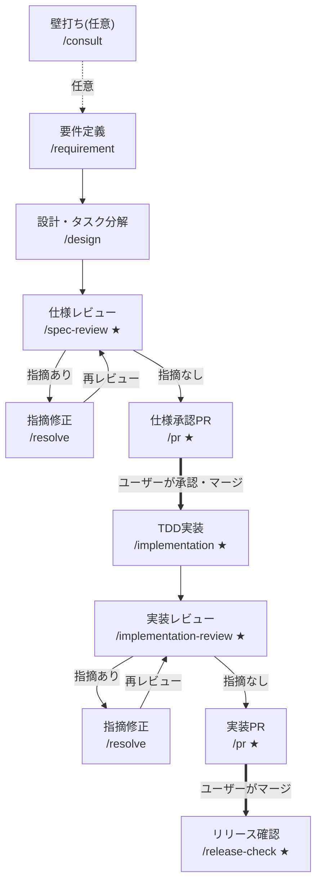
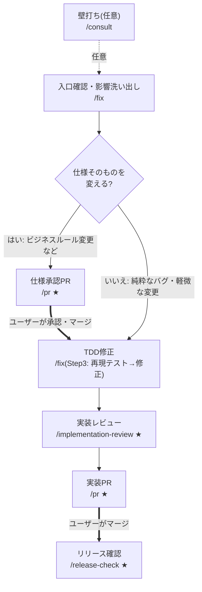
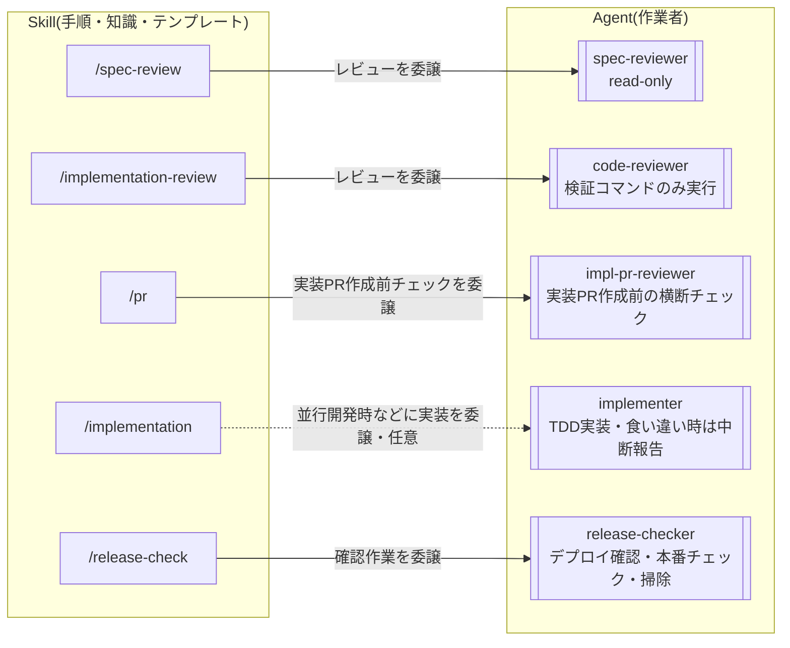

# 0002. 開発ワークフローのSkill/Agent役割分担

## ステータス
採用

## コンテキスト
- 開発ワークフローは工程別のSkill(`.claude/skills/`)として手順化済みだが、Agent(`.claude/agents/`)はimpl-pr-reviewer(当時はspec-pr-reviewer)1本のみで、SkillとAgentの使い分け基準がなかった
- 理想像として「Skill=手順・知識・テンプレート」「Agent=人格・作業者」という役割分担を目指す
- Claude CodeのAgent(サブエージェント)には次の技術特性があり、これが分割の判断材料になる
  1. **別コンテキストで動く**: 仕様・コードを書いた本人がレビューする「自己レビューバイアス」を排除できる。逆に、それまでの議論の文脈を引き継げない
  2. **途中でユーザーに質問できない**: 完走して報告を返すだけ。ヒアリングや「同意できない場合はユーザーに確認」が必要な作業は任せられない
  3. **toolsを制限できる**: 「レビュー中は修正しない」等の制約を、指示文ではなく構造(書き込みツールを与えない)で強制できる

## 決定

**「別コンテキストの新鮮な目」と「tools制限」に価値がある工程だけをAgent化し、ユーザーとの対話が本体の工程はメインスレッドのSkillのまま残す。**

### フェーズ別の判定

| フェーズ | Skill(手順・知識) | Agent(作業者) | 判定理由 |
|---|---|---|---|
| 壁打ち | consult | なし | 対話そのものが仕事 |
| 要件定義 | requirement | なし | ヒアリングで質問を重ねる必要がある |
| 設計 | design | なし(当面) | 要件定義時の議論の文脈を引き継ぐ方が設計の質が上がる |
| 仕様レビュー | spec-review | **spec-reviewer** | 新鮮な目+read-onlyで「修正禁止」を強制 |
| 実装PR作成前チェック | pr | impl-pr-reviewer(既存) | 機械的チェックの自己完結した作業。実装PRの作成前のみ起動する(仕様承認PRではマーカー残り・coverage除外によりチェックが成立しないため) |
| TDD実装 | implementation | **implementer(委譲は任意)** | 通常は対話しながら進められるメインスレッドが直接実装する。並行開発時などは委譲でき、仕様との食い違い検出時は中断して報告する |
| 実装レビュー | implementation-review | **code-reviewer** | spec-reviewerと同じ。Bashはテスト実行用に許可 |
| 指摘対応 | resolve | なし | 「同意できない指摘はユーザーに確認」が組み込まれており対話必須。書いた本人の文脈も必要 |
| リリース確認 | release-check | **release-checker** | 手順が機械的・自己完結 |
| 定期作業のうち4種(retrospectiveを除く) | 各Skill | (未導入)個別Agent化 | 独立性が高くメインの文脈を汚さない。特にlaw-revision-check(Web調査が重い)とspec-audit(リポジトリ全読みが重い)の効果が大きい。retrospectiveはSkill自体の更新でメインの文脈が要るためAgent化の対象外 |

### AgentとSkillの分担(薄いAgentパターン)

Skillの中身をAgentへ移動せず、**AgentはSkillを参照する薄い定義に留める**(impl-pr-reviewerが既に実践している形)。

- **Agent側に持つもの**: 人格(「あなたは〜専任レビュアー」)、行動制約(報告に徹する・修正しない)、tools制限、参照すべきチェックリストのパス
- **Skill側に残すもの**: ワークフロー遷移の案内とAgentの起動手順(SKILL.md本体)、チェックリスト・重要度基準・フィードバックテンプレート(`references/checklist.md`)

これによりSkillが単一の情報源のまま保たれ、チェックリスト変更時にAgentとSkillの二重メンテが発生しない。Skill冒頭の「レビューの注意事項」のような人格的な内容のみ、Agent側にも重複して持つことを許容する(数行のため保守コストは無視できる)。

チェックリスト類をSKILL.md本体でなく`references/checklist.md`に置くのはトークンコスト対策。SKILL.md本体はSkill起動時にメインスレッドへ全文読み込まれるため、Agentしか使わないチェックリストを本体に置くと、レビュー1回ごとにメインスレッドとAgentの両方が同じ内容を読み込むことになる。分離すればメインスレッドは薄い起動手順だけを読み、チェックリストはAgent(またはAgentを使えない状況で直接レビューする場合)だけが読む。

### 開発フローとSkill・Agentの対応

[.claude/skills/README.md](../../.claude/skills/README.md)の遷移図と同じ分割で示す。各ノードは「工程名+使用Skill」を表し、**★はAgentを起動するSkill**(呼び出し先は図3)。定期作業Skillはこれらのフローとは独立して実行するため省略。

#### 図1: 新機能開発の流れ(工程で使うSkill)

#### 図2: バグ修正・既存機能改修の流れ(工程で使うSkill)

- 太線(=)はユーザーの承認・マージ待ち(仕様承認ゲート)
- レビューで指摘が出た場合の /resolve ループは図1と同じ(図2では省略)

#### 図3: SkillからのAgent呼び出し関係

★の付いたSkillが起動するAgentの対応。Agentは別コンテキストで完走し、報告をSkill側(メインスレッド)に返す。実線はその工程で常に起動するもの、点線は委譲が任意のもの(通常はメインスレッドが直接作業する)。

/consult・/requirement・/design・/resolve・/fixはAgentを呼ばず、メインスレッドが直接担当する(判定理由は上の表を参照)。

### Agentのモデル選定基準

Agentはfrontmatterの`model:`でメインスレッドと別のモデルを指定できる(未指定はメインスレッドを継承=最上位モデルで動く)。トークンコストを抑えるため、作業の性質に応じて全Agentにモデルを明示する:

| 作業の性質 | モデル | 判断の目安 |
|---|---|---|
| 機械的なチェック(手順どおりの照合・コマンド実行) | haiku | チェックリストを実行するだけで、結果の解釈に判断がほぼ要らない |
| 拘束された作業(仕様・tasks.mdが細かく手順を決めている) | sonnet | 手順は決まっているが、逸脱・食い違いに気づく判断力は要る |
| 判断が本体(レビューの質がそのAgentの存在理由) | inherit | 品質ゲートを軽量化するとワークフロー全体の品質が下がる |

現在の割り当て: impl-pr-reviewer / release-checker = haiku、implementer = sonnet、spec-reviewer / code-reviewer = inherit。

- implementerをsonnetにできるのは、下流のcode-reviewer(inherit)が品質ゲートとして受け止める構造があるため。複雑な計算ロジックの実装は委譲せずメインスレッドで直接実装する選択肢も残っている
- 軽量化したAgentの報告品質が落ちていないかは/retrospectiveで確認し、問題があればこの基準に立ち返って割り当てを見直す
- 第3段階(定期作業のAgent化)を進める際もこの基準でモデルを選ぶ(目安: dependency-update=haiku〜sonnet、spec-audit=sonnet、law-revision-check=Web調査+法令解釈の判断があるためsonnet以上)

### 導入順

1. **spec-reviewer / code-reviewer**(導入済み。レビューの客観性が構造的に上がる、効果最大)
2. **release-checker**(導入済み。機械的で失敗リスクが低い)
3. **定期作業のAgent化**(未導入。定期作業5種のうちretrospectiveを除く4種が対象。law-revision-check → spec-audit → dependency-update / data-check の順で検討する)
4. **implementer**(導入済み。ただし常用ではなく、[parallel-work](../../.claude/skills/parallel-work/SKILL.md)のworktree並行開発時などに実装を委譲する任意の作業者として運用する。通常はメインスレッドが直接実装する)

残るは第3段階(定期作業)のみ。レビュー系Agentの運用で問題が見つかった場合は、このADRの判断基準に立ち返って構成を見直す。

### ワークフローへの自動ルーティングと前提条件ゲート(2026-07追記)

Skillを明示的に選ばない会話も必ずワークフローのSkillに乗るように、次の3層で誘導する。

1. **入口(自動ルーティング)**: UserPromptSubmitフック(`.claude/hooks/route-to-workflow.sh`)が、すべてのユーザー入力に「開発作業に該当する依頼は該当する工程Skillを起動してから作業する」という指示をコンテキストとして注入する。どの工程かの判定はスクリプトの語彙マッチではなくメインスレッドのモデルが行う(日本語の自由入力をスクリプトで分類するのは脆く、誤判定時に誤った工程を強制してしまうため)。`/`で始まる明示的なSkill起動には注入しない
2. **途中(前提条件ゲート)**: 前工程の成果物を必要とする各工程Skill(/design以降)の冒頭に「前提条件」セクションを置き、満たしていない場合は上流の工程Skillへ誘導する。これにより工程の途中から会話が始まっても(例: いきなり「実装して」)、requirements.md・仕様承認などの上流の成果物がなければ必ず上流から進む
3. **出口(次ステップ案内・既存)**: 各Skill末尾の「完了時の次ステップ案内」で下流の工程へ誘導する(従来どおり)

**限界と運用**: フックの注入もSkillの前提条件も指示であり、tools制限のような構造的な強制ではない。ルーティング漏れ・前提条件のすり抜けに気づいたら、/retrospectiveでフックの指示文・Skillのdescription・前提条件の記述を改善する。

## 検討した代替案

| 候補 | 見送り理由 |
| --- | --- |
| チェックリスト・テンプレートをAgent定義側に持たせる | SkillとAgentで同じ内容の二重メンテが発生する。メインスレッドで直接レビューする使い方(Skill単体利用)もできなくなる |
| ルーティングをフックの語彙マッチ(キーワード→Skill起動の強制)で行う | 日本語の自由入力の分類は語彙マッチでは脆く、誤判定時に誤った工程を強制する。判定はモデルに任せ、フックは判定を促す指示の注入に徹する |
| 全工程をAgent化する | 要件ヒアリング・壁打ち・指摘対応は途中でユーザーに質問できないAgentには任せられない。設計も要件議論の文脈を失うと質が落ちる |
| Agent化せずSkillのみで続ける | 「レビュー中は修正しない」が指示文頼みになり、また仕様・コードを書いた同一コンテキストがレビューするため自己レビューバイアスを排除できない |

## 影響

**良い点**
- レビュー工程が別コンテキスト+read-onlyになり、客観性と「修正禁止」の強制力が構造的に担保される
- Skill=知識・Agent=作業者の分担基準が明文化され、今後の工程追加時に迷わない
- レビュー系Agentが読む大量のファイルがメインスレッドのコンテキストを消費しなくなる

**懸念点**
- Agentは起動のたびに仕様・コードを読み直すため、メインスレッドで直接レビューするよりトークンコストがかかる(客観性とのトレードオフとして許容。モデル選定基準による軽量モデルの割り当てで緩和する)
- Agentの報告がメインスレッド経由でユーザーに渡るため、報告の転記漏れに注意が必要(Skill側に「報告をそのまま提示する」と明記して対処)
- Skill冒頭の注意事項とAgentの人格記述に小さな重複が残る(変更時は両方を直す。/retrospectiveの確認対象)
