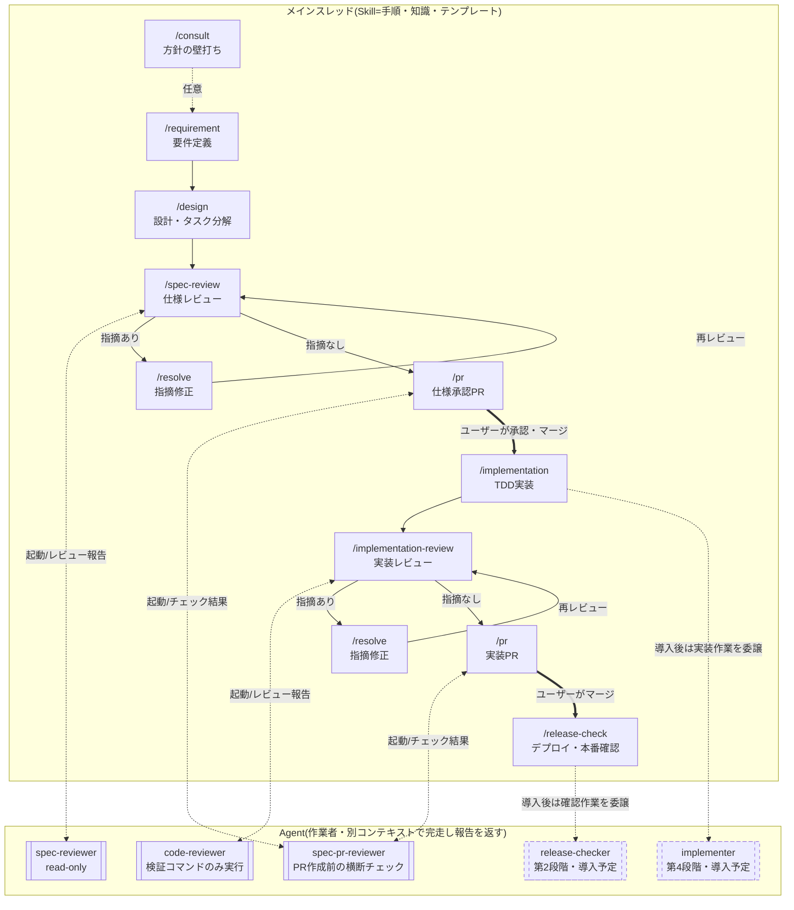

# 0002. 開発ワークフローのSkill/Agent役割分担

## ステータス
採用

## コンテキスト
- 開発ワークフローは工程別のSkill(`.claude/skills/`)として手順化済みだが、Agent(`.claude/agents/`)はspec-pr-reviewer 1本のみで、SkillとAgentの使い分け基準がなかった
- 理想像として「Skill=手順・知識・テンプレート」「Agent=人格・作業者」という役割分担を目指す
- Claude CodeのAgent(サブエージェント)には次の技術特性があり、これが分割の判断材料になる
  1. **別コンテキストで動く**: 仕様・コードを書いた本人がレビューする「自己レビューバイアス」を排除できる。逆に、それまでの議論の文脈を引き継げない
  2. **途中でユーザーに質問できない**: 完走して報告を返すだけ。ヒアリングや「同意できない場合はユーザーに確認」が必要な作業は任せられない
  3. **toolsを制限できる**: 「レビュー中は修正しない」等の制約を、指示文ではなく構造(書き込みツールを与えない)で強制できる

## 決定

**「別コンテキストの新鮮な目」と「tools制限」に価値がある工程だけをAgent化し、ユーザーとの対話が本体の工程はメインスレッドのSkillのまま残す。**

### フェーズ別の判定

| フェーズ | Skill(手順・知識) | Agent(作業者) | 判定理由 |
|---|---|---|---|
| 壁打ち | consult | なし | 対話そのものが仕事 |
| 要件定義 | requirement | なし | ヒアリングで質問を重ねる必要がある |
| 設計 | design | なし(当面) | 要件定義時の議論の文脈を引き継ぐ方が設計の質が上がる |
| 仕様レビュー | spec-review | **spec-reviewer** | 新鮮な目+read-onlyで「修正禁止」を強制 |
| PR作成前チェック | pr | spec-pr-reviewer(既存) | 機械的チェックの自己完結した作業 |
| TDD実装 | implementation | (第4段階)implementer | 承認済みtasks.mdがあれば自律実行可能だが、仕様との食い違い検出時に中断・報告する設計が必要 |
| 実装レビュー | implementation-review | **code-reviewer** | spec-reviewerと同じ。Bashはテスト実行用に許可 |
| 指摘対応 | resolve | なし | 「同意できない指摘はユーザーに確認」が組み込まれており対話必須。書いた本人の文脈も必要 |
| リリース確認 | release-check | (第2段階)release-checker | 手順が機械的・自己完結 |
| 定期作業4種 | 各Skill | (第3段階)個別Agent化 | 独立性が高くメインの文脈を汚さない。特にlaw-revision-check(Web調査が重い)とspec-audit(リポジトリ全読みが重い)の効果が大きい |

### AgentとSkillの分担(薄いAgentパターン)

Skillの中身をAgentへ移動せず、**AgentはSkillを参照する薄い定義に留める**(spec-pr-reviewerが既に実践している形)。

- **Agent側に持つもの**: 人格(「あなたは〜専任レビュアー」)、行動制約(報告に徹する・修正しない)、tools制限、参照すべきSKILL.mdのパス
- **Skill側に残すもの**: チェックリスト・重要度基準・フィードバックテンプレート・ワークフロー遷移の案内

これによりSkillが単一の情報源のまま保たれ、チェックリスト変更時にAgentとSkillの二重メンテが発生しない。Skill冒頭の「レビューの注意事項」のような人格的な内容のみ、Agent側にも重複して持つことを許容する(数行のため保守コストは無視できる)。

### 開発フロー全体像(Skill×Agent)

メインスレッドがSkillの手順に沿って工程を進め、Agent化された工程では作業者Agentを起動して報告を受け取る。点線枠のAgentは導入予定(導入順は次節)。

- 太線(=)はユーザーの承認・マージ待ち(仕様承認ゲート)。定期作業Skillはこのフローとは独立して実行するため図から省略
- 壁打ち・要件定義・指摘修正など対話が本体の工程はAgentを持たず、メインスレッドが直接担当する(判定理由は上の表を参照)

### 導入順

1. **spec-reviewer / code-reviewer**(本ADRと同時に導入。レビューの客観性が構造的に上がる、効果最大)
2. **release-checker**(機械的で失敗リスクが低い)
3. **定期作業のAgent化**(law-revision-check → spec-audit → dependency-update / data-check)
4. **implementer**([parallel-work](../../.claude/skills/parallel-work/SKILL.md)のworktree並行開発とセットで検討)

第2段階以降は、第1段階の運用で問題がないことを確認してから進める。

## 検討した代替案

| 候補 | 見送り理由 |
| --- | --- |
| チェックリスト・テンプレートをAgent定義側に持たせる | SkillとAgentで同じ内容の二重メンテが発生する。メインスレッドで直接レビューする使い方(Skill単体利用)もできなくなる |
| 全工程をAgent化する | 要件ヒアリング・壁打ち・指摘対応は途中でユーザーに質問できないAgentには任せられない。設計も要件議論の文脈を失うと質が落ちる |
| Agent化せずSkillのみで続ける | 「レビュー中は修正しない」が指示文頼みになり、また仕様・コードを書いた同一コンテキストがレビューするため自己レビューバイアスを排除できない |

## 影響

**良い点**
- レビュー工程が別コンテキスト+read-onlyになり、客観性と「修正禁止」の強制力が構造的に担保される
- Skill=知識・Agent=作業者の分担基準が明文化され、今後の工程追加時に迷わない
- レビュー系Agentが読む大量のファイルがメインスレッドのコンテキストを消費しなくなる

**懸念点**
- Agentは起動のたびに仕様・コードを読み直すため、メインスレッドで直接レビューするよりトークンコストがかかる(客観性とのトレードオフとして許容)
- Agentの報告がメインスレッド経由でユーザーに渡るため、報告の転記漏れに注意が必要(Skill側に「報告をそのまま提示する」と明記して対処)
- Skill冒頭の注意事項とAgentの人格記述に小さな重複が残る(変更時は両方を直す。/retrospectiveの確認対象)
