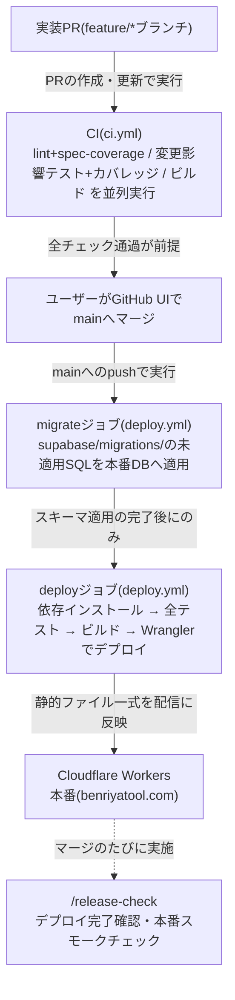

# デプロイメント図

mainマージから本番(benriyatool.com)反映までの経路をまとめたプロジェクト共通ドキュメント。使用サービス全体の構成は[インフラ構成図](infrastructure.md)を参照。

この図の正となる定義は[ci.yml](../../.github/workflows/ci.yml)・[deploy.yml](../../.github/workflows/deploy.yml)・[wrangler.toml](../../wrangler.toml)。

## 経路の補足(各定義ファイルのコメントが正)

- **マイグレーションが先、デプロイが後**: 新コードが前提とするスキーマ変更を先に適用してからデプロイする(順序が逆転するとINSERT失敗が握りつぶされて気づけない)。マイグレーションの適用済み判定はDB内の管理テーブルが担い、二重適用されない(基盤は[ADR-0003](../adr/0003-db-schema-migration-ci.md))
- **Supabaseへの接続はSession Pooler経由**: GitHub ActionsランナーはIPv6不可のため、IPv4対応のPooler(ポート5432)で接続する
- **環境変数の埋め込み**: `NEXT_PUBLIC_SUPABASE_URL`・`NEXT_PUBLIC_SUPABASE_ANON_KEY`はビルド時に静的成果物へ埋め込まれる(GitHub ActionsのSecretsで管理し、ビルドステップでのみ渡す)
- **サーバー環境は本番のみ**: ステージング環境はなく、mainマージ=本番反映。マージ後は毎回[/release-check](../../.claude/skills/release-check/SKILL.md)で確認する
- **CIの並列ジョブ化と変更影響テストへの絞り込み**: ci.ymlはPRごとに変更ファイルの依存グラフから影響するテストのみを実行し高速化する一方、その分の安全網としてdeployジョブのビルド前に全テストを実行する(背景・トレードオフは[ADR-0008](../adr/0008-ci-changed-tests-and-parallel-jobs.md))

## 更新ルール

CIの構成・デプロイ先・ビルド手順を変えるPRでは、この図を同じPRで更新する。図の陳腐化は[/retrospective](../../.claude/skills/retrospective/SKILL.md)のスポットチェックで見直す。
