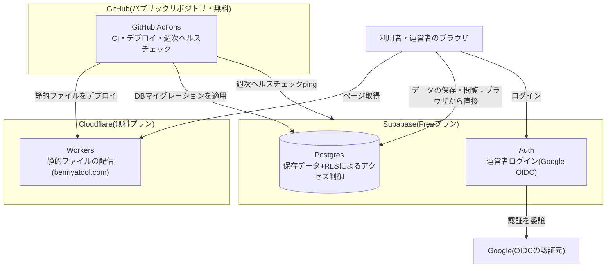

# インフラ構成図

べんりやつーる(benriyatool.com)が使っている全クラウドサービスと役割・データの流れ・課金/無料枠の境界をまとめたプロジェクト共通ドキュメント。アプリ単位の構成(画面・テーブルの使い方)は各`specs/<アプリ名>/architecture.md`のシステム構成図を参照。

この図の正となる定義は[wrangler.toml](../../wrangler.toml)・[.github/workflows/](../../.github/workflows/)・[docs/adr/](../adr/)(選定理由)。mainマージから本番反映までの経路の詳細は[デプロイメント図](deployment.md)を参照。

## 各サービスの役割

| サービス | 役割 | 関連する決定 |
|---|---|---|
| Cloudflare Workers | Next.js静的エクスポート(`out/`)の配信。カスタムドメイン`benriyatool.com`のみで公開(workers.devサブドメインは無効) | [wrangler.toml](../../wrangler.toml) |
| Supabase Postgres | ユーザー入力・計算結果の保存。anonキーはINSERTのみ、閲覧はRLSで許可された運営者のみ | [ADR-0001](../adr/0001-user-input-database.md)、[ADR-0006](../adr/0006-admin-screen-oidc-rls.md) |
| Supabase Auth | 管理画面の運営者ログイン(Google OIDC) | [ADR-0006](../adr/0006-admin-screen-oidc-rls.md) |
| GitHub Actions | PR時のCI(lint・テスト・spec-coverage・ビルド)、mainマージ時のマイグレーション適用+デプロイ、週次のSupabaseヘルスチェック | [ADR-0003](../adr/0003-db-schema-migration-ci.md)、[deployment.md](deployment.md) |

## 課金/無料枠の境界

全サービスを無料枠で運用しており、課金中のサービスはない([ADR-0001](../adr/0001-user-input-database.md)の前提「無料枠に収まる範囲で運用」)。

| サービス | プラン | 無料枠の注意点 |
|---|---|---|
| Cloudflare Workers | 無料プラン | 静的アセット配信は無料。サーバー処理(Workerスクリプトの実行)を増やす場合はリクエスト数上限に注意 |
| Supabase | Free | APIアクセスが目安1週間ないとプロジェクトが自動一時停止される。対策として週次ヘルスチェック([supabase-health-check.yml](../../.github/workflows/supabase-health-check.yml))でpingしている |
| GitHub Actions | 無料 | パブリックリポジトリのため実行時間の課金なし |
| Google OIDC | 無料 | Supabase Auth経由で利用。Google Cloud側のOAuthクライアント設定のみ(課金対象の利用なし) |

## ネットワーク構成図を作らない理由

フルマネージドサービスの利用のみで、VPC・サブネット・独自DNS/CDN経路などのネットワーク境界を自分で設計していないため、ネットワーク構成図は作成しない(この図が兼ねる。基準は[architecture-workflow](../../.claude/skills/architecture-workflow/SKILL.md)の「クラウド・インフラ系の図」)。

## 更新ルール

ホスティング変更・CI変更・外部サービス追加など、インフラ・デプロイ構成を変えるPRでは、この図を同じPRで更新する。図の陳腐化は[/spec-audit](../../.claude/skills/spec-audit/SKILL.md)(四半期)で棚卸しする。現状はサービス数が少なくMermaidで足りるため、Draw.ioへの昇格(アイコン・配置に意味が出てきた場合)も同棚卸しで見直す。
