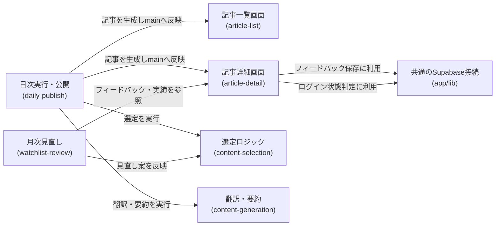

# アーキテクチャ: ai-dev-digest

## 1. 概要
AI駆動開発関連の話題コンテンツ(公式組織のブログ・YouTube、個人YouTube、個人ブログ、Qiita、Zenn)を1日1回自動で収集・翻訳・要約し、日次のダイジェスト記事として公開するアプリ。URL: `/ai-dev-digest`

## 2. アーキテクチャの目的
- コンテンツの収集・選定([content-selection](content-selection/requirements.md))と翻訳・要約([content-generation](content-generation/requirements.md))を分離し、それぞれの基準を独立して見直せるようにする
- サーバーを持たない静的サイトの構成を維持したまま、Claude Routines(定期実行のクラウドエージェント)による記事生成・PR作成という新しい運用パターンを導入する
- 通常はPRレビューが必須のこのプロジェクトの運用に対し、日次記事の完全自動マージという例外を[daily-publish](daily-publish/requirements.md)に明確に限定し、ウォッチリスト変更等の影響が大きい変更([watchlist-review](watchlist-review/requirements.md))には人間承認を残す

## 3. 設計方針
- 記事本文はDBに保存せず、ビルド時に取り込まれる静的コンテンツ(Markdown等)として管理する(ブログ的な運用の方が実態に合うため。DBを介さないことで[ADR-0001](../../docs/adr/0001-user-input-database.md)が前提とする「サーバー機能を持たない」構成を保つ)
- 運営者フィードバックの保存だけは既存の[ADR-0001](../../docs/adr/0001-user-input-database.md)パターン(anonキーでINSERT専用)をそのまま踏襲し、新しい認証・DB設計を増やさない
- ウォッチリスト・採用基準の変更([watchlist-review](watchlist-review/requirements.md))は、日次記事公開([daily-publish](daily-publish/requirements.md))と異なる自動マージポリシーを適用し、影響範囲の大きさに応じてPRの扱いを分ける

## 4. システム構成図
```mermaid
flowchart TD
    visitor["訪問者のブラウザ"]
    adminVisitor["運営者のブラウザ(ログイン済み)"]
    cf["Cloudflare Workers(静的配信)"]
    list["/ai-dev-digest<br>記事一覧"]
    detail["/ai-dev-digest/[date]<br>記事詳細・フィードバック入力"]
    dailyRoutine["Claude Routines(日次)<br>収集・翻訳・要約・記事執筆"]
    monthlyRoutine["Claude Routines(月次)<br>ウォッチリスト・基準の見直し"]
    sources["情報源<br>公式API・公式RSS・公式ブログ・公開ページ"]
    repo["GitHubリポジトリ<br>(記事Markdown)"]
    dailyPR["日次記事PR<br>(完全自動マージ)"]
    reviewPR["見直し提案PR<br>(人間承認必須)"]
    feedbackDb[("Supabase<br>ai_dev_digest_feedbackテーブル")]
    auth["Supabase Auth<br>(Google OIDC)"]

    visitor -->|ページ取得| cf
    adminVisitor -->|ページ取得| cf
    cf --> list
    cf --> detail
    dailyRoutine -->|情報取得| sources
    dailyRoutine -->|記事Markdownを追加| dailyPR
    dailyPR -->|CI成功で自動マージ| repo
    repo -->|ビルド・配信| cf
    detail -->|フィードバックを保存 - anonキーでINSERTのみ| feedbackDb
    adminVisitor -->|Googleでログイン(運営者)| auth
    detail -->|ログイン状態を判定 - 表示切替のみ| auth
    monthlyRoutine -->|フィードバック・掲載実績を参照| feedbackDb
    monthlyRoutine -->|見直し案を作成| reviewPR
    reviewPR -->|運営者が確認しマージ| repo
```

この図の正となる文章は下記「[5. アーキテクチャ概要](#5-アーキテクチャ概要)」と各specの設計書。このアプリから見た構成のみを描いており、プロジェクト共通インフラの詳細は[docs/architecture/](../../docs/architecture/infrastructure.md)を参照。

## 5. アーキテクチャ概要
Next.jsの静的エクスポートをCloudflare Workersで配信する構成は他アプリと同じ。記事本文はDBではなくMarkdown等のコンテンツファイルとしてリポジトリ内に置き、ビルド時に取り込む。日次のClaude Routineが情報源(公式API・公式RSSフィード・公式ブログ・公開ページ)から候補を収集し、選定基準([content-selection](content-selection/requirements.md))に沿ってトピックを選び、翻訳・要約([content-generation](content-generation/requirements.md))を経て記事を生成、PRを作成しCI成功後に自動マージする([daily-publish](daily-publish/requirements.md))。訪問者は記事一覧・詳細ページ([article-list](article-list/requirements.md)、[article-detail](article-detail/requirements.md))を閲覧でき、運営者はGoogle OIDCでログインした状態で記事詳細ページに表示されるフィードバック欄から選定基準への気づきを残せる(既存のanonキーINSERT専用パターンを流用、DB読み取りは発生しない)。月次のClaude Routineがフィードバックと掲載実績を読み、ウォッチリスト・採用基準の見直し案をPRとして提案し、これは日次記事と異なり運営者の承認を経てからマージされる([watchlist-review](watchlist-review/requirements.md))。

## 6. 採用技術
| 技術 | 用途 |
|---|---|
| Next.js(静的エクスポート) | 記事一覧・詳細ページの描画 |
| Supabase | 運営者フィードバックの保存(`ai_dev_digest_feedback`テーブル) |
| Supabase Auth(Google OIDC) | フィードバック入力欄の表示切り替え(運営者判定) |
| Claude Routines | 日次の記事生成、月次のウォッチリスト・基準見直しの実行基盤 |
| Tailwind CSS | スタイリング |

選定理由はプロジェクト横断のため[関連ADR](#11-関連adr)を参照。

## 7. 機能マップ
| spec | 役割 | 依存 |
|---|---|---|
| [article-list](article-list/requirements.md) | 日付ごとのダイジェスト記事をカード一覧で表示する | article-detailの記事構造を参照([article-detail/requirements.md#機能要件](article-detail/requirements.md)) |
| [article-detail](article-detail/requirements.md) | 記事本文(トピックごとの見出し・要約・出典)と、運営者向けフィードバック入力欄を表示する | content-selectionの選定結果([content-selection/requirements.md#機能要件](content-selection/requirements.md))、content-generationの生成ルール([content-generation/requirements.md#機能要件](content-generation/requirements.md))に従う |
| [content-selection](content-selection/requirements.md) | 情報源ウォッチリストと採用基準を定義し、日次のトピックを選び出す | daily-publishの実行タイミングに従う([daily-publish/requirements.md#機能要件](daily-publish/requirements.md)) |
| [content-generation](content-generation/requirements.md) | 選定されたトピックの翻訳・要約・記事執筆のルールを定める | content-selectionの選定結果を受け取る([content-selection/requirements.md#機能要件](content-selection/requirements.md)) |
| [daily-publish](daily-publish/requirements.md) | 収集・翻訳・要約・記事公開を1日1回自動実行し、完全自動マージする | content-selection・content-generationの結果を公開する |
| [watchlist-review](watchlist-review/requirements.md) | 月次でウォッチリスト・採用基準の見直し案を作成し、人間承認を経て反映する | article-detailのフィードバック([article-detail/requirements.md#運営者向けフィードバック](article-detail/requirements.md))、content-selectionの掲載実績([content-selection/requirements.md#1日の掲載件数](content-selection/requirements.md))を参照 |

## 8. コンポーネント図


この図の正となる文章は「[7. 機能マップ](#7-機能マップ)」の依存列と、各specのrequirements.mdの依存関係。

## 9. ディレクトリ構成
CLAUDE.mdの一般規約(`components/`,`lib/`)通りで、逸脱なし。ただし記事本文はコード資産(`app/`)ではなくコンテンツデータとして別途管理する(格納場所・形式は設計で確定する)。

## 10. 外部サービス
| サービス | 用途 |
|---|---|
| Supabase(`ai_dev_digest_feedback`テーブル) | 運営者フィードバックの保存 |
| Supabase Auth(Google OIDC) | フィードバック入力欄の表示切り替え(既存admin authと同じ仕組みを流用、SELECT権限は追加しない) |
| YouTube公式API・各社公式RSSフィード・各社公式ブログ・Qiita公式API・Zenn公式RSS | 情報源データの取得([content-selection/requirements.md#データ取得方法](content-selection/requirements.md)) |
| Claude Routines | 記事生成([daily-publish](daily-publish/requirements.md))・見直し提案([watchlist-review](watchlist-review/requirements.md))の定期実行基盤 |

## 11. 関連ADR
- [0001-user-input-database.md](../../docs/adr/0001-user-input-database.md) — 運営者フィードバック保存のDB選定・RLSパターン(anonキーでのINSERT専用)をそのまま踏襲
- [0006-admin-screen-oidc-rls.md](../../docs/adr/0006-admin-screen-oidc-rls.md) — フィードバック入力欄の表示切り替えに使うGoogle OIDCログイン判定の基盤(`app/lib/adminAuth.ts`)を流用。ただし本アプリはDBの読み取り(SELECT)を必要としないため、同ADRが定める「運営者専用SELECTポリシーの追加」は行わない

## 12. セキュリティ
運営者フィードバックの保存は`anon`キーによるINSERT専用とし、SELECT/UPDATE/DELETEは許可しない(他人の投稿内容を読む・改ざんする経路を作らない)。保存される内容は選定基準への自由記述コメントのみで、氏名・連絡先等の個人情報は扱わない。フィードバック入力欄の表示・非表示はログイン状態による画面側の出し分けであり、DB側のアクセス制御ではない点に注意する(ADR-0006本来の「読み取り専用管理画面」の権限モデルとは異なる用途のため、同ADRのRLSテンプレートは適用しない)。

## 13. 技術的制約
他者の著作物を要約・翻訳して掲載するため、著作権法上のリスク(翻訳権・翻案権侵害の可能性)を伴う。要約分量の制限・出典明記・利用規約への条項追記([content-generation/requirements.md#利用規約への反映](content-generation/requirements.md))によってリスクを低減する運用とする。各情報源の取得は公式API・公式RSSフィード・公開ページの閲覧の範囲にとどめ、非公式APIや利用規約を超えたアクセスは行わない([content-selection/requirements.md#データ取得方法](content-selection/requirements.md))。

## 14. 用語集
| 用語 | 説明 |
|---|---|
| ウォッチリスト | 収集対象として固定的に管理する情報源(公式組織・個人・プラットフォーム)の一覧。[content-selection](content-selection/requirements.md)で定義 |
| 基準未達掲載 | content-selectionの採用基準を満たす候補が不足する日に、基準未達の候補で3〜5件を埋める措置。[watchlist-review](watchlist-review/requirements.md)で見直しの判断材料になる |
| Claude Routines | 定期実行のクラウドエージェント。日次の記事生成([daily-publish](daily-publish/requirements.md))、月次の見直し提案([watchlist-review](watchlist-review/requirements.md))の実行主体 |
