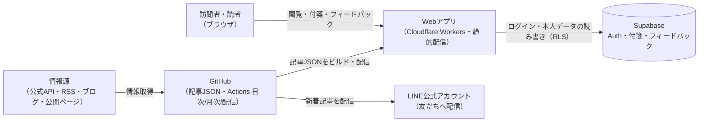
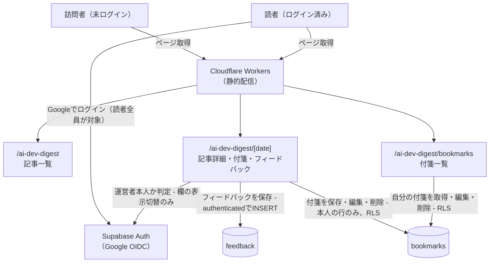
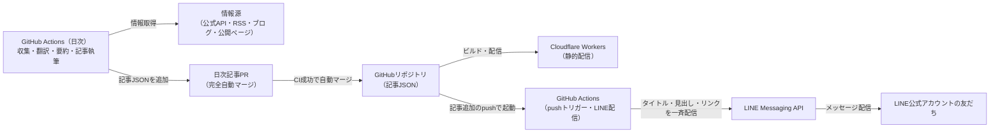
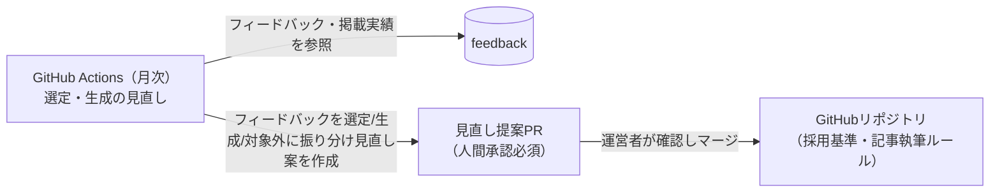
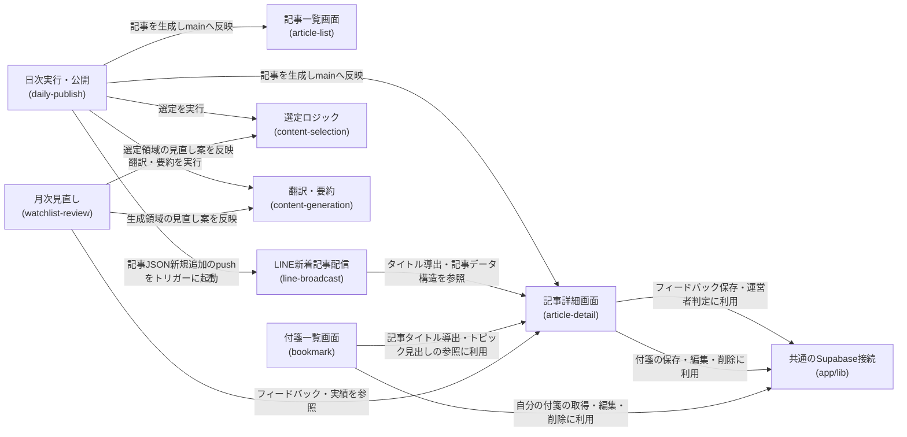
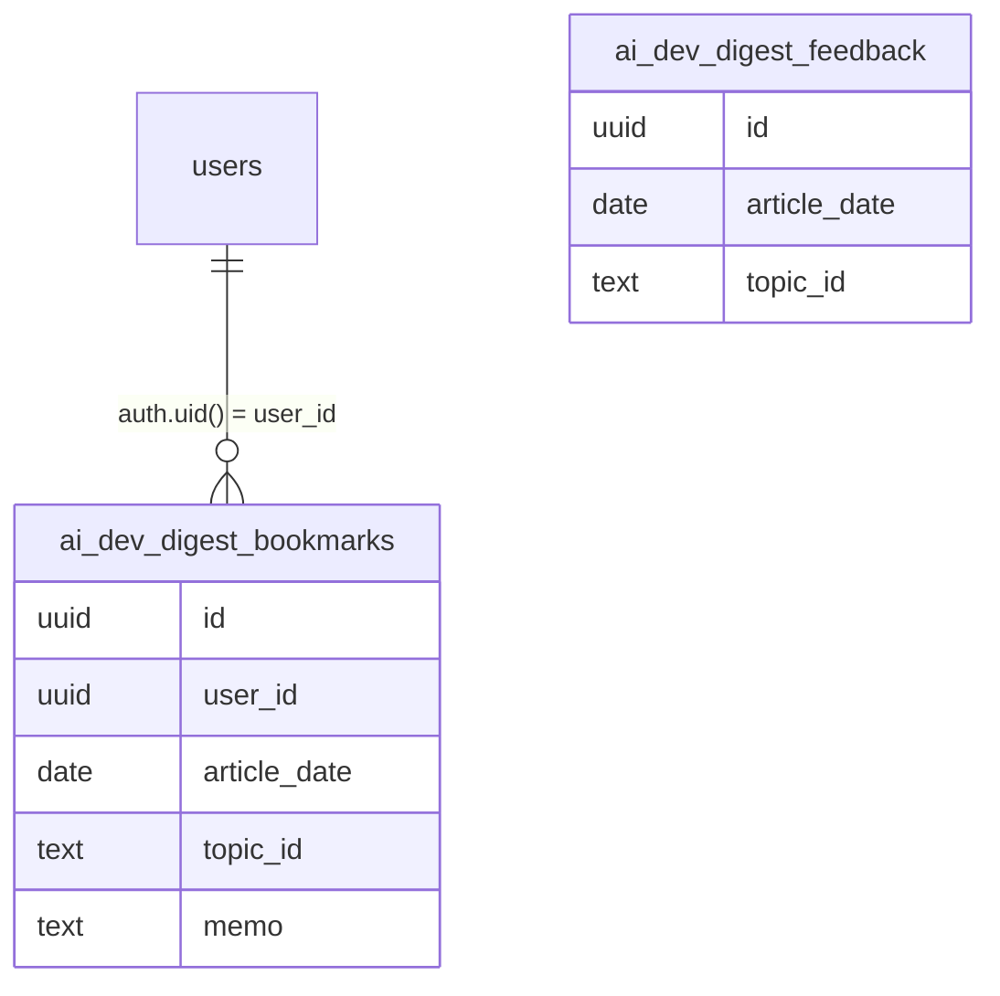

# アーキテクチャ: ai-dev-digest

## 1. 概要
AI駆動開発関連の話題コンテンツ(公式組織のブログ・YouTube、個人YouTube、個人ブログ、Qiita、Zenn)を1日1回自動で収集・翻訳・要約し、日次のダイジェスト記事として公開するアプリ。URL: `/ai-dev-digest`

## 2. アーキテクチャの目的
- コンテンツの収集・選定([content-selection](content-selection/requirements.md))と翻訳・要約([content-generation](content-generation/requirements.md))を分離し、それぞれの基準を独立して調整できるようにする(月次見直し([watchlist-review](watchlist-review/requirements.md))は選定・生成の両方を対象にするが、変更対象のファイル・基準は領域ごとに分かれたまま扱う)
- サーバーを持たない静的サイトの構成を維持したまま、GitHub Actionsによる日次の記事生成・PR作成、月次の見直し提案・PR作成という新しい運用パターンを導入する(2026-08改定: 当初は日次・月次ともClaude Routinesを想定していたが、Routine実行環境に外部APIキー・DB接続情報等を渡す手段が確認できず、両方ともGitHub Actionsに変更した。月次がDB(`SUPABASE_READONLY_DB_URL`)を読み取る点についてはdocs/adr/0004を改定し、`benriyatool_readonly`ロールに限りGitHub Actions Secretsへの保持を許容した。詳細は[daily-publish/design.md](daily-publish/design.md)・[watchlist-review/design.md](watchlist-review/design.md)の「実行環境の前提」参照)
- 通常はPRレビューが必須のこのプロジェクトの運用に対し、日次記事の完全自動マージという例外を[daily-publish](daily-publish/requirements.md)に明確に限定し、ウォッチリスト変更等の影響が大きい変更([watchlist-review](watchlist-review/requirements.md))には人間承認を残す

## 3. 設計方針
- 記事本文はDBに保存せず、ビルド時に取り込まれる静的コンテンツ(JSON。[article-detail/design.md](article-detail/design.md)で確定)として管理する(ブログ的な運用の方が実態に合うため。DBを介さないことで[ADR-0001](../../docs/adr/0001-user-input-database.md)が前提とする「サーバー機能を持たない」構成を保つ)
- 運営者フィードバックの保存だけは既存の[ADR-0001](../../docs/adr/0001-user-input-database.md)パターン(INSERT専用)を踏襲し、新しい認証・DB設計を増やさない。ただしログイン中のみ表示する入力欄のため、INSERT許可先は`anon`ではなく`authenticated`ロール(2026-08-05修正、詳細はarchitecture.md#12-セキュリティ)
- 2026-08追加: [bookmark](bookmark/requirements.md)により、Google OIDCログインを運営者限定から読者全員に開放する。読者本人のデータ(付箋)は[ADR-0001](../../docs/adr/0001-user-input-database.md)が予告する「ログインが必要なアプリ」パターン(`user_id`紐付け+RLSで本人行のみ操作可)を、[life-money-sim/saved-scenario](../life-money-sim/saved-scenario/design.md)に続いて2例目として踏襲する。ログインが読者全員に開放されたことに伴い、従来「ログインの有無」だけで表示していた運営者向けフィードバック入力欄は、運営者本人の判定(`isAuthorizedAdmin()`)を追加して対象を絞り込む([article-detail/design.md](article-detail/design.md)「ログイン状態に応じてフィードバック入力欄の表示を切り替える処理」)
- ウォッチリスト・採用基準の変更([watchlist-review](watchlist-review/requirements.md))は、日次記事公開([daily-publish](daily-publish/requirements.md))と異なる自動マージポリシーを適用し、影響範囲の大きさに応じてPRの扱いを分ける

## 4. システム構成図
1枚に全要素を詰めると読み手が追えないため、**全体像の俯瞰図**と**利用シーン別の詳細図**(閲覧・日次公開/配信・月次見直し)に分けて示す(各図はノード10・エッジ12以内を目安にする。分割の考え方は[architecture-workflow](../../.claude/skills/architecture-workflow/SKILL.md)を参照)。

### 4.1 全体俯瞰


### 4.2 閲覧・読者フロー(未ログイン閲覧＋ログイン読者の付箋・フィードバック)


### 4.3 日次記事の生成・公開・LINE配信フロー


### 4.4 月次の見直し(選定・生成)フロー


これらの図の正となる文章は下記「[5. アーキテクチャ概要](#5-アーキテクチャ概要)」と各specの設計書。このアプリから見た構成のみを描いており、プロジェクト共通インフラの詳細は[docs/architecture/](../../docs/architecture/infrastructure.md)を参照。

## 5. アーキテクチャ概要
Next.jsの静的エクスポートをCloudflare Workersで配信する構成は他アプリと同じ。記事本文はDBではなくJSONのコンテンツファイルとしてリポジトリ内(`content/ai-dev-digest/`)に置き、ビルド時に取り込む。日次のGitHub Actionsワークフローが情報源(公式API・公式RSSフィード・公式ブログ・公開ページ)から候補を収集し、選定基準([content-selection](content-selection/requirements.md))に沿ってトピックを選び、Claude Code CLIのヘッドレス実行による翻訳・要約([content-generation](content-generation/requirements.md))を経て記事を生成、PRを作成しCI成功後に自動マージする([daily-publish](daily-publish/requirements.md))。このマージ(記事JSONの新規追加)をトリガーに、独立したGitHub Actionsワークフローが記事タイトル・トピック見出し一覧・記事リンクをLINE Messaging APIのブロードキャスト機能で友だち全員へ配信する([line-broadcast](line-broadcast/requirements.md))。訪問者は記事一覧・詳細ページ([article-list](article-list/requirements.md)、[article-detail](article-detail/requirements.md))を未ログインでも閲覧できる。

2026-08追加: 記事詳細ページのGoogle OIDCログインは読者全員に開放されており、ログイン中の読者はトピックに自由記述メモ付きの付箋を貼り([bookmark](bookmark/requirements.md))、専用の一覧画面(`/ai-dev-digest/bookmarks`)から自分の付箋を振り返れる(付箋データは本人の行のみRLSで操作可能な`ai_dev_digest_bookmarks`テーブルに保存)。この変更に伴い、運営者向けフィードバック欄(記事詳細ページの各トピック下)の表示条件は「ログイン中」から「ログイン中かつ運営者本人」に変更された(既存のINSERT専用パターン(`authenticated`ロール)自体は変更なし。表示切り替えのみ`admin_emails`のSELECTを追加で利用)。月次のGitHub Actionsワークフローがフィードバックと掲載実績を読み、ヘッドレス起動したClaude Code経由で、各フィードバックを選定領域(ウォッチリスト・採用基準)・生成領域(翻訳・要約・記事執筆ルール)・対象外に振り分けたうえで見直し案をPRとして提案し、これは日次記事と異なり運営者の承認を経てからマージされる([watchlist-review](watchlist-review/requirements.md))。

## 6. 採用技術
| 技術 | 用途 |
|---|---|
| Next.js(静的エクスポート) | 記事一覧・詳細・付箋一覧ページの描画 |
| Supabase | 運営者フィードバックの保存(`ai_dev_digest_feedback`テーブル)、読者の付箋の保存(`ai_dev_digest_bookmarks`テーブル、2026-08追加) |
| Supabase Auth(Google OIDC) | 記事詳細ページ・付箋一覧ページのログイン(読者全員が対象、2026-08で運営者限定から拡大)。フィードバック入力欄の表示切り替え(運営者判定)にも利用 |
| GitHub Actions | 日次の記事生成・月次のウォッチリスト・基準見直し(スケジュール実行)・LINE新着記事配信(pushトリガー)の実行基盤 |
| Claude Code(ヘッドレス実行) | 月次見直し案の検討・複数ファイルの編集(watchlist-review内でGitHub Actionsから起動) |
| LINE Messaging API | 新着記事のLINE公式アカウントからの一斉配信(line-broadcast内でGitHub Actionsから呼び出し) |
| Tailwind CSS | スタイリング |

選定理由はプロジェクト横断のため[関連ADR](#11-関連adr)を参照。

## 7. 機能マップ
| spec | 役割 | 依存 |
|---|---|---|
| [article-list](article-list/requirements.md) | 日付ごとのダイジェスト記事をカード一覧で表示する | article-detailの記事構造を参照([article-detail/requirements.md#機能要件](article-detail/requirements.md)) |
| [article-detail](article-detail/requirements.md) | 記事本文(トピックごとの見出し・要約・出典)と、運営者本人向けフィードバック入力欄を表示する | content-selectionの選定結果([content-selection/requirements.md#機能要件](content-selection/requirements.md))、content-generationの生成ルール([content-generation/requirements.md#機能要件](content-generation/requirements.md))に従う。フィードバック欄の表示条件(運営者本人限定)はbookmarkのログイン開放に伴う変更([article-detail/requirements.md#運営者向けフィードバック](article-detail/requirements.md)) |
| [bookmark](bookmark/requirements.md) | ログイン中の読者がトピックへ自由記述メモ付きの付箋を貼り、一覧から振り返れるようにする | article-detailのトピック識別子・記事データ構造([article-detail/design.md](article-detail/design.md))に従う |
| [content-selection](content-selection/requirements.md) | 情報源ウォッチリストと採用基準を定義し、日次のトピックを選び出す | daily-publishの実行タイミングに従う([daily-publish/requirements.md#機能要件](daily-publish/requirements.md)) |
| [content-generation](content-generation/requirements.md) | 選定されたトピックの翻訳・要約・記事執筆のルールを定める | content-selectionの選定結果を受け取る([content-selection/requirements.md#機能要件](content-selection/requirements.md)) |
| [daily-publish](daily-publish/requirements.md) | 収集・翻訳・要約・記事公開を1日1回自動実行し、完全自動マージする | content-selection・content-generationの結果を公開する |
| [line-broadcast](line-broadcast/requirements.md) | daily-publishの日次記事PRがmainへ自動マージされた直後に、新着記事をLINE公式アカウントの友だち全員へ自動配信する | daily-publishのマージタイミング([daily-publish/requirements.md#実行](daily-publish/requirements.md))、article-detailの記事データ構造([article-detail/design.md](article-detail/design.md))、content-generationのタイトル導出処理([content-generation/design.md](content-generation/design.md))に従う |
| [watchlist-review](watchlist-review/requirements.md) | 月次でウォッチリスト・採用基準(選定領域)と翻訳・要約・記事執筆ルール(生成領域)の見直し案を作成し、人間承認を経て反映する | article-detailのフィードバック([article-detail/requirements.md#運営者向けフィードバック](article-detail/requirements.md))、content-selectionの掲載実績([content-selection/requirements.md#1日の掲載件数](content-selection/requirements.md))、生成領域の変更対象として[content-generation/requirements.md](content-generation/requirements.md)を参照 |

## 8. コンポーネント図


この図の正となる文章は「[7. 機能マップ](#7-機能マップ)」の依存列と、各specのrequirements.mdの依存関係。

## 9. ディレクトリ構成
CLAUDE.mdの一般規約(`components/`,`lib/`)通りで、逸脱なし。ただし記事本文・ウォッチリスト・採用基準はコード資産(`app/`)ではなくコンテンツデータとして`content/ai-dev-digest/`配下に別途管理する(設計確定: [article-detail/design.md](article-detail/design.md)、[content-selection/design.md](content-selection/design.md))。

```
content/ai-dev-digest/articles/<date>.json  # 1日1ファイルの記事データ(daily-publishが追加)
content/ai-dev-digest/watchlist.json        # 情報源ウォッチリスト(watchlist-reviewが変更)
content/ai-dev-digest/criteria.json         # 採用基準の数値(watchlist-reviewが変更)
```

収集・選定・記事組み立てのスクリプトはNext.jsアプリの一部ではないため`scripts/ai-dev-digest/`配下に置く(既存の`scripts/check-spec-coverage.mjs`と同じ置き場所の考え方)。DB読み取りを伴うスクリプト([watchlist-review](watchlist-review/design.md)が使う`collect-review-data`)は、依存関係を本体`package.json`から隔離した独立パッケージにする(`.claude/skills/data-check/`と同じ隔離パターン)。LINE配信のスクリプト([line-broadcast](line-broadcast/design.md)の`broadcast-line.ts`)も同様に`scripts/ai-dev-digest/`配下に置く。

## 10. 外部サービス
| サービス | 用途 |
|---|---|
| Supabase(`ai_dev_digest_feedback`テーブル) | 運営者フィードバックの保存 |
| Supabase(`ai_dev_digest_bookmarks`テーブル、2026-08追加) | ログイン中の読者本人の付箋(自由記述メモ)の保存 |
| Supabase Auth(Google OIDC) | 記事詳細ページ・付箋一覧ページのログイン(2026-08: 運営者限定から読者全員が対象に拡大)。フィードバック入力欄の表示切り替え(運営者判定、既存admin authと同じ仕組みを流用)にも利用 |
| YouTube公式API・各社公式RSSフィード・各社公式ブログ・Qiita公式API・Zenn公式RSS | 情報源データの取得([content-selection/requirements.md#データ取得方法](content-selection/requirements.md)) |
| GitHub Actions | 記事生成([daily-publish](daily-publish/requirements.md))・見直し提案([watchlist-review](watchlist-review/requirements.md))・LINE配信([line-broadcast](line-broadcast/requirements.md))の実行基盤(スケジュール実行・pushトリガーいずれも含む) |
| Claude Code CLI(運営者個人のPro/Maxサブスクリプション認証) | daily-publishの翻訳・要約生成、watchlist-reviewの見直し案検討に、いずれもヘッドレス起動で使用(2026-08第2次改定。当初はAnthropic APIの従量課金呼び出しだったが、サブスクリプション利用枠内で完結させるため変更) |
| LINE Messaging API | 新着記事のLINE公式アカウントからの一斉配信([line-broadcast](line-broadcast/requirements.md)) |

2026-08追加: `ai_dev_digest_bookmarks`により使用テーブルが2つになり、`auth.users`とのリレーションも生まれたため、以下にER図を置く。`ai_dev_digest_feedback`は引き続き`authenticated`ロールのINSERT専用(+docs/adr/0004の`benriyatool_readonly`ロールのSELECT専用)で`auth.users`とのリレーションを持たない。`ai_dev_digest_bookmarks`は本人の行のみRLSで操作可能なため`auth.users`と1対多の関係を持つ(1ユーザーが複数件の付箋を貼れる)。2つのテーブル間に直接のリレーションはない(`article_date`・`topic_id`はアプリ側のみで解決する参照で、外部キー制約は持たない)。各カラムの正となる文章は[article-detail/design.md#データベース設計](article-detail/design.md#データベース設計)・[bookmark/design.md#データベース設計](bookmark/design.md#データベース設計)。



## 11. 関連ADR
- [0001-user-input-database.md](../../docs/adr/0001-user-input-database.md) — 運営者フィードバック保存のDB選定・RLSパターン(INSERT専用)を踏襲。ログイン中のみ表示する入力欄のため対象ロールは`authenticated`(2026-08-05修正)。2026-08追加: 読者本人の付箋(`ai_dev_digest_bookmarks`)は同ADRが予告する「ログインが必要なアプリ」パターン(`user_id`紐付け+RLSで本人行のみSELECT/INSERT/UPDATE/DELETE)を踏襲する([life-money-sim/saved-scenario](../life-money-sim/saved-scenario/design.md)に続く2例目)
- [0004-agent-readonly-db-access.md](../../docs/adr/0004-agent-readonly-db-access.md) — [watchlist-review](watchlist-review/design.md)の月次GitHub Actionsワークフローが`ai_dev_digest_feedback`を読む際、`benriyatool_readonly`ロールのSELECT専用ポリシーをこのテーブルにも追加して利用する。同ADRは2026-08の第2次改定で`benriyatool_readonly`ロールに限りGitHub Actions Secretsへの接続情報保持を正式に許容しており、本specはその対象範囲に基づく。`ai_dev_digest_bookmarks`は読者個人のデータであり同ロールのSELECT対象には含めない
- [0006-admin-screen-oidc-rls.md](../../docs/adr/0006-admin-screen-oidc-rls.md) — フィードバック入力欄の表示切り替えに使うGoogle OIDCログイン判定の基盤(`app/lib/adminAuth.ts`)を流用。2026-08修正: `ai_dev_digest_feedback`自体へのSELECTポリシー追加は引き続き行わないが、フィードバック欄の表示条件を運営者本人限定に絞り込むため`isAuthorizedAdmin()`(`admin_emails`のSELECT)を新たに呼び出すようになった([bookmark](bookmark/requirements.md)によるログイン開放が理由。`admin_emails`のRLSは「自分の行のみ見える」ため読者全員が呼び出しても情報漏洩はない)。付箋機能(bookmark)のログインには許可リスト判定を用いない

## 12. セキュリティ
運営者フィードバックの保存は`authenticated`ロールによるINSERT専用とし、SELECT/UPDATE/DELETEは許可しない(他人の投稿内容を読む・改ざんする経路を作らない)。この入力欄は運営者本人がログイン中の場合のみ画面に表示されるため、実際のリクエストは常に`authenticated`ロールで行われる(`anon`は初期実装での誤りで、2026-08-05に修正した。ログイン不要なアプリのINSERT専用パターン(`anon`)とは区別すること)。保存される内容は選定基準への自由記述コメントのみで、氏名・連絡先等の個人情報は扱わない。フィードバック入力欄の表示・非表示はログイン状態+運営者判定(`isAuthorizedAdmin()`)による画面側の出し分けであり、DB側のアクセス制御ではない点に注意する(ADR-0006本来の「読み取り専用管理画面」の権限モデルとは異なる用途のため、同ADRのRLSテンプレートは適用しない)。

2026-08追加: 読者の付箋(`ai_dev_digest_bookmarks`)は本人の行のみRLS(`auth.uid() = user_id`)でSELECT/INSERT/UPDATE/DELETEでき、他の読者・運営者(自作画面経由)は閲覧経路を持たない。保存される内容(自由記述メモ)は本人以外に見られたくないという要件([bookmark/requirements.md](bookmark/requirements.md))に基づく。記事詳細ページ・付箋一覧ページへのログインが読者全員に開放されたことで`isAuthorizedAdmin()`(`admin_emails`のSELECT)の呼び出し元が運営者以外にも広がったが、同テーブルのRLSは「自分の行のみ見える」設計(ADR-0006)のため、許可リスト自体が読者に露出することはない。

## 13. 技術的制約
他者の著作物を要約・翻訳して掲載するため、著作権法上のリスク(翻訳権・翻案権侵害の可能性)を伴う。要約分量の制限・出典明記・利用規約への条項追記([content-generation/requirements.md#利用規約への反映](content-generation/requirements.md))によってリスクを低減する運用とする。各情報源の取得は公式API・公式RSSフィード・公開ページの閲覧の範囲にとどめ、非公式APIや利用規約を超えたアクセスは行わない([content-selection/requirements.md#データ取得方法](content-selection/requirements.md))。

## 14. 用語集
| 用語 | 説明 |
|---|---|
| 付箋 | ログイン中の読者がトピックに添える自由記述メモ(200文字まで)。本人のみ閲覧・編集・削除でき、一覧画面(`/ai-dev-digest/bookmarks`)から振り返れる。[bookmark](bookmark/requirements.md)で定義 |
| ウォッチリスト | 収集対象として固定的に管理する情報源(公式組織・個人・プラットフォーム)の一覧。[content-selection](content-selection/requirements.md)で定義 |
| 基準未達掲載 | content-selectionの採用基準を満たす候補が3件に満たない日に、実在する候補(基準未達の候補を含む)をその件数のまま掲載する措置。掲載する各トピックには基準未達である旨を示す。[watchlist-review](watchlist-review/requirements.md)で見直しの判断材料になる |
| GitHub Actions | スケジュール実行・pushトリガー実行のワークフロー基盤。日次の記事生成([daily-publish](daily-publish/requirements.md))・月次の見直し提案([watchlist-review](watchlist-review/requirements.md))・LINE新着記事配信([line-broadcast](line-broadcast/requirements.md))の実行主体 |
