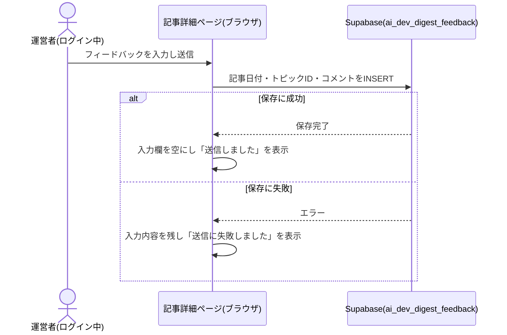

# 設計: 記事詳細ページ

## 前提: 記事データの形式(この機能が定義する共有スキーマ)

記事本文はDBではなく、ビルド時に取り込む静的コンテンツファイルとして管理する(`architecture.md#3-設計方針`)。この記事データの型・置き場所は本specで定義し、[article-list](../article-list/requirements.md)・[content-selection](../content-selection/requirements.md)・[content-generation](../content-generation/requirements.md)・[daily-publish](../daily-publish/requirements.md)・[watchlist-review](../watchlist-review/requirements.md)は共通してこの形式に従う。

- 格納場所: `content/ai-dev-digest/articles/<date>.json`(`<date>`は`YYYY-MM-DD`。URLの`[date]`と一致させる)
- 1ファイル=1日分の記事。日次のGitHub Actionsワークフロー([daily-publish](../daily-publish/requirements.md))がこのファイルを新規追加する
- なぜMarkdownでなくJSONか: トピックごとの見出し・要約・出典・情報源種別・基準未達フラグを構造化フィールドとして持つ必要があり、本文全体が地の文であるMarkdownより、フィールド単位で機械検証(バリデーション)しやすいJSONの方が、エージェントが生成する入力形式として事故が少ないと判断した(要件に形式指定はないため設計判断)

```ts
// app/ai-dev-digest/lib/types.ts
export type SourceType = 'official' | 'individual-youtube' | 'individual-blog' | 'qiita' | 'zenn'

// 要約の章立て1セクション分(content-generation/requirements.md#要約-2〜5)
export type SummarySection = {
  heading: string // セクション見出し
  teaser: string // 常時表示する導入文。60〜120字程度(content-generation/requirements.md#要約-3)
  detail: string // 「詳細を見る」操作で展開表示する詳細文(content-generation/requirements.md#要約-4)
}

export type Topic = {
  id: string // 記事内で一意。フィードバックの紐付けに使う(例: "topic-1")。表示順=配列順
  heading: string
  sections: SummarySection[] // 章立て構成の要約。目安2〜4セクション、detail合計1000〜1500字程度(content-generation/requirements.md#要約-2〜5に従う)
  sourceType: SourceType
  sourceName: string // 発信者名(例: "Anthropic"、"Andrej Karpathy")
  sourceUrl: string // 出典の元URL
  sourcePublishedAt: string // 元記事・動画のISO 8601形式の公開日時。content-selectionが収集したCandidate.publishedAtをそのまま引き継ぐ(エージェントが新たに調べ直す値ではない。requirements.md#記事本文表示-11)
  youtubeVideoId?: string // YouTube動画を紹介する場合のみ。公式埋め込みプレーヤー表示に使う
  belowCriteria: boolean // 採用基準未達での掲載(content-selection/requirements.md#1日の掲載件数-10)
  belowCriteriaReason?: string // belowCriteriaがtrueの場合のみ必須。基準からの乖離内容(例: "いいね数18件(基準30件に12件不足)")
}

export type Article = {
  date: string // YYYY-MM-DD。ファイル名と一致
  topics: Topic[] // 1〜5件(基準を満たす候補が不足する日は1〜2件になりうる。content-selection/requirements.md#1日の掲載件数-9〜10)
}
```

要約を単一の`summary: string`ではなく`sections: SummarySection[]`という構造化フィールドにしたのは、章立て(小見出し+導入文+詳細文)を画面側で機械的に描画するため。改行区切りのMarkdown的な単一文字列だと、見出し・導入文・詳細文の境界をパースする処理が別途必要になり事故が起きやすいため、JSONの構造自体で章立てと二段表示を表現する設計とした(要件に構造の指定はないため設計判断)。

記事タイトルはJSONに保存せず、`date`から`buildArticleTitle(date)`(content-generation/design.md参照)で常に導出する。タイトルをエージェントに毎回生成させると表現が揺れたり誇張表現に流れたりするリスクがあるため、日付から一意に決まる決定的な処理にする(content-generation/requirements.md#記事の構成-8、content-generation/requirements.md#エージェントの逸脱防止-8と対になる設計判断)。

## 処理フロー

### 記事データを読み込む処理
- 対象: `content/ai-dev-digest/articles/`配下のJSONファイル
- 手順:
  1. 指定された日付のファイル(`<date>.json`)を読み込む
  2. JSONとしてパースできない、またはスキーマ(下記バリデーション参照)を満たさない場合は例外を投げる
  3. 該当日のファイルが存在しない場合は「記事なし」を表す`null`を返す(例外にしない。存在しない日付へのアクセスは異常系ではなく通常のnot found扱いのため)
- 関連するビジネスルール: requirements.md#記事本文表示-1〜2

### その日の記事本文を表示する処理
- 対象: 読み込んだ記事データ
- 手順:
  1. `buildArticleTitle(date)`で導出した記事タイトル・公開日(`date`)を見出しとして表示する
  2. `topics`配列の順に、各トピックの見出し・出典(発信者名・タイトル代わりの見出しへのリンク・元URL)を表示する。あわせて`sourcePublishedAt`を`YYYY年M月D日`形式(時刻は表示しない。ダイジェスト自体が日次更新のため、出典の時刻まで表示する必要性が薄く、`buildArticleTitle`の日付粒度と合わせた)に整形して表示する(requirements.md#記事本文表示-11)
  3. 各トピックの`sections`配列の順に、セクション見出し(`h3`相当)と導入文(`teaser`)を常時表示する(content-generation/requirements.md#要約-3)
  4. 各セクションの導入文の下に、HTML標準の`<details><summary>詳細を見る</summary>…</details>`要素を配置し、`<summary>`を操作すると詳細文(`detail`)が展開表示されるようにする。ブラウザ標準機能で開閉できるため、開閉状態を保持するJavaScriptの状態管理を自前で持つ必要がない(要件「操作前は導入文のみ、操作後に詳細文」に対応。requirements.md#記事本文表示-4)
  5. 各トピックには情報源の種別(公式組織/個人YouTube/個人ブログ/Qiita/Zenn)が分かるバッジを表示する(表示位置・文言は「画面設計」参照)
  6. `youtubeVideoId`を持つトピックは、要約(セクション群)の下にYouTube公式の埋め込みプレーヤー(`<iframe>`、`youtube-nocookie.com`ドメイン)を表示する(content-generation/requirements.md#著作権への配慮-6)。持たない場合は表示しない
  7. `belowCriteria`が`true`のトピックには「採用基準未達」バッジと`belowCriteriaReason`の内容を小さく添える。1件以上該当がある記事では、記事冒頭にも「この日は基準を満たす候補が少なかったため、一部のトピックは基準に届いていない内容を含みます」という注記を1回だけ表示する(繰り返し表示による煩雑さを避けるため)
- 関連するビジネスルール: requirements.md#記事本文表示-1〜5、requirements.md#記事本文表示-11、requirements.md#表示分量・著作権配慮-1〜2

### ログイン状態に応じてフィードバック入力欄の表示を切り替える処理
- 対象: Supabase Authのログインセッション
- 手順:
  1. ページ表示時に現在のログインセッションを取得する(`app/lib/adminAuth.ts`の`getSession`)
  2. セッションが存在する(ログイン中)場合のみ、各トピックの下にフィードバック入力欄を表示する。存在しない場合は何も表示しない
  3. ログイン状態の変化(ログイン完了・ログアウト)を購読し(`onAuthChange`)、変化のたびに表示を更新する
  4. 未ログイン状態では、ページ下部に小さくログインボタンを表示する(Googleでのログインを開始する導線。`life-money-sim`の`LoginStatus`と同じ表示パターン)
- **DBの読み取り(SELECT)は一切行わない**。管理画面(`app/lib/adminAuth.ts`の`isAuthorizedAdmin`、`admin_emails`テーブルのSELECT)は呼び出さず、生のログイン状態(セッションの有無)だけで表示を切り替える。これは「運営者向け」を名乗りつつ実際にはGoogleアカウントでログインした任意の訪問者にも入力欄が表示されることを意味するが、保存されるのは選定基準への自由記述コメントのみで、閲覧・改ざんの実害がないため許容する(architecture.md#12-セキュリティ、指示された設計方針どおり)
- 関連するビジネスルール: requirements.md#運営者向けフィードバック-7、requirements.md#フィードバックの保存・権限-4

### フィードバックを送信する処理
- 対象: フィードバック入力欄に入力された自由記述コメント
- 手順:
  1. 入力内容をトリムした結果が空文字の場合、送信ボタンを無効化する(押下自体をできなくする)(requirements.md#運営者向けフィードバック-10)
  2. 送信ボタン押下時、対象トピックの記事日付(`date`)とトピック識別子(`topic.id`)、入力内容を1件のレコードとしてまとめる
  3. `ai_dev_digest_feedback`テーブルへの保存を試みる(`anon`キーでのINSERT)
  4. 保存に成功した場合、入力欄を空にし「送信しました」という完了表示を数秒間出す
  5. 保存に失敗した場合、入力内容は消さずに残し、「送信に失敗しました。もう一度お試しください」と表示する(既存の`saveResult`系は分析用ベストエフォートのため失敗を握りつぶすが、本機能は運営者が能動的に書いた自由記述であり、消えたことに気づけない方が不親切なため、この機能に限り失敗を可視化する設計とする)
- シーケンス図(俯瞰用。正は上記の手順の文章):


- 関連するビジネスルール: requirements.md#運営者向けフィードバック-8〜10、requirements.md#フィードバックの保存・権限-3、requirements.md#フィードバックの保存・権限-5

## バリデーション

記事データ(JSONファイル)のスキーマ検証:
- `date`: `YYYY-MM-DD`形式で、ファイル名と一致すること
- `topics`: 配列長が1件以上5件以下であること(content-selection/requirements.md#1日の掲載件数-9〜10。基準を満たす候補が不足する日は1〜2件になりうる)
- 各`topic`: `id`が記事内で重複しないこと、`heading`/`sourceName`/`sourceUrl`/`sourcePublishedAt`が空文字でないこと、`sourceUrl`が`http`または`https`で始まる絶対URLであること、`sourcePublishedAt`がISO 8601形式としてパース可能な日時文字列であること、`sourceType`が定義済み種別のいずれかであること、`belowCriteria`が`true`の場合は`belowCriteriaReason`が必須(false時は無くてよい)
- `sections`: 配列長が**2件以上**であること(要件「複数のセクションに分けて構成する」により1件は不正。content-generation/requirements.md#要約-5)。各セクションの`heading`/`teaser`/`detail`が空文字でないこと。各セクションの`teaser`が40〜140字の範囲であること(目安60〜120字。content-generation/requirements.md#要約-3)。全セクションの`detail`を連結した文字数が800〜1700字の範囲であること(目安1000〜1500字に対し、既存の要約分量チェック(80〜170字/目安100〜150字)と同じ比率のバッファを取った範囲。content-generation/requirements.md#要約-4)
- 上記を満たさない場合は例外を投げる(下記エラーハンドリング参照)。フィードバック送信の入力内容自体(自由記述テキスト)は長さ・文字種の制限を設けないが、空文字または空白文字のみの場合は送信できない(トリムした結果が空文字になる入力を拒否する)(requirements.md#運営者向けフィードバック-10)

## エラーハンドリング

- 記事データのスキーマ違反は**ビルド時(`next build`)に例外として検知させ、ビルドを失敗させる**。これにより[daily-publish](../daily-publish/requirements.md)のCIチェック(`npm run build`を含む)が壊れたデータのPRを弾き、不正な記事が公開される事故を防ぐ(daily-publish/requirements.md#エラーハンドリング-5と対になる設計)
- フィードバック送信の失敗(通信エラー・RLS拒否等)は上記処理フロー4.のとおり画面に失敗を表示する。原因の種類による出し分けは行わない(自由記述の再送を促せれば十分なため)

## 関連するファイル(抜粋)

```
app/ai-dev-digest/lib/types.ts (新規: Article/Topic/SourceTypeの型定義)
app/ai-dev-digest/lib/articleTitle.ts (新規: content-generation/design.mdで定義するbuildArticleTitle。article-listのカード表示からも参照される)
app/ai-dev-digest/lib/articleSchema.ts (新規: JSONのバリデーション・パース処理。article-listのページネーションからも参照される)
app/ai-dev-digest/lib/articles.ts (新規: content/ai-dev-digest/articles/ を読み込むgetAllArticles/getArticleByDate。article-listと共有)
app/ai-dev-digest/lib/saveFeedback.ts (新規: フィードバック保存処理)
app/ai-dev-digest/[date]/page.tsx (新規: 記事詳細ページ、generateStaticParamsで全日付を列挙)
app/ai-dev-digest/components/TopicSection.tsx (新規)
app/ai-dev-digest/components/SourceBadge.tsx (新規)
app/ai-dev-digest/components/YoutubeEmbed.tsx (新規)
app/ai-dev-digest/components/FeedbackForm.tsx (新規)
app/lib/adminAuth.ts (既存: getSession/onAuthChange/signInWithGoogle/signOutを利用。isAuthorizedAdminは使わない)
app/lib/supabaseClient.ts (既存の共通クライアントを利用)
content/ai-dev-digest/articles/*.json (新規: 記事本文データ。コード資産ではないためapp/配下に置かない)
```

## データベース設計

### ai_dev_digest_feedback(新規テーブル)
| カラム | 型 | 補足 |
|---|---|---|
| id | uuid | 共通カラム(docs/adr/0001)。DB側で自動採番 |
| created_at | timestamptz | 共通カラム。DB側で自動設定 |
| is_test | boolean, not null, default false | 共通カラム(docs/adr/0001)。開発環境またはURLに`?test=1`が付いている場合にtrue |
| article_date | date, not null | 対象記事の日付(`content/ai-dev-digest/articles/<date>.json`の`date`と一致) |
| topic_id | text, not null | 対象トピックの`Topic.id` |
| comment | text, not null | 自由記述のフィードバック内容 |

RLSは既存パターンをそのまま踏襲する(新規性なし、architecture.md#11-関連adr):
- `anon`: INSERTのみ許可(docs/adr/0001)
- `benriyatool_readonly`: SELECTのみ許可(docs/adr/0004)。[watchlist-review](../watchlist-review/requirements.md)の月次見直しがこのロールでフィードバックを読む
- 運営者専用SELECTポリシー(docs/adr/0006のテンプレート)は**追加しない**。フィードバック入力欄の表示切り替えは画面側のログイン状態判定のみで行い、DBの読み取り権限を必要としないため(architecture.md#12-セキュリティ)

```sql
create table ai_dev_digest_feedback (
  id uuid primary key default gen_random_uuid(),
  created_at timestamptz not null default now(),
  is_test boolean not null default false,
  article_date date not null,
  topic_id text not null,
  comment text not null
);

alter table ai_dev_digest_feedback enable row level security;

-- anonはINSERTのみ許可(docs/adr/0001の共通方針)
grant insert on ai_dev_digest_feedback to anon;
create policy "anon can insert" on ai_dev_digest_feedback
  for insert to anon with check (true);

-- benriyatool_readonlyはSELECTのみ許可(docs/adr/0004。watchlist-reviewの月次見直しが読む)
grant select on ai_dev_digest_feedback to benriyatool_readonly;
create policy "benriyatool_readonly can select" on ai_dev_digest_feedback
  for select to benriyatool_readonly using (true);
```

実際のマイグレーションファイル作成・適用は[daily-publish](../daily-publish/tasks.md)ではなく本specのtasks.mdで行う(記事の読み書きより先にテーブルが必要なため)。

## 画面設計

- パンくず(べんりやつーる › AI駆動開発ダイジェスト › 記事タイトル)
- デスクトップ幅(lg以上)では本文の右側に目次(各トピック見出しへのアンカーリンク)を表示する。モバイル幅では本文がそのまま縦に並ぶため目次は表示しない
- 記事タイトル・公開日
- トピックごとのカード: 情報源種別バッジ、見出し、要約(章立て。セクション見出し+導入文(60〜120字程度)を2〜4セクション程度で常時表示し、各セクションに「詳細を見る」の開閉操作を配置。展開すると詳細文(全セクション合計1000〜1500字程度)が表示される)、出典(発信者名・投稿日時・元URLへのリンク、新規タブで開く)、(該当時)YouTube埋め込みプレーヤー、(該当時)「採用基準未達」バッジ+理由の小さな注記
- 基準未達トピックが1件以上ある場合、記事冒頭に注記文を1回表示
- 各トピックの下: ログイン中のみフィードバック入力欄(テキストエリア+送信ボタン)。送信後は「送信しました」、失敗時は「送信に失敗しました。もう一度お試しください」を表示
- ページ下部: 未ログイン時は「運営者ログイン」リンク、ログイン中はログイン中メールアドレス+ログアウトボタン(`life-money-sim`の`LoginStatus`と同じ表示)

## コンポーネント設計

| コンポーネント | Props | 役割 |
|---|---|---|
| TopicSection | `topic: Topic`, `session: Session \| null`, `articleDate: string` | 1トピック分の表示+配下にFeedbackFormを条件付きで表示 |
| SourceBadge | `sourceType: SourceType` | 情報源種別を日本語ラベルのバッジで表示 |
| YoutubeEmbed | `videoId: string` | YouTube公式埋め込みプレーヤー(`youtube-nocookie.com`)を表示 |
| FeedbackForm | `articleDate: string`, `topicId: string` | 自由記述の入力欄・送信・送信結果表示 |

## 状態管理

- ログインセッション(`Session \| null`): ページのトップレベルコンポーネントで`useState`保持し、`TopicSection`にpropsで渡す(`life-money-sim/page.tsx`と同じ方式)
- 各`FeedbackForm`の送信状態(`idle`/`sending`/`sent`/`failed`)はコンポーネント内の`useState`で完結させる(トピックをまたいで共有しない)

## セキュリティ

- フィードバックの`comment`はエスケープせずそのままDBに保存する(表示・一覧化を一切行わないため、XSS等の表示起因のリスクは発生しない。requirements.md#スコープ外を参照)
- `article_date`・`topic_id`はブラウザから送信される値をそのまま信頼する。存在しない日付・トピックIDが送られても、フィードバックとして意味を持たないだけで実害はない(anonはINSERTのみで他データへの影響がないため、厳密なサーバー側検証は行わない)
- 記事データ(JSONファイル)は開発者・エージェントが作成しリポジトリにコミットされるコンテンツであり、訪問者からの入力ではないため、XSS対策としてのサニタイズは不要(通常のReactレンダリングでエスケープされる)。ただし`sourceUrl`は`http`/`https`のみを許可し(バリデーション参照)、`javascript:`等のスキームを含むリンクが生成されないようにする

## ログ

- フィードバックの保存成功・失敗はコンソール等へのログ出力を行わない(既存の`saveResult`系と同じ方針。静的配信でサーバーを持たずコンソールログを運営者が収集できないため)
- 記事データのスキーマ違反はビルド時に例外としてCIのログに出力される(`next build`の標準エラー出力。エラーハンドリング参照)
