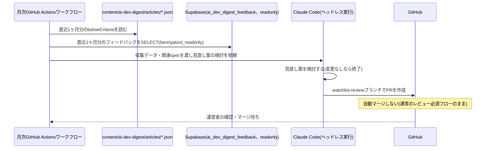

# 設計: ウォッチリスト・採用基準の月次見直し

## 実行環境の前提

実行主体はGitHub Actionsとする。**2026-08改定(第2版)の経緯**: 当初はClaude Routines(定期実行のクラウドエージェント)を実行主体とする想定だったが、[daily-publish/design.md](../daily-publish/design.md)の検証と同じ理由(Routine実行環境に独自のシークレットを追加する手段が確認できなかったこと)により、本specもGitHub Actionsに変更した。当初はDB接続情報(`SUPABASE_READONLY_DB_URL`)をGitHub Actions Secretsに置かないというdocs/adr/0004の既定方針を優先し、本specだけはClaude Routinesのまま据え置く判断をしていたが、その後の方針転換によりGitHub Actionsへ統一することとした。これに伴い、docs/adr/0004を改定し、`benriyatool_readonly`ロール(SELECT専用・BYPASSRLSなし・RLSスコープ限定という低い権限のロール)に限りGitHub Actions Secretsへの保持を許容する例外を追加した(改定内容は[0004-agent-readonly-db-access.md](../../../docs/adr/0004-agent-readonly-db-access.md)の「GitHub Actions実行環境への対象拡大(2026-08第2次改定)」参照)。**2026-08第3次改定**: Claude Code CLIの認証をAnthropic API(`ANTHROPIC_API_KEY`、従量課金)から運営者個人のClaude Code Pro/Maxサブスクリプション認証(`CLAUDE_CODE_OAUTH_TOKEN`)に変更した(理由は[daily-publish/design.md](../daily-publish/design.md)「実行環境の前提」・[content-generation/design.md](../content-generation/design.md)「設計の前提」参照。認証情報は両specで共用する)。

- ワークフロー本体は`.github/workflows/ai-dev-digest-monthly.yml`として月1回起動する
- 「見直し案を作成する処理」(下記)はエージェントの推論を要するため、GitHub Actionsのワークフロー内でClaude Code CLIをヘッドレス(非対話)モードで起動し(`claude -p "<プロンプト>"`相当。[daily-publish](../daily-publish/design.md)のcontent-generationのような単発のAPI呼び出しでは、複数ファイル(requirements.md・watchlist.json・criteria.json)を横断して整合の取れた編集を行うタスクに対応できないため、ファイル読み書きツールを持つエージェントセッションとして実行する)、リポジトリのチェックアウト・ファイル編集・コミットまでを行わせる
- GitHubへの書き込み(ブランチ作成・コミット・push・PR作成)には、[daily-publish](../daily-publish/design.md)と同じfine-grained PAT(`AI_DEV_DIGEST_GH_PAT`)を再利用する(本specは自動マージしないため、daily-publishで懸念した「同一PATによる自動マージ範囲の混同」は生じない)
- Claude Code CLIの実行には`CLAUDE_CODE_OAUTH_TOKEN`(`claude setup-token`で発行する長期(1年)OAuthトークン。daily-publishと共用)を、DB読み取りには`SUPABASE_READONLY_DB_URL`を、それぞれこのリポジトリのActions Secretsとして保存する
- ワークフローへの実行指示は、この`watchlist-review`のrequirements.md/design.mdと、参照先の`content-selection`のrequirements.md/design.mdをそのまま参照する形にする(専用のプロンプトファイルを別途複製しない)
- 運用開始前に、上記のPAT・APIキー・DB接続情報が実際にリポジトリのActions Secretsに設定されていることを確認する

## 処理フロー

### 見直しの材料を集める処理
- 対象: 直近1ヶ月分のデータ
- 手順:
  1. `content/ai-dev-digest/articles/*.json`のうち、実行日から過去1ヶ月分のファイルを読み込み、`belowCriteria: true`のトピックを抽出する(発生日・情報源・`belowCriteriaReason`)。これがcontent-selection/requirements.md#1日の掲載件数-11の「基準未達掲載の記録」にあたる
  2. `ai_dev_digest_feedback`テーブルから、直近1ヶ月分・`is_test = false`のレコードを`benriyatool_readonly`ロールで読み取る(docs/adr/0004の接続方式。`is_test`除外はdocs/adr/0001の集計時の共通ルール)
  3. 上記2種類のデータをまとめ、見直し案の根拠として使えるようにする
- 関連するビジネスルール: requirements.md#見直しの実行-1

### 見直し案を作成する処理(エージェントの推論)
- 対象: 収集した基準未達記録・フィードバック
- 手順:
  1. 基準未達が特定の情報源・種別で慢性的に続いている場合、その情報源の除外、または該当種別の採用基準(閾値)の緩和を検討する(requirements.md#見直しの実行-1、content-selection/requirements.md#1日の掲載件数-11)
  2. フィードバックの内容(「この選定はもう不要」等)を踏まえ、ウォッチリストからの除外や基準の見直しを検討する
  3. 見直し案には、どのフィードバック・どの実績データに基づく変更かを明記する(requirements.md#ビジネスルール・制約-2)
  4. 見直す点が見当たらない月は、変更なしと判断してPRを作成しない(要件は見直し案の作成頻度のみを定めており、必ず変更PRを出すとは定めていないため。空の提案PRを毎月作らないことで、実際に検討すべき提案の埋没を防ぐ)
- 変更対象ファイル(1つのPRでまとめて更新する。片方だけの更新はしない):
  - `specs/ai-dev-digest/content-selection/requirements.md`(ウォッチリストの表・採用基準の記述。requirements.md#承認フロー-2)
  - `content/ai-dev-digest/watchlist.json`・`content/ai-dev-digest/criteria.json`(content-selection/design.mdの機械可読データ。requirements.mdとの二重管理をこのPRで同時に維持する)
- 関連するビジネスルール: requirements.md#見直しの実行-1〜2、requirements.md#ビジネスルール・制約-2

### 見直し案をPRとして提案する処理
- 対象: 上記で作成した変更内容
- 手順:
  1. 作業用ブランチ`ai-dev-digest/watchlist-review/<year-month>`(例: `ai-dev-digest/watchlist-review/2026-08`)を作成する
  2. 変更内容をコミットし、`main`向けにPRを作成する。PR本文に変更理由(根拠データ)を明記する
  3. **このPRは自動マージしない。** [daily-publish](../daily-publish/design.md)の自動マージ対象は`ai-dev-digest/articles/**`ブランチのみであり、`ai-dev-digest/watchlist-review/**`は対象外(ブランチ命名で明確に区別する)。通常のリポジトリのブランチ保護(レビュー必須)がそのまま適用され、運営者が内容を確認してマージする
- シーケンス図(俯瞰用。正は上記の手順の文章):


- 関連するビジネスルール: requirements.md#承認フロー-3

## エラーハンドリング

- `ai_dev_digest_feedback`への接続に失敗した場合、フィードバックなしの状態(基準未達記録のみ)で見直し案を検討する。DB接続の可否によって月次実行自体を失敗させない(接続失敗はGitHub Actionsのワークフロー実行ログに記録する)
- 見直し案がrequirements.mdとJSONデータの片方しか更新できていない状態でPRを作らない(処理フロー「見直し案を作成する処理」の変更対象ファイルを両方満たしてからコミットする)

## 関連するファイル(抜粋)

```
.github/workflows/ai-dev-digest-monthly.yml (新規: 月1回起動するワークフロー本体。collectReviewData.tsの実行→Claude Code CLIのヘッドレス起動→変更があればコミット・push・PR作成までを行う)
scripts/ai-dev-digest/collect-review-data/ (新規: 独立したpackage.json。pg/dotenvを使いbenriyatool_readonlyで接続する。.claude/skills/data-check/と同じ依存隔離パターン)
scripts/ai-dev-digest/collect-review-data/collectReviewData.ts (新規: 基準未達記録の集計+フィードバックのSELECT)
content/ai-dev-digest/articles/*.json (既存: 基準未達記録の参照元)
supabase/migrations/<timestamp>_create_ai_dev_digest_feedback.sql (既存: article-detailで作成するbenriyatool_readonly向けSELECTポリシーを利用)
specs/ai-dev-digest/content-selection/requirements.md (既存: 見直し案の変更対象)
content/ai-dev-digest/watchlist.json・criteria.json (既存: 見直し案の変更対象)
```

## データベース設計

新規テーブルはない。[article-detail/design.md](../article-detail/design.md)で作成する`ai_dev_digest_feedback`テーブルの`benriyatool_readonly`向けSELECTポリシー(docs/adr/0004)をそのまま利用する。

## セキュリティ

- `SUPABASE_READONLY_DB_URL`は、このリポジトリのActions Secretsとして暗号化保存する(2026-08第2次改定でdocs/adr/0004が`benriyatool_readonly`ロールに限り許容した例外。`service_role`キー等の強い権限は引き続きこのリポジトリ・CI Secretsに含めない)
- `CLAUDE_CODE_OAUTH_TOKEN`は運営者個人のClaude Code Pro/Maxサブスクリプションに紐づく認証情報である点はdaily-publish/design.md「セキュリティ」と同様(2026-08第3次改定)
- フィードバックのSELECTは集計・見直し検討の目的に限定し、特定の投稿者を特定・追跡する用途には使わない(docs/adr/0004の既存方針を踏襲。なお本アプリのフィードバックには投稿者を特定する情報自体が含まれない)
- 見直し案のPRは通常のレビュー必須フローに乗るため、内容の妥当性は運営者のレビューで最終確認される(自動マージしないこと自体が主要な安全策。本specのワークフローは`gh pr merge --auto`のようなauto-merge操作を一切行わない)

## ログ

- 月次実行ごとに、集計対象期間・基準未達件数・フィードバック件数・PR作成の有無(変更なしの場合はその旨)をGitHub Actionsのワークフロー実行ログに記録する
