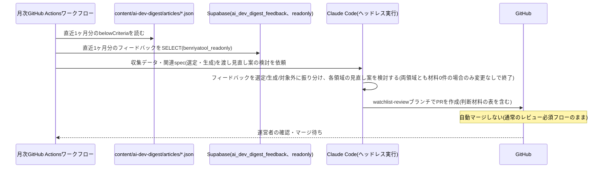

# 設計: 月次見直し(選定・生成)

## 実行環境の前提

実行主体はGitHub Actionsとする。DB接続情報(`SUPABASE_READONLY_DB_URL`)は、`benriyatool_readonly`ロール(SELECT専用・BYPASSRLSなし・RLSスコープ限定という低い権限のロール)に限りGitHub Actions Secretsへの保持を許容する(根拠は[0004-agent-readonly-db-access.md](../../../docs/adr/0004-agent-readonly-db-access.md)参照)。Claude Code CLIの認証は運営者個人のClaude Code Pro/Maxサブスクリプション認証(`CLAUDE_CODE_OAUTH_TOKEN`)を用いる(理由は[daily-publish/design.md](../daily-publish/design.md)「実行環境の前提」・[content-generation/design.md](../content-generation/design.md)「設計の前提」参照。認証情報は両specで共用する)。

- ワークフロー本体は`.github/workflows/ai-dev-digest-monthly.yml`として月1回起動する
- 「見直し案を作成する処理」(下記)はエージェントの推論を要するため、GitHub Actionsのワークフロー内でClaude Code CLIをヘッドレス(非対話)モードで起動し(`claude -p "<プロンプト>"`相当。[daily-publish](../daily-publish/design.md)のcontent-generationのような単発のAPI呼び出しでは、複数ファイル(選定領域: requirements.md・watchlist.json・criteria.json、必要なら選定ロジックの実装・テストファイル / 生成領域: content-generation/requirements.md・design.md、必要ならgenerate-content.ts)を横断して整合の取れた編集を行うタスクに対応できないため、ファイル読み書き・テスト実行(`bash`)ツールを持つエージェントセッションとして実行する)、リポジトリのチェックアウト・ファイル編集・テスト実行・コミットまでを行わせる
- GitHubへの書き込み(ブランチ作成・コミット・push・PR作成)には、[daily-publish](../daily-publish/design.md)と同じfine-grained PAT(`AI_DEV_DIGEST_GH_PAT`)を再利用する(本specは自動マージしないため、daily-publishで懸念した「同一PATによる自動マージ範囲の混同」は生じない)
- Claude Code CLIの実行には`CLAUDE_CODE_OAUTH_TOKEN`(`claude setup-token`で発行する長期(1年)OAuthトークン。daily-publishと共用)を、DB読み取りには`SUPABASE_READONLY_DB_URL`を、それぞれこのリポジトリのActions Secretsとして保存する
- ワークフローへの実行指示は、この`watchlist-review`のrequirements.md/design.mdと、参照先の`content-selection`・`content-generation`のrequirements.md/design.mdをそのまま参照する形にする(専用のプロンプトファイルを別途複製しない)
- 運用開始前に、上記のPAT・APIキー・DB接続情報が実際にリポジトリのActions Secretsに設定されていることを確認する
- フォルダ名は`watchlist-review`のまま据え置く。見直し対象が選定領域だけでなく生成領域も含むため実態としては`monthly-review`等が近いが、リネームの影響が作業ブランチ接頭辞`ai-dev-digest/watchlist-review/`・ワークフロー`.github/workflows/ai-dev-digest-monthly.yml`内の参照パス・[architecture.md](../architecture.md)のcross-link・関連Skill(機能マップ等)のリンクに及び、コストに見合わないため。将来リネームする場合はこれらの追従が必要

## 処理フロー

### 見直しの材料を集める処理
- 対象: 直近1ヶ月分のデータ
- 手順:
  1. `content/ai-dev-digest/articles/*.json`のうち、実行日から過去1ヶ月分のファイルを読み込み、`belowCriteria: true`のトピックを抽出する(発生日・情報源・`belowCriteriaReason`)。これがcontent-selection/requirements.md#1日の掲載件数-11の「基準未達掲載の記録」にあたる
  2. `ai_dev_digest_feedback`テーブルから、直近1ヶ月分・`is_test = false`のレコードを`benriyatool_readonly`ロールで読み取る(docs/adr/0004の接続方式。`is_test`除外はdocs/adr/0001の集計時の共通ルール)。フィードバックは領域で絞り込まず全件取得する(領域の振り分けは次の「見直し案を作成する処理」でエージェントが内容から判断する。requirements.md#見直しの実行-3)
  3. 上記2種類のデータをまとめ、見直し案の根拠として使えるようにする
- 関連するビジネスルール: requirements.md#見直しの実行-1、requirements.md#見直しの実行-3

### 見直し案を作成する処理(エージェントの推論)
- 対象: 収集した基準未達記録・フィードバック
- 手順:
  1. 各運営者フィードバックを内容から「選定領域」「生成領域」「いずれにも該当しない」に振り分ける(requirements.md#見直しの実行-3)。判断の目安:
     - 選定領域: 「どの話題を載せるか」への指摘(重複・偏り・不要な情報源・ニッチさ・話題としての不適切さなど)
     - 生成領域: 「載せた話題をどう書くか」への指摘(分かりやすさ、専門用語の多さ、結論・要点の見えにくさ、試せることの不足、要約の分量、重要度★の付け方など)
     - いずれにも該当しない: 画面表示の不具合、フィードバック・付箋など他機能への要望
  2. 選定領域(基準未達記録 + 選定領域に振り分けたフィードバック)の見直し案を検討する:
     - 基準未達が特定の情報源・種別で慢性的に続いている場合、その情報源の除外、または該当種別の採用基準(閾値)の緩和を検討する(content-selection/requirements.md#1日の掲載件数-11)
     - フィードバックの内容(「この選定はもう不要」等)を踏まえ、ウォッチリストからの除外や基準の見直しを検討する
     - フィードバックが既存の採用基準(情報源単位の可否・数値閾値)では表現できない観点(例: 特定トピックが話題として不適切)を指摘している場合、新しい採用基準・フィルター観点の追加を具体的な変更案として検討する(requirements.md#選定領域の見直し案の粒度・提示方法-6。既存項目の調整に限定しない)
  3. 生成領域(生成領域に振り分けたフィードバック)の見直し案を検討する:
     - フィードバックが指摘する分かりやすさ・情報の取捨選択・重要度の付け方の問題に対し、`content-generation/requirements.md`の機能要件・ビジネスルール(要約の分量[3][4]、固定4観点の構成・内容[5][9]〜[12]、書き出しの順序[10]、情報の優先順位[11]、重要度の基準[13][14]など)と`content-generation/design.md`の該当処理の文言を、具体的な変更案(実際のファイル差分)として検討する(requirements.md#生成領域の見直し案の粒度・提示方法-9)
     - 変更は既存ルールの調整(数値・順序・観点の言い換え)にとどめ、著作権リスク低減の前提(原文の構成をなぞらない独自の再構成、数値・結論の網羅的な転記の回避、出典の明記。content-generation/requirements.md#著作権への配慮(根拠))を弱める変更は提案しない(requirements.md#ビジネスルール・制約-3)
     - 生成領域に振り分けたフィードバックでも、上記の著作権ガード(requirements.md#ビジネスルール・制約-3)に抵触するため採用できない要望(例: 「要約が浅いので原文の数値を全部載せてほしい」等)は、見直し案に反映しない。requirements.md#見直しの実行-4 の「いずれの領域にも該当しない」フィードバックと同様に、却下した旨と理由をPR本文の判断材料の表の行として残す(requirements.md#生成領域の見直し案の粒度・提示方法-9)
  4. 見直し案には、どのフィードバック・どの実績データに基づく変更かを明記する(requirements.md#ビジネスルール・制約-2)
  5. 選定領域・生成領域それぞれについて、振り分けた材料(選定領域は基準未達記録も含む)が1件でもある場合は、必ず具体的な変更案(実際のファイル差分)を作成してPRとして提示する。「1件では根拠が薄い」等の理由で提案自体を見送り、無言で終了することはしない。両領域とも材料が0件の月のみ、実在する材料がないためPRを作成しない(requirements.md#選定領域の見直し案の粒度・提示方法-7、requirements.md#生成領域の見直し案の粒度・提示方法-9。自動マージしない設計のため、提案のハードルを下げても実害がなく、運営者が判断材料を得られないことの方が問題であるため)
  6. 選定領域で、`specs/ai-dev-digest/content-selection/requirements.md`に既存の選定ロジック(`app/ai-dev-digest/lib/selection.ts`等)ではまだ判定できない新しい種類の採用基準・フィルター観点を追加する場合、その判定ロジックの実装(TDDのテストを含む)も同じPRに含める。仕様の変更だけを残し、実装を先送りにしない。実装後は`npm test`・`npm run lint`・`npm run build`・`npm run check:spec-coverage`を実行し、いずれも成功することを確認してからコミットする(requirements.md#選定領域の見直し案の粒度・提示方法-8)。既存の実装済み項目に対する変更(閾値の調整・情報源の除外等)はこの手順の対象外(コード変更を伴わないため)
  7. 手順6の実装がどうしても完了できない場合(判定方法自体に更なる検討が必要な場合等)のみ、`npm run check:spec-coverage`が❌にならないよう`scripts/spec-coverage-skip.json`に理由を添えて登録した上で、PR本文の判断材料の表(下記「見直し案をPRとして提案する処理」参照)に実装が未完了である旨を明記する。これは例外的な扱いであり、通常は手順6で完了させる
  8. 生成領域では、`content-generation/requirements.md`・`design.md`の変更は記事生成CLI(`scripts/ai-dev-digest/generate-content.ts`)が実行時に両ファイルを読み込むため次回の日次生成に自動で反映される(requirements.md#生成領域の見直し案の粒度・提示方法-10)。ただし変更が同CLI内に転記されているルール文(`GUARDRAIL`定数、出力JSONスキーマ例に埋め込まれた字数指定など)に及ぶ場合は、その転記箇所の更新も同じPRに含める。生成領域の変更でも`npm test`・`npm run lint`・`npm run build`・`npm run check:spec-coverage`を実行し成功を確認してからコミットする
- 変更対象ファイル(1つのPRでまとめて更新する。仕様と機械可読データ・転記箇所の片方だけの更新はしない):
  - 選定領域: `specs/ai-dev-digest/content-selection/requirements.md`(ウォッチリストの表・採用基準の記述)と`content/ai-dev-digest/watchlist.json`・`content/ai-dev-digest/criteria.json`(機械可読データ。二重管理をこのPRで同時に維持する)。新しい判定ロジックが必要な場合は`app/ai-dev-digest/lib/`配下の関連ファイル・`__tests__/ai-dev-digest/lib/`配下の対応テスト(上記手順6)
  - 生成領域: `specs/ai-dev-digest/content-generation/requirements.md`・`specs/ai-dev-digest/content-generation/design.md`。変更が転記箇所に及ぶ場合は`scripts/ai-dev-digest/generate-content.ts`(上記手順8)
  - `scripts/spec-coverage-skip.json`(選定領域の実装まで完了できなかった場合のみ。上記手順7の例外的な扱い)
- 関連するビジネスルール: requirements.md#見直しの実行-1〜4、requirements.md#ビジネスルール・制約-2〜3、requirements.md#選定領域の見直し案の粒度・提示方法-6〜8、requirements.md#生成領域の見直し案の粒度・提示方法-9〜10

### 見直し案をPRとして提案する処理
- 対象: 上記で作成した変更内容
- 手順:
  1. 作業用ブランチ`ai-dev-digest/watchlist-review/<year-month>`(例: `ai-dev-digest/watchlist-review/2026-08`)を作成する
  2. 変更内容をコミットし、`main`向けにPRを作成する。PR本文には判断材料として「対象フィードバック・実績」「提案内容」「適用した場合の懸念」の3列からなる表を含める(requirements.md#ビジネスルール・制約-2。表の1行が1つの見直し観点に対応し、複数の観点を検討した場合は複数行にする)。振り分けの結果いずれの領域にも該当しなかったフィードバックも、内容と「対象外」である旨を表の行として残す(requirements.md#見直しの実行-4)。生成領域に振り分けたが著作権ガード(requirements.md#ビジネスルール・制約-3)に抵触するため却下した要望も、却下理由とともに表の行として残す(requirements.md#生成領域の見直し案の粒度・提示方法-9)。Claude Code CLIには、この表をMarkdown形式で`/tmp/watchlist-review-pr-body.md`に書き出すよう指示し、PR作成時に`gh pr create --body-file`でこれを読み込む(ヘッドレス実行の応答をシェル変数経由で受け渡すより、ファイル経由の方が長文・特殊文字を扱いやすいため)
  3. **このPRは自動マージしない。** [daily-publish](../daily-publish/design.md)の自動マージ対象は`ai-dev-digest/articles/**`ブランチのみであり、`ai-dev-digest/watchlist-review/**`は対象外(ブランチ命名で明確に区別する)。通常のリポジトリのブランチ保護(レビュー必須)がそのまま適用され、運営者が内容を確認してマージする
- シーケンス図(俯瞰用。正は上記の手順の文章):


- 関連するビジネスルール: requirements.md#承認フロー-5

## エラーハンドリング

- `ai_dev_digest_feedback`への接続に失敗した場合、フィードバックなしの状態(基準未達記録のみ)で見直し案を検討する。DB接続の可否によって月次実行自体を失敗させない(接続失敗はGitHub Actionsのワークフロー実行ログに記録する)
- 選定領域の見直し案がrequirements.mdとJSONデータ(watchlist.json・criteria.json)の片方しか更新できていない状態でPRを作らない(処理フロー「見直し案を作成する処理」の変更対象ファイルを両方満たしてからコミットする)。生成領域の見直し案は、requirements.md・design.mdの更新と、転記箇所に及ぶ場合の`generate-content.ts`の更新を同様に揃えてからコミットする
- Claude Codeが判断材料の表(`/tmp/watchlist-review-pr-body.md`)を書き出せなかった場合、PR作成自体は妨げず、その旨を明記した簡潔な代替本文でPRを作成する(表の書き出し漏れでPRが作られないより、判断材料が不足していることが分かる形でPRが作られる方が運営者にとって有用なため。2026-08第4次改定)

## 関連するファイル(抜粋)

```
.github/workflows/ai-dev-digest-monthly.yml (月1回起動するワークフロー本体。collectReviewData.tsの実行→Claude Code CLIのヘッドレス起動→変更があればコミット・push・PR作成までを行う。変更検知・git addの対象パスに選定領域と生成領域の両方を含める)
scripts/ai-dev-digest/collect-review-data/ (独立したpackage.json。pg/dotenvを使いbenriyatool_readonlyで接続する。.claude/skills/data-check/と同じ依存隔離パターン)
scripts/ai-dev-digest/collect-review-data/collectReviewData.ts (基準未達記録の集計+フィードバックのSELECT。フィードバックは領域で絞らず全件返す)
content/ai-dev-digest/articles/*.json (既存: 基準未達記録の参照元)
supabase/migrations/<timestamp>_create_ai_dev_digest_feedback.sql (既存: article-detailで作成するbenriyatool_readonly向けSELECTポリシーを利用)
specs/ai-dev-digest/content-selection/requirements.md、content/ai-dev-digest/watchlist.json・criteria.json (既存: 選定領域の見直し案の変更対象)
specs/ai-dev-digest/content-generation/requirements.md・design.md (既存: 生成領域の見直し案の変更対象)
scripts/ai-dev-digest/generate-content.ts (既存: content-generationのrequirements.md・design.mdを実行時に読み込みプロンプトへ渡す。転記されたルール文(GUARDRAIL定数・JSONスキーマ例の字数指定)に及ぶ変更のときだけ更新対象)
```

## データベース設計

新規テーブルはない。[article-detail/design.md](../article-detail/design.md)で作成する`ai_dev_digest_feedback`テーブルの`benriyatool_readonly`向けSELECTポリシー(docs/adr/0004)をそのまま利用する。

## セキュリティ

- `SUPABASE_READONLY_DB_URL`は、このリポジトリのActions Secretsとして暗号化保存する(2026-08第2次改定でdocs/adr/0004が`benriyatool_readonly`ロールに限り許容した例外。`service_role`キー等の強い権限は引き続きこのリポジトリ・CI Secretsに含めない)
- `CLAUDE_CODE_OAUTH_TOKEN`は運営者個人のClaude Code Pro/Maxサブスクリプションに紐づく認証情報である点はdaily-publish/design.md「セキュリティ」と同様(2026-08第3次改定)
- フィードバックのSELECTは集計・見直し検討の目的に限定し、特定の投稿者を特定・追跡する用途には使わない(docs/adr/0004の既存方針を踏襲。なお本アプリのフィードバックには投稿者を特定する情報自体が含まれない)
- 見直し案のPRは通常のレビュー必須フローに乗るため、内容の妥当性は運営者のレビューで最終確認される(自動マージしないこと自体が主要な安全策。本specのワークフローは`gh pr merge --auto`のようなauto-merge操作を一切行わない)

## ログ

- 月次実行ごとに、集計対象期間・基準未達件数・フィードバック件数・PR作成の有無(変更なしの場合はその旨)をGitHub Actionsのワークフロー実行ログに記録する
