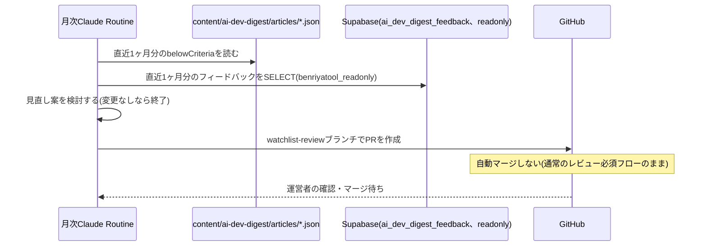

# 設計: ウォッチリスト・採用基準の月次見直し

## 実行環境の前提

実行主体はClaude Routines(定期実行のクラウドエージェント)とする。**2026-08改定の経緯**: [daily-publish/design.md](../daily-publish/design.md)は当初本specと同じくClaude Routinesを使う想定だったが、実際にテスト用Routineを作成・検証した結果、Routine実行環境に独自の環境変数・シークレットを追加する手段が確認できず、GitHub Actionsに変更した。本specは日次と異なりデータベースの読み取り(`SUPABASE_READONLY_DB_URL`)のみを必要とし、docs/adr/0004がこの接続情報をこのリポジトリ・GitHub Actions Secretsには含めない方針を明示的に定めているため(GitHub Actionsに移すと同ADRの方針を覆すことになる)、本specはClaude Routinesを実行主体のまま据え置く判断とした。ただし、daily-publishの検証で判明した「Routine実行環境への独自シークレット追加手段が見当たらない」という制約は本specの`SUPABASE_READONLY_DB_URL`にもそのまま当てはまり、**本spec運用開始前に解決すべき未解決事項として残る**(解決手段が見つからない場合、本specもGitHub Actionsへの変更を含めて再検討する)。日次と異なりデータベースの読み取りが必要になるため、追加で以下を前提とする(要件・ADRのいずれも月次Routineでの利用を明記していないため設計判断):

- docs/adr/0004で導入した`benriyatool_readonly`ロールの接続文字列(`SUPABASE_READONLY_DB_URL`)を、月次Routineの実行環境にも(ローカル開発セッションとは別に)保持する。同ADRは2026-08の改定でClaude Routines実行環境も接続情報の保持対象として正式に含めており、本specの月次Routineはその対象範囲に基づいて接続情報を保持する
- この接続情報はこのリポジトリ・GitHub Actions Secretsには追加しない(docs/adr/0004の既定方針)

## 処理フロー

### 見直しの材料を集める処理
- 対象: 直近1ヶ月分のデータ
- 手順:
  1. `content/ai-dev-digest/articles/*.json`のうち、実行日から過去1ヶ月分のファイルを読み込み、`belowCriteria: true`のトピックを抽出する(発生日・情報源・`belowCriteriaReason`)。これがcontent-selection/requirements.md#1日の掲載件数-11の「基準未達掲載の記録」にあたる
  2. `ai_dev_digest_feedback`テーブルから、直近1ヶ月分・`is_test = false`のレコードを`benriyatool_readonly`ロールで読み取る(docs/adr/0004の接続方式。`is_test`除外はdocs/adr/0001の集計時の共通ルール)
  3. 上記2種類のデータをまとめ、見直し案の根拠として使えるようにする
- 関連するビジネスルール: requirements.md#見直しの実行-1

### 見直し案を作成する処理(エージェントの推論)
- 対象: 収集した基準未達記録・フィードバック
- 手順:
  1. 基準未達が特定の情報源・種別で慢性的に続いている場合、その情報源の除外、または該当種別の採用基準(閾値)の緩和を検討する(requirements.md#見直しの実行-1、content-selection/requirements.md#1日の掲載件数-11)
  2. フィードバックの内容(「この選定はもう不要」等)を踏まえ、ウォッチリストからの除外や基準の見直しを検討する
  3. 見直し案には、どのフィードバック・どの実績データに基づく変更かを明記する(requirements.md#ビジネスルール・制約-2)
  4. 見直す点が見当たらない月は、変更なしと判断してPRを作成しない(要件は見直し案の作成頻度のみを定めており、必ず変更PRを出すとは定めていないため。空の提案PRを毎月作らないことで、実際に検討すべき提案の埋没を防ぐ)
- 変更対象ファイル(1つのPRでまとめて更新する。片方だけの更新はしない):
  - `specs/ai-dev-digest/content-selection/requirements.md`(ウォッチリストの表・採用基準の記述。requirements.md#承認フロー-2)
  - `content/ai-dev-digest/watchlist.json`・`content/ai-dev-digest/criteria.json`(content-selection/design.mdの機械可読データ。requirements.mdとの二重管理をこのPRで同時に維持する)
- 関連するビジネスルール: requirements.md#見直しの実行-1〜2、requirements.md#ビジネスルール・制約-2

### 見直し案をPRとして提案する処理
- 対象: 上記で作成した変更内容
- 手順:
  1. 作業用ブランチ`ai-dev-digest/watchlist-review/<year-month>`(例: `ai-dev-digest/watchlist-review/2026-08`)を作成する
  2. 変更内容をコミットし、`main`向けにPRを作成する。PR本文に変更理由(根拠データ)を明記する
  3. **このPRは自動マージしない。** [daily-publish](../daily-publish/design.md)の自動マージ対象は`ai-dev-digest/articles/**`ブランチのみであり、`ai-dev-digest/watchlist-review/**`は対象外(ブランチ命名で明確に区別する)。通常のリポジトリのブランチ保護(レビュー必須)がそのまま適用され、運営者が内容を確認してマージする
- シーケンス図(俯瞰用。正は上記の手順の文章):


- 関連するビジネスルール: requirements.md#承認フロー-3

## エラーハンドリング

- `ai_dev_digest_feedback`への接続に失敗した場合、フィードバックなしの状態(基準未達記録のみ)で見直し案を検討する。DB接続の可否によって月次実行自体を失敗させない(接続失敗はRoutineの実行ログに記録する)
- 見直し案がrequirements.mdとJSONデータの片方しか更新できていない状態でPRを作らない(処理フロー「見直し案を作成する処理」の変更対象ファイルを両方満たしてからコミットする)

## 関連するファイル(抜粋)

```
scripts/ai-dev-digest/collect-review-data/ (新規: 独立したpackage.json。pg/dotenvを使いbenriyatool_readonlyで接続する。.claude/skills/data-check/と同じ依存隔離パターン)
scripts/ai-dev-digest/collect-review-data/collectReviewData.ts (新規: 基準未達記録の集計+フィードバックのSELECT)
content/ai-dev-digest/articles/*.json (既存: 基準未達記録の参照元)
supabase/migrations/<timestamp>_create_ai_dev_digest_feedback.sql (既存: article-detailで作成するbenriyatool_readonly向けSELECTポリシーを利用)
specs/ai-dev-digest/content-selection/requirements.md (既存: 見直し案の変更対象)
content/ai-dev-digest/watchlist.json・criteria.json (既存: 見直し案の変更対象)
```

## データベース設計

新規テーブルはない。[article-detail/design.md](../article-detail/design.md)で作成する`ai_dev_digest_feedback`テーブルの`benriyatool_readonly`向けSELECTポリシー(docs/adr/0004)をそのまま利用する。

## セキュリティ

- `SUPABASE_READONLY_DB_URL`は月次Routineの実行環境にのみ保持し、リポジトリ・CI Secretsには含めない(docs/adr/0004の既存方針を月次Routineにも適用)
- フィードバックのSELECTは集計・見直し検討の目的に限定し、特定の投稿者を特定・追跡する用途には使わない(docs/adr/0004の既存方針を踏襲。なお本アプリのフィードバックには投稿者を特定する情報自体が含まれない)
- 見直し案のPRは通常のレビュー必須フローに乗るため、内容の妥当性は運営者のレビューで最終確認される(自動マージしないこと自体が主要な安全策)

## ログ

- 月次実行ごとに、集計対象期間・基準未達件数・フィードバック件数・PR作成の有無(変更なしの場合はその旨)をRoutineの実行ログに記録する
