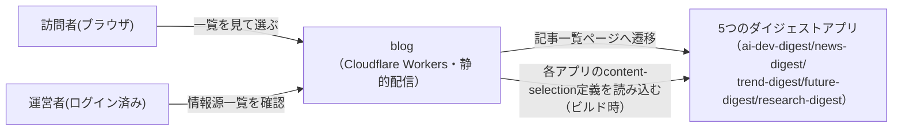
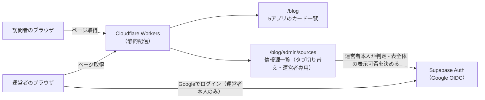

# アーキテクチャ: blog

## サマリ
5つのダイジェストアプリ(ai-dev-digest/news-digest/trend-digest/future-digest/research-digest)への入口をまとめるハブ領域。訪問者向けの一覧ページ([digest-hub](digest-hub/requirements.md))と、運営者専用の情報源一覧ページ([source-directory](source-directory/requirements.md))の2つのspecからなる。アプリ本体のコンテンツ・ロジックは持たず、既存5アプリへの導線と、既存5アプリが持つ設定の集約表示に専念する。詳細は下記[コンテキスト図](#4-コンテキスト図)・[システム構成図](#5-システム構成図)を参照。

## 1. 概要
ダイジェスト系5アプリへの入口を1画面に集約し、配信曜日を一覧できるようにするハブ領域。URL: `/blog`

## 2. アーキテクチャの目的
- トップページ(`/`)のツールカードが5アプリ分の個別カードで埋まることを避け、1枚の入口に集約する([digest-hub](digest-hub/requirements.md))
- 5アプリに分散している運営者専用の「情報源一覧」を1か所にまとめ、月次見直しのたびに5箇所を回らなくてよいようにする([source-directory](source-directory/requirements.md))
- 本サイトの共通方針(Cloudflare Workersでの静的配信、ランタイムのサーバー機能を持たない)を踏襲し、新しいインフラ・DB資産を増やさない

## 3. 設計方針
- 記事本文・ジャンル情報源・採用基準のデータは一切複製しない。digest-hubは各アプリの配信specを参照するだけ、source-directoryは各アプリのcontent-selectionが持つ実データ(ウォッチリスト等)をビルド時に読み込んで表示するだけで、blog側に独自のデータストアを持たない
- 運営者ログインは新しい認証方式を作らず、既存の`app/lib/adminAuth.ts`(Google OIDC + `admin_emails`許可リスト)をそのまま再利用する

## 4. コンテキスト図

この図の正となる文章は[digest-hub/requirements.md](digest-hub/requirements.md)・[source-directory/requirements.md](source-directory/requirements.md)。

## 5. システム構成図

この図の正となる文章は[6. アーキテクチャ概要](#6-アーキテクチャ概要)と各specのrequirements.md。プロジェクト共通インフラの詳細は[docs/architecture/](../../docs/architecture/infrastructure.md)を参照。

## 6. アーキテクチャ概要
Next.jsの静的エクスポートをCloudflare Workersで配信する構成は他アプリと同じ。`/blog`は5アプリのカード一覧(アプリ名・配信曜日・記事一覧へのリンク)を表示し、ビルド時に各アプリの配信spec(日次/週次の曜日情報)を参照する。`/blog/admin/sources`は運営者専用で、既存の`admin_emails`許可リストでログインした場合のみ、アプリ切り替えタブ付きでジャンルごとの情報源・採用基準の表を表示する。表の内容は各アプリの`content-selection`が実際に使っているウォッチリスト等をビルド時に読み込んで組み立て、blog側で複製しない。

## 7. 採用技術
| 技術 | 用途 |
|---|---|
| Next.js(静的エクスポート) | `/blog`・`/blog/admin/sources`の描画 |
| Tailwind CSS | スタイリング |
| Supabase Auth(Google OIDC) | `/blog/admin/sources`の運営者判定(既存の`admin_emails`・`isAuthorizedAdmin()`を再利用) |

## 8. 機能一覧表(機能マップ)
| spec | 機能(利用者から見て) | 役割 | 依存 | 状態 |
|---|---|---|---|---|
| [digest-hub](digest-hub/requirements.md) | 5つのダイジェストアプリへの入口を、配信曜日付きのカード一覧で見る | 各アプリの配信specから配信曜日を取得して表示する | 各アプリの配信spec、[source-directory](source-directory/requirements.md)(情報源リンク先) | 実装中 |
| [source-directory](source-directory/requirements.md) | 5アプリ分のジャンルごとの情報源・採用基準を、タブ切り替えで確認する(運営者専用) | 各アプリのcontent-selectionが持つ定義を読み込んで表示する | 各アプリの`content-selection/requirements.md` | 実装中 |

## 9. ディレクトリ構成
CLAUDE.mdの一般規約(`components/`,`lib/`)通りで、逸脱なし。`blog`は記事本文・コンテンツデータを持たないため`content/blog/`は作らない。

## 10. 外部サービス
Supabase(既存のAuth・`admin_emails`テーブルを再利用。新しいテーブル・マイグレーションは発生しない)以外、新しい外部サービスはなし。

## 11. 関連ADR
全アプリ横断のADR(`docs/adr/`):
- [0006-admin-screen-oidc-rls.md](../../docs/adr/0006-admin-screen-oidc-rls.md) — 運営者専用ページのGoogle OIDC + `admin_emails`許可リストパターンの採用理由(本アプリもこのパターンを再利用する)

## 12. セキュリティ
`/blog/admin/sources`の表示可否判定は既存の運営者専用ページと同じ仕組み(表示制御のみ・テーブル自体のRLSは`admin_emails`既存ポリシーに従う)。新しいセキュリティ設計は発生しない。

## 13. 技術的制約
特になし(既存5アプリの設定・データを読み込むだけで、新しいインフラ・DB資産を増やさない)。
