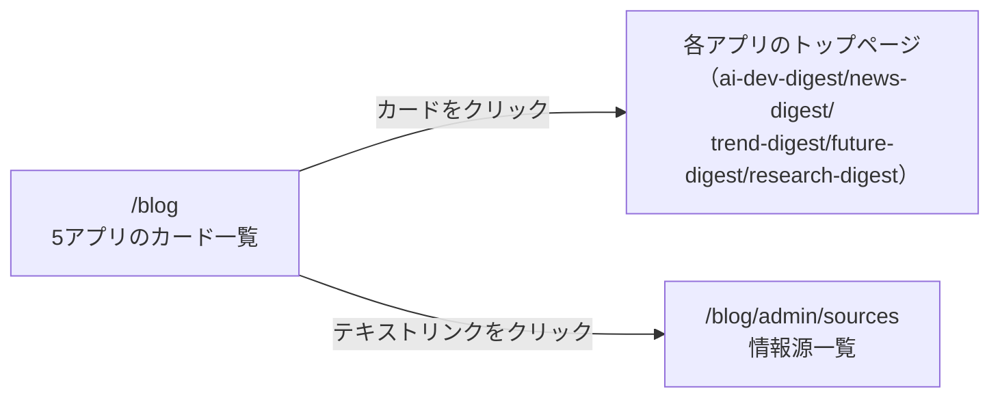

# 設計: ブログダイジェストハブページ

## サマリ

- 5アプリの名称・1行概要・配信曜日・リンク先を、コード側の定数(`app/blog/lib/digestApps.ts`)から読み込んでカード型で一覧表示する、完全に静的なページ〔提案〕
- Step0(UIデザイン確定): **不要。** トップページ(`/`)の既存ツールカードと全く同じスタイル(角丸カード・絵文字アイコン・タイトル・1行概要)を再利用するため、新しい配色・コンポーネントの確定は発生しない(要件ヒアリングの時点で「トップページの既存ツールカードと同じスタイル」と確定済み)〔提案〕
- 主要図: [画面遷移図](#画面設計)

## 決定事項

| 論点 | 選んだ案 | 採らなかった案 | 理由 | 影響範囲 | 出所 |
|---|---|---|---|---|---|
| 配信曜日・1行概要の持ち方 | `app/blog/lib/digestApps.ts`にコード側の定数として手動で持つ | 各アプリの配信spec(weekly-publish/requirements.md等)をビルド時にmarkdown解析して抽出する | 曜日・概要は変更頻度が低く、markdown解析はビルド処理が複雑になる割にメリットが薄い。実装時に配信spec側の記載が変わった場合は、この定数も同じPRで追従させる運用とする | 処理フロー、関連するファイル(抜粋) | 〔提案〕 |

<details><summary>詳細を開く</summary>

| 論点 | 選んだ案 | 採らなかった案 | 理由 | 影響範囲 | 出所 |
|---|---|---|---|---|---|
| カードコンポーネントの共通化 | `app/blog/components/DigestAppCard.tsx`を新設し5カードで共用する | 5カードをpage.tsxにそれぞれ直書きする | 構造が完全に同じ5件の繰り返しのため、propsだけ変える共通コンポーネントの方がシンプル | 関連するファイル(抜粋)、コンポーネント設計 | 〔提案〕 |

</details>

## 処理フロー

### ダイジェストカード一覧を表示する処理

定数`DIGEST_APPS`の記載順そのままに5カードを描画する。〔提案〕

<details><summary>詳細を開く</summary>

- 対象: `app/blog/lib/digestApps.ts`の定数`DIGEST_APPS`(5件、記載順はrequirements.md#ダイジェストカード一覧-1〜4の通り固定)
- 手順:
  1. `DIGEST_APPS`を定義順のまま走査し、各要素の名称・1行概要・配信曜日ラベル・リンク先(そのアプリのトップページ)からカードを1枚ずつ組み立てる(並び替え・絞り込みは行わない)
  2. カード一覧の下に、情報源一覧ページ(`/blog/admin/sources`)への固定リンクを1つ表示する。ログイン判定はこのページでは行わず、未ログインの訪問者がリンクを開いた場合の挙動は情報源一覧ページ側に委ねる
- 関連するビジネスルール: `requirements.md#ダイジェストカード一覧`、`requirements.md#情報源一覧への導線`

</details>

## エラーハンドリング

実行時エラーは発生しない想定。〔提案〕

<details><summary>詳細を開く</summary>

全データがビルド時に確定した定数であり、外部通信・ユーザー入力を伴わないため、実行時に失敗しうる処理がない。定数の必須項目(名称・概要・配信曜日ラベル・リンク先)の欠落はTypeScriptの型チェックでビルド時に検知する。

</details>

## 関連するファイル(抜粋)

新規ファイルはカード一覧の定数・コンポーネント・ページの3点。既存のトップページも1枚のカードに差し替える。〔提案〕

<details><summary>詳細を開く</summary>

```
app/blog/lib/digestApps.ts (新規。5アプリの名称・1行概要・配信曜日ラベル・アイコン・リンク先を定義する定数。source-directoryのタブ順もこの定数を再利用する)
app/blog/components/DigestAppCard.tsx (新規)
app/blog/page.tsx (新規)
app/page.tsx (既存。5アプリ個別カードを削除し、`/blog`への1枚のカードに置き換える)
```

</details>

## コンポーネント設計

1件分のカードを共通コンポーネントにする。〔提案〕

<details><summary>詳細を開く</summary>

| コンポーネント | Props | 役割 |
|---|---|---|
| `DigestAppCard` | `name`, `description`, `scheduleLabel`, `icon`, `href` | 1アプリ分のカードを描画する |

</details>

## セキュリティ

外部入力を扱わない静的ページのため、新たなリスクはない。〔提案〕

<details><summary>詳細を開く</summary>

カードのリンク先はすべてビルド時に定義済みの固定パス(自サイト内の各アプリのトップページ、または`/blog/admin/sources`)で、ユーザー入力を経由しない。個人情報・機微情報も扱わない。

</details>

## ログ

実行時ログは出力しない。〔提案〕

<details><summary>詳細を開く</summary>

完全に静的なページで、ビルド時に内容が確定するため、閲覧時のアクセスログ以外に独自のログ出力は設けない。

</details>

## 画面設計

カード一覧の下に情報源一覧への導線リンクを1つ置くレイアウト(トップページの既存カード一覧と同じ構造)。〔提案〕


正となる文章は下記の表示項目・操作。

<details><summary>詳細を開く</summary>

- 表示項目
  - ヘッダー: ページタイトル(「週刊ダイジェスト一覧」相当の見出し)【推測】
  - カード(5枚、記載順): アイコン(絵文字。トップページで既に使っている絵文字をそのまま踏襲: 🤖/📰/📈/🔭/🔬)【推測】・アプリ名・1行概要・配信曜日ラベル
  - カード一覧の下: 情報源一覧ページへの軽量なテキストリンク(1つ)
- 操作
  - カードのどこをクリックしてもそのアプリのトップページへ遷移する(トップページの既存カードと同じ挙動)
  - テキストリンクをクリックすると`/blog/admin/sources`へ遷移する

</details>
