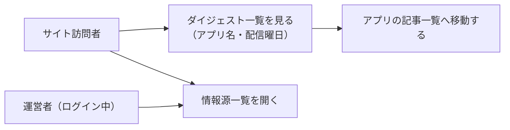

# 要件定義: ブログダイジェストハブページ

> ステータス: 仕様確認中(未実装)

## サマリ

- サイト訪問者の「どんなダイジェストアプリがあり、何曜日に配信されるかを1画面で把握してから読みたいアプリを選びたい」を解決する。`/blog`に5アプリ(ai-dev-digest/news-digest/trend-digest/future-digest/research-digest)のカード一覧を新設する〔合意〕
- 主要なルール: カードには配信曜日を明記する。カード一覧の下に情報源一覧ページ(運営者専用、[source-directory](../source-directory/requirements.md))への導線を1つ置く〔合意〕
- トップページ(`/`)の5アプリ個別カードは廃止し、`/blog`への1枚のカードに集約する(トップページ側の変更は[specs/hub-site/requirements.md](../../hub-site/requirements.md)で定義する)〔合意〕
- スコープ外: 記事本文の統合表示、RSS配信等の新しい配信手段、アプリ横断のブックマーク等の機能〔合意〕
- 全体像は[ユースケース図](#ユースケース図)を参照

## 概要

- 機能名: ブログダイジェストハブページ
- 目的: 5つのダイジェストアプリへの入口を1画面に集約し、配信曜日が一目でわかるようにする
- 優先度: 中

## ユーザーストーリー

- サイト訪問者として、5つのダイジェストアプリがそれぞれ何曜日に配信されるかを1画面で把握し、読みたいアプリを選びたい
- サイト運営者として、ジャンルごとの情報源・採用基準を確認したいときに、5アプリ分の情報源一覧ページへすぐ移動したい

## ユースケース図

正となる文章は[ユーザーストーリー](#ユーザーストーリー)・[機能要件](#機能要件)。情報源一覧ページ自体の閲覧権限は[source-directory/requirements.md](../source-directory/requirements.md)が定める。

## 機能要件

### ダイジェストカード一覧

`/blog`に、対象5アプリ分のカードを一覧表示する。

詳細を開く

- [1] 対象アプリは次の5つ: ai-dev-digest、news-digest、trend-digest、future-digest、research-digest
- [2] 各カードには、アプリ名・1行概要・配信曜日・そのアプリの記事一覧への リンクを表示する
- [3] 配信曜日の表示は各アプリの配信仕様に従う(二重管理しないため、カード一覧側で独自の曜日定義を持たない)。各アプリの配信曜日は次の通り
  - ai-dev-digest: 毎日([daily-publish/requirements.md](../../ai-dev-digest/daily-publish/requirements.md))
  - news-digest: 毎週水曜([weekly-publish/requirements.md](../../news-digest/weekly-publish/requirements.md))
  - trend-digest: 火・金(週2回。[weekly-publish/requirements.md](../../trend-digest/weekly-publish/requirements.md))
  - future-digest: 毎週木曜([weekly-publish/requirements.md](../../future-digest/weekly-publish/requirements.md))
  - research-digest: 毎週月曜([weekly-publish/requirements.md](../../research-digest/weekly-publish/requirements.md))
- [4] カードの並び順は上記[1]の記載順とする

### 情報源一覧への導線

カード一覧の下に、情報源一覧ページ([source-directory](../source-directory/requirements.md))への軽量なテキストリンクを1つ置く。

詳細を開く

- [1] リンクは1つのみとし、アプリごとに個別のリンクは置かない(5アプリ分がタブ切り替えで1ページにまとまっているため)
- [2] 未ログインの訪問者がこのリンクを開いた場合、情報源一覧ページ側の仕組みでログインが促される(本ページ側では権限チェックを行わない)

### メタ情報

- [1] `/blog`のメタ情報(title/description)を設定する: title「週刊ダイジェスト一覧｜べんりやつーる」、description「AI駆動開発・ニュース・トレンド・未来予測・研究発見の5つのダイジェストアプリへの入口を、配信曜日付きでまとめています。」〔提案〕

## ビジネスルール・制約

### カードの表示内容の出所

- [1] カードの1行概要・アプリ名は、各アプリのトップページのメタ情報(title/description)またはREADME「アプリ一覧」の概要文を踏襲し、本spec側で新しい文言を作らない〔提案〕

## 依存関係

詳細を開く

- 配信曜日の定義は各アプリの配信specに従う(上記「ダイジェストカード一覧」[3]参照)
- 情報源一覧ページの内容・閲覧権限は[source-directory/requirements.md](../source-directory/requirements.md)に従う。本specは導線(リンク)のみを持つ
- トップページ(`/`)側のカード構成変更は[specs/hub-site/requirements.md](../../hub-site/requirements.md)が定める

## スコープ外

- 記事本文の統合表示(各アプリの記事一覧・詳細ページへのリンクのみを提供する)〔合意〕
- RSS配信・プッシュ通知等の新しい配信手段〔合意〕
- アプリ横断のブックマーク・既読管理等の機能(各アプリ内のブックマーク機能はそのまま利用する)〔合意〕
