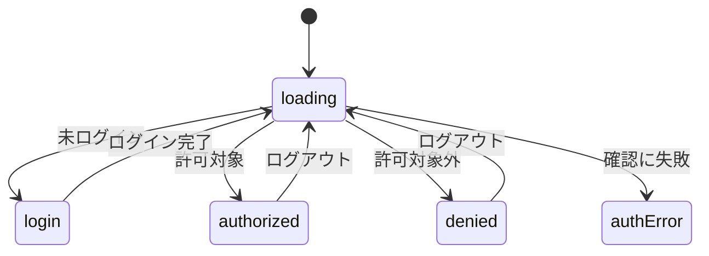

# 設計: 情報源一覧(運営者専用・5アプリ共通)

## サマリ

- 既存のtrend-digest単体実装(`app/trend-digest/admin/sources/`)をタブ切り替え型に拡張し、5アプリ分の情報源・採用基準を1画面にまとめる〔提案〕
- 5アプリの実データ(形が異なる)はアプリごとの変換関数で共通の表示行型に変換してから描画する〔提案〕
- Step0(UIデザイン確定): **不要。** 既存実装のビジュアルをそのまま踏襲しタブバーを追加するだけで、新しい配色・コンポーネントの確定は発生しない〔提案〕
- 主要図: [状態遷移図](#状態管理)

## 決定事項

| 論点 | 選んだ案 | 採らなかった案 | 理由 | 影響範囲 | 出所 |
|---|---|---|---|---|---|
| 5アプリのデータ形状差への対応 | アプリごとの変換関数(`app/blog/lib/sourceDirectory/`)で共通の表示行型に変換する | 5アプリの生データを先に1つの正規形へ揃えて保存する | 実データの形が元から異なり、正規形に揃えると各アプリ側の変更が要るため | 処理フロー、関連するファイル(抜粋) | 〔提案〕 |
| trend-digestの表示行の組み立て | 既存の`buildSourceDirectory.ts`をimportして使う | blog側に同じロジックを再実装する | ロジックを複製しないため(requirements.md#機能要件-5) | 処理フロー、関連するファイル(抜粋) | 〔提案〕 |

<details><summary>詳細を開く</summary>

| 論点 | 選んだ案 | 採らなかった案 | 理由 | 影響範囲 | 出所 |
|---|---|---|---|---|---|
| future-digest/research-digestの選定方式・採用基準の表示 | アプリ単位の固定文言をblog側の変換関数に直接持つ | 両アプリに採用基準の構造化データを新設する | 両アプリは採用基準を自然文でLLMへ渡す設計で数値データを持たない。新設はcontent-selection仕様の変更になり本specの範囲を超えるため、固定文言で表示する(requirements.md「採用基準」節が変わったら同じPRで更新) | 処理フロー | 〔提案〕 |
| 編(edition)列の表示判定 | 編の区別がある行が1件以上あるアプリのタブでのみ編列を表示する | 全アプリ共通で編列を常に表示する | 現時点で編の区別を持つのはtrend-digestのみのため | 画面設計 | 〔提案〕 |
| タブの実装方式 | 1ページ内で選択状態をuseStateで持つクライアント側タブ切り替え | 5アプリ分を別URLのページに分ける | 既存のtrend-digest単体実装の構成を拡張するのが最小変更のため | 画面設計、状態管理 | 〔提案〕 |
| 情報源へのリンクURL | 複数の取得手段を持つ情報源は、RSS→YouTube→公式ページの優先順で見つかった1つを代表リンクとする | 取得手段ごとに複数リンクを並べる | 運営者が確認したいのは生死であり1つのリンクで足りるため | 処理フロー | 〔提案〕 |

</details>

## 処理フロー

### ログイン状態に応じて表示を切り替える処理

既存のtrend-digest単体実装と同じ判定を、5アプリ共通のこの1画面に適用する。〔提案〕

<details><summary>詳細を開く</summary>

- 対象: ページ表示中の運営者のログイン状態
- 手順:
  1. 初回表示時、およびログイン完了・ログアウトのたびに、`getSession`でセッションの有無を確認する
  2. セッションがない場合はログイン画面(Googleでログインボタン)を表示する
  3. セッションがある場合は`isAuthorizedAdmin`で許可対象かどうかを確認し、許可されていれば表全体を表示し、許可されていなければ「閲覧する権限がありません」の旨を表示する
  4. 確認自体が失敗した場合は、「確認できませんでした」と表示し再試行できるようにする
- 関連するビジネスルール: `requirements.md#閲覧できる人`

</details>

### アプリごとの表示行を組み立てる処理

5アプリの実データの形に合わせて、共通の表示行(ジャンル/編/選定方式/採用基準/情報源)に変換する。〔提案〕

<details><summary>詳細を開く</summary>

- 対象: 5アプリそれぞれのcontent-selection実データ
- 手順:
  1. ai-dev-digest: `content/ai-dev-digest/watchlist.json`の情報源を、公式組織/個人YouTube/個人ブログ/Qiita/Zennの5グループに分け、ジャンル列にはこのグループ名を表示する。`criteria.json`の値(採用基準)を日本語の文言に組み立てる(`ai-dev-digest/content-selection/requirements.md#採用基準(種別ごとの定量判定)`の内容をそのまま文言化する)
  2. news-digest: `content/news-digest/watchlist.json`の4カテゴリ(総合/経済・ビジネス/神奈川ローカル/育児)をそのままジャンル行とし、`criteria.json`の値から採用基準の文言を組み立てる
  3. trend-digest: 既存の`buildSourceDirectory`(`app/trend-digest/lib/buildSourceDirectory.ts`)を呼び出し、結果を共通の表示行型に変換するだけで、ロジック自体は再実装しない
  4. future-digest/research-digest: 各アプリの`loadGenres()`で取得した有効なジャンル(`active: true`)をジャンル行とする。選定方式は「WebSearch」固定とし、採用基準は決定事項「future-digest/research-digestの選定方式・採用基準の表示」の固定文言を表示する。情報源列には、ジャンルの`description`(future-digestの個人的注目分野ジャンルのみ`themes`)を検索の手がかりとして表示する
  5. いずれのアプリも、情報源には実際のページへのリンクを添える。複数の取得手段を持つ情報源は、決定事項「情報源へのリンクURL」の優先順で見つかった1つを代表リンクとする
- 関連するビジネスルール: `requirements.md#ジャンルごとの情報源・採用基準の表`

</details>

### タブを切り替える処理

digest-hubと同じ並び順の定数を使う。〔提案〕

<details><summary>詳細を開く</summary>

- 対象: 選択中のアプリ
- 手順:
  1. 初期表示は`DIGEST_APPS`(digest-hubが定義した定数。`app/blog/lib/digestApps.ts`)の先頭であるai-dev-digestとする
  2. タブをクリックすると選択中のアプリが切り替わり、そのアプリの表だけを表示する
- 関連するビジネスルール: `requirements.md#アプリ切り替えタブ`

</details>

## エラーハンドリング

権限確認の失敗は画面に詳細を出さず再試行を促す。〔提案〕

<details><summary>詳細を開く</summary>

- 権限確認(`isAuthorizedAdmin`)自体に失敗した場合は、画面には「確認できませんでした」の定型文のみを表示し、原因は`console.error`に出力する(既存のtrend-digest単体実装と同じ方針)
- 各アプリの実データ(JSON・ジャンル設定)が壊れている場合は、ビルド時に例外として検知する(実行時に初めて壊れることはない)

</details>

## 関連するファイル(抜粋)

アプリごとの変換関数とタブ対応の表示コンポーネントを新設する。〔提案〕

<details><summary>詳細を開く</summary>

```
app/blog/lib/sourceDirectory/types.ts (新規。共通のSourceDirectoryRow型)
app/blog/lib/sourceDirectory/buildAiDevDigestSources.ts (新規)
app/blog/lib/sourceDirectory/buildNewsDigestSources.ts (新規)
app/blog/lib/sourceDirectory/buildTrendDigestSources.ts (新規。app/trend-digest/lib/buildSourceDirectory.tsを呼ぶだけ)
app/blog/lib/sourceDirectory/buildFutureDigestSources.ts (新規)
app/blog/lib/sourceDirectory/buildResearchDigestSources.ts (新規)
app/blog/admin/sources/page.tsx (新規)
app/blog/admin/sources/components/SourceTabs.tsx (新規)
app/blog/admin/sources/components/SourceTable.tsx (新規。app/trend-digest/admin/sources/components/SourceTable.tsxを汎用化)
app/trend-digest/admin/sources/ (削除。blog側に統合)
app/lib/adminAuth.ts (既存の共通認証ロジックを利用)
app/blog/lib/digestApps.ts (既存。digest-hubが定義したタブ順の定数を再利用)
app/trend-digest/lib/buildSourceDirectory.ts (既存。そのまま利用)
content/ai-dev-digest/watchlist.json, content/ai-dev-digest/criteria.json (既存)
content/news-digest/watchlist.json, content/news-digest/criteria.json (既存)
content/trend-digest/watchlist.json, content/trend-digest/criteria.json (既存)
content/future-digest/genres.json, content/research-digest/genres.json (既存)
```

</details>

## セキュリティ

既存の運営者専用ページと同じ認証を使う。表示専用で入力は受け取らない。〔提案〕

<details><summary>詳細を開く</summary>

- 表示可否の判定は既存の`app/lib/adminAuth.ts`(Google OIDC + `admin_emails`許可リスト)をそのまま使い、新しい認証方式・RLSは追加しない
- 情報源のリンクはhttp/https以外のスキームを除外する(既存のtrend-digest実装の`isHttpUrl`ガードをそのまま踏襲)
- 表示専用で入力欄を持たないため、入力由来のXSS等のリスクはない
- 既存trend-digest実装を踏襲する構成上、ウォッチリスト等のJSON(`content/*/watchlist.json`等)はクライアントコンポーネントのモジュールスコープでimportされ、静的エクスポートのJSバンドルに同梱される。ログイン判定は表全体の表示切り替えのみを行い、データ配信自体は制限しない。このJSON群はそもそも公開リポジトリにコミットされているデータであり秘匿情報ではないため、バンドルへの同梱で未ログインの訪問者が内容を読めても実害はないとみなし許容する

</details>

## ログ

権限確認の失敗だけを記録する。〔提案〕

<details><summary>詳細を開く</summary>

- 権限確認に失敗した場合は`console.error`に原因を出力する(既存実装と同じ)
- それ以外は静的データの表示のみのため、独自のログは出力しない

</details>

## 画面設計

単一画面で完結し、画面間の遷移はない(ログイン→表の表示は状態の切り替えであり、[状態管理](#状態管理)の状態遷移図を参照)。〔提案〕

<details><summary>詳細を開く</summary>

- 表示項目
  - ヘッダー: タイトル「情報源一覧」、表示専用であることの一言、ログイン中メールアドレス、ログアウトボタン(既存のtrend-digest実装を踏襲)
  - タブバー: 5アプリ(`DIGEST_APPS`の順。アイコン+名称)
  - 本体: 選択中アプリの表(列はジャンル/選定方式/採用基準/情報源。編の区別を持つアプリ(現在はtrend-digestのみ)は編列も表示する)
- 操作
  - タブをクリックすると表示するアプリの表が切り替わる
  - 情報源の名前をクリックすると、実際のページを新しいタブで開く
  - ログアウトボタンをクリックするとログアウトする

</details>

## コンポーネント設計

タブバーと表を別コンポーネントに分ける。〔提案〕

<details><summary>詳細を開く</summary>

| コンポーネント | Props | 役割 |
|---|---|---|
| `SourceTabs` | `apps`, `selectedId`, `onSelect` | タブバーの描画・選択アプリの切り替え通知 |
| `SourceTable` | `rows: SourceDirectoryRow[]` | 選択中アプリの表を描画する(表示専用) |

</details>

## 状態管理

ログイン判定の状態(phase)と選択中タブ(selectedAppId)をuseStateで持つ。〔提案〕


正となる文章は下記の詳細。

<details><summary>詳細を開く</summary>

- `phase`(loading/login/denied/authorized/authError): 既存実装と同じ状態をuseStateで持つ
- `selectedAppId`: 選択中のタブ(初期値は`DIGEST_APPS`の先頭=ai-dev-digest)

</details>
