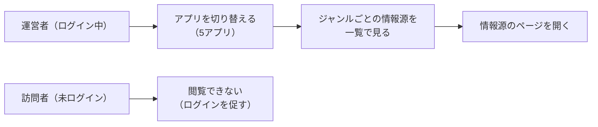

# 要件定義: 情報源一覧(運営者専用・5アプリ共通)

> ステータス: 仕様確認中(未実装)

## サマリ

- 運営者の「5つのダイジェストアプリが、それぞれどこから話題・記事を集めているかを1画面で確認したい」を解決する。`/blog/admin/sources`に、アプリ切り替えタブ付きの運営者専用ページを新設する〔合意〕
- 主要なルール: ログインできるのは運営者本人のみ(既存のGoogle OIDC + `admin_emails`許可リストをそのまま使う)。表示専用で、このページから情報源・採用基準を編集することはできない〔合意〕
- 対象はai-dev-digest/news-digest/trend-digest/future-digest/research-digestの5アプリ。各アプリのジャンルごとの情報源・採用基準は、各アプリのcontent-selection仕様が持つ定義をそのまま表示し、このページ用に内容を別途持たない〔合意〕
- スコープ外: 情報源・採用基準の編集機能(変更は各アプリのsource-reviewの月次見直しで行う)〔合意〕
- 全体像は[ユースケース図](#ユースケース図)を参照

## 概要

- 機能名: 情報源一覧(運営者専用・5アプリ共通)
- 目的: ジャンルごとの情報源・採用基準の現状を、5アプリ分まとめて運営者が1画面で確認できるようにする
- 優先度: 中

## ユーザーストーリー

- 運営者として、5つのダイジェストアプリそれぞれどのジャンルがどこを情報源にしているかを、アプリを切り替えながら一覧で確認したい(月次の見直しで、どの情報源を変えるか判断するため)
- 運営者として、ジャンルごとの採用基準(上位何位以内か、言及元が何件以上か等)も情報源とセットで見たい
- 運営者として、情報源のリンクからその場で実際のページを開いて、まだ生きているか確認したい

## ユースケース図

正となる文章は下記「機能要件」「ビジネスルール・制約」。

## 機能要件

### アプリ切り替えタブ

詳細を開く

- [1] 対象5アプリ(ai-dev-digest/news-digest/trend-digest/future-digest/research-digest)をタブで切り替えて表示する
- [2] タブの並び順はブログダイジェストハブページのカード順([digest-hub/requirements.md#ダイジェストカード一覧](../digest-hub/requirements.md#ダイジェストカード一覧)[1])と揃える
- [3] 初期表示は先頭のタブ(ai-dev-digest)とする

### ジャンルごとの情報源・採用基準の表

選択中のアプリについて、ジャンルごとの情報源・採用基準を1枚の表で表示する。

詳細を開く

- [1] 表の列は「ジャンル」「選定方式」「採用基準」「情報源」とする。アプリが記事を複数の編(例: trend-digestのエンタメ編/カルチャー・ライフスタイル編)に分けて管理している場合は「編」の列も表示する
- [2] 情報源の列には、その情報源の名前と、実際のページへのリンク、地域区分(日本/海外。区分を持たないアプリでは省略する)を表示する。1つのジャンルに情報源が複数ある場合はすべて表示する
- [3] WebSearchで話題・記事を集めるジャンルは固定の情報源を持たないため、情報源の列には検索の手がかりとして登録されている語を表示する
- [4] 採用基準の列には、そのジャンルが候補を採用する条件を日本語の文言で表示する(「上位5位以内」「新規ランクインまたは順位上昇」「独立した言及元が3件以上」など)
- [5] 表示する内容は、各アプリの選定ロジックが実際に使っている設定(各アプリの`content-selection/requirements.md`が定めるジャンル別の情報源・採用基準の定義)から組み立てる。このページ用に内容を別途持たない

## ビジネスルール・制約

### 閲覧できる人

詳細を開く

- [1] このページは運営者本人がログインしているときのみ表示する。ログインしていない訪問者には内容を表示しない(情報源の構成は選定ロジックの内部情報であり、読者に向けて公開する目的の機能ではないため)
- [2] [digest-hub](../digest-hub/requirements.md#情報源一覧への導線)のリンクを唯一の公開された入口とし、個々のアプリの記事ページ等からこのページへのリンクは置かない
- [3] ログインの判定は、既存の運営者専用機能(各アプリの記事詳細ページのフィードバック入力欄等)と同じ仕組み(`app/lib/adminAuth.ts`のGoogle OIDC + `admin_emails`許可リスト)に従う

### 表示する内容の範囲

詳細を開く

- [1] 表示するのは情報源と採用基準の構成のみとする。各回の掲載結果・継続度・注目度・収集ログはこのページには表示しない(各アプリの記事ページと実行ログで確認できるため、同じ情報を複数の場所で持たない)
- [2] このページから情報源・採用基準を編集することはできない。変更は各アプリのsource-reviewの月次見直しで、PRのレビューを経て行う(設定の変更は以後の全記事の方向性を左右するため、画面から直接変えられないようにする)

## 依存関係

詳細を開く

- 表示するジャンル・選定方式・情報源・採用基準の定義は、対象アプリごとの`content-selection/requirements.md`に従う。このspecは表示のみを担い、定義は持たない
- ログイン状態の判定は既存の運営者専用機能(各アプリのarticle-detailのフィードバック機能)と同じ仕組みを使う
- 公開された入口は[digest-hub/requirements.md#情報源一覧への導線](../digest-hub/requirements.md#情報源一覧への導線)のみ

## スコープ外

- 情報源・採用基準の編集機能(変更は各アプリのsource-reviewの月次見直しで行う)〔合意〕
- 情報源の死活監視・自動チェック(取得失敗の検知は各アプリのcontent-selectionの実行ログが担う)〔合意〕
- 各回の掲載結果・継続度・注目度・収集ログの表示(各アプリの記事ページ・実行ログで確認できるため)〔合意〕
