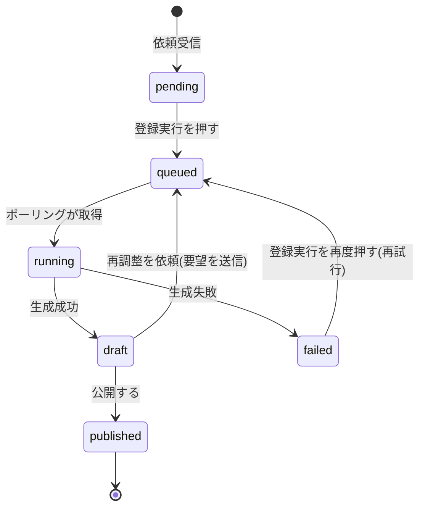
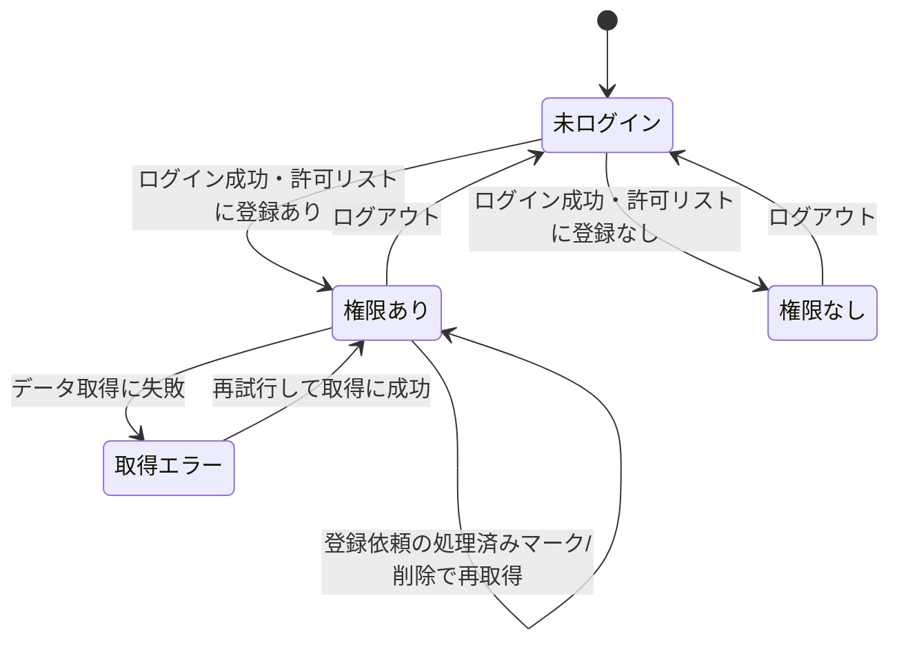

# 設計: 管理画面(モデレーション)

認証とアクセス制御の全体方針は[docs/adr/0006](../../../docs/adr/0006-admin-screen-oidc-rls.md)、書き込み権限の例外は[docs/adr/0007](../../../docs/adr/0007-runtime-llm-server-and-writable-admin.md)にあるため重複させず、本specではこの画面固有の処理フロー(通報一覧の確認・登録依頼の確認/処理)を書く。ゲーム1件ごとのモデレーション操作(編集・削除・紹介画像差し替え・元写真照合・コメント削除)の設計は[game-detail/design.md#運営者向けの操作(管理者ログイン時)](../game-detail/design.md)にある。ログイン・権限確認の処理は`ikukyu/admin/design.md`・`life-money-sim/admin/design.md`と同じロジック(共通の`admin_emails`・`adminAuth.ts`)を再利用する。本管理画面と詳細画面の管理者導線はADR-0006テンプレートの「読み取り専用」の例外として、運営者本人の書き込み(ゲームの編集・削除、コメントの削除、紹介画像の差し替え、登録依頼の処理)を認める(ADR-0007)。モデレーション専用のサーバーは新設せず、書き込みはすべてRLS経由のDB操作で行う(requirements.md#非機能要件-2)。

利用者からの登録依頼([game-registration/design.md](../game-registration/design.md)の`board_game_rules_game_requests`)の写真解析・ルール本文の生成は、この管理画面(Webアプリ)ではなく**ローカルの自動処理**(下記「登録実行・下書きレビューの処理」「ローカル環境の定期処理」)で行う。管理画面が担うのは依頼の確認・登録実行の起動・下書きの確認と公開判断・削除である。

## 処理フロー

ログインから閲覧・操作までの全体像は`ikukyu/admin/design.md#処理フロー`のシーケンス図と同一(対象が`board_game_rules_games`等に変わり、SELECTに加えUPDATE・DELETEの書き込みが加わる)。

### ログイン状態を判定して画面を出し分ける処理
- 対象: 管理画面を開いた時点のログインセッション
- 手順:
  1. ログインセッションがない場合は、ログインを促す画面を表示し、管理機能・データ取得は一切行わない(requirements.md#ログイン・アクセス制御-1)
  2. ログインセッションがある場合は「閲覧権限を確認する処理」に進む
- 補足: `ikukyu/admin`・`life-money-sim/admin`と同じSupabase Authセッション・同じ運営者アカウントを使う(一度ログインしていれば再ログイン不要)
- 関連するビジネスルール: requirements.md#ログイン・アクセス制御-1、requirements.md#アクセス制御・権限-1

### Googleでログインする処理 / ログアウトする処理
- 手順: `ikukyu/admin/design.md`の同名処理と同一(戻り先URLが本管理画面自身になる点のみ異なる)
- 関連するビジネスルール: requirements.md#ログイン・アクセス制御-2、requirements.md#ログイン・アクセス制御-4

### 閲覧権限を確認する処理
- 対象: ログイン済みユーザーのアカウント
- 手順:
  1. ログイン中のアカウントが共用の許可リスト(`admin_emails`)に登録されているかを`isAuthorizedAdmin`で確認する
  2. 登録されていれば、モデレーション機能(通報一覧・登録依頼一覧の確認/処理)の表示に進む。ゲーム個別の編集・削除・写真照合・コメント削除は詳細画面の管理者導線で行う([game-detail/design.md#運営者向けの操作(管理者ログイン時)](../game-detail/design.md))
  3. 登録されていなければ、管理機能を一切表示せず「操作する権限がありません」旨とログアウト手段を表示する(requirements.md#ログイン・アクセス制御-3)
- 補足: この確認は画面の出し分けのためで、実際の保護はRLSが担う。迂回して操作を試みても、運営者以外は保護されたSELECT/UPDATE/DELETE・元写真取得ができない(requirements.md#アクセス制御・権限-2)
- 関連するビジネスルール: requirements.md#ログイン・アクセス制御-3、requirements.md#アクセス制御・権限-1〜2

本管理画面が担う処理は、以下の「共通ナビに管理画面への導線を表示する処理」「通報を確認する処理」「登録依頼を確認する処理」以降である。ゲーム1件ごとの編集・削除・紹介画像差し替え・元写真照合・コメント削除の設計は[game-detail/design.md#運営者向けの操作(管理者ログイン時)](../game-detail/design.md)にある。

### 共通ナビに管理画面への導線を表示する処理
- 対象: board-game-rulesの共通ナビ(左サイドバー `components/BoardGameNav.tsx`)を表示する各画面(一覧・登録依頼・お気に入り)
- 手順:
  1. ナビ内に運営者専用の導線を担うクライアント島 `components/AdminNavLink.tsx` を置く。`useSession`でログイン状態を参照する
  2. 未ログインの場合は何も描画しない(導線を出さない)
  3. ログイン中の場合のみ`isAuthorizedAdmin`で許可リスト(`admin_emails`)に登録があるかを確認し、登録があれば管理画面(`/board-game-rules/admin/`)へのリンクを他のナビ項目と同じ体裁で描画する。登録がなければ何も描画しない
  4. 権限確認自体に失敗した場合(`isAuthorizedAdmin`が例外)は導線を出さない(フェイルクローズ。ナビ全体は壊さず、他項目は通常表示のまま)
- 補足: これは運営者が管理画面へ素早く到達するための利便であって、アクセス制御ではない。導線の表示有無にかかわらず、実際の保護はRLS/Storageポリシーが担う(requirements.md#アクセス制御・権限-2、下記「セキュリティ」)。判定ロジックは「閲覧権限を確認する処理」と同じ`isAuthorizedAdmin`を再利用し、新規ロジックは持たない。管理画面自身は`BoardGameNav`を使わない独自レイアウトのため、この導線に現在地ハイライト(`aria-current`)は不要(`BoardGameNavKey`は追加しない)
- 関連するビジネスルール: requirements.md#ログイン・アクセス制御-18、requirements.md#アクセス制御・権限-2

### 通報を確認する処理
- 対象: `board_game_rules_reports`の通報レコード
- 手順:
  1. 通報を一覧で確認できるようにする。各通報に対象ゲーム・通報日時・理由テキストを表示する(requirements.md#通報の確認-5)
  2. 通報一覧から対象ゲームの詳細画面(game-detail)へ遷移できるようにする。編集・削除はその詳細画面の管理者導線で行う(requirements.md#通報の確認-6、[game-detail/design.md#運営者向けの操作(管理者ログイン時)](../game-detail/design.md))
  3. 通報があっても対象を自動非表示・自動削除にはせず、必ず運営者の判断を挟む(requirements.md#通報への対応方針-6、[report/design.md](../report/design.md))
- 関連するビジネスルール: requirements.md#通報の確認、requirements.md#通報への対応方針

### 登録依頼を確認する処理
- 対象: `board_game_rules_game_requests`のレコード
- 手順:
  1. 運営者として依頼を一覧取得する。`processed_at`がNULLの未処理を優先し、次いで新しい順に並べる(requirements.md#登録依頼の確認-7)
  2. 各依頼の写真(非公開Storage)と入力済み分類情報を表示する
  3. 依頼に添付されたゲーム紹介画像(`intro_photo_paths`)があれば、公開Storageバケットの公開URLでプレビュー表示する。0枚の場合は「紹介画像なし(登録時に自動補完されます)」の旨を表示する(requirements.md#ゲーム紹介画像の確認・自動補完-10)
  4. 取得に失敗した場合は、一覧を表示せずエラー表示にする(後述エラーハンドリング)
- 関連するビジネスルール: requirements.md#登録依頼の確認-7、requirements.md#ゲーム紹介画像の確認・自動補完-10

### 登録実行・下書きレビューの処理
- 対象: 運営者が選んだ1件の登録依頼(`board_game_rules_game_requests`)
- 手順:
  1. **登録実行**: `status`が`pending`または`failed`の依頼で「登録実行」を押すと、`status`を`queued`にUPDATEする(requirements.md#登録実行・下書きレビュー-1)。実際の解析・生成は下記「ローカル環境の定期処理」が担う
  2. **状況表示**: 一覧は`status`に応じて「未着手/処理中/下書きあり/公開済み/失敗」のいずれかを表示する(requirements.md#登録実行・下書きレビュー-2)。`queued`・`running`は「処理中」として表示をまとめる(運営者にとって意味のある区別ではないため)
  3. **下書き確認**: `status`が`draft`になったら、`draft_content`(ゲーム名・対応人数・プレイ時間・ジャンル・簡単版ルールの抜粋など)を表示する(requirements.md#登録実行・下書きレビュー-3)
  4. **公開する**: `draft_content`(ゲーム名・対応人数・プレイ時間・ジャンル等の分類情報とルール本文。`photo_paths`・`intro_photo_paths`は含まない)に、対象の登録依頼行が持つ`photo_paths`(元写真、必須のため常に1枚以上)と`intro_photo_paths`(紹介画像。下記「ローカル環境の定期処理」手順5・「ゲーム紹介画像を自動補完する処理」で確定済みの値)をそのまま合わせて`board_game_rules_games`へINSERTする(下記「データベース設計」の運営者向けINSERT権限)。成功したら、対応する依頼の`processed_at`に現在時刻を、`published_game_id`に発行されたゲームID、`status`に`published`をセットするUPDATEを行う(requirements.md#登録実行・下書きレビュー-4、requirements.md#登録依頼の確認-8)
  5. **再調整を依頼**: 入力した要望テキストを`revision_note`にセットし、`status`を`queued`に戻すUPDATEを行う(requirements.md#登録実行・下書きレビュー-4)。`draft_content`・`revision_round`・`revision_history`は変更しない(「ローカル環境の定期処理」が完了後に更新する)
  6. **履歴表示**: `revision_history`(`{round, note, created_at}`の配列)を新しい順に表示する(requirements.md#登録実行・下書きレビュー-5)
  7. **失敗表示**: `status`が`failed`の依頼は`error_message`を表示する。「登録実行」を再度押せば手順1と同じ操作(`status`を`queued`に戻す)で再試行できる(requirements.md#登録実行・下書きレビュー-6)
  8. **破棄**: 依頼そのものをDELETEする(requirements.md#登録依頼の確認-9、requirements.md#登録実行・下書きレビュー-4「破棄」)。下書きの有無にかかわらず、削除操作は共通
  9. いずれの操作も、処理中は該当操作を無効化し二重実行を防ぐ。成功したら一覧の表示を更新、失敗したら失敗表示
- 関連するビジネスルール: requirements.md#登録実行・下書きレビュー、requirements.md#登録実行のローカル処理起動

`status`(登録依頼1件ごとの進行状態)の遷移は次のとおり。破棄(依頼のDELETE)はどの状態からも行える操作のため状態遷移には含めない。



### ローカル環境の定期処理(管理画面の外)
- 対象: `status`が`queued`の登録依頼
- 手順(概要。実装の詳細は本specのタスクで扱う):
  1. 運営者のMac上でlaunchdが一定間隔(60秒。requirements.md#登録実行のローカル処理起動-10)ごとにポーリングスクリプトを起動する(常駐プロセスは持たない)。処理対象がなければ何もせず終了する
  2. スクリプトは`status='queued'`の依頼を1件、`status='running'`への条件付きUPDATE(`WHERE status = 'queued'`)で排他的に取得する(同時に複数のポーリング実行が重複して処理しないようにする)
  3. `draft_content`が未設定(初回)なら依頼の写真(非公開Storageから[service_role](#データベース設計)で取得)と入力済み分類情報を、`draft_content`が既にある(再調整)なら直前の下書きと`revision_note`をあわせて、ヘッドレスのClaude Codeセッション(`claude -p`)へ渡す
  4. Claude Codeが写真(初回)または直前の下書き+要望(再調整)をもとに、分類情報とルール本文(簡単版・詳しい版、[game-registration/requirements.md#ルール本文の著作権への配慮](../game-registration/requirements.md)に従う独自の言い回し。詳しい版は下記「詳しい版の共通章立て(生成時の構造)」に沿う)を生成し、構造化された内容を出力する
  5. 依頼にゲーム紹介画像(`intro_photo_paths`)が添付されていれば、そのままそのゲームの紹介画像として引き継ぐ(依頼行の`intro_photo_paths`列はそのまま)。添付が0枚(かつ初回)の場合は「ゲーム紹介画像を自動補完する処理」(下記)で補う。自動補完で生成した画像パスは依頼行の`intro_photo_paths`列をUPDATEして書き戻す(新たな列・`draft_content`側への保存はしない。requirements.md#ゲーム紹介画像の確認・自動補完-11)
  6. 成功したら、スクリプトが`draft_content`を更新し、`revision_round`を+1、`revision_history`に`{round, note, created_at}`を追記し(`note`は初回`null`、再調整時は消費した`revision_note`)、`revision_note`を`null`に戻し、`status`を`draft`にUPDATEする
  7. 失敗したら(写真解析・生成・出力の構造化のいずれかで例外が起きたら)、`status`を`failed`に、`error_message`に原因をセットする。ゲームの登録(INSERT)自体はまだ行わないため、失敗しても`board_game_rules_games`には影響しない
- 補足: この処理はAnthropic API呼び出しを伴うが、運営者自身のClaude Codeセッション(Pro/Maxプラン等の対話コンテキスト)上で行われ、Webアプリ・Cloudflare Workersからの追加のAPI課金は発生しない(根拠: `/consult`での判断。requirements.md#登録実行のローカル処理起動-9)
- 補足: 運営者のMacが起動していない・オフラインの間は`queued`のまま処理が進まない。次にMacが起動しポーリングが走った時点で処理が再開する(requirements.md#登録実行のローカル処理起動-10)
- 関連するビジネスルール: requirements.md#登録実行のローカル処理起動

### 詳しい版の共通章立て(生成時の構造)
- 対象: 上記手順2で生成する「詳しい版」ルール本文の構造
- 「詳しい版」は次の6章で構成し、ローカルツールはこの構造に沿って生成する。章キー(英語識別子)を`rules_detailed`(jsonb)に保存し、[game-detail/design.md#ルール本文をタブで表示する処理](../game-detail/design.md)が章キーごとに表示見出し(日本語)を付けて描画する。該当ルールがない章は空でよい(生成しない/空文字列のままにする):
  - `overview`(概要) / `setup`(準備) / `turn_flow`(手番の流れ) / `victory`(勝利条件) / `scoring`(得点計算) / `special`(特殊ルール・例外)
  - `victory`と`scoring`は得点計算がそのまま勝敗を決めるゲームで内容が重複しやすい。`scoring`には得点の計算方法自体、`victory`には勝敗の決め方(同点処理・得点以外の勝利条件があればそれも)を書き分ける
- 章キー↔表示見出しの対応・型定義は`app/board-game-rules/lib/rulesChapters.ts`(`RULE_CHAPTERS`)を正とする。生成側(本ローカルツール)・表示側(game-detail)の両方がこの定義を共有する
- 言い回しの再構成方針(原文の逐語転載をしない・数値や条件を省略しない「精密な言い換え」)は[game-registration/requirements.md#ルール本文の著作権への配慮](../game-registration/requirements.md)に従う

### ゲーム紹介画像を自動補完する処理(ローカルツール内、管理画面の外)
- 対象: 紹介画像が0枚の登録依頼(上記「登録実行・下書きレビューの処理」手順3、または`registerGame.ts`の手動フロー)
- 手順:
  1. **画像検索**: BoardGameGeek API(`https://boardgamegeek.com/xmlapi2/search`等、APIキー不要・無料)へ、依頼のゲーム名(未入力ならAIが写真から読み取ったゲーム名)で検索する。該当するゲームが見つかれば、そのthing詳細からbox art画像URLを取得する
  2. 該当するゲームが見つからない場合は、紹介画像なしのまま処理を続行する(`intro_photo_paths`は空配列。requirements.md#ゲーム紹介画像の確認・自動補完-11の自動補完は「見つけた場合」の処理であり、見つからない場合まで無理に画像を用意しない)
  3. **AI画像加工**: 取得した画像URLをGoogle Gemini API(画像生成/編集モデル、無料枠)へ渡し、そのまま転載しない新規画像を生成する(requirements.md#ゲーム紹介画像の取り扱い-12。具体的な加工プロンプト・生成パラメータは本specのタスクで扱う実装詳細とする)
  4. 生成した画像を公開Storageバケット(`board-game-rules-game-photos`)へ、新規採番したアップロードUUID配下にアップロードし、対象の登録依頼行の`intro_photo_paths`列を`[<アップロードしたパス>]`でUPDATEする(登録実行・下書きレビューの自動フローでは、この時点でゲームIDはまだ確定していない(公開はWeb管理画面の操作で後から行われるため)。依頼時点の投稿画像と同じ「アップロードUUID配下」の命名規則を使い、公開時もパスの付け替えは行わない。[game-registration/design.md#ゲーム紹介画像のStorage](../game-registration/design.md)と同じ考え方)
  5. 画像検索・AI加工のいずれかが失敗した場合も、処理自体は止めない(紹介画像なしで続行し、失敗はローカルのコンソールログに残す。下記「ログ」参照)
- 補足: BoardGameGeek API・Google Gemini APIの呼び出しは運営者のローカル環境から行われ、Webアプリ・Cloudflare Workersのコード・課金構造には一切影響しない(requirements.md#ゲーム紹介画像の自動補完-8「無料枠の範囲で運用できるものを選定する」を満たす)。Gemini APIキーは運営者のローカル`.env`等で管理し、リポジトリ・Cloudflare Workers Secretsには含めない
- 関連するビジネスルール: requirements.md#ゲーム紹介画像の確認・自動補完-11、requirements.md#ゲーム紹介画像の自動補完-8

## エラーハンドリング
- 画面の状態は「未ログイン」「ログイン済みだが権限なし」「権限あり」「取得エラー」に切り分ける(`ikukyu/admin`と同一方針)
- 一般利用者向けの保存(お気に入り等)は失敗を握りつぶす方針だが、管理画面は運営者がモデレーションする画面のため、データ取得の失敗は握りつぶさず画面に伝える(空一覧では取得失敗と0件の区別ができないため)
- 登録依頼の処理済みマーク/削除、登録実行/公開する/再調整を依頼は運営者が明示的に行う操作のため、失敗時は失敗が分かる表示をする。処理中は該当操作を無効化し二重実行を防ぐ(ゲームの編集・削除・コメント削除の失敗処理は詳細画面側。[game-detail/design.md](../game-detail/design.md))。ローカル環境の定期処理自体の失敗は上記「登録実行・下書きレビューの処理」手順7の`error_message`表示で扱う(Web側の操作失敗とは別系統)

## 関連するファイル(抜粋)
```
app/board-game-rules/admin/page.tsx (管理画面本体。ログイン・権限で出し分け、通報一覧・登録依頼一覧を表示するクライアント画面)
app/board-game-rules/admin/lib/fetchReports.ts (通報一覧の取得)
app/board-game-rules/admin/lib/gameRequests.ts (登録依頼の一覧取得・processed_at更新・削除・登録実行/再調整のstatus更新・公開時のgames INSERT)
app/board-game-rules/admin/components/LoginScreen.tsx (ログイン/権限なしの案内)
app/board-game-rules/admin/components/ReportsView.tsx (通報一覧。各通報に対象ゲームの詳細画面への遷移リンクを出す)
app/board-game-rules/admin/components/GameRequestsView.tsx (登録依頼一覧+写真プレビュー+ゲーム紹介画像プレビュー+処理済みマーク/削除の導線)
app/board-game-rules/admin/components/DraftReviewCard.tsx (依頼1件の状況表示+下書き内容+公開する/再調整を依頼/破棄の導線+再調整履歴)
app/board-game-rules/components/AdminNavLink.tsx (共通ナビ内の運営者専用の管理画面導線。useSession + isAuthorizedAdmin で出し分けるクライアント島)
app/board-game-rules/components/BoardGameNav.tsx (nav末尾に AdminNavLink を差し込む。サーバーコンポーネントのまま。実装は [game-list/design.md](../game-list/design.md) が真実の源)
app/board-game-rules/lib/useSession.ts (ログイン状態の参照フックを AdminNavLink でも利用)
app/lib/adminAuth.ts (getSession/onAuthChange/signInWithGoogle/signOut/isAuthorizedAdmin を利用)
app/lib/supabaseClient.ts (共通クライアントを利用)
.claude/skills/board-game-rules-batch-register/SKILL.md (ローカル環境の定期処理が呼び出す、写真解析・ルール本文生成の手順を定めたSkill。Webアプリのコードではない。ゲーム紹介画像の自動補完(BoardGameGeek API検索 + Google Gemini API加工)を含む)
scripts/board-game-rules/registerGame.ts (運営者が対話セッションで明示的に起動する既存の手動フロー。`photosDir`・`requestId`いずれもSupabaseへ直接INSERTする。自動化が止まった場合の手動フォールバックとしても使う)
scripts/board-game-rules/processRegistrationQueue.ts (ローカル環境の定期処理の本体。queuedな依頼を1件取得し、写真取得→`claude -p`呼び出し→結果の構造化→board_game_rules_game_requestsのdraft_content等の更新までを行う。board_game_rules_gamesへは書き込まない)
scripts/board-game-rules/com.benriyatool.board-game-rules-registration.plist (launchdの定期起動設定。StartIntervalでprocessRegistrationQueue.tsを60秒ごとに起動する。常駐プロセスではない)
```

ゲーム個別のモデレーション操作(編集・削除・紹介画像差し替え・元写真照合・コメント削除)のコンポーネント・libは詳細画面側にある([game-detail/design.md#関連するファイル抜粋](../game-detail/design.md))。

## データベース設計
本specは`board_game_rules_reports`([report/design.md](../report/design.md))・`board_game_rules_game_requests`([game-registration/design.md](../game-registration/design.md))を運営者権限で読み書きし、通報の対象ゲーム名の表示のため`board_game_rules_games`([game-registration/design.md](../game-registration/design.md))をSELECTする。各テーブルの運営者向けRLSは各specのマイグレーションで定義済みのため、ここでは重複させない。テーブルごとに運営者へ与える操作は次のとおり:
- `board_game_rules_games`: 本管理画面は全行SELECTに加え、「公開する」操作のためINSERTを使う(運営者本人のログインセッションから直接。[game-registration/design.md#追加マイグレーション登録実行・下書きレビュー](../game-registration/design.md)のRLSで担保)。ゲームの編集(UPDATE)・削除(DELETE)は詳細画面で行い、そのRLS・子レコードのカスケード削除は[game-detail/design.md#運営者による削除の処理](../game-detail/design.md)で定義する。写真解析・ルール生成に伴う書き込みは行わない(そちらはservice_role相当の権限を持つローカル定期処理が下書き段階で完結させ、games への書き込みは「公開する」操作でのみ発生する)
- `board_game_rules_reports`: 運営者は全行SELECTのみ(通報の確認。書き換え・削除はしない。[report/design.md](../report/design.md))
- `board_game_rules_comments`: DELETEは本人+運営者、UPDATE(編集)は本人のみで運営者は編集不可([comment/design.md](../comment/design.md))。運営者によるコメント削除の導線は詳細画面にある([game-detail/design.md](../game-detail/design.md))
- `board_game_rules_game_requests`: 運営者はSELECT・UPDATE(`processed_at`・`status`・`draft_content`・`revision_note`・`revision_history`等)・DELETEができる([game-registration/design.md](../game-registration/design.md))。ローカル定期処理はservice_role相当の権限でRLSをバイパスして`status`・`draft_content`等を更新する

許可リスト`admin_emails`は`ikukyu/admin`で作成済みのものを共用し、新規テーブルは作らない。

本specで新規に作るのは**元写真の非公開Storageバケットとそのアクセスポリシー**(登録時に写真を保存する先。[game-registration/design.md#元写真のStorage](../game-registration/design.md))。

### 元写真の非公開Storage(新規: 実装より先に単独PRで適用)
- 非公開バケットを1つ作る。バケット名: `board-game-rules-photos`(`public = false`)。パス設計: `<アップロード単位のUUID>/<連番>.<拡張子>`(ゲームIDはDB採番のためアップロード時点で未確定。確定済みの写真パスは`photo_paths`に保存する)。上記は`supabase/migrations/20260807160400_create_board_game_rules_photos_storage.sql`で適用済み
- Storageのアクセスポリシー:
  - anon・authenticated(運営者以外)は元写真をSELECT(ダウンロード)できない
  - 運営者本人(`admin_emails`に載るアカウント)のみSELECTできる
  - 登録処理からの書き込み(アップロード)は、投稿を匿名で許すため anon/authenticated からのINSERTを許可する(バケットは非公開のまま。読み出しだけを運営者に絞る)
- **匿名アップロードの量的制約(濫用・容量枯渇対策)**: 元写真のアップロードは登録フローの確定保存でブラウザ→Storageへ直接行われ、解析関数もTurnstileも経由しない([game-registration/design.md#セキュリティ](../game-registration/design.md))。つまり写真アップロードはボット対策の外にあり、anonキーで直接大量アップロードされるとStorage容量・コストを濫用されうる。この濫用は「ゲームの事後モデレーション(ADR-0007)」の対象外で、写真は非公開ゆえ通報・削除の運用ループにも乗らず検知しづらい。そのためバケット側で次の量的制約を課す:
  - ファイルサイズ上限(1ファイルあたりの最大バイト数。Supabase Storageのバケット設定 `file_size_limit`)
  - 許可MIMEタイプを画像(`image/*` の想定形式)に限定(`allowed_mime_types`)
  - 1ゲーム(1フォルダ)あたりの枚数上限を、登録画面([game-registration/design.md](../game-registration/design.md))とStorage側の両面で担保する(実装確定値: 登録画面側で20枚。Storage側はサイズ・MIMEのみを担保し、枚数はクライアント側で制限する。理由は`supabase/migrations/20260807160400_create_board_game_rules_photos_storage.sql`のコメント参照)
- 具体的なStorageポリシーのSQL(`storage.objects`に対するRLS)・バケット設定値は上記マイグレーションで適用済み。方針は「INSERTは誰でも可(ただしサイズ・MIME・枚数の制約付き)、SELECT(ダウンロード)は運営者のみ、バケットはpublic=false」

T0(マイグレーション/Storage設定適用)の実機確認:
- 運営者本人でのみ元写真をダウンロードでき、anon・運営者以外のログインでは取得できないこと(元写真照合は詳細画面の管理者モードで行うが、Storageポリシーは本バケットのもの)
- サイズ上限を超えるファイル・許可外MIMEのアップロードがバケット設定で拒否されること(匿名アップロードの量的制約)
- 運営者本人で`board_game_rules_games`の全行がSELECTできること(編集・削除の権限とカスケードの実機確認は[game-detail/design.md](../game-detail/design.md)側で行う)
- 運営者本人で`board_game_rules_reports`がSELECTできること
- 運営者本人で`board_game_rules_game_requests`がSELECT/UPDATE/DELETEできること
- 未ログイン(anon)・運営者以外では上記の保護された操作・元写真取得ができないこと

### ゲーム紹介画像の公開Storage(新規: 実装より先に単独PRで適用)
上記の元写真バケットとは別に、ゲーム紹介画像用の**公開**バケットを新設する(公開範囲がそもそも異なるため。[game-registration/design.md#ゲーム紹介画像のStorage](../game-registration/design.md))。

- バケット名: `board-game-rules-game-photos`(`public = true`)
- サイズ上限(`file_size_limit`)・許可MIME(`allowed_mime_types`)は元写真バケットと同じ値を流用する(既存の防御上限をそのまま踏襲。10MiB/ファイル、`image/jpeg`・`image/png`・`image/webp`・`image/heic`・`image/heif`)
- 枚数上限(1ゲームあたり20枚)はStorage側では担保せず、登録依頼画面([game-registration/design.md](../game-registration/design.md))・詳細画面の紹介画像差し替えUI側のクライアント制限で担保する(元写真バケットと同じ考え方)
- パス設計: 登録依頼時は`<アップロードUUID>/<並び順の連番>.<拡張子>`(ゲームID未確定のため)、登録済みゲームへの追加(運営者の差し替え・ローカルツールの自動補完)は`<ゲームID>/<連番>.<拡張子>`とする([game-registration/design.md#ゲーム紹介画像のStorage](../game-registration/design.md))
- `public = true`のバケットは`getPublicUrl()`で生成した公開URLがRLSを経由せず配信されるため、ダウンロード(SELECT)用のRLSポリシーは不要(非公開の元写真バケットとの違い)
- 書き込みポリシー(`storage.objects`へのRLS。バケット公開設定とは別に、INSERT/UPDATE/DELETEは引き続きRLS対象):
  - **INSERT**: 誰でも可(anon/authenticated)。投稿者の登録依頼アップロードを許すため(サイズ・MIMEはバケット設定で担保)
  - **UPDATE・DELETE**: 運営者本人のみ(`admin_emails`)。投稿者本人による事後の差し替え・削除はできない(依頼送信後の内容編集不可という既存方針[game-registration/requirements.md#スコープ外](../game-registration/requirements.md)に揃える)
  - 運営者のローカル登録ツール(自動補完)はservice_role相当の権限でRLSをバイパスして書き込む
- **公開バケットゆえの残余リスク**: 元写真バケット(非公開)の「匿名アップロードの量的制約」と同様、本バケットもINSERTはanon/authenticatedに開放しており、アプリのUI(登録依頼画面・詳細画面の紹介画像差し替えUI)の20枚制限を経由せずStorage REST APIを直接叩けば任意枚数の画像をアップロードされうる。加えて本バケットは`public = true`のため、アップロードされた画像は即座に誰でも取得できる公開URLを持ち、`intro_photo_paths`に登録されずアプリのモデレーション対象にも乗らない画像が公開URLとして残存しうる(元写真バケットより公開範囲が広い分、直接濫用の実害も大きい)。この残余リスクは技術的に完全には防がず、運営者が容量・アクセス状況を定期的に確認する運用(Supabaseダッシュボードでのバケット容量確認)で気付く前提とする(シンプルさ優先の方針に基づき、専用の監視機構は設けない)

```sql
insert into storage.buckets (id, name, public, file_size_limit, allowed_mime_types)
values (
  'board-game-rules-game-photos',
  'board-game-rules-game-photos',
  true,
  10485760, -- 10 MiB(元写真バケットと同じ防御上限)
  array['image/jpeg', 'image/png', 'image/webp', 'image/heic', 'image/heif']
);

-- アップロード: 匿名の投稿者(登録依頼)を含め誰でもINSERTできる
create policy "anyone can upload game intro photos" on storage.objects
  for insert to anon, authenticated
  with check (bucket_id = 'board-game-rules-game-photos');

-- 差し替え・削除: 運営者本人のみ
create policy "admin can update game intro photos" on storage.objects
  for update to authenticated
  using (
    bucket_id = 'board-game-rules-game-photos'
    and (auth.jwt() ->> 'email') in (select email from admin_emails)
  )
  with check (
    bucket_id = 'board-game-rules-game-photos'
    and (auth.jwt() ->> 'email') in (select email from admin_emails)
  );
create policy "admin can delete game intro photos" on storage.objects
  for delete to authenticated
  using (
    bucket_id = 'board-game-rules-game-photos'
    and (auth.jwt() ->> 'email') in (select email from admin_emails)
  );

-- ダウンロード: バケットがpublic=trueのため、SELECTポリシーは不要(誰でも公開URLで取得可能)
```

T0(ゲーム紹介画像バケット設定適用)の実機確認:
- anon(未ログイン)で`board-game-rules-game-photos`へファイルをINSERT(アップロード)できること
- サイズ上限を超えるファイル・許可外MIMEのアップロードがバケット設定で拒否されること
- アップロード直後の`getPublicUrl()`で生成したURLに、認証なしでアクセスして画像が取得できること
- anon・運営者以外のログインでは、既存オブジェクトのUPDATE(差し替え)・DELETEができないこと。運営者本人はUPDATE・DELETEができること

## 画面設計
1画面に縦に並べる(PC中心・スマホでも破綻しない範囲。requirements.md#非機能要件-1)。ゲーム個別の編集・削除・元写真照合・紹介画像差し替え・コメント削除は詳細画面(game-detail)の管理者導線で行うため、本画面には持たない:
- 上部: ログイン中のアカウント表示とログアウト操作
- 登録依頼一覧(`GameRequestsView`): 未処理を優先・次いで新しい順。写真プレビュー・ゲーム紹介画像プレビュー(0枚なら「紹介画像なし(登録時に自動補完されます)」の案内)・入力済み分類情報を表示。処理済みマーク・削除の導線。各依頼は`status`(未着手/処理中/下書きあり/公開済み/失敗)のバッジと、状態に応じた操作(`DraftReviewCard`)を持つ:
  - 未着手・失敗: 「登録実行」ボタン(失敗時はあわせて`error_message`を表示)
  - 処理中(queued/running): 進行中の表示のみ(操作は無効化)
  - 下書きあり: 下書きの内容(ゲーム名・対応人数・プレイ時間・ジャンル・簡単版ルールの抜粋)、「公開する」「再調整を依頼」ボタン、再調整の要望入力欄、再調整履歴(新しい順)
  - 公開済み: 「公開済み」の表示のみ(操作なし)
- 通報一覧(`ReportsView`): 対象ゲーム・通報日時・理由テキスト。各通報から**対象ゲームの詳細画面(game-detail)へのリンク**を出す。編集・削除はその詳細画面の管理者導線で行う([game-detail/design.md](../game-detail/design.md))

未ログイン時・権限なし時は上記を出さず、案内(ログイン/権限がない旨)だけを表示する。

本画面への導線は、他画面(一覧・登録依頼・お気に入り)の共通ナビに運営者ログイン時のみ表示する管理画面リンク(上記「共通ナビに管理画面への導線を表示する処理」)が担う。管理画面自身は`BoardGameNav`を使わない独自レイアウトのため、この画面内にはナビを持たない。

## 状態管理
- 管理画面(`page.tsx`)は「ログインセッション」「閲覧権限の判定結果」「取得した通報一覧・登録依頼一覧」「取得/操作状態」をローカル状態として持つ(`ikukyu/admin`と同一方針)。複数画面をまたがないためグローバルな状態管理は使わない
- 画面の4状態(未ログイン/権限なし/権限あり/取得エラー)の遷移は`ikukyu/admin/design.md#状態管理`の状態遷移図と同一構造(対象データが本アプリのテーブルに変わり、操作に登録依頼の処理済みマーク/削除が加わる)



## セキュリティ
- 実際のアクセス制御はDB側のRLSとStorageのアクセスポリシーで担保する(ADR-0006)。画面側の権限確認・出し分けは案内のためのもので、突破されても運営者以外は保護された読み書き・元写真取得ができない
- 運営者のメールアドレスは`admin_emails`(`ikukyu/admin`と共用)にのみ持ち、gitにもクライアントのJSバンドルにも置かない。画面側は「自分のメールが許可リストにあるか」を問い合わせるだけで、許可メールの値を保持しない(`ikukyu/admin`と同方針)
- 静的サイトのため管理画面URLは誰でも開ける。守るのは「開けること」ではなく「データの読み書き・元写真取得ができること」であり、未ログイン・権限なしでは保護された処理を走らせない
- 本管理画面はADR-0006テンプレートの読み取り専用の例外として書き込み(編集・削除)を認めるが、書き込みはRLSで運営者本人に限定する(ADR-0007)。モデレーション専用の別サーバーは新設しない(requirements.md#非機能要件-2)
- 通報理由・コメント本文・ゲーム情報を運営者画面に表示する際は、HTMLとして解釈しない形で描画する(利用者投稿・匿名通報の任意テキストを含むため。[comment/design.md](../comment/design.md)・[report/design.md](../report/design.md)と同方針)
- ゲーム紹介画像の差し替え・削除は、`board_game_rules_games`のUPDATE権限と同じRLS(運営者本人のみ)で担保する。Storage側も同バケットのUPDATE/DELETEポリシーを運営者本人に限定する(上記「ゲーム紹介画像の公開Storage」)
- BoardGameGeek API・Google Gemini APIの呼び出しは運営者のローカル環境(Claude Codeセッション)から行われ、Webアプリ・Cloudflare Workersのコードには一切含まれない。Gemini APIキーはローカルの`.env`等で管理し、リポジトリにコミットしない([game-registration/design.md#セキュリティ](../game-registration/design.md)の「課金の発生しない設計」と同じ考え方を、外部API呼び出し一般に拡張したもの)
- 「公開する」操作(`board_game_rules_games`へのINSERT)は運営者本人(`admin_emails`)に限定するRLSで担保する。anon/authenticated(運営者以外)からの直接INSERTは引き続き拒否される([game-registration/design.md#追加マイグレーション登録実行・下書きレビュー](../game-registration/design.md))
- ローカル環境の定期処理(`processRegistrationQueue.ts`)はlaunchdから起動されるため、対話シェルのPATH・環境変数を引き継がない。`claude`・`node`コマンドは絶対パスで指定し、`SUPABASE_SERVICE_ROLE_KEY`等の資格情報はlaunchdの`EnvironmentVariables`または明示的な`.env`読み込みで注入する(教訓: launchd常駐のPATH欠落で処理が全く動いていなかった別ツールの事例があるため、実機での動作確認を必ず行う)

## パフォーマンス
- 通報一覧・登録依頼一覧は件数が少ない前提で、単純な全件取得で足りる(小規模運用)。件数が増えた場合はページングを別途見直す

## ログ
- 通報・登録依頼のデータ取得が想定外に失敗した場合、原因究明のためコンソールにエラーを出す(`ikukyu/admin`と同一方針)。ログにはゲーム情報・通報本文の中身を含めず、失敗の事実・種別にとどめる。運営者自身のブラウザで確認できるため出力する価値がある(ゲーム編集・削除・元写真取得のログは詳細画面側。[game-detail/design.md](../game-detail/design.md))
- ローカル登録ツールの画像自動補完(BoardGameGeek検索・Gemini加工)が失敗した場合、原因(検索ヒットなし/API呼び出し失敗など)をローカルのコンソールに出す。ゲーム自体の登録は続行するため、運営者は登録完了後にログを見て紹介画像の有無を把握する
- ローカル環境の定期処理(`processRegistrationQueue.ts`)が失敗した場合、原因を`board_game_rules_game_requests.error_message`に記録する(管理画面で確認できるようにするため)ほか、launchdの標準出力/エラー出力をローカルのログファイルへリダイレクトする(`plist`の`StandardOutPath`/`StandardErrorPath`。運営者がMac上で原因を追えるようにする)

## 依存関係
- 認証方式(Google OIDC)・許可リスト(`admin_emails`)・RLS方針は[docs/adr/0006](../../../docs/adr/0006-admin-screen-oidc-rls.md)、書き込み権限の例外は[docs/adr/0007](../../../docs/adr/0007-runtime-llm-server-and-writable-admin.md)に従う。ログイン・権限確認ロジックは`ikukyu/admin`・`life-money-sim/admin`と共用の`adminAuth.ts`を再利用する
- 編集・削除の対象は[game-registration/design.md](../game-registration/design.md)の`board_game_rules_games`(`intro_photo_paths`を含む)、通報は[report/design.md](../report/design.md)、コメント削除は[comment/design.md](../comment/design.md)、登録依頼の確認は[game-registration/design.md](../game-registration/design.md)の`board_game_rules_game_requests`に従う。各テーブルの運営者向けRLSは各specで定義済み
- 登録実行・下書きレビュー用のカラム(`status`・`draft_content`・`revision_note`・`revision_round`・`revision_history`・`error_message`・`published_game_id`)と、公開操作用の`board_game_rules_games`INSERTポリシーは[game-registration/design.md#追加マイグレーション登録実行・下書きレビュー](../game-registration/design.md)で定義する
- 元写真の非公開Storageは本specで作り、依頼送信([game-registration/design.md](../game-registration/design.md))がそこへ書き込む
- ゲーム紹介画像の公開Storage(`board-game-rules-game-photos`)も本specで作る。依頼送信([game-registration/design.md](../game-registration/design.md))・本spec(差し替え・削除、ローカルツールの自動補完)が書き込み、公開URLは[game-list/design.md](../game-list/design.md)・[game-detail/design.md](../game-detail/design.md)が表示に使う
- 登録依頼からゲームを登録するローカルツール(Claude Code Skill)の実体は`.claude/skills/board-game-rules-batch-register/`に置く。Webアプリのコードではないため`app/board-game-rules/`配下には置かない
- ゲーム紹介画像の自動補完に使う外部API(BoardGameGeek API・Google Gemini API)は運営者のローカル環境からのみ呼び出す。requirements.md#ゲーム紹介画像の自動補完-8の「無料枠の範囲で運用できるもの」の選定として本specで確定した
- Supabase AuthのRedirect URLs許可リストに本管理画面の戻り先URL(`https://benriyatool.com/board-game-rules/admin/**`)を本番公開前に登録する(requirements.md#認証手段とパスキー-5。既存`life-money-sim/admin`の登録漏れの教訓)。なお利用者ログインの戻り先(一覧・詳細・登録・お気に入り一覧など`/board-game-rules/**`)の許可リスト登録は[user-auth](../user-auth/tasks.md)の責務で、本管理画面の`/admin/**`だけに寄せない(両者を合わせてリリース前に確認する)。Googleアカウント側のパスキー・2段階認証の維持もリリース前に確認する(ADR-0006)
