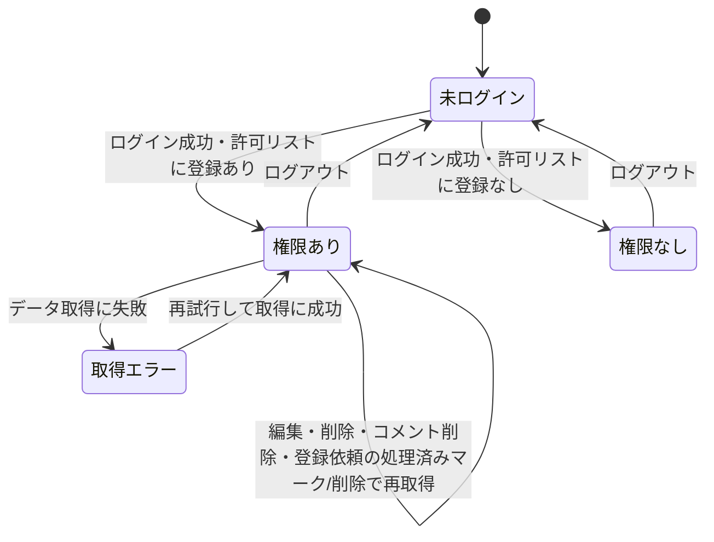

# 設計: 管理画面(モデレーション)

認証とアクセス制御の全体方針は[docs/adr/0006](../../../docs/adr/0006-admin-screen-oidc-rls.md)、書き込み権限の例外は[docs/adr/0007](../../../docs/adr/0007-runtime-llm-server-and-writable-admin.md)にあるため重複させず、本specではこの画面固有の処理フロー・書き込み(編集・削除)・元写真の照合閲覧・登録依頼の確認の具体を書く。ログイン・権限確認の処理は`ikukyu/admin/design.md`・`life-money-sim/admin/design.md`と同じロジック(共通の`admin_emails`・`adminAuth.ts`)を再利用する。本管理画面はADR-0006テンプレートの「読み取り専用」の例外として、ゲームの編集・削除、コメントの削除という書き込みを認める(ADR-0007)。モデレーション専用のサーバーは新設せず、書き込みはすべてRLS経由のDB操作で行う(requirements.md#非機能要件-2)。

利用者からの登録依頼([game-registration/design.md](../game-registration/design.md)の`board_game_rules_game_requests`)を実際にゲームとして登録する処理は、この管理画面(Webアプリ)ではなく**ローカルのClaude Code Skill**(下記「登録依頼からゲームを登録するローカルツール」)で行う。管理画面が担うのは依頼の確認・処理済みマーク・削除にとどまる。

## 処理フロー

ログインから閲覧・操作までの全体像は`ikukyu/admin/design.md#処理フロー`のシーケンス図と同一(対象が`board_game_rules_games`等に変わり、SELECTに加えUPDATE・DELETEの書き込みが加わる)。

### ログイン状態を判定して画面を出し分ける処理
- 対象: 管理画面を開いた時点のログインセッション
- 手順:
  1. ログインセッションがない場合は、ログインを促す画面を表示し、管理機能・データ取得は一切行わない(requirements.md#ログイン・アクセス制御-1)
  2. ログインセッションがある場合は「閲覧権限を確認する処理」に進む
- 補足: `ikukyu/admin`・`life-money-sim/admin`と同じSupabase Authセッション・同じ運営者アカウントを使う(一度ログインしていれば再ログイン不要)
- 関連するビジネスルール: requirements.md#ログイン・アクセス制御-1、requirements.md#アクセス制御・権限-1

### Googleでログインする処理 / ログアウトする処理
- 手順: `ikukyu/admin/design.md`の同名処理と同一(戻り先URLが本管理画面自身になる点のみ異なる)
- 関連するビジネスルール: requirements.md#ログイン・アクセス制御-2、requirements.md#ログイン・アクセス制御-4

### 閲覧権限を確認する処理
- 対象: ログイン済みユーザーのアカウント
- 手順:
  1. ログイン中のアカウントが共用の許可リスト(`admin_emails`)に登録されているかを`isAuthorizedAdmin`で確認する
  2. 登録されていれば、モデレーション機能(一覧・編集・削除・通報確認・写真照合)の表示に進む
  3. 登録されていなければ、管理機能を一切表示せず「操作する権限がありません」旨とログアウト手段を表示する(requirements.md#ログイン・アクセス制御-3)
- 補足: この確認は画面の出し分けのためで、実際の保護はRLSが担う。迂回して操作を試みても、運営者以外は保護されたSELECT/UPDATE/DELETE・元写真取得ができない(requirements.md#アクセス制御・権限-2)
- 関連するビジネスルール: requirements.md#ログイン・アクセス制御-3、requirements.md#アクセス制御・権限-1〜2

### 共通ナビに管理画面への導線を表示する処理
- 対象: board-game-rulesの共通ナビ(左サイドバー `components/BoardGameNav.tsx`)を表示する各画面(一覧・登録依頼・お気に入り)
- 手順:
  1. ナビ内に運営者専用の導線を担うクライアント島 `components/AdminNavLink.tsx` を置く。`useSession`でログイン状態を参照する
  2. 未ログインの場合は何も描画しない(導線を出さない)
  3. ログイン中の場合のみ`isAuthorizedAdmin`で許可リスト(`admin_emails`)に登録があるかを確認し、登録があれば管理画面(`/board-game-rules/admin/`)へのリンクを他のナビ項目と同じ体裁で描画する。登録がなければ何も描画しない
  4. 権限確認自体に失敗した場合(`isAuthorizedAdmin`が例外)は導線を出さない(フェイルクローズ。ナビ全体は壊さず、他項目は通常表示のまま)
- 補足: これは運営者が管理画面へ素早く到達するための利便であって、アクセス制御ではない。導線の表示有無にかかわらず、実際の保護はRLS/Storageポリシーが担う(requirements.md#アクセス制御・権限-2、下記「セキュリティ」)。判定ロジックは「閲覧権限を確認する処理」と同じ`isAuthorizedAdmin`を再利用し、新規ロジックは持たない。管理画面自身は`BoardGameNav`を使わない独自レイアウトのため、この導線に現在地ハイライト(`aria-current`)は不要(`BoardGameNavKey`は追加しない)
- 関連するビジネスルール: requirements.md#ログイン・アクセス制御-18、requirements.md#アクセス制御・権限-2

### ゲーム一覧を取得する処理(モデレーション対象)
- 対象: `board_game_rules_games`の全レコード(削除済み含む)
- 手順:
  1. 運営者として全ゲームを取得する。対応が必要なものを見つけやすい並び(通報件数の多い順を基本とし、次いで新しい順)にする(requirements.md#ゲームの編集・削除-5)。並びの具体は実装時に確定する
  2. 各ゲームに紐づく通報件数を併せて把握する(通報一覧の集計、または件数の取得)
  3. 削除済み(`deleted_at`あり)のゲームも一覧で区別して見えるようにする(誤削除の確認・状態把握のため)
  4. 取得に失敗した場合は、一覧を表示せずエラー表示にする(後述エラーハンドリング)
- 関連するビジネスルール: requirements.md#ゲームの編集・削除-5、requirements.md#通報の確認-8

### ゲームを編集して上書き保存する処理
- 対象: 運営者が選んだ1ゲーム
- 手順:
  1. そのゲームの分類情報・ルール本文(簡単版・詳しい版の各章)を編集可能に表示する(requirements.md#ゲームの編集・削除-6)
  2. 登録時と同じ検証(必須項目・下限≤上限・文字数上限)を通す([game-registration/design.md#バリデーション](../game-registration/design.md)と揃える)
  3. 該当行をUPDATEで上書き保存する。運営者本人のみ実行できる(RLSで担保)
  4. 成功したら一覧・編集内容へ反映、失敗したら入力を保持し失敗表示
- 関連するビジネスルール: requirements.md#ゲームの編集・削除-6

### ゲームを削除する処理
- 対象: 運営者が選んだ1ゲーム
- 手順:
  1. 該当ゲームを論理削除する(`deleted_at`に現在時刻をセットするUPDATE)。これにより一覧・詳細・絞り込みの対象から外れる(requirements.md#ゲームの編集・削除-7、[game-list/design.md#表示対象](../game-list/design.md)、[game-detail/design.md#表示対象](../game-detail/design.md))
  2. 論理削除にすることで、その後も運営者は通報・元写真の照合を行える(レコードを残す)
  3. 成功したら一覧の表示を削除済みに更新、失敗したら失敗表示
- 補足: 誤操作を避けるため、削除には確認ステップを設ける(実装時に確定)
- 関連するビジネスルール: requirements.md#ゲームの編集・削除-7、requirements.md#通報への対応方針-6

### ゲーム紹介画像を差し替え・削除する処理
- 対象: 運営者が選んだ1ゲームの`intro_photo_paths`(編集画面`GameEditForm`から)
- 手順:
  1. 編集画面で現在の紹介画像(`intro_photo_paths`)をプレビュー表示し、個々の画像を削除できるようにする(requirements.md#ゲーム紹介画像の確認・自動補完-17)
  2. 新しい画像を追加でアップロードできる。追加時は公開Storageバケット(`board-game-rules-game-photos`)へ当該ゲームのID配下に保存し、パスを`intro_photo_paths`の末尾に追加する。既存分と合わせて上限20枚までとし、上限に達した状態からの追加選択は切り捨てる([game-registration/design.md#バリデーション](../game-registration/design.md)の`GamePhotoUploader`と同じ挙動)
  3. 削除は配列から該当パスを取り除くのみとし、Storage上のオブジェクト自体の削除は行わない(残存ファイルは公開URLを知らない限り閲覧経路がなく実害が小さいため。定期的な棚卸しはスコープ外とする)
  4. 並び替え(先頭=メイン画像への変更)は登録依頼時と同じ「メイン画像にする」操作を編集画面でも提供する([game-registration/design.md#ゲーム紹介画像を選択・並び替える処理](../game-registration/design.md)と同じUI・挙動)
  5. 変更を`board_game_rules_games`のUPDATEで保存する。運営者本人のみ実行できる(既存のゲーム編集RLSで担保)
  6. 成功したら表示に反映、失敗したら失敗表示(既存の編集の失敗処理と同方針)
- 関連するビジネスルール: requirements.md#ゲーム紹介画像の確認・自動補完-17

### 通報を確認する処理
- 対象: `board_game_rules_reports`の通報レコード
- 手順:
  1. 通報を一覧で確認できるようにする。各通報に対象ゲーム・通報日時・理由テキストを表示する(requirements.md#通報の確認-8)
  2. 通報一覧から対象ゲームの編集・削除に進めるようにする(requirements.md#通報の確認-9)
  3. 通報があっても対象を自動非表示・自動削除にはせず、必ず運営者の判断を挟む(requirements.md#通報への対応方針-6、[report/design.md](../report/design.md))
- 関連するビジネスルール: requirements.md#通報の確認、requirements.md#通報への対応方針

### 元写真を照合閲覧する処理
- 対象: 個々のゲームの投稿時の元写真(非公開Storage)
- 手順:
  1. 運営者が照合を求めたゲームについて、`photo_paths`から非公開Storageの元写真を取得して表示する(requirements.md#投稿写真の照合閲覧-10)
  2. 元写真の取得は運営者本人のみ可能(Storageのアクセスポリシーで担保)。運営者以外・未ログインは取得できない(requirements.md#アクセス制御・権限-1)
- 補足: `photo_paths`は運営者が`authenticated`の全列SELECT+admin RLSで取得できる。一般向けの一覧・詳細では`photo_paths`を返さないうえ、`anon`は列単位のSELECT権限から`photo_paths`が除外され直接読み取りもDBで拒否される(列秘匿の担保は[game-registration/design.md#データベース設計](../game-registration/design.md)を正とする)
- 関連するビジネスルール: requirements.md#投稿写真の照合閲覧-10、requirements.md#アクセス制御・権限-1

### コメントを削除する処理
- 対象: 不適切なコメント
- 手順:
  1. 運営者は任意のコメントをDELETEできる(編集はしない。requirements.md#コメントの削除-11、[comment/design.md](../comment/design.md))。削除可否はRLS(本人+運営者)で担保する
  2. 成功したら一覧から取り除く、失敗したら失敗表示
- 関連するビジネスルール: requirements.md#コメントの削除-11

### 登録依頼を確認する処理
- 対象: `board_game_rules_game_requests`のレコード
- 手順:
  1. 運営者として依頼を一覧取得する。`processed_at`がNULLの未処理を優先し、次いで新しい順に並べる(requirements.md#登録依頼の確認-12)
  2. 各依頼の写真(非公開Storage)と入力済み分類情報を表示する
  3. 依頼に添付されたゲーム紹介画像(`intro_photo_paths`)があれば、公開Storageバケットの公開URLでプレビュー表示する。0枚の場合は「紹介画像なし(登録時に自動補完されます)」の旨を表示する(requirements.md#ゲーム紹介画像の確認・自動補完-15)
  4. 取得に失敗した場合は、一覧を表示せずエラー表示にする(後述エラーハンドリング)
- 関連するビジネスルール: requirements.md#登録依頼の確認-12、requirements.md#ゲーム紹介画像の確認・自動補完-15

### 登録依頼を処理済みにする処理 / 削除する処理
- 対象: 運営者が選んだ1件の登録依頼
- 手順:
  1. 下記「登録依頼からゲームを登録するローカルツール」でゲームの登録が完了したら、管理画面から該当依頼の`processed_at`に現在時刻をセットするUPDATEを行う(requirements.md#登録依頼の確認-13)
  2. 不要な依頼(スパム・重複・情報不足など)は、依頼そのものをDELETEする(requirements.md#登録依頼の確認-14)
  3. 成功したら一覧の表示を更新、失敗したら失敗表示
- 関連するビジネスルール: requirements.md#登録依頼の確認-13、requirements.md#登録依頼の確認-14

### 登録依頼からゲームを登録するローカルツール(管理画面の外)
- 対象: 未処理の登録依頼(写真+入力済み分類情報)
- 手順(概要。実装の詳細は本specのタスクで扱う):
  1. 運営者がローカル(Mac)の特定フォルダに写真セットを配置する、または`board_game_rules_game_requests`から未処理の依頼を確認する
  2. 新規のClaude Code Skill(`.claude/skills/board-game-rules-batch-register/`)を起動する。Claude Codeが写真(依頼に入力済みの分類情報があれば参考にしつつ)を解析し、分類情報とルール本文(簡単版・詳しい版、[game-registration/requirements.md#ルール本文の著作権への配慮](../game-registration/requirements.md)に従う独自の言い回し。詳しい版は下記「詳しい版の共通章立て(生成時の構造)」に沿う)を生成する
  3. 依頼にゲーム紹介画像(`intro_photo_paths`)が添付されていれば、そのままそのゲームの紹介画像として引き継ぐ。添付が0枚の場合は「ゲーム紹介画像を自動補完する処理」(下記)で補う(requirements.md#ゲーム紹介画像の確認・自動補完-16)
  4. Node.jsスクリプトが、生成した内容(紹介画像パスを含む)を`board_game_rules_games`へINSERTする(下記「データベース設計」の権限で担保)
  5. 依頼由来の場合は、対応する`board_game_rules_game_requests`の`processed_at`もあわせて更新する
- 補足: この処理はAnthropic API呼び出しを伴うが、運営者自身のClaude Codeセッション(Pro/Maxプラン等の対話コンテキスト)上で行われ、Webアプリ・Cloudflare Workersからの追加のAPI課金は発生しない(根拠: `/consult`での判断。[game-registration/design.md](../game-registration/design.md)参照)
- 関連するビジネスルール: requirements.md#登録依頼の確認-13

### 詳しい版の共通章立て(生成時の構造)
- 対象: 上記手順2で生成する「詳しい版」ルール本文の構造
- 「詳しい版」は次の6章で構成し、ローカルツールはこの構造に沿って生成する。章キー(英語識別子)を`rules_detailed`(jsonb)に保存し、[game-detail/design.md#ルール本文をタブで表示する処理](../game-detail/design.md)が章キーごとに表示見出し(日本語)を付けて描画する。該当ルールがない章は空でよい(生成しない/空文字列のままにする):
  - `overview`(概要) / `setup`(準備) / `turn_flow`(手番の流れ) / `victory`(勝利条件) / `scoring`(得点計算) / `special`(特殊ルール・例外)
  - `victory`と`scoring`は得点計算がそのまま勝敗を決めるゲームで内容が重複しやすい。`scoring`には得点の計算方法自体、`victory`には勝敗の決め方(同点処理・得点以外の勝利条件があればそれも)を書き分ける
- 章キー↔表示見出しの対応・型定義は`app/board-game-rules/lib/rulesChapters.ts`(`RULE_CHAPTERS`)を正とする。生成側(本ローカルツール)・表示側(game-detail)の両方がこの定義を共有する
- 言い回しの再構成方針(原文の逐語転載をしない・数値や条件を省略しない「精密な言い換え」)は[game-registration/requirements.md#ルール本文の著作権への配慮](../game-registration/requirements.md)に従う

### ゲーム紹介画像を自動補完する処理(ローカルツール内、管理画面の外)
- 対象: 紹介画像が0枚の登録依頼から登録するゲーム(上記手順3)
- 手順:
  1. **画像検索**: BoardGameGeek API(`https://boardgamegeek.com/xmlapi2/search`等、APIキー不要・無料)へ、依頼のゲーム名(未入力ならAIが写真から読み取ったゲーム名)で検索する。該当するゲームが見つかれば、そのthing詳細からbox art画像URLを取得する
  2. 該当するゲームが見つからない場合は、紹介画像なしのまま登録する(`intro_photo_paths`は空配列。requirements.md#ゲーム紹介画像の確認・自動補完-16の自動補完は「見つけた場合」の処理であり、見つからない場合まで無理に画像を用意しない)
  3. **AI画像加工**: 取得した画像URLをGoogle Gemini API(画像生成/編集モデル、無料枠)へ渡し、そのまま転載しない新規画像を生成する(requirements.md#ゲーム紹介画像の取り扱い-12。具体的な加工プロンプト・生成パラメータは本specのタスクで扱う実装詳細とする)
  4. 生成した画像を公開Storageバケット(`board-game-rules-game-photos`)へ、登録するゲームのID配下にアップロードし、`intro_photo_paths`に1枚として設定する
  5. 画像検索・AI加工のいずれかが失敗した場合も、ゲーム自体の登録処理は止めない(紹介画像なしで登録を続行し、失敗はローカルのコンソールログに残す。下記「ログ」参照)
- 補足: BoardGameGeek API・Google Gemini APIの呼び出しは運営者のローカル環境から行われ、Webアプリ・Cloudflare Workersのコード・課金構造には一切影響しない(requirements.md#ゲーム紹介画像の自動補完-8「無料枠の範囲で運用できるものを選定する」を満たす)。Gemini APIキーは運営者のローカル`.env`等で管理し、リポジトリ・Cloudflare Workers Secretsには含めない
- 関連するビジネスルール: requirements.md#ゲーム紹介画像の確認・自動補完-16、requirements.md#ゲーム紹介画像の自動補完-8

## エラーハンドリング
- 画面の状態は「未ログイン」「ログイン済みだが権限なし」「権限あり」「取得エラー」に切り分ける(`ikukyu/admin`と同一方針)
- 一般利用者向けの保存(お気に入り等)は失敗を握りつぶす方針だが、管理画面は運営者がモデレーションする画面のため、データ取得の失敗は握りつぶさず画面に伝える(空一覧では取得失敗と0件の区別ができないため)
- 編集・削除・コメント削除・登録依頼の処理済みマーク/削除は運営者が明示的に行う操作のため、失敗時は失敗が分かる表示をする。編集は入力を保持する。処理中は該当操作を無効化し二重実行を防ぐ

## 関連するファイル(抜粋)
```
app/board-game-rules/admin/page.tsx (新規: 管理画面本体。ログイン状態・権限で表示を出し分けるクライアント画面)
app/board-game-rules/admin/lib/fetchAdminGames.ts (新規: 全ゲーム(削除済み含む)+通報件数の取得)
app/board-game-rules/admin/lib/moderation.ts (新規: ゲームの編集(UPDATE)・論理削除、コメント削除)
app/board-game-rules/admin/lib/photos.ts (新規: 非公開Storageから元写真を取得する)
app/board-game-rules/admin/lib/introPhotos.ts (新規: ゲーム紹介画像の追加アップロード・削除・並び替え(公開Storageバケット))
app/board-game-rules/admin/lib/fetchReports.ts (新規: 通報一覧の取得)
app/board-game-rules/admin/lib/gameRequests.ts (新規: 登録依頼の一覧取得・processed_at更新・削除)
app/board-game-rules/admin/components/LoginScreen.tsx (新規: ログイン/権限なしの案内。ikukyu/adminのLoginScreenと同等のロジック)
app/board-game-rules/admin/components/GameModerationTable.tsx (新規: ゲーム一覧+編集・削除・写真照合の導線)
app/board-game-rules/admin/components/GameEditForm.tsx (新規: 分類情報・ルール本文の編集フォーム。登録時の検証を再利用。ゲーム紹介画像の差し替え・削除UIを含む)
app/board-game-rules/admin/components/ReportsView.tsx (新規: 通報一覧と対象ゲームへの導線)
app/board-game-rules/admin/components/GameRequestsView.tsx (新規: 登録依頼一覧+写真プレビュー+ゲーム紹介画像プレビュー+処理済みマーク/削除の導線)
app/board-game-rules/components/AdminNavLink.tsx (新規: 共通ナビ内の運営者専用の管理画面導線。useSession + isAuthorizedAdmin で出し分けるクライアント島)
app/board-game-rules/components/BoardGameNav.tsx (変更: nav末尾に AdminNavLink を差し込む。サーバーコンポーネントのまま。実装は [game-list/design.md](../game-list/design.md) が真実の源)
app/board-game-rules/lib/useSession.ts (既存: ログイン状態の参照フックを AdminNavLink でも利用)
app/board-game-rules/lib/games.ts (既存: ゲーム型・共通章立てを共有)
app/board-game-rules/lib/gamePhotos.ts ([game-list/design.md](../game-list/design.md)で実装される getGamePhotoUrl を共有)
app/board-game-rules/lib/comments.ts (既存: 運営者によるコメント削除に deleteComment を利用)
app/lib/adminAuth.ts (既存: getSession/onAuthChange/signInWithGoogle/signOut/isAuthorizedAdmin を利用)
app/lib/supabaseClient.ts (既存の共通クライアントを利用)
.claude/skills/board-game-rules-batch-register/SKILL.md (変更: 登録依頼からゲームを登録するローカルツール。Webアプリのコードではない。ゲーム紹介画像の自動補完(BoardGameGeek API検索 + Google Gemini API加工)の手順を追記する)
scripts/board-game-rules/registerGame.ts (変更: 依頼の intro_photo_paths を引き継ぐ処理、0枚時の自動補完(画像検索・AI加工・アップロード)を追加する)
```

## データベース設計
本specは`board_game_rules_games`([game-registration/design.md](../game-registration/design.md))・`board_game_rules_reports`([report/design.md](../report/design.md))・`board_game_rules_comments`([comment/design.md](../comment/design.md))・`board_game_rules_game_requests`([game-registration/design.md](../game-registration/design.md))を運営者権限で読み書きする。各テーブルの運営者向けRLSは各specのマイグレーションで定義済みのため、ここでは重複させない。テーブルごとに運営者へ与える操作は異なり、次のとおり(総称の「全行SELECT・UPDATE・DELETE」ではない点に注意):
- `board_game_rules_games`: 運営者(Web管理画面)は全行SELECT+UPDATE(編集・`deleted_at`による論理削除)。物理DELETEのポリシーは持たない(削除は論理削除=UPDATE。[game-registration/design.md](../game-registration/design.md))。**INSERT(新規登録)はWeb管理画面からは行わない**。ローカル登録ツール(下記)がservice_role相当の権限でRLSをバイパスして書き込む
- `board_game_rules_reports`: 運営者は全行SELECTのみ(通報の確認。書き換え・削除はしない。[report/design.md](../report/design.md))
- `board_game_rules_comments`: DELETEは本人+運営者、UPDATE(編集)は本人のみで運営者は編集不可([comment/design.md](../comment/design.md))
- `board_game_rules_game_requests`: 運営者はSELECT・UPDATE(`processed_at`)・DELETEができる([game-registration/design.md](../game-registration/design.md))

許可リスト`admin_emails`は`ikukyu/admin`で作成済みのものを共用し、新規テーブルは作らない。

本specで新規に作るのは**元写真の非公開Storageバケットとそのアクセスポリシー**(登録時に写真を保存する先。[game-registration/design.md#元写真のStorage](../game-registration/design.md))。

### 元写真の非公開Storage(新規: 実装より先に単独PRで適用)
- 非公開バケットを1つ作る。バケット名: `board-game-rules-photos`(`public = false`)。パス設計: `<アップロード単位のUUID>/<連番>.<拡張子>`(ゲームIDはDB採番のためアップロード時点で未確定。確定済みの写真パスは`photo_paths`に保存する)。上記は`supabase/migrations/20260807160400_create_board_game_rules_photos_storage.sql`で適用済み
- Storageのアクセスポリシー:
  - anon・authenticated(運営者以外)は元写真をSELECT(ダウンロード)できない
  - 運営者本人(`admin_emails`に載るアカウント)のみSELECTできる
  - 登録処理からの書き込み(アップロード)は、投稿を匿名で許すため anon/authenticated からのINSERTを許可する(バケットは非公開のまま。読み出しだけを運営者に絞る)
- **匿名アップロードの量的制約(濫用・容量枯渇対策)**: 元写真のアップロードは登録フローの確定保存でブラウザ→Storageへ直接行われ、解析関数もTurnstileも経由しない([game-registration/design.md#セキュリティ](../game-registration/design.md))。つまり写真アップロードはボット対策の外にあり、anonキーで直接大量アップロードされるとStorage容量・コストを濫用されうる。この濫用は「ゲームの事後モデレーション(ADR-0007)」の対象外で、写真は非公開ゆえ通報・削除の運用ループにも乗らず検知しづらい。そのためバケット側で次の量的制約を課す:
  - ファイルサイズ上限(1ファイルあたりの最大バイト数。Supabase Storageのバケット設定 `file_size_limit`)
  - 許可MIMEタイプを画像(`image/*` の想定形式)に限定(`allowed_mime_types`)
  - 1ゲーム(1フォルダ)あたりの枚数上限を、登録画面([game-registration/design.md](../game-registration/design.md))とStorage側の両面で担保する(実装確定値: 登録画面側で20枚。Storage側はサイズ・MIMEのみを担保し、枚数はクライアント側で制限する。理由は`supabase/migrations/20260807160400_create_board_game_rules_photos_storage.sql`のコメント参照)
- 具体的なStorageポリシーのSQL(`storage.objects`に対するRLS)・バケット設定値は上記マイグレーションで適用済み。方針は「INSERTは誰でも可(ただしサイズ・MIME・枚数の制約付き)、SELECT(ダウンロード)は運営者のみ、バケットはpublic=false」

T0(マイグレーション/Storage設定適用)の実機確認:
- 運営者本人でのみ元写真をダウンロードでき、anon・運営者以外のログインでは取得できないこと
- サイズ上限を超えるファイル・許可外MIMEのアップロードがバケット設定で拒否されること(匿名アップロードの量的制約)
- 運営者本人で`board_game_rules_games`の全行(削除済み含む)がSELECTでき、UPDATE(編集・論理削除)ができること
- 運営者本人で`board_game_rules_reports`がSELECTでき、コメントのDELETEができること
- 運営者本人で`board_game_rules_game_requests`がSELECT/UPDATE/DELETEできること
- 未ログイン(anon)・運営者以外では上記の保護された操作・元写真取得ができないこと

### ゲーム紹介画像の公開Storage(新規: 実装より先に単独PRで適用)
上記の元写真バケットとは別に、ゲーム紹介画像用の**公開**バケットを新設する(公開範囲がそもそも異なるため。[game-registration/design.md#ゲーム紹介画像のStorage](../game-registration/design.md))。

- バケット名: `board-game-rules-game-photos`(`public = true`)
- サイズ上限(`file_size_limit`)・許可MIME(`allowed_mime_types`)は元写真バケットと同じ値を流用する(既存の防御上限をそのまま踏襲。10MiB/ファイル、`image/jpeg`・`image/png`・`image/webp`・`image/heic`・`image/heif`)
- 枚数上限(1ゲームあたり20枚)はStorage側では担保せず、登録依頼画面([game-registration/design.md](../game-registration/design.md))・管理画面編集フォーム側のクライアント制限で担保する(元写真バケットと同じ考え方)
- パス設計: 登録依頼時は`<アップロードUUID>/<並び順の連番>.<拡張子>`(ゲームID未確定のため)、登録済みゲームへの追加(運営者の差し替え・ローカルツールの自動補完)は`<ゲームID>/<連番>.<拡張子>`とする([game-registration/design.md#ゲーム紹介画像のStorage](../game-registration/design.md))
- `public = true`のバケットは`getPublicUrl()`で生成した公開URLがRLSを経由せず配信されるため、ダウンロード(SELECT)用のRLSポリシーは不要(非公開の元写真バケットとの違い)
- 書き込みポリシー(`storage.objects`へのRLS。バケット公開設定とは別に、INSERT/UPDATE/DELETEは引き続きRLS対象):
  - **INSERT**: 誰でも可(anon/authenticated)。投稿者の登録依頼アップロードを許すため(サイズ・MIMEはバケット設定で担保)
  - **UPDATE・DELETE**: 運営者本人のみ(`admin_emails`)。投稿者本人による事後の差し替え・削除はできない(依頼送信後の内容編集不可という既存方針[game-registration/requirements.md#スコープ外](../game-registration/requirements.md)に揃える)
  - 運営者のローカル登録ツール(自動補完)はservice_role相当の権限でRLSをバイパスして書き込む
- **公開バケットゆえの残余リスク**: 元写真バケット(非公開)の「匿名アップロードの量的制約」と同様、本バケットもINSERTはanon/authenticatedに開放しており、アプリのUI(登録依頼画面・管理画面編集フォーム)の20枚制限を経由せずStorage REST APIを直接叩けば任意枚数の画像をアップロードされうる。加えて本バケットは`public = true`のため、アップロードされた画像は即座に誰でも取得できる公開URLを持ち、`intro_photo_paths`に登録されずアプリのモデレーション対象にも乗らない画像が公開URLとして残存しうる(元写真バケットより公開範囲が広い分、直接濫用の実害も大きい)。この残余リスクは技術的に完全には防がず、運営者が容量・アクセス状況を定期的に確認する運用(Supabaseダッシュボードでのバケット容量確認)で気付く前提とする(シンプルさ優先の方針に基づき、専用の監視機構は設けない)

```sql
insert into storage.buckets (id, name, public, file_size_limit, allowed_mime_types)
values (
  'board-game-rules-game-photos',
  'board-game-rules-game-photos',
  true,
  10485760, -- 10 MiB(元写真バケットと同じ防御上限)
  array['image/jpeg', 'image/png', 'image/webp', 'image/heic', 'image/heif']
);

-- アップロード: 匿名の投稿者(登録依頼)を含め誰でもINSERTできる
create policy "anyone can upload game intro photos" on storage.objects
  for insert to anon, authenticated
  with check (bucket_id = 'board-game-rules-game-photos');

-- 差し替え・削除: 運営者本人のみ
create policy "admin can update game intro photos" on storage.objects
  for update to authenticated
  using (
    bucket_id = 'board-game-rules-game-photos'
    and (auth.jwt() ->> 'email') in (select email from admin_emails)
  )
  with check (
    bucket_id = 'board-game-rules-game-photos'
    and (auth.jwt() ->> 'email') in (select email from admin_emails)
  );
create policy "admin can delete game intro photos" on storage.objects
  for delete to authenticated
  using (
    bucket_id = 'board-game-rules-game-photos'
    and (auth.jwt() ->> 'email') in (select email from admin_emails)
  );

-- ダウンロード: バケットがpublic=trueのため、SELECTポリシーは不要(誰でも公開URLで取得可能)
```

T0(ゲーム紹介画像バケット設定適用)の実機確認:
- anon(未ログイン)で`board-game-rules-game-photos`へファイルをINSERT(アップロード)できること
- サイズ上限を超えるファイル・許可外MIMEのアップロードがバケット設定で拒否されること
- アップロード直後の`getPublicUrl()`で生成したURLに、認証なしでアクセスして画像が取得できること
- anon・運営者以外のログインでは、既存オブジェクトのUPDATE(差し替え)・DELETEができないこと。運営者本人はUPDATE・DELETEができること

## 画面設計
1画面に縦に並べる(PC中心・スマホでも破綻しない範囲。requirements.md#非機能要件-1):
- 上部: ログイン中のアカウント表示とログアウト操作
- 登録依頼一覧(`GameRequestsView`): 未処理を優先・次いで新しい順。写真プレビュー・ゲーム紹介画像プレビュー(0枚なら「紹介画像なし(登録時に自動補完されます)」の案内)・入力済み分類情報を表示。処理済みマーク・削除の導線
- 通報一覧(`ReportsView`): 対象ゲーム・通報日時・理由テキスト。各通報から対象ゲームの編集・削除へ進める
- ゲーム一覧(`GameModerationTable`): 通報件数の多い順(次いで新しい順)。各行に編集・削除・元写真の照合閲覧の導線。削除済みは区別して表示
- ゲーム編集(`GameEditForm`): 選んだゲームの分類情報・ルール本文(章ごと)の編集と上書き保存。ゲーム紹介画像のプレビュー・追加アップロード・削除・メイン画像の並び替え(登録依頼画面と同じ操作)。削除は確認ステップを挟む
- 元写真の照合: 選んだゲームの元写真を運営者のみ取得・表示

未ログイン時・権限なし時は上記を出さず、案内(ログイン/権限がない旨)だけを表示する。

本画面への導線は、他画面(一覧・登録依頼・お気に入り)の共通ナビに運営者ログイン時のみ表示する管理画面リンク(上記「共通ナビに管理画面への導線を表示する処理」)が担う。管理画面自身は`BoardGameNav`を使わない独自レイアウトのため、この画面内にはナビを持たない。

## 状態管理
- 管理画面(`page.tsx`)は「ログインセッション」「閲覧権限の判定結果」「取得したゲーム一覧・通報一覧・登録依頼一覧」「編集中のゲーム」「取得/操作状態」をローカル状態として持つ(`ikukyu/admin`と同一方針)。複数画面をまたがないためグローバルな状態管理は使わない
- 画面の4状態(未ログイン/権限なし/権限あり/取得エラー)の遷移は`ikukyu/admin/design.md#状態管理`の状態遷移図と同一構造(対象データが本アプリのテーブルに変わり、操作に編集・削除・登録依頼の処理済みマーク/削除が加わる)



## セキュリティ
- 実際のアクセス制御はDB側のRLSとStorageのアクセスポリシーで担保する(ADR-0006)。画面側の権限確認・出し分けは案内のためのもので、突破されても運営者以外は保護された読み書き・元写真取得ができない
- 運営者のメールアドレスは`admin_emails`(`ikukyu/admin`と共用)にのみ持ち、gitにもクライアントのJSバンドルにも置かない。画面側は「自分のメールが許可リストにあるか」を問い合わせるだけで、許可メールの値を保持しない(`ikukyu/admin`と同方針)
- 静的サイトのため管理画面URLは誰でも開ける。守るのは「開けること」ではなく「データの読み書き・元写真取得ができること」であり、未ログイン・権限なしでは保護された処理を走らせない
- 本管理画面はADR-0006テンプレートの読み取り専用の例外として書き込み(編集・削除)を認めるが、書き込みはRLSで運営者本人に限定する(ADR-0007)。モデレーション専用の別サーバーは新設しない(requirements.md#非機能要件-2)
- 通報理由・コメント本文・ゲーム情報を運営者画面に表示する際は、HTMLとして解釈しない形で描画する(利用者投稿・匿名通報の任意テキストを含むため。[comment/design.md](../comment/design.md)・[report/design.md](../report/design.md)と同方針)
- ゲーム紹介画像の差し替え・削除は、`board_game_rules_games`のUPDATE権限と同じRLS(運営者本人のみ)で担保する。Storage側も同バケットのUPDATE/DELETEポリシーを運営者本人に限定する(上記「ゲーム紹介画像の公開Storage」)
- BoardGameGeek API・Google Gemini APIの呼び出しは運営者のローカル環境(Claude Codeセッション)から行われ、Webアプリ・Cloudflare Workersのコードには一切含まれない。Gemini APIキーはローカルの`.env`等で管理し、リポジトリにコミットしない([game-registration/design.md#セキュリティ](../game-registration/design.md)の「課金の発生しない設計」と同じ考え方を、外部API呼び出し一般に拡張したもの)

## パフォーマンス
- ゲーム一覧に通報件数を併せて出すため、通報の集計が要る。件数が少ない前提で、全ゲーム取得+通報の集計取得で足りる(小規模運用)。件数が増えた場合は集計の取り方を別途見直す

## ログ
- データ取得・編集・削除・元写真取得が想定外に失敗した場合、原因究明のためコンソールにエラーを出す(`ikukyu/admin`と同一方針)。ログにはゲーム情報・写真・通報本文の中身を含めず、失敗の事実・種別にとどめる。運営者自身のブラウザで確認できるため出力する価値がある
- ローカル登録ツールの画像自動補完(BoardGameGeek検索・Gemini加工)が失敗した場合、原因(検索ヒットなし/API呼び出し失敗など)をローカルのコンソールに出す。ゲーム自体の登録は続行するため、運営者は登録完了後にログを見て紹介画像の有無を把握する

## 依存関係
- 認証方式(Google OIDC)・許可リスト(`admin_emails`)・RLS方針は[docs/adr/0006](../../../docs/adr/0006-admin-screen-oidc-rls.md)、書き込み権限の例外は[docs/adr/0007](../../../docs/adr/0007-runtime-llm-server-and-writable-admin.md)に従う。ログイン・権限確認ロジックは`ikukyu/admin`・`life-money-sim/admin`と共用の`adminAuth.ts`を再利用する
- 編集・削除の対象は[game-registration/design.md](../game-registration/design.md)の`board_game_rules_games`(`intro_photo_paths`を含む)、通報は[report/design.md](../report/design.md)、コメント削除は[comment/design.md](../comment/design.md)、登録依頼の確認は[game-registration/design.md](../game-registration/design.md)の`board_game_rules_game_requests`に従う。各テーブルの運営者向けRLSは各specで定義済み
- 元写真の非公開Storageは本specで作り、依頼送信([game-registration/design.md](../game-registration/design.md))がそこへ書き込む
- ゲーム紹介画像の公開Storage(`board-game-rules-game-photos`)も本specで作る。依頼送信([game-registration/design.md](../game-registration/design.md))・本spec(差し替え・削除、ローカルツールの自動補完)が書き込み、公開URLは[game-list/design.md](../game-list/design.md)・[game-detail/design.md](../game-detail/design.md)が表示に使う
- 登録依頼からゲームを登録するローカルツール(Claude Code Skill)の実体は`.claude/skills/board-game-rules-batch-register/`に置く。Webアプリのコードではないため`app/board-game-rules/`配下には置かない
- ゲーム紹介画像の自動補完に使う外部API(BoardGameGeek API・Google Gemini API)は運営者のローカル環境からのみ呼び出す。requirements.md#ゲーム紹介画像の自動補完-8の「無料枠の範囲で運用できるもの」の選定として本specで確定した
- Supabase AuthのRedirect URLs許可リストに本管理画面の戻り先URL(`https://benriyatool.com/board-game-rules/admin/**`)を本番公開前に登録する(requirements.md#認証手段とパスキー-5。既存`life-money-sim/admin`の登録漏れの教訓)。なお利用者ログインの戻り先(一覧・詳細・登録・お気に入り一覧など`/board-game-rules/**`)の許可リスト登録は[user-auth](../user-auth/tasks.md)の責務で、本管理画面の`/admin/**`だけに寄せない(両者を合わせてリリース前に確認する)。Googleアカウント側のパスキー・2段階認証の維持もリリース前に確認する(ADR-0006)
