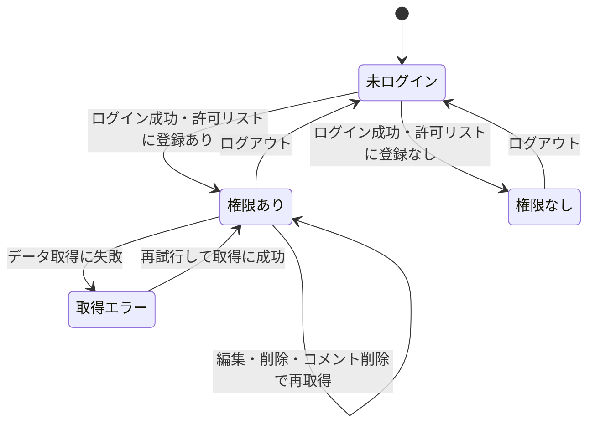

# 設計: 管理画面(モデレーション)

認証とアクセス制御の全体方針は[docs/adr/0006](../../../docs/adr/0006-admin-screen-oidc-rls.md)、書き込み権限の例外は[docs/adr/0007](../../../docs/adr/0007-runtime-llm-server-and-writable-admin.md)にあるため重複させず、本specではこの画面固有の処理フロー・書き込み(編集・削除)・元写真の照合閲覧の具体を書く。ログイン・権限確認の処理は`ikukyu/admin/design.md`・`life-money-sim/admin/design.md`と同じロジック(共通の`admin_emails`・`adminAuth.ts`)を再利用する。本管理画面はADR-0006テンプレートの「読み取り専用」の例外として、ゲームの編集・削除、コメントの削除という書き込みを認める(ADR-0007)。モデレーション専用のサーバーは新設せず、書き込みはすべてRLS経由のDB操作で行う(requirements.md#非機能要件-2)。

## 処理フロー

ログインから閲覧・操作までの全体像は`ikukyu/admin/design.md#処理フロー`のシーケンス図と同一(対象が`board_game_rules_games`等に変わり、SELECTに加えUPDATE・DELETEの書き込みが加わる)。

### ログイン状態を判定して画面を出し分ける処理
- 対象: 管理画面を開いた時点のログインセッション
- 手順:
  1. ログインセッションがない場合は、ログインを促す画面を表示し、管理機能・データ取得は一切行わない(requirements.md#ログイン・アクセス制御-1)
  2. ログインセッションがある場合は「閲覧権限を確認する処理」に進む
- 補足: `ikukyu/admin`・`life-money-sim/admin`と同じSupabase Authセッション・同じ運営者アカウントを使う(一度ログインしていれば再ログイン不要)
- 関連するビジネスルール: requirements.md#ログイン・アクセス制御-1、requirements.md#アクセス制御・権限-1

### Googleでログインする処理 / ログアウトする処理
- 手順: `ikukyu/admin/design.md`の同名処理と同一(戻り先URLが本管理画面自身になる点のみ異なる)
- 関連するビジネスルール: requirements.md#ログイン・アクセス制御-2、requirements.md#ログイン・アクセス制御-4

### 閲覧権限を確認する処理
- 対象: ログイン済みユーザーのアカウント
- 手順:
  1. ログイン中のアカウントが共用の許可リスト(`admin_emails`)に登録されているかを`isAuthorizedAdmin`で確認する
  2. 登録されていれば、モデレーション機能(一覧・編集・削除・通報確認・写真照合)の表示に進む
  3. 登録されていなければ、管理機能を一切表示せず「操作する権限がありません」旨とログアウト手段を表示する(requirements.md#ログイン・アクセス制御-3)
- 補足: この確認は画面の出し分けのためで、実際の保護はRLSが担う。迂回して操作を試みても、運営者以外は保護されたSELECT/UPDATE/DELETE・元写真取得ができない(requirements.md#アクセス制御・権限-2)
- 関連するビジネスルール: requirements.md#ログイン・アクセス制御-3、requirements.md#アクセス制御・権限-1〜2

### ゲーム一覧を取得する処理(モデレーション対象)
- 対象: `board_game_rules_games`の全レコード(削除済み含む)
- 手順:
  1. 運営者として全ゲームを取得する。対応が必要なものを見つけやすい並び(通報件数の多い順を基本とし、次いで新しい順)にする(requirements.md#ゲームの編集・削除-5)。並びの具体は実装時に確定する
  2. 各ゲームに紐づく通報件数を併せて把握する(通報一覧の集計、または件数の取得)
  3. 削除済み(`deleted_at`あり)のゲームも一覧で区別して見えるようにする(誤削除の確認・状態把握のため)
  4. 取得に失敗した場合は、一覧を表示せずエラー表示にする(後述エラーハンドリング)
- 関連するビジネスルール: requirements.md#ゲームの編集・削除-5、requirements.md#通報の確認-8

### ゲームを編集して上書き保存する処理
- 対象: 運営者が選んだ1ゲーム
- 手順:
  1. そのゲームの分類情報・ルール本文(簡単版・詳しい版の各章)を編集可能に表示する(requirements.md#ゲームの編集・削除-6)
  2. 登録時と同じ検証(必須項目・下限≤上限・文字数上限)を通す([game-registration/design.md#バリデーション](../game-registration/design.md)と揃える)
  3. 該当行をUPDATEで上書き保存する。運営者本人のみ実行できる(RLSで担保)
  4. 成功したら一覧・編集内容へ反映、失敗したら入力を保持し失敗表示
- 関連するビジネスルール: requirements.md#ゲームの編集・削除-6

### ゲームを削除する処理
- 対象: 運営者が選んだ1ゲーム
- 手順:
  1. 該当ゲームを論理削除する(`deleted_at`に現在時刻をセットするUPDATE)。これにより一覧・詳細・絞り込みの対象から外れる(requirements.md#ゲームの編集・削除-7、[game-list/design.md#表示対象](../game-list/design.md)、[game-detail/design.md#表示対象](../game-detail/design.md))
  2. 論理削除にすることで、その後も運営者は通報・元写真の照合を行える(レコードを残す)
  3. 成功したら一覧の表示を削除済みに更新、失敗したら失敗表示
- 補足: 誤操作を避けるため、削除には確認ステップを設ける(実装時に確定)
- 関連するビジネスルール: requirements.md#ゲームの編集・削除-7、requirements.md#通報への対応方針-6

### 通報を確認する処理
- 対象: `board_game_rules_reports`の通報レコード
- 手順:
  1. 通報を一覧で確認できるようにする。各通報に対象ゲーム・通報日時・理由テキストを表示する(requirements.md#通報の確認-8)
  2. 通報一覧から対象ゲームの編集・削除に進めるようにする(requirements.md#通報の確認-9)
  3. 通報があっても対象を自動非表示・自動削除にはせず、必ず運営者の判断を挟む(requirements.md#通報への対応方針-6、[report/design.md](../report/design.md))
- 関連するビジネスルール: requirements.md#通報の確認、requirements.md#通報への対応方針

### 元写真を照合閲覧する処理
- 対象: 個々のゲームの投稿時の元写真(非公開Storage)
- 手順:
  1. 運営者が照合を求めたゲームについて、`photo_paths`から非公開Storageの元写真を取得して表示する(requirements.md#投稿写真の照合閲覧-10)
  2. 元写真の取得は運営者本人のみ可能(Storageのアクセスポリシーで担保)。運営者以外・未ログインは取得できない(requirements.md#アクセス制御・権限-1)
- 補足: `photo_paths`は運営者が`authenticated`の全列SELECT+admin RLSで取得できる。一般向けの一覧・詳細では`photo_paths`を返さないうえ、`anon`は列単位のSELECT権限から`photo_paths`が除外され直接読み取りもDBで拒否される(列秘匿の担保は[game-registration/design.md#データベース設計](../game-registration/design.md)を正とする)
- 関連するビジネスルール: requirements.md#投稿写真の照合閲覧-10、requirements.md#アクセス制御・権限-1

### コメントを削除する処理
- 対象: 不適切なコメント
- 手順:
  1. 運営者は任意のコメントをDELETEできる(編集はしない。requirements.md#コメントの削除-11、[comment/design.md](../comment/design.md))。削除可否はRLS(本人+運営者)で担保する
  2. 成功したら一覧から取り除く、失敗したら失敗表示
- 関連するビジネスルール: requirements.md#コメントの削除-11

## エラーハンドリング
- 画面の状態は「未ログイン」「ログイン済みだが権限なし」「権限あり」「取得エラー」に切り分ける(`ikukyu/admin`と同一方針)
- 一般利用者向けの保存(お気に入り等)は失敗を握りつぶす方針だが、管理画面は運営者がモデレーションする画面のため、データ取得の失敗は握りつぶさず画面に伝える(空一覧では取得失敗と0件の区別ができないため)
- 編集・削除・コメント削除は運営者が明示的に行う操作のため、失敗時は失敗が分かる表示をする。編集は入力を保持する。処理中は該当操作を無効化し二重実行を防ぐ

## 関連するファイル(抜粋)
```
app/board-game-rules/admin/page.tsx (新規: 管理画面本体。ログイン状態・権限で表示を出し分けるクライアント画面)
app/board-game-rules/admin/lib/fetchAdminGames.ts (新規: 全ゲーム(削除済み含む)+通報件数の取得)
app/board-game-rules/admin/lib/moderation.ts (新規: ゲームの編集(UPDATE)・論理削除、コメント削除)
app/board-game-rules/admin/lib/photos.ts (新規: 非公開Storageから元写真を取得する)
app/board-game-rules/admin/lib/fetchReports.ts (新規: 通報一覧の取得)
app/board-game-rules/admin/components/LoginScreen.tsx (新規: ログイン/権限なしの案内。ikukyu/adminのLoginScreenと同等のロジック)
app/board-game-rules/admin/components/GameModerationTable.tsx (新規: ゲーム一覧+編集・削除・写真照合の導線)
app/board-game-rules/admin/components/GameEditForm.tsx (新規: 分類情報・ルール本文の編集フォーム。登録時の検証を再利用)
app/board-game-rules/admin/components/ReportsView.tsx (新規: 通報一覧と対象ゲームへの導線)
app/board-game-rules/lib/games.ts (既存: ゲーム型・共通章立てを共有)
app/board-game-rules/lib/comments.ts (既存: 運営者によるコメント削除に deleteComment を利用)
app/lib/adminAuth.ts (既存: getSession/onAuthChange/signInWithGoogle/signOut/isAuthorizedAdmin を利用)
app/lib/supabaseClient.ts (既存の共通クライアントを利用)
```

## データベース設計
本specは`board_game_rules_games`([game-registration/design.md](../game-registration/design.md))・`board_game_rules_reports`([report/design.md](../report/design.md))・`board_game_rules_comments`([comment/design.md](../comment/design.md))を運営者権限で読み書きする。各テーブルの運営者向けRLSは各specのマイグレーションで定義済みのため、ここでは重複させない。テーブルごとに運営者へ与える操作は異なり、次のとおり(総称の「全行SELECT・UPDATE・DELETE」ではない点に注意):
- `board_game_rules_games`: 運営者は全行SELECT+UPDATE(編集・`deleted_at`による論理削除)。物理DELETEのポリシーは持たない(削除は論理削除=UPDATE。[game-registration/design.md](../game-registration/design.md))
- `board_game_rules_reports`: 運営者は全行SELECTのみ(通報の確認。書き換え・削除はしない。[report/design.md](../report/design.md))
- `board_game_rules_comments`: DELETEは本人+運営者、UPDATE(編集)は本人のみで運営者は編集不可([comment/design.md](../comment/design.md))

許可リスト`admin_emails`は`ikukyu/admin`で作成済みのものを共用し、新規テーブルは作らない。

本specで新規に作るのは**元写真の非公開Storageバケットとそのアクセスポリシー**(登録時に写真を保存する先。[game-registration/design.md#元写真のStorage](../game-registration/design.md))。

### 元写真の非公開Storage(新規: 実装より先に単独PRで適用)
- 非公開バケットを1つ作る。バケット名・パス設計は実装時に確定する(例: ゲームIDごとのフォルダ配下に写真を置く)
- Storageのアクセスポリシー:
  - anon・authenticated(運営者以外)は元写真をSELECT(ダウンロード)できない
  - 運営者本人(`admin_emails`に載るアカウント)のみSELECTできる
  - 登録処理からの書き込み(アップロード)は、投稿を匿名で許すため anon/authenticated からのINSERTを許可する(バケットは非公開のまま。読み出しだけを運営者に絞る)
- **匿名アップロードの量的制約(濫用・容量枯渇対策)**: 元写真のアップロードは登録フローの確定保存でブラウザ→Storageへ直接行われ、解析関数もTurnstileも経由しない([game-registration/design.md#セキュリティ](../game-registration/design.md))。つまり写真アップロードはボット対策の外にあり、anonキーで直接大量アップロードされるとStorage容量・コストを濫用されうる。この濫用は「ゲームの事後モデレーション(ADR-0007)」の対象外で、写真は非公開ゆえ通報・削除の運用ループにも乗らず検知しづらい。そのためバケット側で次の量的制約を課す:
  - ファイルサイズ上限(1ファイルあたりの最大バイト数。Supabase Storageのバケット設定 `file_size_limit`)
  - 許可MIMEタイプを画像(`image/*` の想定形式)に限定(`allowed_mime_types`)
  - 1ゲーム(1フォルダ)あたりの枚数上限を、登録画面([game-registration/design.md](../game-registration/design.md))とStorage側の両面で担保する
- 具体的なStorageポリシーのSQL(`storage.objects`に対するRLS)・バケット設定値は、Supabase Storageの標準的な書き方に従い実装時に確定する。方針は「INSERTは誰でも可(ただしサイズ・MIME・枚数の制約付き)、SELECT(ダウンロード)は運営者のみ、バケットはpublic=false」

T0(マイグレーション/Storage設定適用)の実機確認:
- 運営者本人でのみ元写真をダウンロードでき、anon・運営者以外のログインでは取得できないこと
- サイズ上限を超えるファイル・許可外MIMEのアップロードがバケット設定で拒否されること(匿名アップロードの量的制約)
- 運営者本人で`board_game_rules_games`の全行(削除済み含む)がSELECTでき、UPDATE(編集・論理削除)ができること
- 運営者本人で`board_game_rules_reports`がSELECTでき、コメントのDELETEができること
- 未ログイン(anon)・運営者以外では上記の保護された操作・元写真取得ができないこと

## 画面設計
1画面に縦に並べる(PC中心・スマホでも破綻しない範囲。requirements.md#非機能要件-1):
- 上部: ログイン中のアカウント表示とログアウト操作
- 通報一覧(`ReportsView`): 対象ゲーム・通報日時・理由テキスト。各通報から対象ゲームの編集・削除へ進める
- ゲーム一覧(`GameModerationTable`): 通報件数の多い順(次いで新しい順)。各行に編集・削除・元写真の照合閲覧の導線。削除済みは区別して表示
- ゲーム編集(`GameEditForm`): 選んだゲームの分類情報・ルール本文(章ごと)の編集と上書き保存。削除は確認ステップを挟む
- 元写真の照合: 選んだゲームの元写真を運営者のみ取得・表示

未ログイン時・権限なし時は上記を出さず、案内(ログイン/権限がない旨)だけを表示する。

## 状態管理
- 管理画面(`page.tsx`)は「ログインセッション」「閲覧権限の判定結果」「取得したゲーム一覧・通報一覧」「編集中のゲーム」「取得/操作状態」をローカル状態として持つ(`ikukyu/admin`と同一方針)。複数画面をまたがないためグローバルな状態管理は使わない
- 画面の4状態(未ログイン/権限なし/権限あり/取得エラー)の遷移は`ikukyu/admin/design.md#状態管理`の状態遷移図と同一構造(対象データが本アプリのテーブルに変わり、操作に編集・削除が加わる)



## セキュリティ
- 実際のアクセス制御はDB側のRLSとStorageのアクセスポリシーで担保する(ADR-0006)。画面側の権限確認・出し分けは案内のためのもので、突破されても運営者以外は保護された読み書き・元写真取得ができない
- 運営者のメールアドレスは`admin_emails`(`ikukyu/admin`と共用)にのみ持ち、gitにもクライアントのJSバンドルにも置かない。画面側は「自分のメールが許可リストにあるか」を問い合わせるだけで、許可メールの値を保持しない(`ikukyu/admin`と同方針)
- 静的サイトのため管理画面URLは誰でも開ける。守るのは「開けること」ではなく「データの読み書き・元写真取得ができること」であり、未ログイン・権限なしでは保護された処理を走らせない
- 本管理画面はADR-0006テンプレートの読み取り専用の例外として書き込み(編集・削除)を認めるが、書き込みはRLSで運営者本人に限定する(ADR-0007)。モデレーション専用の別サーバーは新設しない(requirements.md#非機能要件-2)
- 通報理由・コメント本文・ゲーム情報を運営者画面に表示する際は、HTMLとして解釈しない形で描画する(利用者投稿・匿名通報の任意テキストを含むため。[comment/design.md](../comment/design.md)・[report/design.md](../report/design.md)と同方針)

## パフォーマンス
- ゲーム一覧に通報件数を併せて出すため、通報の集計が要る。件数が少ない前提で、全ゲーム取得+通報の集計取得で足りる(小規模運用)。件数が増えた場合は集計の取り方を別途見直す

## ログ
- データ取得・編集・削除・元写真取得が想定外に失敗した場合、原因究明のためコンソールにエラーを出す(`ikukyu/admin`と同一方針)。ログにはゲーム情報・写真・通報本文の中身を含めず、失敗の事実・種別にとどめる。運営者自身のブラウザで確認できるため出力する価値がある

## 依存関係
- 認証方式(Google OIDC)・許可リスト(`admin_emails`)・RLS方針は[docs/adr/0006](../../../docs/adr/0006-admin-screen-oidc-rls.md)、書き込み権限の例外は[docs/adr/0007](../../../docs/adr/0007-runtime-llm-server-and-writable-admin.md)に従う。ログイン・権限確認ロジックは`ikukyu/admin`・`life-money-sim/admin`と共用の`adminAuth.ts`を再利用する
- 編集・削除の対象は[game-registration/design.md](../game-registration/design.md)の`board_game_rules_games`、通報は[report/design.md](../report/design.md)、コメント削除は[comment/design.md](../comment/design.md)に従う。各テーブルの運営者向けRLSは各specで定義済み
- 元写真の非公開Storageは本specで作り、登録処理([game-registration/design.md](../game-registration/design.md))がそこへ書き込む
- Supabase AuthのRedirect URLs許可リストに本管理画面の戻り先URL(`https://benriyatool.com/board-game-rules/admin/**`)を本番公開前に登録する(requirements.md#認証手段とパスキー-5。既存`life-money-sim/admin`の登録漏れの教訓)。なお利用者ログインの戻り先(一覧・詳細・登録・お気に入り一覧など`/board-game-rules/**`)の許可リスト登録は[user-auth](../user-auth/tasks.md)の責務で、本管理画面の`/admin/**`だけに寄せない(両者を合わせてリリース前に確認する)。Googleアカウント側のパスキー・2段階認証の維持もリリース前に確認する(ADR-0006)
