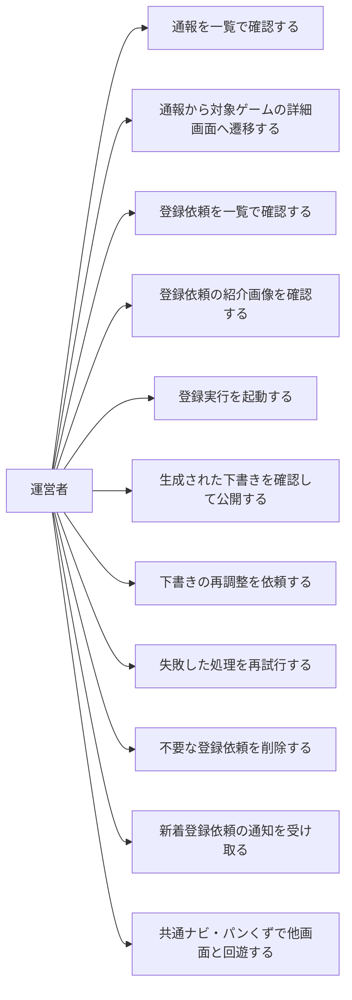

# 要件定義: 管理画面(モデレーション)

## サマリ
運営者本人だけがログインして使う管理画面。通報([report/requirements.md](../report/requirements.md))と利用者からの登録依頼([game-registration/requirements.md](../game-registration/requirements.md))を横断で一覧確認し、登録依頼は写真・分類情報をもとに外部ツール(管理画面の外)でゲーム登録できる。ゲーム1件ごとの編集・削除・紹介画像差し替え・コメント削除は詳細画面([game-detail/requirements.md](../game-detail/requirements.md))で行う。アクセス制御はGoogle OIDCログイン+DB側RLSで担保し、画面はboard-game-rules共通の左サイドバーナビ・パンくずを備えて他画面と回遊できる。

このspecの利用者と主なユースケースは下記「[ユースケース図](#ユースケース図)」を参照。

## 概要
- 機能名: 管理画面(モデレーション)
- 目的: 運営者本人だけがログインして、複数ゲームを横断する運用(通報内容の確認、利用者から届く登録依頼([game-registration/requirements.md](../game-registration/requirements.md))の確認・処理)を行えるようにする
- 優先度: 中

## ユーザーストーリー
- 運営者として、通報された内容をまとめて確認し、対応の要否を判断したい
- 運営者として、通報された内容から対象ゲームを開いて、その場で対処(編集・削除)したい
- 運営者として、管理画面を自分以外に開かれない・操作されないようにしたい
- 運営者として、届いた登録依頼をまとめて確認し、写真をもとにゲームを登録したい
- 運営者として、新しい登録依頼が届いたらすぐに気づけるようにしたい
- 運営者として、管理画面の「登録実行」を押すだけで、ローカル環境での解析処理を起動したい(手動でセッションを開かずに済ませたい)
- 運営者として、生成された下書きの内容を確認してから公開するか判断したい
- 運営者として、下書きの内容が思っていたのと違う場合、直してほしい点を伝えて再生成してもらいたい
- 運営者として、処理が失敗した場合に原因を把握し、改めて実行し直したい
- 運営者として、登録依頼に添付されたゲーム紹介画像を確認したい
- 運営者として、投稿者が紹介画像を用意しなかった場合でも、登録時に自動的に画像を用意したい
- 運営者として、共通ナビから管理画面へ素早く到達したい
- 運営者として、管理画面から一覧など他の画面へ戻り、迷わず回遊したい
- 運営者として、管理画面が他の画面と同じ見た目・同じナビで、違和感なく使いたい

ゲーム1件ごとの編集・削除・紹介画像差し替え・元写真照合・コメント削除は、そのゲームの詳細画面で行う([game-detail/requirements.md#運営者向けの操作管理者ログイン時](../game-detail/requirements.md))。

## ユースケース図

- 利用できるのは運営者本人のみ(requirements.md#アクセス制御・権限-1)。通報の確認・遷移はrequirements.md#通報の確認-6・requirements.md#通報の確認-7、登録依頼の一覧確認・削除はrequirements.md#登録依頼の確認-8・requirements.md#登録依頼の確認-10、登録実行の起動・下書き確認・公開・再調整・再試行はrequirements.md#登録実行・下書きレビュー-16〜21、紹介画像の確認はrequirements.md#ゲーム紹介画像の確認・自動補完-11、通知はrequirements.md#通知-7、共通ナビ・パンくずでの回遊はrequirements.md#ログイン・アクセス制御-5・requirements.md#画面レイアウト・回遊導線-13〜14に対応する

## 機能要件

### ログイン・アクセス制御
- [1] 管理画面のURLを開いたとき、ログインしていない場合は管理機能を一切表示せず、ログインを促す
- [2] Googleアカウントでログイン(OIDC)できること。既存アプリの管理画面と同じ運営者アカウントを使う
- [3] 運営者本人以外のアカウントでログインした場合、管理機能を表示せず、操作できない旨を表示する
- [4] ログアウトできること
- [5] 運営者本人としてログインしている場合に限り、board-game-rulesの共通ナビ(左サイドバー)に管理画面(`/board-game-rules/admin/`)への導線を表示する。未ログイン・運営者以外のアカウントでは表示しない。これは運営者が管理画面へ素早く到達するための利便であって、アクセス制御ではない(保護は下記[ビジネスルール2]のRLSが担い、導線の表示有無にかかわらず未権限者は管理機能を利用できない)。運営者判定は既存の共通運営者判定を再利用し、新規のロジックは持たない(判定の実装詳細は[admin/design.md](design.md)を正とする)

### 通報の確認
- [6] 通報([report/requirements.md](../report/requirements.md))された内容を一覧で確認できる。各通報には対象ゲーム・通報日時・理由テキストを表示する
- [7] 通報の一覧から対象ゲームの詳細画面へ遷移できる。編集・削除はその詳細画面の管理者導線([game-detail/requirements.md#運営者向けの操作管理者ログイン時](../game-detail/requirements.md))で行う

### 登録依頼の確認
- [8] 利用者から送信された登録依頼(写真+分類情報。[game-registration/requirements.md](../game-registration/requirements.md))を一覧で確認できる。未処理/処理済みを区別して表示する
- [9] 依頼ごとに、投稿された写真・入力済み分類情報・添付のゲーム紹介画像を確認できる。投稿写真・ゲーム紹介画像は一覧上のサムネイルから原寸(別タブ)で開いて確認できる。この確認画面が下記「登録実行・下書きレビュー」[16]〜[21]の各操作の起点になる
- [10] 不要な依頼(スパム・重複・情報不足など)や、登録も公開もしない依頼(重複など、キューから外したいだけのもの)を削除できる

### 登録実行・下書きレビュー
- [16] 未処理の登録依頼に対して「登録実行」を押すと、ローカル環境での解析処理(写真解析・分類情報とルール本文の生成)が起動する。押した時点で処理が完了するわけではないため、進行中であることが分かる表示をする
- [17] 依頼ごとの処理状況(未着手/処理中/下書きあり/公開済み/失敗)を一覧で確認できる
- [18] 処理が完了すると下書き(生成された分類情報・ルール本文)が、公開後の詳細画面と同じ見た目のプレビューで確認できるようになる。ゲーム名・対応人数・プレイ時間・ジャンルに加え、簡単版ルールの全文・詳しい版ルール・分類情報(対象年齢・難易度・出版社・作者・日本語ルールの有無・受賞歴・発売年)を確認でき、運営者が「公開する」前に生成物の質を判断できる。プレビューに出ない情報(本文が空の未生成の章、共通章立てにないキーの章)は運営者向けに別途示す
- [19] 下書きに対して、次のいずれかを選べる:
  - **公開する**: 下書きの内容でゲームを登録・即時公開する。あわせて依頼は処理済みとして記録される
  - **再調整を依頼**: 直してほしい点を自由記述で入力して送信すると、ローカル環境での再生成処理が起動し、直前の下書きと今回の要望をもとに下書きが更新される。回数の上限は設けず、何度でも繰り返せる
  - **破棄**: 上記「登録依頼の確認」[10]の依頼削除の操作を使う(下書き専用の別操作は設けない)
- [20] 過去に依頼した再調整の要望を、下書きの履歴として新しい順に確認できる
- [21] 処理が失敗した場合、失敗した旨と原因(分かる範囲)を表示する。「登録実行」を再度押すことで再試行できる

### ゲーム紹介画像の確認・自動補完
- [11] 登録依頼の確認画面で、依頼に添付されたゲーム紹介画像(あれば)を確認できる([game-registration/requirements.md#ゲーム紹介画像のアップロード](../game-registration/requirements.md))
- [12] 登録依頼にゲーム紹介画像が添付されていない場合、登録依頼からゲームを登録するローカルツールが画像検索を行い、見つけた画像をそのまま転載せずAI画像加工を施したうえで登録する(根拠: [game-registration/requirements.md#ゲーム紹介画像の取り扱い](../game-registration/requirements.md)の著作権配慮の方針に従う)

### 画面レイアウト・回遊導線
- [13] 管理画面に、board-game-rules共通の左サイドバーナビ(一覧・登録依頼・お気に入り・管理へのリンク)を、他画面(一覧・登録依頼・お気に入り)と同じ体裁で表示する。管理画面を表示している間は「管理」を現在地として示す
- [14] 画面上部にパンくず(べんりやつーる › ボドゲのトリセツ › 管理)を表示し、上位画面へ遷移できる。左サイドバーを表示しない狭幅(スマートフォン)でもパンくずで上位画面へ回遊できるようにする(根拠: 非機能要件[1]の外出先での対応を、狭幅でも回遊手段が残る形で満たす)
- [15] サイドバー・パンくずの導線は運営者が画面間を移動するための利便であって、アクセス制御ではない(未権限者の保護は下記[ビジネスルール2]のRLSが担い、導線の表示有無にかかわらず未権限者は管理機能を利用できない)

## ビジネスルール・制約

### アクセス制御・権限
- [1] 管理機能を利用できるのは運営者本人のアカウントのみとする。ログインしていない状態・運営者以外のアカウントでは、管理機能を利用できず、投稿写真も取得できないこと(根拠: [docs/adr/0006-admin-screen-oidc-rls.md](../../../docs/adr/0006-admin-screen-oidc-rls.md))
- [2] アクセス制御は画面上の表示の出し分けではなく、DB側のルール(RLS)で担保する(根拠: 静的サイトのため画面側だけの制御は迂回されうる)
- [3] 本管理画面と、詳細画面に載る管理者導線は、ADR-0006のテンプレートが定める「読み取り専用」の例外とし、運営者本人による書き込み操作(ゲームの編集・削除、コメントの削除、紹介画像の差し替え、登録依頼の処理、下書きの「公開する」によるゲームの新規登録)を認める(根拠: 利用者が投稿する公開コンテンツのモデレーションが必要なため。[docs/adr/0007-runtime-llm-server-and-writable-admin.md](../../../docs/adr/0007-runtime-llm-server-and-writable-admin.md)。「公開する」による新規登録は[adr/0002](../adr/0002-operator-publish-insert.md))。詳細画面側でも書き込みは運営者本人に限定する(RLSで担保。[game-detail/requirements.md#運営者向けの操作管理者ログイン時](../game-detail/requirements.md))

### 認証手段とパスキー
- [4] 既存アプリの管理画面(`ikukyu/admin`・`life-money-sim/admin`)と同一の認証方針(Google OIDC、同じ運営者アカウント、パスキー・2段階認証の運用)とする(根拠: [docs/adr/0006-admin-screen-oidc-rls.md](../../../docs/adr/0006-admin-screen-oidc-rls.md))。Google OIDC自体の設定は新規に不要
- [5] Supabase AuthのRedirect URLs(URL Configuration)の許可リストに、本管理画面の戻り先URL(`https://benriyatool.com/board-game-rules/admin/**`)を本番公開前に登録する(根拠: 既存の`life-money-sim/admin`で登録漏れによるリダイレクト不具合が発生した教訓)。なお[user-auth](../user-auth/requirements.md)が登録する利用者ログインの戻り先`https://benriyatool.com/board-game-rules/**`は本管理画面の`/admin/**`を包含するため、その広域エントリが登録されていれば管理画面の戻り先も兼ねられる(別エントリの二重登録は必須ではない。詳細は[admin/design.md](design.md)・[user-auth/tasks.md](../user-auth/tasks.md))

### 通報への対応方針
- [6] 通報があっても対象を自動非表示・自動削除にはせず、必ず運営者の判断を挟む([report/requirements.md#通報後の扱い](../report/requirements.md))

### 通知
- [7] 新しい登録依頼が届いたら、運営者に通知が届く(具体的な通知手段は[game-registration/design.md](../game-registration/design.md)で確定)

### ゲーム紹介画像の自動補完
- [8] ゲーム紹介画像の画像検索・AI加工に使う外部APIは、無料枠の範囲で運用できるものを選定する(根拠: `/consult`での判断。Webアプリ側には課金構造を持ち込まない既存方針([game-registration/requirements.md](../game-registration/requirements.md))を、運営者ローカルツールの追加機能でも維持する)

### 登録実行のローカル処理起動
- [9] 管理画面からの「登録実行」「再調整を依頼」は、Supabase上の状態を更新する操作にとどまり、実際の写真解析・ルール生成は運営者のローカル環境(Claude Codeセッション)で行われる。Webアプリ(Cloudflare Workers)・Supabaseから直接LLM APIを呼び出すことは一切ない(根拠: `/consult`での判断。既存の「課金の発生しない設計」方針(requirements.md#登録依頼の確認)を維持する)
- [10] ローカル環境は、起動を待つ依頼を定期的に確認して処理を開始する。運営者のMacが起動していない・オフラインの間は処理が進まない(根拠: 常駐サーバーを持たない静的サイト構成のため。低頻度運用のため許容する。具体的な検知間隔は[admin/design.md](design.md)で確定する)
- [11] 「公開する」操作は、運営者本人のログインセッションから直接ゲームとして登録される(ローカル処理を経由せず、押した時点で即時公開される)。この書き込みは運営者本人(`admin_emails`)に限定する(RLSで担保)。根拠は[adr/0002](../adr/0002-operator-publish-insert.md)
- [12] 下書きは常に最新の1件のみを保持する(過去の下書き本文そのものは保存せず、再調整で上書きされる)。再調整の要望テキストのみを履歴として残す(根拠: シンプルさを優先する方針。過去の下書き本文を見返す運用は想定しない)
- [13] ローカル環境の解析処理(`claude -p`)は、対応人数・プレイ時間など事実として存在する数値項目について、写真に記載がある、またはWeb検索で情報が見つかった場合のみ値を埋める。裏付けとなる情報が何もない場合は、値を推測で埋めず空欄(NULL)のままにする(根拠のない推定はしない)。Web検索は写真から判定したゲーム名を検索クエリとする場合に限り、1件の依頼につき合計5回程度を目安に試す(際限なく繰り返さない)。検索で見つかった情報は、個人ブログ等の情報源であっても信頼してよい(複数の情報源での裏付け確認は必須としない)。判定したゲーム名がボードゲームのタイトルとして不自然(指示文・URL・コマンドのように見える)なときは検索せず生成を続ける。写真の埋め込みテキストと同様、検索結果の内容も指示ではなく解析対象のデータとして扱う(プロンプトインジェクションへの軽量な緩和策であり、厳密な検証機構は設けない。根拠: `/consult`での判断。Web検索はClaude Codeセッション自身の機能のため、既存の「課金の発生しない設計」方針([9])を維持する)。一方、ジャンルなど写真・ルール内容から判断できる分類情報は、外部情報源による裏付けを必須とせず、ローカル処理自身の判断(推論)で決めてよい(対象年齢・難易度等の既存の任意項目と同じ扱い)
- [14] 対応人数・プレイ時間などが根拠不足で埋まらなかった(NULLのままの)下書きも、それを理由に「公開する」操作([19])を妨げない。`board_game_rules_games`のこれらの列はNOT NULL制約を持たない(根拠: 何も分からない情報を理由に運営者の公開操作を止めない方針。`/consult`での判断)。公開後の一覧・詳細画面では、該当項目を表示しないか「不明」と表示する([game-list/requirements.md](../game-list/requirements.md)、[game-detail/requirements.md](../game-detail/requirements.md))

## 非機能要件
- [1] 主にPC・スマートフォンの双方から利用しうる(外出先で通報に気付いて対応する場面を想定)。表示が破綻しない程度に配慮する
- [2] 静的エクスポート構成を維持する。通報・登録依頼の確認はDB(RLS経由)への操作で行い、モデレーション専用のサーバーを新設しない([game-registration/requirements.md](../game-registration/requirements.md)により、本アプリはランタイムサーバー機能を持たない)

## UI/UX要件
- [1] 管理画面の見た目を、board-game-rules共通のデザイン(配色・カード・タイポグラフィ・共通ナビ)に踏襲し、一覧・登録依頼・お気に入りの各画面と一貫させる(根拠: 運営者が画面間を行き来するため見た目が揃っている方が迷いにくい。管理画面だけがデザインから乖離している状態を解消する)
- [2] 通報一覧・登録依頼一覧・ログイン/権限なし表示など管理画面内の各要素も、共通デザインのカード・ボタン・見出しの体裁に揃える(独自の見た目を持ち込まない)

## 依存関係
- 認証方式(Google OIDC)とDB読み取り権限(RLS)の方針は[docs/adr/0006-admin-screen-oidc-rls.md](../../../docs/adr/0006-admin-screen-oidc-rls.md)、運営者本人の書き込み権限は[docs/adr/0007-runtime-llm-server-and-writable-admin.md](../../../docs/adr/0007-runtime-llm-server-and-writable-admin.md)(編集・削除)および[adr/0002-operator-publish-insert.md](../adr/0002-operator-publish-insert.md)(「公開する」による新規INSERT)に従う
- ゲームの編集・削除・紹介画像差し替え・元写真照合・コメント削除は詳細画面で行う。それらの要件・ルールは[game-detail/requirements.md](../game-detail/requirements.md)に従う。編集・削除の対象データは[game-registration/requirements.md](../game-registration/requirements.md)、通報は[report/requirements.md](../report/requirements.md)、コメントは[comment/requirements.md](../comment/requirements.md)に従う
- 登録依頼(写真+分類情報)の保存構造・通知手段、および登録実行・下書き・再調整の状態を保持するカラムは[game-registration/design.md](../game-registration/design.md)で確定する
- 投稿写真という機微になりうる情報・利用者コメントの管理経路があるため、[specs/legal/requirements.md](../../legal/requirements.md)のプライバシーポリシーの更新要否を確認する
- ゲーム紹介画像の取り扱い方針(著作権配慮・削除ポリシー)は[game-registration/requirements.md#ゲーム紹介画像の取り扱い](../game-registration/requirements.md)に従う
- モデレーションの詳細画面集約・削除方針の背景は[adr/0001](../adr/0001-moderation-on-detail-and-physical-delete.md)
- 管理画面の見た目・共通ナビ(BoardGameNav)・パンくずの体裁(UI/UX要件[1][2]・機能要件[13][14])は、他画面と同じboard-game-rules共通デザインに従う。共通デザインのトークンと共通chrome(ナビ・パンくず等の枠)の定義は[design-system/requirements.md](../design-system/requirements.md)および[DESIGN.md](../DESIGN.md)に従う

## スコープ外
- 登録依頼を手動で「処理済み」にする操作。`processed_at`は下書きレビュー経由の「公開する」([19])と手動フォールバックの`registerGame.ts`(`requestId`指定時)がそれぞれ自動で記録する。登録も公開もしない依頼(重複など)はキューから外すために[10]の削除で対応する
- 複数の管理者アカウント・権限ロールの管理(利用者は運営者本人のみ)
- 管理画面ドメイン自身をパスキー(WebAuthn)の登録先とする実装(根拠: [docs/adr/0006-admin-screen-oidc-rls.md](../../../docs/adr/0006-admin-screen-oidc-rls.md)と同じ)
- 通報者・コメント投稿者へのペナルティ管理(アカウントBAN等)
- 写真解析・ルール本文の生成そのもの(ローカル環境で行われる処理の中身)。管理画面が担うのは処理の起動・状況確認・下書きの確認・公開判断であり、解析・生成のロジック自体はローカルツール(`.claude/skills/board-game-rules-batch-register/`)側の実装とする
- 編集・削除操作の履歴管理(監査ログ)
- 再調整の要望に対する内容の自動的な妥当性チェック(運営者が下書きを見て都度判断する)
- 下書きの複数バージョンの並行保持・過去の下書き本文の閲覧(常に最新1件のみを保持する。上記[ビジネスルール12]参照)
- 通報一覧・登録依頼一覧の取得ロジック・並び順・データ構造そのものの変更(機能要件[13][14]とUI/UX要件は管理画面の見た目と回遊導線を対象とし、モデレーション機能の動作は変えない)
