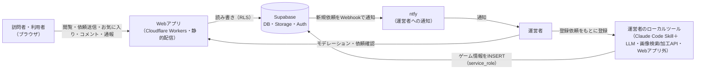
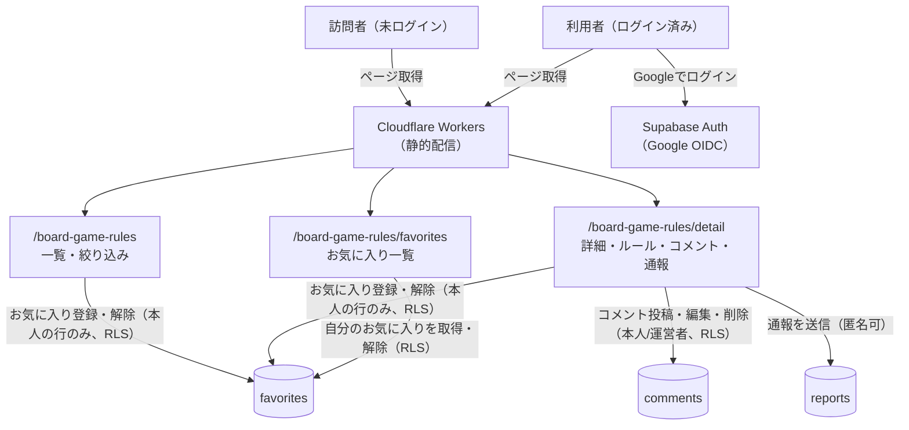
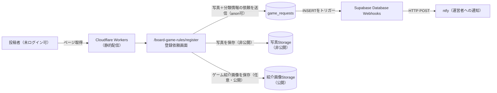
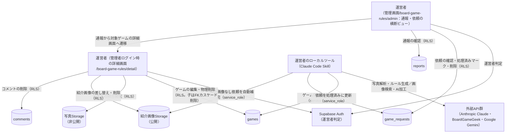
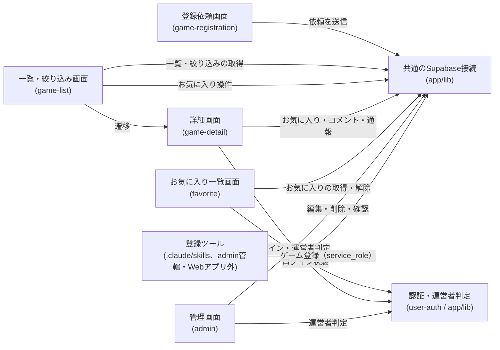
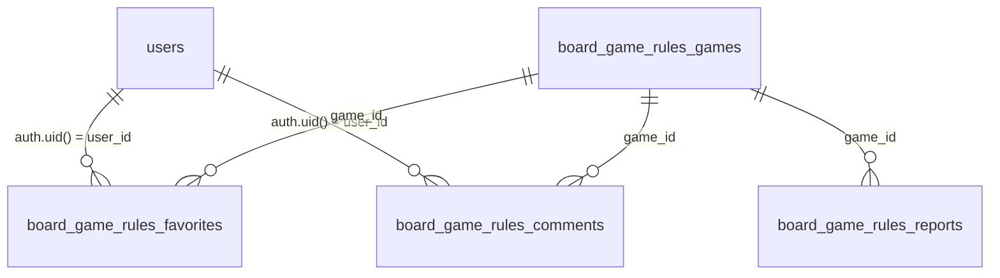

# アーキテクチャ: board-game-rules

## 1. 概要
誰でもボードゲームのルールブックを撮影して登録依頼でき、プレイ人数・時間・ジャンルなど複数の分類で絞り込んで探し、ルール(簡単版・詳しい版)を確認できるアプリ。URL: `/board-game-rules`

## 2. アーキテクチャの目的
- 手入力の手間をなくし「写真を撮るだけ」で登録を依頼できる体験を提供する。実際の登録(LLMによる解析・ルール生成)は運営者がローカルでまとめて行い、Webアプリからの匿名LLM呼び出し費用を発生させない
- ルール本文を共通の章立てで構造化し、将来、章単位での全ゲーム横断分析・分類に使えるデータ資産にする

## 3. 設計方針
- 静的配信(Cloudflare Workersでの静的アセット配信)のみで完結させる。**ランタイムのサーバー機能(LLM呼び出し用のCloudflare Workers関数)は持たない**(方針転換の経緯: `/consult`で、匿名投稿からのライブLLM解析は費用が発生し続けるため撤廃した。既存アプリ(ai-dev-digest)のLLM処理と同じ「オフラインバッチ」の考え方を踏襲しつつ、GitHub Actionsではなく運営者のローカル環境(Claude Code Skill)で実行する)
- ルール本文は説明書原文の逐語転載を避け、独自の言い回しで再構成する。「詳しい版」は数値・条件・例外を省略・改変しない「精密な言い換え」とし、要約的な性質を保ちつつ実用精度を確保する(根拠: [game-registration/requirements.md#ルール本文の著作権への配慮](game-registration/requirements.md))。原本にあたる投稿写真は一般公開せず運営者の照合用に限定保存する
- 投稿者からの依頼は即時公開しない。運営者が依頼(写真+入力済み分類情報)を確認し、ローカルツールでルール本文を生成・登録して初めて公開される(根拠: `/consult`での判断、[game-registration/requirements.md#公開ポリシー](game-registration/requirements.md))。登録済みの内容への品質対応は事後モデレーション(管理画面)と閲覧者通報で補う
- 管理画面は既存の読み取り専用テンプレート([ADR-0006](../../docs/adr/0006-admin-screen-oidc-rls.md))の例外として、モデレーションのための書き込み(編集・削除)を認める(根拠: [ADR-0007](../../docs/adr/0007-runtime-llm-server-and-writable-admin.md)。本アプリではランタイムLLMサーバー機能は不要になったが、書き込み権限の例外という方針は維持する)
- ログイン(Google OIDC)は、お気に入り・コメントという利用者本人のデータ機能のために導入する。既存の`ai-dev-digest/bookmark`の「本人の行のみRLSで操作可」パターンを踏襲する。閲覧・依頼送信・通報はログイン不要
- 新規の登録依頼は、Supabase Database WebhooksからntfyへのHTTP POSTで運営者に通知する(中継サーバー不要)

## 4. システム構成図
1枚に全要素を詰めると読み手が追えないため、**全体像の俯瞰図**と**利用シーン別の詳細図**(閲覧・登録依頼・運営)に分けて示す(各図はノード10・エッジ12以内を目安にする。分割の考え方は[architecture-workflow](../../.claude/skills/architecture-workflow/SKILL.md)を参照)。

### 4.1 全体俯瞰

### 4.2 閲覧・利用者フロー(未ログイン閲覧＋ログイン利用者のお気に入り・コメント・通報)

### 4.3 登録依頼・通知フロー(投稿→保存→運営者通知)

### 4.4 運営者の登録・モデレーションフロー

> 方向B(2026-08-19)により、ゲーム個別のモデレーション操作(編集・物理削除・紹介画像差し替え・元写真照合・コメント削除)は管理画面のゲーム一覧を廃止して詳細画面の管理者導線へ集約した。管理画面は通報一覧・登録依頼一覧の横断ビューを担う。

これらの図の正となる文章は下記「[5. アーキテクチャ概要](#5-アーキテクチャ概要)」と各specのrequirements.md/design.md。このアプリから見た構成のみを描いており、プロジェクト共通インフラの詳細は[docs/architecture/](../../docs/architecture/infrastructure.md)を参照。画面URL・テーブル名・Storageは設計([/design](../../.claude/skills/design/SKILL.md))で確定済み(詳細画面は静的エクスポート制約によりクエリ方式 `/board-game-rules/detail?id=…`。テーブルは `board_game_rules_games`/`_game_requests`/`_favorites`/`_comments`/`_reports`、元写真は非公開Storageバケット)。`.claude/skills/board-game-rules-batch-register/`(ローカルツール)はWebアプリのコードではないため、図では「運営者のローカルツール」として外部要素の扱いにしている。

## 5. アーキテクチャ概要
Next.jsの静的エクスポートをCloudflare Workersで配信する構成は他アプリと同じで、本アプリもランタイムのサーバー機能を持たない(静的配信のみ)。投稿者は`/board-game-rules/register`で写真をアップロードし、分かる範囲の分類情報(ゲーム名・対応人数・プレイ時間・ジャンルなど、すべて任意)を入力して送信すると、`board_game_rules_game_requests`に依頼として保存される([game-registration](game-registration/requirements.md))。この時点でゲームは公開されない。

依頼のINSERTはSupabase Database Webhooksでntfyへ通知され、運営者はローカルのClaude Code Skill(`.claude/skills/board-game-rules-batch-register/`)を使って写真を確認し、ゲーム情報とルール本文(簡単版・詳しい版)を生成、`board_game_rules_games`へ登録する。このLLM呼び出しは運営者自身のClaude Codeセッション上で行われ、Webアプリからの追加のAPI課金は発生しない([admin](admin/requirements.md))。

投稿者は登録依頼にゲーム紹介画像(パッケージ・コンポーネント・プレイ風景など)を任意で添付でき、一覧・詳細で公開表示される(元写真とは別の**公開**Storageバケットに保存する)。投稿者が添付しなかった場合、運営者のローカルツールがBoardGameGeek API(画像検索)とGoogle Gemini API(AI画像加工、そのまま転載しない)で自動補完する。いずれの外部APIも運営者のローカル環境から無料枠の範囲で呼び出され、Webアプリ・Cloudflare Workersのコード・課金構造には影響しない([game-registration](game-registration/requirements.md)、[admin](admin/requirements.md))。

訪問者は一覧・絞り込み([game-list](game-list/requirements.md))と詳細([game-detail](game-detail/requirements.md))を未ログインで閲覧でき、ルールは簡単版・詳しい版のタブで確認できる。ログイン(Google OIDC、利用者全員が対象)した利用者は、お気に入りの登録・一覧([favorite](favorite/requirements.md))と、ゲームごとのコメント投稿([comment](comment/requirements.md))ができる。内容に問題があれば誰でも通報でき([report](report/requirements.md))、運営者は管理画面([admin](admin/requirements.md))で通報の確認・登録依頼の確認/処理を行う。方向B(2026-08-19)により、ゲーム個別のモデレーション(編集・物理削除・コメント削除・元写真照合・紹介画像差し替え)は管理画面のゲーム一覧を廃止し、対象ゲームの詳細画面([game-detail](game-detail/requirements.md))の管理者導線に集約した(削除は物理削除で、子レコードはFKカスケード削除・Storage実体は残す)。管理画面と詳細画面の管理者導線は既存の読み取り専用テンプレート([ADR-0006](../../docs/adr/0006-admin-screen-oidc-rls.md))の例外として書き込みを認める([ADR-0007](../../docs/adr/0007-runtime-llm-server-and-writable-admin.md))。

## 6. 採用技術
| 技術 | 用途 |
|---|---|
| Next.js(静的エクスポート) | 一覧・詳細・登録依頼・お気に入り一覧・管理の各画面の描画 |
| Supabase | ゲーム情報・登録依頼・お気に入り・コメント・通報の保存、写真の非公開保存 |
| Supabase Database Webhooks | 登録依頼のINSERTを検知し、ntfyへ通知する |
| ntfy | 運営者への新規依頼通知(既存のClaude Codeセッション通知と同じ運用) |
| Supabase Auth(Google OIDC) | 利用者ログイン(お気に入り・コメント)、運営者判定(管理画面) |
| Claude Code(ローカル、Skill) | 運営者が登録依頼をもとにゲーム情報・ルール本文を生成する際に使う。Webアプリの一部ではない |
| BoardGameGeek API(ローカルツールから、無料枠) | ゲーム紹介画像が未添付の依頼を登録する際、ゲーム名で画像検索する。Webアプリの一部ではない |
| Google Gemini API(ローカルツールから、無料枠) | 検索で見つけた画像をそのまま転載せずAI加工する。Webアプリの一部ではない |
| Tailwind CSS | スタイリング |

選定理由はプロジェクト横断のため[関連ADR](#11-関連adr)を参照。

## 7. 機能マップ
| spec | 役割 | 依存 | 状態 |
|---|---|---|---|
| [user-auth](user-auth/requirements.md) | Google OIDCによる任意ログイン基盤・運営者判定を提供する | [docs/adr/0006](../../docs/adr/0006-admin-screen-oidc-rls.md)を踏襲 | リリース済み |
| [favorite](favorite/requirements.md) | ログイン利用者がゲームをお気に入り登録し一覧で振り返る | user-authのログイン状態、game-registrationのゲームID | リリース済み |
| [game-registration](game-registration/requirements.md) | 写真+分類情報の登録依頼を受け付け、運営者へ通知する(実際の登録・LLM解析は運営者側で行う)。ゲーム紹介画像の任意アップロード・並び替えも受け付ける | user-authは不要(ログイン不要)、admin側のローカルツールへ依頼を供給 | 実装中(ゲーム紹介画像アップロードを追加実装中) |
| [game-list](game-list/requirements.md) | 登録ゲームの一覧表示と複数分類での絞り込み(アプリのトップ)。カードにゲーム紹介画像のメイン画像を表示 | game-registrationが供給する登録済みゲーム、game-detailへ遷移、favoriteのお気に入り操作 | 実装中(カードへのゲーム紹介画像表示を追加実装中) |
| [game-detail](game-detail/requirements.md) | 1ゲームの分類情報・ルール(2タブ)・コメント・通報導線・ゲーム紹介画像ギャラリーを表示。**運営者ログイン時は編集・物理削除・紹介画像差し替え・元写真照合・コメント削除の管理者導線を表示(方向B)** | 登録済みゲーム、favorite/comment/reportの各機能、adminの運営者判定/RLS/Storageポリシー | 仕様のみ(未実装・方向Bで管理者操作を追加) |
| [comment](comment/requirements.md) | ゲームごとの助け合いコメント(ログイン利用者が複数投稿可) | user-authのログイン・運営者判定、game-detailで表示 | 仕様のみ(未実装) |
| [report](report/requirements.md) | 閲覧者による通報(匿名可)。自動非表示にせず運営者判断を挟む | game-detailの通報導線、adminで確認・対応 | 仕様のみ(未実装) |
| [admin](admin/requirements.md) | 運営者の横断ビュー(通報一覧の確認・登録依頼の確認/処理)とログイン・アクセス制御。**ゲーム個別の編集・物理削除・写真照合・コメント削除・紹介画像差し替えは方向Bでgame-detailへ移設**。登録依頼からのゲーム登録・紹介画像の自動補完(BoardGameGeek+Gemini)はローカルツール(Claude Code Skill)で行う | user-authの運営者判定、game-registration/reportの各データ、ADR-0006/0007。ゲーム個別操作はgame-detailへ移設 | 実装中(方向B: ゲーム個別操作をgame-detailへ移設・物理削除化を仕様確定中) |
| [design-system](design-system/requirements.md) | アプリ内の画面の系統を揃えるper-appデザインシステムの土台(トークン+chromeルールの一元管理=[DESIGN.md](DESIGN.md)、共通部品カタログ=`app/board-game-rules/styleguide/`)。全画面の見た目の共有財産 | 確定済みAnalog Hearth([game-registration](game-registration/requirements.md))・共通ナビ、PR #207の運用ルール | リリース済み |

## 8. コンポーネント図

この図の正となる文章は「[7. 機能マップ](#7-機能マップ)」の依存列と、各specのrequirements.mdの依存関係。

## 9. ディレクトリ構成
CLAUDE.mdの一般規約(`components/`,`lib/`)に従う。ランタイムサーバー機能を持たないため、`worker/`ディレクトリや`wrangler.toml`の変更は不要。登録依頼からゲームを登録するローカルツールは`app/board-game-rules/`配下のWebアプリコードではなく、`.claude/skills/board-game-rules-batch-register/`(Claude Code Skill)として置く([admin/design.md](admin/design.md)で確定)。

## 10. 外部サービス
| サービス | 用途 |
|---|---|
| Supabase(`board_game_rules_games`テーブル) | ゲームの分類情報・ルール本文(簡単版・詳しい版)の保存 |
| Supabase(`board_game_rules_game_requests`テーブル) | 利用者からの登録依頼(写真パス+任意の分類情報)の保存 |
| Supabase Storage(写真、非公開) | 依頼写真・登録済みゲームの元写真の保存(運営者のみ照合用に閲覧) |
| Supabase Storage(ゲーム紹介画像、公開) | 一覧・詳細で表示するゲーム紹介画像の保存(誰でも公開URLで閲覧可) |
| Supabase(`board_game_rules_favorites`テーブル) | ログイン利用者本人のお気に入りの保存 |
| Supabase(`board_game_rules_comments`テーブル) | ゲームごとのコメントの保存 |
| Supabase(`board_game_rules_reports`テーブル) | 通報の保存(匿名) |
| Supabase Auth(Google OIDC) | 利用者ログイン・運営者判定 |
| Supabase Database Webhooks | 登録依頼のINSERTを検知してntfyへ通知する |
| ntfy | 運営者への新規依頼通知 |
| BoardGameGeek API(ローカルツールから) | ゲーム紹介画像の自動補完(画像検索) |
| Google Gemini API(ローカルツールから) | ゲーム紹介画像の自動補完(AI画像加工) |

テーブルが複数あり`auth.users`とのリレーションも生まれるため、ER図を置く。各カラムの正となる文章は各specのdesign.md「データベース設計」。テーブル名・カラムは設計で確定済み(`board_game_rules_games`は運営者の論理削除用に`deleted_at`を持ち、`is_official`列は持たない。コメントは公開表示のため`author_name`を非正規化保存)。

`board_game_rules_reports`・`board_game_rules_game_requests`は匿名のため`auth.users`とのリレーションを持たない(`game_requests`は依頼者を特定する情報を保存しない)。写真はStorageに置き、`board_game_rules_games`・`board_game_rules_game_requests`の各レコードから参照する(詳細は設計で確定)。

## 11. 関連ADR
- [0001-user-input-database.md](../../docs/adr/0001-user-input-database.md) — 全アプリ共通のDB/BaaS選定(Supabase・RLS)
- [0006-admin-screen-oidc-rls.md](../../docs/adr/0006-admin-screen-oidc-rls.md) — 認証付き管理画面のGoogle OIDC/RLS方針・全アプリ共通テンプレート
- [0007-runtime-llm-server-and-writable-admin.md](../../docs/adr/0007-runtime-llm-server-and-writable-admin.md) — 管理画面の書き込み権限の例外の根拠。本アプリが当初計画していたランタイムLLMサーバー関数は`/consult`での方針転換により不要になった(ADR本文に経緯を追記)

## 12. セキュリティ
- **課金の発生しない設計**: Webアプリ(Cloudflare Workers・Supabase)からはAnthropic APIを一切呼び出さない。写真解析・ルール生成は運営者のローカル環境(Claude Codeセッション)で行うため、匿名投稿によるLLM費用の無制限消費というリスクが構造的に生じない
- 写真は機微になりうる原本のため一般公開せず、Storage側のアクセス制御で運営者のみ閲覧可能にする([admin/requirements.md](admin/requirements.md))
- ゲーム紹介画像は元写真とは異なり公開が前提のため、別の公開Storageバケットに分離する。著作権配慮(実物撮影またはAI加工に限る)は運用ルールであり技術的な強制はできず、通報・運営者の差し替え/削除で事後対応する([game-registration/requirements.md](game-registration/requirements.md))
- `board_game_rules_games`へのINSERTはWeb側(anon/authenticated)に一切許可しない。運営者のローカルツールがservice_role相当の権限で書き込む(匿名からのスパムゲーム直接登録という残余リスクがなくなる)
- お気に入り・コメントは本人の行のみRLSで操作可能とし、コメント削除のみ運営者判定で例外的に許可する。管理画面の書き込み(編集・削除)、登録依頼のSELECT/UPDATE/DELETEは運営者判定+RLSで担保する
- ntfyの通知先URL(トピック名)はリポジトリに含めず、Supabaseダッシュボードの設定として保持する
- 機微情報・利用者投稿の保存経路が新設されるため、[specs/legal/requirements.md](../legal/requirements.md)のプライバシーポリシー・利用規約の更新要否を確認する

## 13. 技術的制約
- 静的配信のみで完結させ、ランタイムのサーバー機能は一切持たない(モデレーション用の別サーバーも新設せず、DB操作はRLS経由で行う。[admin/requirements.md#非機能要件](admin/requirements.md))

## 14. 用語集
- **簡単版 / 詳しい版**: ルール本文の2つの版。簡単版は要点のみの要約、詳しい版は共通の章立てに沿った詳細な独自解説(数値・条件・例外は省略・改変しない精密な言い換え)
- **登録依頼**: 利用者が写真+任意の分類情報を送信したもの(`board_game_rules_game_requests`)。それ自体では公開されず、運営者の登録作業を経て`board_game_rules_games`になる
- **ゲーム紹介画像**: パッケージ・コンポーネント・プレイ風景などを紹介する、一般公開する画像(`intro_photo_paths`)。投稿者が任意でアップロードでき、未アップロードなら運営者のローカルツールが自動補完する。非公開の元写真(ルールブック撮影分)とは別物
- **精密な言い換え**: 原文の言い回しは使わず独自の文章にしつつ、ルールの実質的な中身(数値・条件・例外)は一切変えない書き換え方
