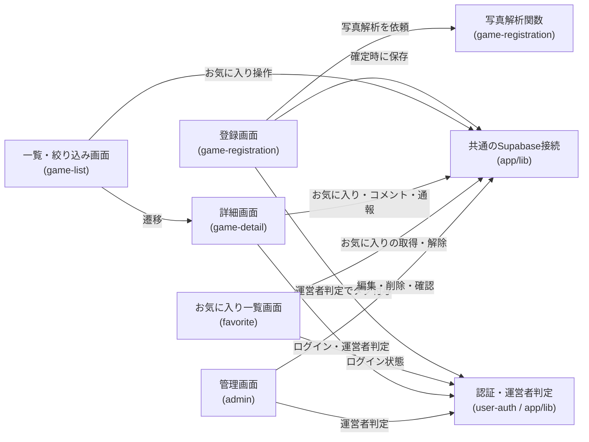
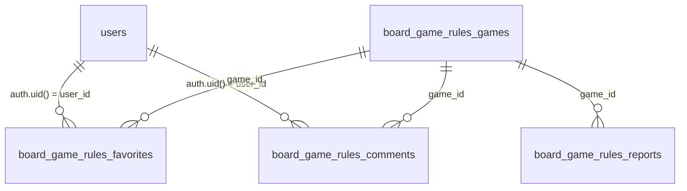

# アーキテクチャ: board-game-rules

## 1. 概要
誰でもボードゲームのルールブックを撮影して登録でき、プレイ人数・時間・ジャンルなど複数の分類で絞り込んで探し、ルール(簡単版・詳しい版)を確認できるアプリ。URL: `/board-game-rules`

## 2. アーキテクチャの目的
- 手入力の手間をなくし「写真を撮るだけ」で登録できる体験を、ライブ(その場で解析→プレビュー→確定)で成立させる
- 匿名の誰でも投稿できる公開サービスとしての気軽さと、コンテンツ品質・費用・著作権のリスク管理(即時公開+事後モデレーション+ボット対策)を両立させる
- ルール本文を共通の章立てで構造化し、将来、章単位での全ゲーム横断分析・分類に使えるデータ資産にする

## 3. 設計方針
- このアプリは、サイトで初めて**ランタイムのサーバー機能(写真解析用のCloudflare Workers関数)**を持つ。静的配信自体は維持し、LLM呼び出し(APIキー保持)だけをこの1関数に閉じ込める(根拠: [ADR-0007](../../docs/adr/0007-runtime-llm-server-and-writable-admin.md))。既存アプリ(ai-dev-digest)のLLM処理がGitHub Actionsのオフラインバッチだったのと異なり、投稿者がその場で結果を確認する必要があるため
- ルール本文は説明書原文の逐語転載を避け、独自の言い回しで再構成する。「詳しい版」は数値・条件・例外を省略・改変しない「精密な言い換え」とし、要約的な性質を保ちつつ実用精度を確保する(根拠: [game-registration/requirements.md#ルール本文の著作権への配慮](game-registration/requirements.md))。原本にあたる投稿写真は一般公開せず運営者の照合用に限定保存する
- 即時公開を採用し、品質・不適切投稿への対応は事後モデレーション(管理画面)と閲覧者通報で補う。承認制にしない(根拠: `/consult`での判断、[game-registration/requirements.md#公開ポリシー](game-registration/requirements.md))
- 管理画面は既存の読み取り専用テンプレート([ADR-0006](../../docs/adr/0006-admin-screen-oidc-rls.md))の例外として、モデレーションのための書き込み(編集・削除)を認める(根拠: [ADR-0007](../../docs/adr/0007-runtime-llm-server-and-writable-admin.md))
- ログイン(Google OIDC)は、お気に入り・コメントという利用者本人のデータ機能のために導入する。既存の`ai-dev-digest/bookmark`の「本人の行のみRLSで操作可」パターンを踏襲する。閲覧・登録・通報はログイン不要

## 4. システム構成図
```mermaid
flowchart TD
    visitor["訪問者のブラウザ(未ログイン)"]
    userVisitor["利用者のブラウザ(ログイン済み)"]
    cf["Cloudflare Workers(静的配信)"]
    list["/board-game-rules<br>一覧・絞り込み"]
    detail["/board-game-rules/detail?id=…<br>詳細・ルール・コメント・通報"]
    register["/board-game-rules/register<br>写真投稿・プレビュー・確定"]
    favList["/board-game-rules/favorites<br>お気に入り一覧"]
    admin["/board-game-rules/admin<br>モデレーション"]
    analyzeFn["Cloudflare Workers関数<br>写真解析・Web検索(LLM)"]
    llm["Anthropic API(画像入力+Web検索)"]
    turnstile["Cloudflare Turnstile<br>ボット判定"]
    auth["Supabase Auth<br>(Google OIDC)"]
    gamesDb[("Supabase<br>board_game_rules_games")]
    photosDb[("Supabase Storage<br>投稿写真(非公開)")]
    favDb[("Supabase<br>board_game_rules_favorites")]
    commentDb[("Supabase<br>board_game_rules_comments")]
    reportDb[("Supabase<br>board_game_rules_reports")]

    visitor -->|ページ取得| cf
    userVisitor -->|ページ取得| cf
    cf --> list
    cf --> detail
    cf --> register
    cf --> favList
    cf --> admin
    register -->|ボット判定| turnstile
    register -->|写真を送信し解析を依頼| analyzeFn
    analyzeFn -->|画像解析・不明項目のWeb検索| llm
    analyzeFn -->|解析結果を返す(未保存)| register
    register -->|確定時にゲーム情報を保存| gamesDb
    register -->|確定時に元写真を保存(非公開)| photosDb
    userVisitor -->|Googleでログイン(利用者全員)| auth
    list -->|お気に入り登録・解除(本人の行のみ、RLS)| favDb
    detail -->|お気に入り登録・解除(本人の行のみ、RLS)| favDb
    favList -->|自分のお気に入りを取得・解除(本人の行のみ、RLS)| favDb
    detail -->|コメント投稿・編集・削除(本人/運営者、RLS)| commentDb
    detail -->|通報を送信(匿名可)| reportDb
    admin -->|運営者判定| auth
    admin -->|ゲームの編集・削除(運営者のみ、RLS)| gamesDb
    admin -->|元写真の照合閲覧(運営者のみ、RLS)| photosDb
    admin -->|通報の確認(運営者のみ、RLS)| reportDb
    admin -->|コメントの削除(運営者のみ、RLS)| commentDb
```

この図の正となる文章は下記「[5. アーキテクチャ概要](#5-アーキテクチャ概要)」と各specのrequirements.md/design.md。このアプリから見た構成のみを描いており、プロジェクト共通インフラの詳細は[docs/architecture/](../../docs/architecture/infrastructure.md)を参照。画面URL・テーブル名・Storageは設計([/design](../../.claude/skills/design/SKILL.md))で確定済み(詳細画面は静的エクスポート制約によりクエリ方式 `/board-game-rules/detail?id=…`。テーブルは `board_game_rules_games`/`_favorites`/`_comments`/`_reports`、元写真は非公開Storageバケット)。

## 5. アーキテクチャ概要
Next.jsの静的エクスポートをCloudflare Workersで配信する構成は他アプリと同じ。ただし本アプリは、投稿された写真をLLMで解析しルール(簡単版・詳しい版)と分類情報を生成する処理のため、サイトで初めてランタイムのサーバー関数(Cloudflare Workers関数)を持つ([game-registration](game-registration/requirements.md)、[ADR-0007](../../docs/adr/0007-runtime-llm-server-and-writable-admin.md))。投稿者は`/board-game-rules/register`で写真をアップロードし(Cloudflare Turnstileでボット判定)、サーバー関数がAnthropic APIによる画像解析と不明項目のWeb検索補完を行い、結果を未保存のままプレビューに返す。投稿者が内容を確認・修正して確定すると、ゲーム情報がDBに、元写真は非公開ストレージに保存され、即座に一覧・検索の対象になる。

訪問者は一覧・絞り込み([game-list](game-list/requirements.md))と詳細([game-detail](game-detail/requirements.md))を未ログインで閲覧でき、ルールは簡単版・詳しい版のタブで確認できる。ログイン(Google OIDC、利用者全員が対象)した利用者は、お気に入りの登録・一覧([favorite](favorite/requirements.md))と、ゲームごとのコメント投稿([comment](comment/requirements.md))ができる。内容に問題があれば誰でも通報でき([report](report/requirements.md))、運営者は管理画面([admin](admin/requirements.md))でゲームの編集・削除、通報の確認、コメントの削除、元写真の照合閲覧を行う。管理画面は既存の読み取り専用テンプレート([ADR-0006](../../docs/adr/0006-admin-screen-oidc-rls.md))の例外として書き込みを認める([ADR-0007](../../docs/adr/0007-runtime-llm-server-and-writable-admin.md))。

## 6. 採用技術
| 技術 | 用途 |
|---|---|
| Next.js(静的エクスポート) | 一覧・詳細・登録・お気に入り一覧・管理の各画面の描画 |
| Cloudflare Workers関数 | 写真解析・Web検索のためのLLM呼び出し(APIキー保持)。本アプリで初導入 |
| Anthropic API | ルールブック写真の画像解析、不明項目のWeb検索による補完 |
| Cloudflare Turnstile | 匿名投稿フォームのボット対策 |
| Supabase | ゲーム情報・お気に入り・コメント・通報の保存、投稿写真の非公開保存 |
| Supabase Auth(Google OIDC) | 利用者ログイン(お気に入り・コメント)、運営者判定(管理画面・運営者登録タグ) |
| Tailwind CSS | スタイリング |

選定理由はプロジェクト横断のため[関連ADR](#11-関連adr)を参照。

## 7. 機能マップ
| spec | 役割 | 依存 |
|---|---|---|
| [user-auth](user-auth/requirements.md) | Google OIDCによる任意ログイン基盤・運営者判定を提供する | [docs/adr/0006](../../docs/adr/0006-admin-screen-oidc-rls.md)を踏襲 |
| [favorite](favorite/requirements.md) | ログイン利用者がゲームをお気に入り登録し一覧で振り返る | user-authのログイン状態、game-registrationのゲームID |
| [game-registration](game-registration/requirements.md) | 写真をLLM解析しルール・分類情報を生成、プレビュー確認後に登録する | user-authの運営者判定、ADR-0007のサーバー関数、game-list/game-detailへ登録内容を供給 |
| [game-list](game-list/requirements.md) | 登録ゲームの一覧表示と複数分類での絞り込み(アプリのトップ) | game-registrationの登録内容、game-detailへ遷移、favoriteのお気に入り操作 |
| [game-detail](game-detail/requirements.md) | 1ゲームの分類情報・ルール(2タブ)・コメント・通報導線を表示 | game-registrationの登録内容、favorite/comment/reportの各機能 |
| [comment](comment/requirements.md) | ゲームごとの助け合いコメント(ログイン利用者が複数投稿可) | user-authのログイン・運営者判定、game-detailで表示 |
| [report](report/requirements.md) | 閲覧者による通報(匿名可)。自動非表示にせず運営者判断を挟む | game-detailの通報導線、adminで確認・対応 |
| [admin](admin/requirements.md) | 運営者のモデレーション(編集・削除・通報確認・写真照合・コメント削除) | user-authの運営者判定、game-registration/report/commentの各データ、ADR-0006/0007 |

## 8. コンポーネント図


この図の正となる文章は「[7. 機能マップ](#7-機能マップ)」の依存列と、各specのrequirements.mdの依存関係。

## 9. ディレクトリ構成
CLAUDE.mdの一般規約(`components/`,`lib/`)に従う。ただし写真解析用のサーバー関数はNext.jsの静的アプリの一部ではないため、`app/board-game-rules/`配下ではなく`worker/`配下に置く([game-registration/design.md](game-registration/design.md)で確定)。`wrangler.toml`に`main`(Workerエントリ)と`[assets]`の`binding`を追加し、静的配信を維持したままWorkers関数を同居させる(Workerは`/board-game-rules`の解析APIパスのみ処理し、他はすべて静的アセットへフォールバック)。

## 10. 外部サービス
| サービス | 用途 |
|---|---|
| Supabase(`board_game_rules_games`テーブル) | ゲームの分類情報・ルール本文(簡単版・詳しい版)の保存 |
| Supabase Storage(投稿写真、非公開) | 投稿された元写真の保存(運営者のみ照合用に閲覧) |
| Supabase(`board_game_rules_favorites`テーブル) | ログイン利用者本人のお気に入りの保存 |
| Supabase(`board_game_rules_comments`テーブル) | ゲームごとのコメントの保存 |
| Supabase(`board_game_rules_reports`テーブル) | 通報の保存(匿名) |
| Supabase Auth(Google OIDC) | 利用者ログイン・運営者判定 |
| Cloudflare Workers関数 | 写真解析・Web検索用のLLM呼び出し基盤 |
| Anthropic API | ルールブック写真の画像解析・Web検索補完 |
| Cloudflare Turnstile | 投稿フォームのボット対策 |

テーブルが複数あり`auth.users`とのリレーションも生まれるため、ER図を置く。各カラムの正となる文章は各specのdesign.md「データベース設計」。テーブル名・カラムは設計で確定済み(`board_game_rules_games`は運営者の論理削除用に`deleted_at`を持つ。コメントは公開表示のため`author_name`を非正規化保存)。



`board_game_rules_reports`は匿名通報のため`auth.users`とのリレーションを持たない。投稿写真はStorageに置き、`board_game_rules_games`のレコードから参照する(詳細は設計で確定)。

## 11. 関連ADR
- [0001-user-input-database.md](../../docs/adr/0001-user-input-database.md) — 全アプリ共通のDB/BaaS選定(Supabase・RLS)
- [0006-admin-screen-oidc-rls.md](../../docs/adr/0006-admin-screen-oidc-rls.md) — 認証付き管理画面のGoogle OIDC/RLS方針・全アプリ共通テンプレート
- [0007-runtime-llm-server-and-writable-admin.md](../../docs/adr/0007-runtime-llm-server-and-writable-admin.md) — 本アプリのためのランタイムLLMサーバー関数追加と、管理画面の書き込み権限の例外

## 12. セキュリティ
- 写真解析用サーバー関数がAnthropic APIキーを保持する。キーはWrangler Secretsで管理し、ブラウザに露出させない。関数はTurnstile検証済みリクエストのみ処理し、匿名投稿によるコスト攻撃を抑える(詳細は[game-registration/design.md](game-registration/design.md)で確定)
- 投稿写真は機微になりうる原本のため一般公開せず、Storage側のアクセス制御で運営者のみ閲覧可能にする([admin/requirements.md](admin/requirements.md))
- お気に入り・コメントは本人の行のみRLSで操作可能とし、コメント削除のみ運営者判定で例外的に許可する。管理画面の書き込み(編集・削除)は運営者判定+RLSで担保する
- 機微情報・利用者投稿の保存経路が新設されるため、[specs/legal/requirements.md](../legal/requirements.md)のプライバシーポリシー・利用規約の更新要否を確認する

## 13. 技術的制約
- 静的配信を維持したまま、サーバー機能は写真解析関数1つに限定する(モデレーション用の別サーバーは新設せず、DB操作はRLS経由で行う。[admin/requirements.md#非機能要件](admin/requirements.md))

## 14. 用語集
- **簡単版 / 詳しい版**: ルール本文の2つの版。簡単版は要点のみの要約、詳しい版は共通の章立てに沿った詳細な独自解説(数値・条件・例外は省略・改変しない精密な言い換え)
- **運営者登録タグ**: 運営者本人がログイン中に登録したゲームに付与されるタグ。絞り込み項目の一つ
- **精密な言い換え**: 原文の言い回しは使わず独自の文章にしつつ、ルールの実質的な中身(数値・条件・例外)は一切変えない書き換え方
