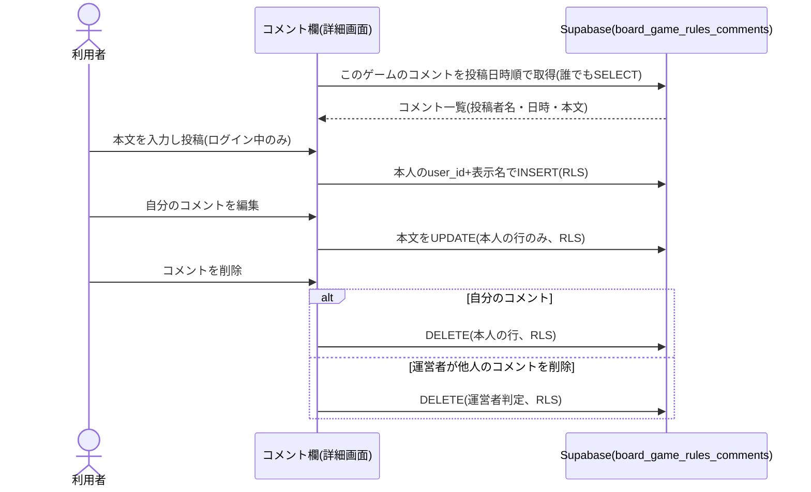

# 設計: コメント(ゲームごとの助け合い)

ゲーム詳細画面([game-detail/design.md](../game-detail/design.md))に表示するコメント欄。閲覧は誰でも(未ログイン・anon含む)可、投稿・編集は本人のみ、削除は本人+運営者。ログイン基盤は[user-auth/design.md](../user-auth/design.md)、運営者判定は`isAuthorizedAdmin`を使う。コメントは公開表示のため、投稿者名(表示名)を投稿時に非正規化して保存する(anonは`auth.users`を読めないため、表示名を都度引けない)。

## 処理フロー



### コメント一覧を取得して表示する処理
- 対象: 詳細画面を開いた時点の対象ゲーム
- 手順:
  1. 対象ゲームのコメントを、投稿日時の**昇順(古い順)**で取得すると確定する(古い順に読み進めやすいため。requirements.md#コメントの表示-4が設計に委ねた並び順をここで確定)。閲覧はログイン不要(requirements.md#コメントの表示-1〜4)
  2. 各コメントに、投稿者を示す表示(保存された表示名)・投稿日時・本文を表示する(requirements.md#コメントの表示-2)
  3. ログイン中の場合、自分のコメントには編集・削除操作、運営者の場合は任意のコメントに削除操作を出す(表示の出し分けは案内用。実際の権限はRLSで担保。後述セキュリティ)
  4. 取得に失敗した場合は、コメント欄にエラーが分かる表示をする(詳細ページ本体の表示は妨げない。後述エラーハンドリング)
- 関連するビジネスルール: requirements.md#コメントの表示、requirements.md#権限-1

### コメントを投稿する処理
- 対象: ログイン中の利用者による投稿
- 手順:
  1. 未ログインには投稿操作を表示しないか、押下でログインを促す(requirements.md#コメントの投稿-8)
  2. 本文をトリムした結果が空文字・空白のみの場合は投稿しない(送信操作を無効化。requirements.md#コメントの投稿-6)
  3. 本文が文字数上限(2000文字。後述バリデーション)を超える場合は投稿しない(入力欄の`maxLength`+トリム検証。DB側でもCHECK制約で担保。後述セキュリティ)
  4. 本文を、ログイン中の本人のuser_idと、セッションから得た表示名(アカウント名)とともにINSERTする。1ゲームに複数件投稿できる(件数上限なし。requirements.md#コメントの投稿-5)
  5. 成功したらコメント一覧へ反映し、入力欄を空にする。失敗したら入力内容を保持し失敗が分かる表示をする
- 補足(表示名): 表示名はログインセッションのユーザー情報(Google OIDCの氏名等)から取得し、投稿時に`author_name`として保存する。以降の表示はこの保存値を使う(anonが`auth.users`を読めないため、公開表示のコメントでは表示名を非正規化して持つ)
- 補足(実名公開の周知): Google OIDCの表示名は実名の可能性が高く、それが誰でも閲覧できるコメント欄に公開される。利用者が意図せず実名を公開しないよう、投稿フォームに「この名前(=実際に保存・公開される表示名)で公開されます」と、公開される表示名そのものを明示してから投稿させる(requirements.md#コメントの投稿-8)。表示名の変更・仮名化はスコープ外だが、投稿時点で何が公開されるかは必ず見せる
- 関連するビジネスルール: requirements.md#コメントの投稿、requirements.md#権限-1

### コメントを編集する処理
- 対象: 投稿者本人の自分のコメント
- 手順:
  1. 「編集」操作でその場に本文の入力欄を開き、保存済み本文を初期値にする
  2. 投稿時と同じ検証(空・空白のみ不可、文字数上限)を行う
  3. 該当の1行の本文をUPDATEする(新規行は作らない)。編集できるのは投稿者本人のみ(運営者でも他人のコメントは編集しない。requirements.md#コメントの編集・削除-10)
  4. 成功したら入力欄を閉じ更新後の本文を表示、失敗したら入力欄を開いたまま失敗表示(入力は保持)
- 関連するビジネスルール: requirements.md#コメントの編集・削除-9、requirements.md#権限-2

### コメントを削除する処理
- 対象: 投稿者本人の自分のコメント、または運営者による任意のコメント
- 手順:
  1. 「削除」操作で該当コメントをDELETEする。本人は自分のコメント、運営者は任意のコメントを削除できる(requirements.md#コメントの編集・削除-9〜10)
  2. 成功したら一覧から取り除く。失敗したら残したまま失敗表示
- 補足: 運営者は削除のみ可能で編集はできない(他人の発言を書き換えないため。requirements.md#コメントの編集・削除-10)。実際の削除可否はRLSで担保する
- 関連するビジネスルール: requirements.md#コメントの編集・削除-9〜11、requirements.md#権限-2〜3

## バリデーション
- 本文はトリム後の空文字・空白のみを不可とする(requirements.md#コメントの投稿-6)
- 本文の文字数上限は**2000文字**に確定する(requirements.md#コメントの投稿-7が設計に委ねた値をここで確定。根拠: コメントはルールの誤りの指摘・補足や遊び方のコツの共有といった短い助け合い用途で、長文の記事投稿は想定しない。長文共有はスコープ外)。入力欄の`maxLength`+トリム検証に加え、DB側でもCHECK制約(`char_length(body) <= 2000`)で担保する(画面側の制限だけに頼らない。理由は後述セキュリティ)

## エラーハンドリング
- コメント一覧の取得失敗は、コメント欄にエラーが分かる表示をする(詳細ページ本体は妨げない)。お気に入りのように握りつぶさないのは、コメントが助け合いの主要素で、表示されないと投稿の重複や誤解を招くため
- 投稿・編集・削除は利用者が明示的に指示した操作のため、失敗時は失敗が分かる定型表示をする(Supabaseの生エラーは画面に出さない)。処理中は該当操作を無効化し二重実行を防ぐ

## 関連するファイル(抜粋)
```
app/board-game-rules/lib/comments.ts (新規: fetchComments / createComment / updateComment / deleteComment)
app/board-game-rules/components/CommentSection.tsx (新規: コメント欄本体。一覧取得・投稿フォーム・権限に応じた操作の出し分け)
app/board-game-rules/components/CommentItem.tsx (新規: 1コメントの表示・編集・削除)
app/lib/adminAuth.ts (既存: getSession/onAuthChange と、運営者削除の判定に isAuthorizedAdmin を利用)
app/lib/supabaseClient.ts (既存の共通クライアントを利用)
app/legal/page.tsx (既存: プライバシーポリシーにコメント(氏名を含む表示名・本文)の公開保存について追記)
```

## データベース設計

### board_game_rules_comments(新規)
| カラム | 型 | 補足 |
|---|---|---|
| id | uuid, primary key, default gen_random_uuid() | コメントID |
| game_id | uuid, not null, references board_game_rules_games(id) | 対象ゲーム |
| user_id | uuid, not null, references auth.users(id) | 投稿者本人 |
| author_name | text, not null | 投稿時の表示名(公開表示用に非正規化)。anonが`auth.users`を読めないため保存する |
| body | text, not null, check (char_length(body) <= 2000) | 本文(文字数上限2000。根拠は「バリデーション」参照。DB側でもCHECK) |
| created_at | timestamptz, not null, default now() | 投稿日時。一覧の並び順に使う |
| updated_at | timestamptz, not null, default now() | 最終編集日時(UPDATE時にアプリが現在時刻をセット。DBトリガーは使わずシンプルに保つ) |

### マイグレーション(実装より先に単独PRで適用)
前提: `game_id`の参照先`board_game_rules_games`([game-registration](../game-registration/design.md))と、運営者DELETEポリシーが参照する共用の`admin_emails`(`ikukyu/admin`で作成済み。本アプリでは新規作成しない)が、適用時点で存在していること([tasks.md#T0](tasks.md))。

```sql
create table board_game_rules_comments (
  id uuid primary key default gen_random_uuid(),
  game_id uuid not null references board_game_rules_games(id),
  user_id uuid not null references auth.users(id),
  author_name text not null,
  body text not null check (char_length(body) <= 2000), -- 上限2000(助け合いの短文用途。design.md「バリデーション」参照)
  created_at timestamptz not null default now(),
  updated_at timestamptz not null default now()
);
alter table board_game_rules_comments enable row level security;

-- 閲覧: 誰でも(anon含む)SELECTできる(公開コメント)
grant select on board_game_rules_comments to anon, authenticated;
create policy "anyone can select comments" on board_game_rules_comments
  for select to anon, authenticated using (true);

-- 投稿: ログイン中の本人のuser_idでのみINSERTできる
grant insert on board_game_rules_comments to authenticated;
create policy "user can insert own comment" on board_game_rules_comments
  for insert to authenticated with check (auth.uid() = user_id);

-- 編集: 投稿者本人のみUPDATEできる(運営者でも他人のコメントは編集不可)
grant update on board_game_rules_comments to authenticated;
create policy "user can update own comment" on board_game_rules_comments
  for update to authenticated using (auth.uid() = user_id) with check (auth.uid() = user_id);

-- 削除: 投稿者本人、または運営者本人がDELETEできる
grant delete on board_game_rules_comments to authenticated;
create policy "user or admin can delete comment" on board_game_rules_comments
  for delete to authenticated using (
    auth.uid() = user_id
    or (auth.jwt() ->> 'email') in (select email from admin_emails)
  );

-- benriyatool_readonly はSELECTのみ(docs/adr/0004)
grant select on board_game_rules_comments to benriyatool_readonly;
create policy "benriyatool_readonly can select comments" on board_game_rules_comments
  for select to benriyatool_readonly using (true);
```

T0(マイグレーション適用)の実機確認:
- 誰でも(anon含む)コメントをSELECTできること
- ログイン中の本人のuser_idでのみINSERTでき、他人のuser_idを詐称したINSERTが拒否されること
- 投稿者本人のみUPDATEでき、他人(運営者含む)のUPDATEが拒否されること
- 投稿者本人と運営者がDELETEでき、無関係のログインユーザーのDELETEが拒否されること
- `body`が上限を超える行がCHECK制約で拒否されること

## 画面設計
- ゲーム詳細画面のコメント欄(`CommentSection`)に、コメント一覧(投稿日時順)と投稿フォームを表示する
- 各コメント(`CommentItem`): 投稿者の表示名・投稿日時・本文。ログイン中の本人には「編集」「削除」、運営者には「削除」を表示する
- 投稿フォーム: ログイン中のみ表示する。未ログインには投稿操作を出さないか、押下でログインを促す。本文が空・空白のみ・上限超過では送信を無効化する。投稿ボタン付近に、公開される表示名(実際に保存されるアカウント名)を明示し、「この名前で公開されます」と分かるようにする(実名公開の予期せぬ露出を防ぐ)

## 状態管理
- `CommentSection`は「コメント一覧」「取得状態(読み込み中/表示中/取得エラー)」「ログインセッション」「運営者判定の結果」をローカル状態として持つ
- `CommentItem`は「表示中」「編集中」「処理中(投稿/編集/削除の実行中)」を持つ

## セキュリティ
- 実際のアクセス制御はDB側のRLSで担保する。編集は投稿者本人のみ、削除は本人+運営者。画面側の操作の出し分けは案内用で、突破されても権限のない書き込みはできない(requirements.md#権限-2、方針は[docs/adr/0001](../../../docs/adr/0001-user-input-database.md))
- コメント本文・表示名は、表示時にHTMLとして解釈しない形で描画する(`dangerouslySetInnerHTML`を使わない)。投稿は誰でもできるため、悪意ある入力を前提に必ずエスケープ描画する
- 本文の文字数上限は画面側(`maxLength`+トリム)に加えDB側のCHECK制約でも担保する。コメント投稿はGoogleアカウントを持つ利用者全員に開放するため、開発者ツール等で直接巨大な文字列をINSERTされるとSupabaseの共通無料枠を消費しうる。1件あたりの上限をDB側でも防御的に持つ([bookmark/design.md#セキュリティ](../../ai-dev-digest/bookmark/design.md)と同じ考え方)
- 表示名は投稿時のセッション由来の値を保存する。任意の表示名をブラウザから詐称してINSERTする余地はあるが、`user_id`はRLSで本人に固定されるため、なりすまし投稿(他人のuser_idでの投稿)はできない。表示名の見た目の詐称は運営者が[admin](../admin/requirements.md)で削除できる範囲の運用リスクとして扱う
- データ保護(個人情報): 公開される表示名はGoogle OIDC由来で実名になりうる。投稿フォームで公開される表示名を明示し(上記「画面設計」)、利用者が認識したうえで投稿できるようにする。あわせて、氏名を含む表示名・本文を公開保存する旨を[specs/legal/requirements.md](../../legal/requirements.md)のプライバシーポリシーに追記する(user-auth・favoriteと合わせて確認)
- 運営者による削除は運営者判定(`isAuthorizedAdmin`相当)を用いる。判定の問い合わせに失敗した場合は運営者ではないものとして扱い(削除操作を出さない)、本人としての操作のみ可能にする

## ログ
- コメント一覧・投稿・編集・削除の失敗は、原因究明のためコンソールにエラーを出す(画面には定型表示、または取得失敗の表示)。本文の中身はログに含めず、失敗の事実・種別にとどめる。成功時はログを出さない

## 依存関係
- コメント対象ゲームの識別子は[game-registration/design.md](../game-registration/design.md)の`board_game_rules_games.id`に従う
- コメント欄は[game-detail/design.md](../game-detail/design.md)で表示される
- ログイン状態・運営者判定は[user-auth/design.md](../user-auth/design.md)に従う
- プライバシーポリシーの更新要否(氏名を含む表示名・本文の公開保存)は[user-auth](../user-auth/requirements.md)・[favorite](../favorite/requirements.md)と合わせて確認する
