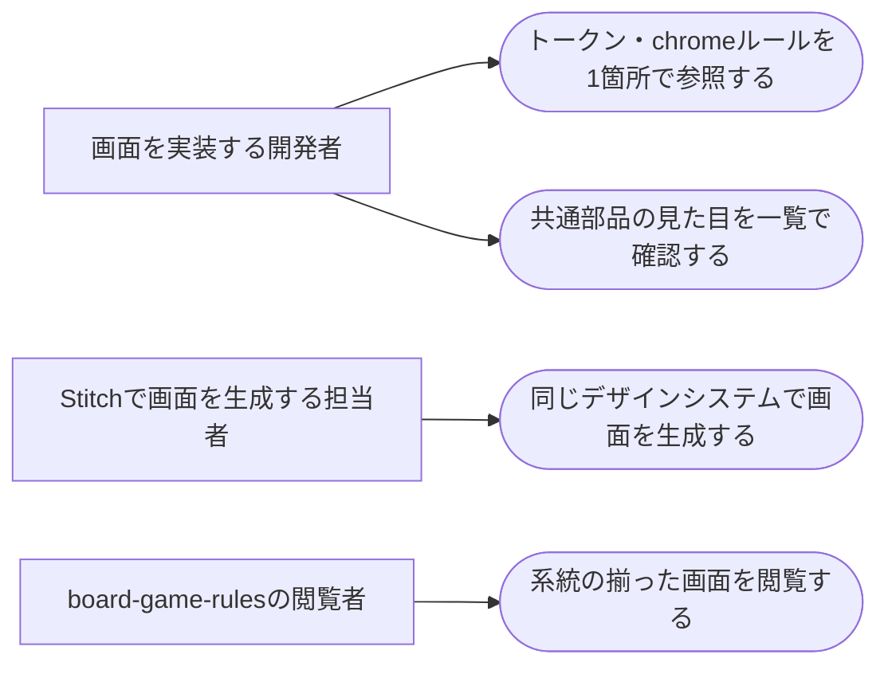

# 要件定義: board-game-rules デザインシステム

> ステータス: 仕様確認中(未実装)

## サマリ
board-game-rules(ボドゲのトリセツ)のアプリ内で、今後追加する画面の見た目の系統を揃えるための「per-appデザインシステム」を立ち上げる。既に確定済みの配色・フォント「Analog Hearth」と共通ナビ(BoardGameNav)を、**アプリ直下の `specs/board-game-rules/DESIGN.md` を唯一の真実の源(トークン+chromeルールの一元管理)**として整理し、共通部品を一覧できる `app/board-game-rules/_styleguide/page.tsx`(＋同居 `styleguide.png`)を新設する。あわせて DESIGN.md を Stitch にも反映し、以後の画面生成で同じデザインシステムを使い回せる運用感を検証する(このアプリを試金石に、DESIGN.md一元管理を全アプリの恒久ルールにするか判断する材料にする)。今回のスコープは基盤整備に限り、既存 register/favorites の見た目・構造は変えない。方針の全体像は[PR #207](https://github.com/zakiyama0108/benriyatool/pull/207)と[architecture.md](../architecture.md)を土台とする。

このspecの利用者と主なユースケースは下記「[ユースケース図](#ユースケース図)」を参照。

## 概要
- 機能名: board-game-rules デザインシステム
- 目的: 今後 board-game-rules に追加する画面(game-list / game-detail / comment / report など未実装分)が、配色・フォント・角丸・共通chrome(ヘッダー/ナビ等の枠)の系統をぶらさず一貫した見た目になるための土台(トークン+chromeルール+共通部品カタログ)を整える。あわせて DESIGN.md 一元管理 + Stitch連携の運用感を検証し、A工程(全アプリ恒久化)の判断材料を得る
- 優先度: 中

## ユーザーストーリー
- board-game-rules の画面を実装する開発者として、配色・フォント・角丸・共通chromeのルールが1箇所(DESIGN.md)にまとまっていて、新しい画面でも同じトークン・同じ枠を迷わず使いたい
- board-game-rules の画面を実装する開発者として、アプリの共通部品(ナビ・ボタン・カード・フォーム部品など)の見た目を、`npm run dev` を起動しなくても一覧(styleguideページのキャプチャ)で確認したい
- Stitch で新しい画面イメージを生成する担当者として、毎回同じデザインシステム(Analog Hearth)を渡して、chrome やトークンがズレない生成結果を得たい
- board-game-rules の閲覧者として、アプリ内のどの画面に移動しても配色・レイアウトの系統が揃っていて、同じサービスだと自然に感じられる状態でありたい(開発者向け基盤が結果として届ける価値)

## ユースケース図

この図の正となる文章は上記「[ユーザーストーリー](#ユーザーストーリー)」と下記「[機能要件](#機能要件)」。図はアクターとできることの俯瞰用。

## 機能要件

### DESIGN.md(トークン+chromeルールの一元管理)
- [1] アプリ直下 `specs/board-game-rules/DESIGN.md` に、このアプリのデザイントークン(配色・フォント・角丸・階層表現の方針)と共通chromeのルール(枠として何を持つか・どこがコード側の真実の源か)を1箇所にまとめて記載する
- [2] DESIGN.md は、現在 [game-registration/design.md](../game-registration/design.md) や [app/globals.css](../../../app/globals.css) に散在しているトークンの記述を集約した「唯一の真実の源」とし、各 design.md からは値を書き写さず DESIGN.md を参照する形に付け替える(値の重複管理をなくす)
- [3] コード側の実トークン定義([app/globals.css](../../../app/globals.css) の `@theme` の `bgr-*`)と DESIGN.md の記載値が一致していること(片方だけ更新されてズレない運用にする)

### 共通部品カタログ(styleguideページ)
- [4] `app/board-game-rules/_styleguide/page.tsx` に、このアプリの共通部品(共通ナビ、ボタン、カード、フォーム部品、パンくず等の代表的な見た目)を並べて一覧確認できるページを用意する
- [5] `npm run dev` を起動しなくても見られるよう、同ディレクトリに `styleguide.png`(キャプチャ)を同居させる
- [6] styleguideページは既存の共通部品の見た目を写す「カタログ」であり、新しいデザインや新しい共通部品をこのページのために作り起こさない(既に確定・実装済みの Analog Hearth の見た目を土台にする)

### Stitch連携(DESIGN.md一元管理の検証)
- [7] DESIGN.md の内容を Stitch に反映し、以後の画面生成で board-game-rules 用の同じデザインシステムを使い回せる状態にする(具体的なツール手順は設計・実装で確定する)
- [8] Stitch側のデザインシステムとリポジトリの DESIGN.md が同じ内容(Analog Hearth)で同居している状態にし、この運用が回るかを検証する。検証で分かった利点・難点は、A工程(DESIGN.md一元管理を全アプリの恒久ルールにするか)の判断材料として残す

## ビジネスルール・制約

### デザインシステムの土台(Analog Hearth)
- [1] トークンの確定値は既存の Analog Hearth を踏襲し、新たに配色・フォントを作り直さない(根拠: Stitchプロジェクト `10756296516233709248` で確定済み。[game-registration/design.md#デザイントークンanalog-hearth](../game-registration/design.md)・[app/globals.css](../../../app/globals.css) に実装済み。今回は「作り直し」ではなく「一元管理への整理」が目的)
- [2] 影を使わず、トーン差+1px罫線(縁線 `bgr-line`)で階層を表現する方針を維持する(根拠: 確定済みの Analog Hearth の意匠)

### 共通chromeとトークンの分離(PR #207のルール)
- [3] 共通chrome(ヘッダー/フッター/ナビ等、全画面共通の枠)はコード側の共通コンポーネントを真実の源とし、Stitch生成のたびに描き直させない(根拠: [PR #207](https://github.com/zakiyama0108/benriyatool/pull/207)で明文化した運用ルール)
- [4] 配色・フォント・角丸などのトークンはアプリ単位で1つのデザインシステムにまとめ、サイト共通で1つにはしない(アプリごとに chrome・配色が異なるため。根拠: PR #207)
- [5] 共通部品(chrome や styleguideページに並べた部品)を変更したら、同じコミットで `styleguide.png` を撮り直す(古い画像が実装と食い違ったまま残らないように。根拠: PR #207で [/implementation](../../../.claude/skills/implementation/SKILL.md) に追記済みの運用)

### 真実の源の優先順位
- [6] トークンの値が DESIGN.md とコード([app/globals.css](../../../app/globals.css))で食い違った場合、コードの実装値を正とし、DESIGN.md を実装に合わせて直す(利用者に実際に届くのはコードの値であるため)。ただし [6-3] のとおり両者は常に一致させる運用を前提とする

## スコープ外(今回やらないこと)
- 既存 register / favorites 画面の見た目・レイアウト・構造の変更(今回は基盤整備のみ。共通chromeの抽出・既存画面の載せ替えは今回やらない)
- 未実装画面(game-list / game-detail / comment / report など)そのものの構築(それらは各specの実装時に、本デザインシステムを土台にする)
- 新しい配色・フォント・ロゴの作成(Analog Hearth を土台にするため)
- Storybook の導入(仕様変更が頻繁なため過剰。軽量な styleguideページで代替する。根拠: PR #207)
- 個別コンテンツ画面のPRごとの before/after キャプチャの自動化・コミット(完全自動化とリポジトリ非肥大の両立ができず見送り。`styleguide.png`(共通部品のみ)だけコミット対象。根拠: [project計画の保留事項](../architecture.md))

## 依存関係・非機能要件
- 確定済みのデザイントークン・ロゴ・共通ナビの意匠は [game-registration/design.md](../game-registration/design.md)・[favorite/design.md](../favorite/design.md)・[app/board-game-rules/components/BoardGameNav.tsx](../../../app/board-game-rules/components/BoardGameNav.tsx) に従う(値を書き写さず参照する)
- 共通chrome/トークンの運用ルールは [PR #207](https://github.com/zakiyama0108/benriyatool/pull/207) が反映した [/design](../../../.claude/skills/design/SKILL.md)・[/implementation](../../../.claude/skills/implementation/SKILL.md) の該当節に従う
- `_styleguide` は利用者向けの公開画面ではなく開発者向けの確認用ページのため、[hub-site](../../hub-site/requirements.md) のトップページカード追加や metadata 定義の対象外とする
