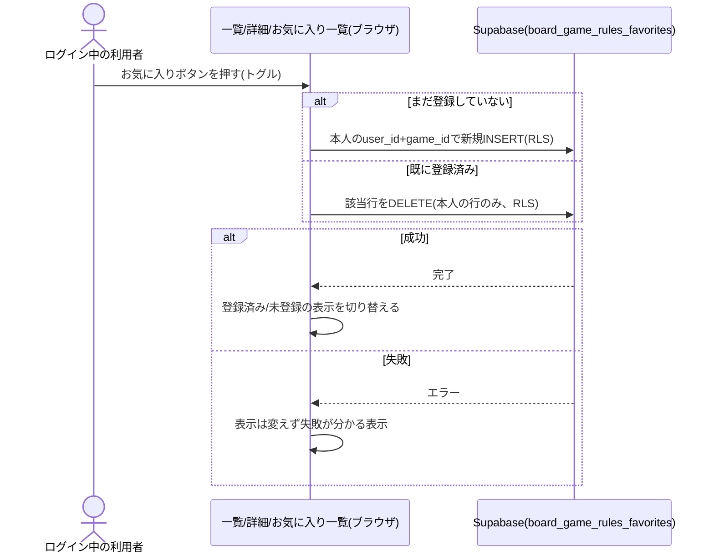
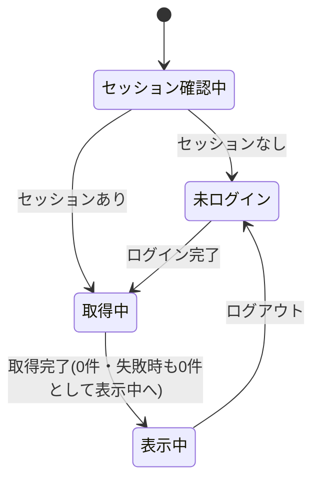

# 設計: お気に入りのボードゲーム

ログイン中の本人に紐づくデータの保存・一覧・解除は、[ai-dev-digest/bookmark/design.md](../../ai-dev-digest/bookmark/design.md)・[life-money-sim/saved-scenario/design.md](../../life-money-sim/saved-scenario/design.md)と同じRLSパターン(`auth.uid() = user_id`)を踏襲する。ログイン基盤は[user-auth/design.md](../user-auth/design.md)のGoogle OIDCを使い、運営者判定は使わない(利用者全員が対象)。お気に入りは1ゲームにつき本人1件のトグルで、メモ等は持たない(bookmarkより単純)。

## 処理フロー



### 画面内のお気に入り状態をまとめて取得する処理
- 対象: 一覧・詳細を開いた時点、およびログイン状態が変化した時点
- 手順:
  1. ログインセッションがない場合は取得しない(未ログインにはお気に入り操作を表示しない。requirements.md#お気に入りの登録・解除-2、後述「画面設計」で確定)
  2. ログインセッションがある場合、自分のお気に入り(登録済みのgame_id)を1回のまとめ取得で取得する(一覧の各ゲームごとに個別取得しない)。取得完了までは、実際は登録済みでも一律「未登録」として扱う([bookmark/design.md](../../ai-dev-digest/bookmark/design.md)と同じ考え方)
  3. 取得できたら、game_idごとに登録済みかどうかを引き当てられる状態にする
  4. 取得に失敗した場合は、すべて「未登録」として扱う(失敗を画面に伝えない。後述エラーハンドリング)
- 関連するビジネスルール: requirements.md#お気に入りの登録・解除-3、requirements.md#表示範囲・権限-1

### お気に入りを登録する処理
- 対象: お気に入りボタンを押した(未登録の)ゲーム
- 手順:
  1. 対象のgame_idを、ログイン中の本人のuser_idで新規INSERTする
  2. 成功したら、そのゲームの表示を「登録済み」に切り替える
  3. 失敗したら、表示は変えず失敗が分かる表示をする
- 関連するビジネスルール: requirements.md#お気に入りの登録・解除-1

### お気に入りを解除する処理
- 対象: お気に入りボタンを押した(登録済みの)ゲーム
- 手順:
  1. 対象のお気に入り行(本人+game_id)をDELETEする
  2. 成功したら、そのゲームの表示を「未登録」に切り替える(一覧・詳細のどこからでも解除できる。requirements.md#お気に入りの登録・解除-1)
  3. 失敗したら、表示は変えず失敗が分かる表示をする
- 関連するビジネスルール: requirements.md#お気に入りの登録・解除-1

### お気に入り一覧を取得して表示する処理
- 対象: お気に入り一覧画面を開いた時点、およびログイン状態が変化した時点
- 手順:
  1. ログインセッションがない場合、一覧は取得せずログインを促す表示のみ行う(requirements.md#お気に入り一覧-4、requirements.md#表示範囲・権限-1)
  2. ログインセッションがある場合、自分のお気に入りを、お気に入り登録日時の新しい順に取得する(requirements.md#お気に入り一覧-7)。あわせて対象ゲームの表示に必要な情報(ゲーム名・対応人数・プレイ時間・ジャンル等)を得る
  3. 対象ゲームが存在しないもの(物理削除された等)は一覧に出さない。ゲームを物理削除するとそのお気に入りはFKの`ON DELETE CASCADE`で連動削除されるため通常は残らないが、取得時もゲーム情報が得られる項目だけを表示する(存在しない詳細へのリンクを作らないため。[game-detail/design.md#運営者による物理削除の処理](../game-detail/design.md))
  4. 各項目に、ゲーム情報・詳細画面へのリンク・その場での解除操作を表示する(requirements.md#お気に入り一覧-5〜6)
  5. 取得に失敗した場合は0件として扱う(失敗を画面に伝えない。後述エラーハンドリング)
- 補足(取得方法): お気に入り行の`game_id`から対象ゲームを引く。お気に入りとゲームを結合して取得する(1回のまとめ取得)か、game_idの集合でゲームをまとめて取得する。いずれも`photo_paths`は取得しない
- 関連するビジネスルール: requirements.md#お気に入り一覧

### お気に入り一覧からの解除
- 対象: お気に入り一覧の各項目
- 手順: 上記「お気に入りを解除する処理」と同じ処理をその場(一覧画面内)で行う。詳細画面に戻らずに完結する(requirements.md#お気に入り一覧-6)
- 関連するビジネスルール: requirements.md#お気に入り一覧-6

## エラーハンドリング
- 画面内のお気に入り状態の取得、およびお気に入り一覧の取得の失敗は、画面にエラーを伝えず「未登録」または「0件」として扱う(コンソールにのみ出力。主機能である閲覧を止めないため。[bookmark/design.md](../../ai-dev-digest/bookmark/design.md)の方針を踏襲)
- 登録・解除は利用者が明示的に指示した操作のため、失敗時は失敗が分かる定型表示をする(Supabaseの生エラーは画面に出さない)。処理中は同じボタンを無効化し、二重登録・二重解除を防ぐ
- ごく稀な競合(複数タブから同じゲームを同時に初回登録)でDB側の一意制約違反が起きても、他の登録失敗と同じ定型表示にする(取り直せば足りる)

## 関連するファイル(抜粋)
```
app/board-game-rules/lib/favorites.ts (新規: fetchMyFavoriteGameIds / fetchMyFavoriteGames / addFavorite / removeFavorite)
app/board-game-rules/components/FavoriteButton.tsx (新規: 1ゲーム分のお気に入りトグル。一覧カード・詳細・お気に入り一覧から使う)
app/board-game-rules/favorites/page.tsx (新規: お気に入り一覧画面。セッション確認・一覧取得・その場解除)
app/board-game-rules/lib/games.ts (既存: ゲーム型・お気に入り対象ゲームの取得に利用)
app/lib/adminAuth.ts (既存: getSession/onAuthChange を利用。isAuthorizedAdminは使わない)
app/lib/supabaseClient.ts (既存の共通クライアントを利用)
app/legal/page.tsx (既存: プライバシーポリシーにお気に入り保存について追記する場合)
```

## データベース設計

### board_game_rules_favorites(新規)
| カラム | 型 | 補足 |
|---|---|---|
| id | uuid, primary key, default gen_random_uuid() | お気に入りID |
| user_id | uuid, not null, references auth.users(id) | お気に入り登録した本人 |
| game_id | uuid, not null, references board_game_rules_games(id) | 対象ゲーム |
| created_at | timestamptz, not null, default now() | 登録日時。一覧の並び順に使う |

- `(user_id, game_id)`の一意制約で、1ゲームにつき本人1件をDB側でも担保する(画面の「登録済み判定」だけに頼らない)

### マイグレーション(実装より先に単独PRで適用)
```sql
create table board_game_rules_favorites (
  id uuid primary key default gen_random_uuid(),
  user_id uuid not null references auth.users(id),
  game_id uuid not null references board_game_rules_games(id),
  created_at timestamptz not null default now(),
  unique (user_id, game_id)
);
alter table board_game_rules_favorites enable row level security;

-- 本人の行のみSELECT/INSERT/DELETEできる(saved-scenario/bookmarkと同じ最小権限)
grant select, insert, delete on board_game_rules_favorites to authenticated;

create policy "user can select own favorites" on board_game_rules_favorites
  for select to authenticated using (auth.uid() = user_id);

create policy "user can insert own favorites" on board_game_rules_favorites
  for insert to authenticated with check (auth.uid() = user_id);

create policy "user can delete own favorites" on board_game_rules_favorites
  for delete to authenticated using (auth.uid() = user_id);

-- benriyatool_readonly はSELECTのみ(docs/adr/0004)
grant select on board_game_rules_favorites to benriyatool_readonly;
create policy "benriyatool_readonly can select favorites" on board_game_rules_favorites
  for select to benriyatool_readonly using (true);
```

T0(マイグレーション適用)の実機確認([bookmark/design.md](../../ai-dev-digest/bookmark/design.md)と同様):
- ログイン中の本人が、自分のお気に入りのみSELECT/INSERT/DELETEできること
- 別アカウントでは他人のお気に入りが一切見えない・操作できないこと
- 未ログイン(anon)ではSELECT/INSERT/DELETEのいずれもできないこと
- 同じゲームへ2件目を登録しようとすると一意制約で拒否されること

## 画面設計

### 一覧・詳細への追加(お気に入りボタン)
- ログイン中のみ、各ゲームにお気に入りトグル(`FavoriteButton`)を表示する
- 未ログインには操作を表示しない(お気に入りはログイン利用者向け機能のため。ログイン導線は各画面の共通ヘッダー`LoginStatus`に集約する)。一覧・詳細・お気に入り一覧で挙動を統一する(requirements.md#お気に入りの登録・解除-2は「表示しない/ログイン促し」の両方を許すが、設計では「表示しない」に確定して画面間の操作感を揃える)
- 登録済み/未登録がひと目で分かる表示にする(requirements.md#お気に入りの登録・解除-3)

### お気に入り一覧画面(新規: `/board-game-rules/favorites`)
Step0で確定したビジュアルデザインに沿って定める(実装済みの素朴版UIからの作り替え。仕様承認PR #194時点ではStep0が抜けていた分の後追い)。

**確定デザインの出所**: Google Stitchプロジェクト「ボドゲのトリセツ 登録依頼フォーム」(project ID `10756296516233709248`、デザインシステム「Analog Hearth」)の画面「お気に入り一覧 (共通ナビ適用)」。生成HTML(Tailwind)を実装の参照素材とする。register画面(game-registration)のデザイン確定後、左サイドバー形式の共通ナビゲーションをboard-game-rulesアプリ全体の視覚言語として採用する方針になり、本画面にも適用した。左サイドバーは`app/board-game-rules/components/BoardGameNav.tsx`として共通コンポーネント化し、register画面(登録依頼)と共有する(register画面側への反映は[game-registration/design.md](../game-registration/design.md)「ナビゲーション」で実施済み)。配色・フォント・角丸などのトークンの定義は、アプリ共通の一元管理先 [DESIGN.md](../DESIGN.md) を参照する。

- **左サイドバー(共通ナビ)**: 上部にアプリロゴ+アプリ名のブランディングブロック、その下にナビゲーションリンク一覧(`app/board-game-rules/components/BoardGameNav.tsx`。registerと共有)。Stitch参照デザインではHome/Search/Add Game/お気に入り/Profileの5項目だが、遷移先画面が実装済みなのは「登録依頼(Add Game)」と「お気に入り」の2つのため、この2項目のみをリンクとして並べ、本画面では「お気に入り」を選択中(`aria-current="page"`)でハイライトする。Home/Search/Profileの各項目は、対応する画面の実装時に追加する
- **本文エリア**: パンくず・見出し「お気に入り」
- セッション確認中・取得中: 読み込み中の表示のみ(未ログイン/0件のどちらとも決まっていないため、どちらかへ暫定的に倒さない。[bookmark/design.md](../../ai-dev-digest/bookmark/design.md)と同じ考え方)
- 未ログイン: 一覧は出さず、ログインを促す表示とログイン操作のみ
- ログイン中0件: 「まだお気に入りがありません」の案内
- ログイン中1件以上: 登録日時の新しい順の3〜4列カードグリッド。各カードにゲーム名・対応人数・プレイ時間・ジャンルチップ・その場での解除操作(カード右上のお気に入りボタン)・詳細へのリンク(カードクリック)

## 状態管理
- `FavoriteButton`は1ゲームにつき「登録済み」「未登録」「処理中」を持つ(bookmarkの3状態より単純で、編集中の入力欄はない)
- 一覧・詳細画面は、画面内の自分のお気に入り集合(game_idの集合)をローカル状態として持ち、各`FavoriteButton`へ渡す
- お気に入り一覧画面(`favorites/page.tsx`)は「セッション確認中/未ログイン/取得中/表示中」の4状態を持つ([bookmark/design.md](../../ai-dev-digest/bookmark/design.md)の`BookmarkListView`と同じ構造。権限確認は無い)



## セキュリティ
- 実際のアクセス制御はDB側のRLS(`auth.uid() = user_id`)で担保する。画面側の出し分けは案内のためのもので、突破されても他人の行は返らない(requirements.md#表示範囲・権限-1、方針は[docs/adr/0001](../../../docs/adr/0001-user-input-database.md))
- 自分のお気に入りは本人しかSELECTできず、他の利用者・運営者(自作画面経由)から参照できない(requirements.md#自分がお気に入り登録した内容は他の利用者から見られたくない)。Supabaseダッシュボード(service_role)、および集計用の`benriyatool_readonly`ロール(横断SELECTを持つがブラウザには公開されない集計専用DBロール。docs/adr/0004)からの閲覧は、他のログイン系テーブルと同じ一般的な運用留保([bookmark/design.md](../../ai-dev-digest/bookmark/design.md)と同じ付与)
- `game_id`はブラウザから送られる値をそのまま使うが、存在しないgame_idを送っても本人の行が増えるだけで実害はない(外部キー制約で存在しないゲームへの登録は弾かれる)。お気に入り一覧表示時、対象ゲームが公開中でない場合はその項目を一覧から除外する(上記処理フロー)
- 認証ユーザーによる大量INSERTでのリソース消費([bookmark/design.md](../../ai-dev-digest/bookmark/design.md)が論じた悪用観点)は、外部キー制約(既存ゲームにしか付けられない)と`(user_id, game_id)`一意制約により1利用者あたりの行数が登録済みゲーム数に自然に上限化されるため該当しない。自由テキスト列も持たないためbookmarkのCHECK制約(文字数上限)の論点も非該当

## ログ
- 画面内お気に入り状態・お気に入り一覧の取得失敗は、原因究明のためコンソールにエラーを出す(画面には伝えない)。登録・解除の失敗も同様にコンソールへ出す(画面のエラー表示と重複するが詳細はコンソールのみ)。成功時はログを出さない([bookmark/design.md](../../ai-dev-digest/bookmark/design.md)と同方針)

## 依存関係
- お気に入り対象ゲームの識別子は[game-registration/design.md](../game-registration/design.md)の`board_game_rules_games.id`に従う。ゲーム情報の取得は`app/board-game-rules/lib/games.ts`を共有する
- ログイン状態は[user-auth/design.md](../user-auth/design.md)(`adminAuth.ts`のgetSession/onAuthChange)に従う。運営者判定は使わない
- RLSパターンは[ai-dev-digest/bookmark/design.md](../../ai-dev-digest/bookmark/design.md)・[life-money-sim/saved-scenario/design.md](../../life-money-sim/saved-scenario/design.md)を踏襲する
- プライバシーポリシーの更新要否は[user-auth](../user-auth/requirements.md)・[comment](../comment/requirements.md)と合わせて確認する
