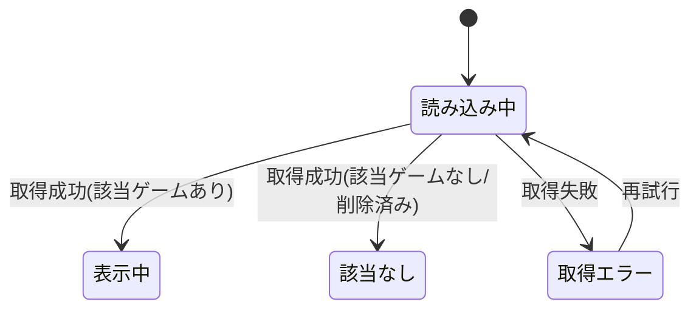

# 設計: ゲーム詳細

## サマリ
1つのゲームの分類情報・ルール本文(簡単版/詳しい版のタブ)・コメント欄・通報導線を表示する。**Step0(UIデザイン確定)の要否宣言: 必要・実施済み**(共通chrome・トークンは[DESIGN.md](../DESIGN.md)で確定済みだが、分類情報・タブ・お気に入り/通報導線・コメント欄というこの画面固有のコンテンツ構成は未確定だったため、既存のAnalog Hearthデザインシステム上でStitch画面を新規生成して確定した。詳細は下記「画面設計」参照)。データは`board_game_rules_games`から取得する。ゲーム型・共通章立ては`app/board-game-rules/lib/games.ts`・`rulesChapters.ts`を共有する。主要な設計判断は、(1)静的エクスポート制約により`/board-game-rules/detail?id=…`のクエリ方式で単一ページがブラウザから対象ゲームを取得すること(下記「詳細画面のルーティング」)、(2)お気に入り・通報の導線をタブ状態に依存しない共有コンポーネントとして1回だけ配置すること、(3)取得状態(読み込み中/表示中/該当なし/取得エラー)を明確に出し分けることの3点。ゲーム紹介画像のギャラリーは、既存の確定画面(レシピアプリ型レイアウト)における「料理写真」相当の位置(ページ最上部)に追加する新規要素で、新たなStitch画面生成は行わない(下記「画像表示」参照)。取得状態の遷移は下記「[状態管理](#状態管理)」の状態遷移図を参照。運営者(管理者)ログイン時のみ、この画面に編集・削除・紹介画像差し替え・元写真照合・コメント削除の管理者導線を表示する(下記「[運営者向けの操作(管理者ログイン時)](#運営者向けの操作管理者ログイン時)」)。削除は物理削除で、子レコードはFKカスケード削除・Storage実体は残す。

## 詳細画面のルーティング(静的エクスポート下での設計判断)
本サイトは`output: "export"`の静的エクスポートで、ゲームは**ビルド後にランタイムで登録される**ため、`/[id]`のような動的ルートを各ゲーム分だけ事前生成できない(`generateStaticParams`はビルド時に既知のパスしか出せない)。そのため詳細画面は**単一の静的ページがURLのクエリからゲームIDを受け取り、ブラウザからDBを取得する**方式にする(例: `/board-game-rules/detail?id=<ゲームID>`。具体的なパス名は実装時に確定)。一覧([game-list/design.md](../game-list/design.md))の各カードはこのクエリ付きURLへリンクする。この方式は`ai-dev-digest/[date]`(ビルド時にコンテンツが確定)とは異なり、ランタイム生成データを扱うための選択である。

## 処理フロー

### 対象ゲームを取得して表示する処理
- 対象: URLのクエリで指定されたゲームID
- 手順:
  1. URLのクエリからゲームIDを読み取る。IDが無い/不正な場合は、対象が見つからない旨を表示する
  2. そのIDのゲームを取得する(削除されたゲームはレコードが存在しないため取得できず、下記4の該当なしになる)。`photo_paths`(元写真パス)は取得しない(元写真は詳細に一切表示しない。requirements.md#表示対象-2、[game-registration/design.md#セキュリティ](../game-registration/design.md))。`intro_photo_paths`(ゲーム紹介画像、公開列)は取得する
  3. 取得できた場合、分類情報・ルール本文・コメント欄・通報導線・紹介画像ギャラリーを表示する
  4. 該当が無い(存在しない、または運営者が削除した)場合は、対象が見つからない旨を表示する(requirements.md#表示対象-1)
  5. 取得に失敗した場合は、取得に失敗した旨と再試行手段を表示する(後述エラーハンドリング)
- 関連するビジネスルール: requirements.md#基本情報の表示、requirements.md#表示対象

### 分類情報を表示する処理
- 対象: 取得したゲームの分類情報
- 手順:
  1. ゲーム名・対応人数・プレイ時間・ジャンル・対象年齢・難易度・メーカー/出版社・作者・言語依存度・受賞歴・発売年を表示する(requirements.md#基本情報の表示-1)
  2. 空欄(未登録=NULL/空)の任意項目は、**その項目自体を表示しない**(「未登録」等のラベルも出さない)。項目が並ぶ中の空欄を減らし、登録済みの情報だけを簡潔に見せるため(requirements.md#基本情報の表示-1が設計に委ねた事項をここで確定)。必須項目(ゲーム名・対応人数・プレイ時間)は常に値があるため必ず表示する
  3. 発売年は西暦4桁の数値に「年」を付けて表示する(例: 2018年)
- 関連するビジネスルール: requirements.md#基本情報の表示

### ルール本文をタブで表示する処理
- 対象: 取得したゲームの簡単版・詳しい版
- 手順:
  1. 「簡単版」「詳しい版」の2つのタブを表示し、初期表示は簡単版を選択状態にする(まず概要をつかむため。requirements.md#ルール本文の表示-4)
  2. 簡単版は要約テキストをそのまま表示する
  3. 詳しい版は、共通の章立て([admin/design.md#詳しい版の共通章立て(生成時の構造)](../admin/design.md))の順に、各章の表示見出し(日本語)を付けて表示する。本文が空の章は表示しない(requirements.md#ルール本文の表示-2〜3)
- 補足: 章キー↔表示見出しの対応は`app/board-game-rules/lib/rulesChapters.ts`を使う。`rules_detailed`はanonが任意のjsonbを直接INSERTしうる列のため、`rulesChapters.ts`に定義のない未知の章キーは表示しない(共通章立てに定義された章のみを見出し付きで描画する。壊れた構造・想定外キーへの表示側の頑健性を担保する)
- 関連するビジネスルール: requirements.md#ルール本文の表示

### お気に入り・コメント・通報の導線を表示する処理
- 対象: 取得したゲーム
- 手順:
  1. ログイン中の利用者には、このゲームのお気に入り登録・解除操作を表示する([favorite/design.md](../favorite/design.md)の`FavoriteButton`)。このとき、[favorite/design.md#画面内のお気に入り状態をまとめて取得する処理](../favorite/design.md)に従い、自分のお気に入りgame_id集合を`fetchMyFavoriteGameIds`(favorite/design.mdが定義するインターフェース)で取得し、当該game_idが集合に含まれるかで登録済み/未登録を判定して`FavoriteButton`へ渡す(単独の登録有無確認関数は設けず、集合取得に一本化する)。取得完了まで・取得失敗時は一律「未登録」として扱う([favorite/requirements.md#お気に入りの登録・解除-3](../favorite/requirements.md))。未ログインには操作を表示しない([favorite/design.md](../favorite/design.md)に揃える。ログイン導線は共通ヘッダーの`LoginStatus`に集約)
  2. このゲームのコメント欄を表示する([comment/design.md](../comment/design.md))
  3. このゲームの通報導線を表示する([report/design.md](../report/design.md))
  4. 詳細画面の閲覧自体はログイン不要(お気に入り・コメント投稿にはログインが必要。requirements.md#操作-8)
- 関連するビジネスルール: requirements.md#操作

### ゲーム紹介画像をギャラリー表示する処理
- 対象: 取得したゲームの`intro_photo_paths`(順序付き。先頭がメイン画像。[game-registration/design.md#データベース設計](../game-registration/design.md))
- 手順:
  1. `intro_photo_paths`が1枚以上あれば、各パスを公開Storageバケット(`board-game-rules-game-photos`)の公開URLに変換し、登録順どおりに並べたギャラリーとして表示する(requirements.md#画像表示-9)
  2. `intro_photo_paths`が0枚(空配列)の場合は、ギャラリー自体を表示しない(requirements.md#画像表示-9)。表示領域を空けたままにしない
- 補足: 公開URLへの変換は`app/board-game-rules/lib/gamePhotos.ts`の`getGamePhotoUrl`(新規、[game-list/design.md](../game-list/design.md)のメイン画像表示と共有)を使う。公開バケットのため署名URLの発行・有効期限管理は不要(admin/design.mdの元写真非公開バケットとは異なる)
- 関連するビジネスルール: requirements.md#画像表示-9、requirements.md#表示対象-3

## 運営者向けの操作(管理者ログイン時)
ゲーム1件ごとのモデレーション操作は、その詳細画面で行う([admin/design.md](../admin/design.md)、背景は[docs/adr/0009-board-game-moderation-on-detail-and-physical-delete.md](../../../docs/adr/0009-board-game-moderation-on-detail-and-physical-delete.md))。運営者(管理者)ログイン時のみ、閲覧表示に加えて以下の管理者導線を表示・実行できる。

### 管理者かどうかを判定する処理
- 対象: 詳細画面を開いた時点のログインセッション
- 手順:
  1. 共通の`app/lib/adminAuth.ts`(`getSession`/`onAuthChange`/`isAuthorizedAdmin`)で、ログイン中アカウントが許可リスト`admin_emails`に載るかを判定する(管理画面・他アプリと同一ロジック。[admin/design.md](../admin/design.md))
  2. 管理者と判定できた場合のみ、下記の各管理者導線を表示する。未ログイン・一般ログイン利用者・運営者以外には一切表示しない(requirements.md#運営者操作のアクセス制御-7)
- 補足: 画面の出し分けは案内のためで、実際の保護はDBのRLS・Storageポリシーが担う(突破されても運営者以外は保護された書き込み・元写真取得ができない。requirements.md#運営者操作のアクセス制御-7)
- 関連するビジネスルール: requirements.md#運営者操作のアクセス制御

### ゲームを編集して上書き保存する処理(管理者)
- 対象: 表示中の1ゲーム
- 手順:
  1. 分類情報・ルール本文(簡単版・詳しい版の各章)を編集可能に表示する(requirements.md#運営者向けの操作-10)
  2. 登録時と同じ検証(必須項目・下限≤上限・文字数上限)を通す([game-registration/design.md#バリデーション](../game-registration/design.md)と揃える)
  3. 該当行をUPDATEで上書き保存する。運営者本人のみ実行できる(既存の`admin can update games` RLSで担保。[admin/design.md#データベース設計](../admin/design.md))
  4. 成功したら表示へ反映、失敗したら入力を保持し失敗表示
- 関連するビジネスルール: requirements.md#運営者向けの操作-10

### 運営者による物理削除の処理(管理者)
- 対象: 表示中の1ゲーム
- 手順:
  1. 確認ステップ(誤操作防止)を挟んだうえで、該当ゲーム行を**物理DELETE**する(requirements.md#運営者向けの操作-11、#運営者による削除の方針-4)
  2. 子レコード(コメント・お気に入り・通報・`intro_photo_paths`)の扱いは下記「物理削除のDB設計」のとおり。コメント・お気に入り・通報は子テーブルのFKを`ON DELETE CASCADE`にすることでゲーム行DELETEに連動して自動削除する。`intro_photo_paths`はgames行の列のため行削除で一緒に消える(requirements.md#運営者による削除の方針-5)
  3. Storageの実ファイル(元写真・紹介画像の実体)は削除しない(requirements.md#運営者による削除の方針-6)。孤児実ファイルの掃除は将来の定期棚卸し運用(本specスコープ外)
  4. 成功したら一覧([game-list](../game-list/design.md))へ戻す等の遷移を行い、失敗したら失敗表示。削除後に同じ詳細URLを開くと「見つかりません」表示になる(該当行が存在しないため。requirements.md#表示対象-1)
- 関連するビジネスルール: requirements.md#運営者向けの操作-11、requirements.md#運営者による削除の方針

#### 物理削除のDB設計(新規マイグレーション)
物理削除には次の変更を新規マイグレーションで加える:
1. `board_game_rules_games`に運営者本人のみの**DELETEポリシー**を追加する:
```sql
grant delete on board_game_rules_games to authenticated;
create policy "admin can delete games" on board_game_rules_games
  for delete to authenticated
  using ((auth.jwt() ->> 'email') in (select email from admin_emails));
```
2. 子テーブルの`game_id`外部キーを`ON DELETE CASCADE`に付け替える。対象: `board_game_rules_comments`・`board_game_rules_favorites`・`board_game_rules_reports`。各テーブルで既存FK制約をDROPし、`on delete cascade`付きで再作成する(これがないとゲーム行のDELETEがFK違反で失敗する)。FKのカスケードは参照アクションのため子テーブルのRLSに関係なく連動削除される(運営者が通報・お気に入りのDELETE RLSを持たなくても、ゲーム削除に伴い子行が消える)
3. `board_game_rules_games`から`deleted_at`列を削除し(`drop column deleted_at`)、公開SELECTのRLS(`anyone can select published games`)の条件を`using (deleted_at is null)`から`using (true)`に変更する。物理削除に統一するため論理削除用の列・条件を持たない(このゲームテーブルのスキーマ・RLSは[game-registration/design.md#データベース設計](../game-registration/design.md)が正)
- 実機確認(このマイグレーションのT0相当):
  - 運営者本人で`board_game_rules_games`の行をDELETEでき、紐づくコメント・お気に入り・通報が連動して消えること
  - 運営者以外・未ログインではDELETEが拒否されること
  - 一般利用者(anon/authenticated)が引き続き全ゲームをSELECTできること(`deleted_at`列の削除・RLS変更後も閲覧が壊れないこと)
  - 削除したゲームのStorage実ファイル(元写真・紹介画像)はStorageに残っていること(依頼側バックアップ保全の確認)

### ゲーム紹介画像を差し替え・削除する処理(管理者)
- 対象: 表示中のゲームの`intro_photo_paths`
- 手順:
  1. 現在の紹介画像をプレビューし、個々の画像を削除できる(requirements.md#運営者向けの操作-12)
  2. 新しい画像を追加アップロードできる。公開Storageバケット(`board-game-rules-game-photos`)へ当該ゲームID配下に保存し`intro_photo_paths`末尾に追加。既存分と合わせ上限20枚([game-registration/design.md#バリデーション](../game-registration/design.md)の`GamePhotoUploader`と同挙動)
  3. 削除は配列から該当パスを取り除くのみ。Storage実体は消さない(requirements.md#運営者による削除の方針-6と同方針)
  4. メイン画像への並び替え(先頭へ移動)を提供する([game-registration/design.md#ゲーム紹介画像を選択・並び替える処理](../game-registration/design.md)と同UI)
  5. `board_game_rules_games`のUPDATEで保存(既存編集RLS)。Storage側UPDATE/DELETEも運営者本人のみ([admin/design.md#ゲーム紹介画像の公開Storage](../admin/design.md))
- 関連するビジネスルール: requirements.md#運営者向けの操作-12

### 元写真を照合閲覧する処理(管理者)
- 対象: 表示中のゲームの投稿時の元写真(非公開Storage `photo_paths`)
- 手順:
  1. 運営者が求めたとき、`photo_paths`から非公開Storageの元写真を取得して表示する(requirements.md#運営者向けの操作-13)。一般取得の`fetchGameById`は`photo_paths`を含めないため、照合用に運営者向けの取得を別途行う
  2. 元写真の取得は運営者本人のみ可能(非公開バケットのSELECTポリシー。[admin/design.md#元写真の非公開Storage](../admin/design.md))。運営者以外・未ログインは取得できない
- 補足: `anon`は列単位のSELECT権限から`photo_paths`が除外され直接読み取りもDBで拒否される(列秘匿の担保は[game-registration/design.md#データベース設計](../game-registration/design.md)を正とする)
- 関連するビジネスルール: requirements.md#運営者向けの操作-13、requirements.md#表示対象-2

### コメントを削除する処理(管理者)
- 対象: コメント欄の不適切なコメント
- 手順:
  1. 管理者ログイン時は、コメント欄(`CommentSection`)の各コメントに削除導線を出す。運営者は任意のコメントをDELETEできる(編集はしない。requirements.md#運営者向けの操作-14、[comment/design.md](../comment/design.md))。削除可否はRLS(本人+運営者)で担保する
  2. 成功したら一覧から取り除く、失敗したら失敗表示
- 関連するビジネスルール: requirements.md#運営者向けの操作-14

## エラーハンドリング
- 取得失敗と「該当なし(存在しない/削除済み)」は区別して表示する。取得失敗は再試行手段を出し、該当なしは「見つかりません」の趣旨を出す
- 管理者の編集・削除・紹介画像差し替え・コメント削除・元写真照合は運営者が明示的に行う操作のため、失敗時は失敗が分かる表示をする。編集は入力を保持する。処理中は該当操作を無効化し二重実行を防ぐ
- お気に入り・コメント・通報の各操作の失敗は、それぞれのspecのdesign.mdの方針に従う(詳細ページ全体の閲覧は止めない)
- ギャラリー画像1枚の読み込みに失敗しても(リンク切れ等)、他の画像・ページ全体の表示は止めない(``の個別読み込みエラーとして扱う。壊れたパスがあってもページが真っ白にならないようにする)

## 関連するファイル(抜粋)
```
app/board-game-rules/detail/page.tsx (新規: 詳細画面。クエリのIDでゲームを取得し表示するクライアント画面。パス名は実装時確定)
app/board-game-rules/lib/games.ts (既存: ゲーム型・取得関数を共有。単一ゲーム取得 fetchGameById を追加。intro_photo_pathsを含める)
app/board-game-rules/lib/rulesChapters.ts (既存: 共通章立てのキー↔見出し対応)
app/board-game-rules/lib/gamePhotos.ts (新規: ゲーム紹介画像の公開URL変換 getGamePhotoUrl。game-list/adminと共有)
app/board-game-rules/components/GameInfo.tsx (新規: 分類情報の表示)
app/board-game-rules/components/RuleTabs.tsx (新規: 簡単版/詳しい版のタブ切り替え表示)
app/board-game-rules/components/PhotoGallery.tsx (新規: ゲーム紹介画像のギャラリー表示。0枚なら何も描画しない)
app/board-game-rules/components/FavoriteButton.tsx (favorite/design.md)
app/board-game-rules/components/CommentSection.tsx (comment/design.md。管理者時は各コメントに削除導線を出す)
app/board-game-rules/components/ReportButton.tsx (report/design.md)
app/board-game-rules/components/LoginStatus.tsx (既存: user-authの共通ログイン導線)
app/lib/supabaseClient.ts (既存の共通クライアントを利用)

# 運営者ログイン時のみ使う管理者操作
app/board-game-rules/components/AdminControls.tsx (管理者導線パネル。編集フォーム展開・削除(確認付き)・元写真照合をまとめる)
app/board-game-rules/lib/gameModeration.ts (ゲーム編集UPDATE・物理DELETE・コメント削除)
app/board-game-rules/lib/originalPhotos.ts (非公開Storageから元写真を取得)
app/board-game-rules/lib/introPhotos.ts (ゲーム紹介画像の追加/削除/並び替え)
app/board-game-rules/lib/games.ts (既存: 管理者向けに photo_paths を含めて取得する関数、または fetchGameById とは別の運営者用取得を追加)
app/board-game-rules/lib/comments.ts (既存: 運営者によるコメント削除に deleteComment を利用)
app/lib/adminAuth.ts (既存: getSession/onAuthChange/isAuthorizedAdmin を利用して管理者判定)
supabase/migrations/<新規>_board_game_rules_games_physical_delete.sql (新規: games DELETEポリシー追加・子テーブルFKのON DELETE CASCADE付け替え。「物理削除のDB設計」参照)
```

## 画面設計

**確定デザインの出所**: Google Stitchプロジェクト「ボドゲのトリセツ 登録依頼フォーム」(project ID `10756296516233709248`)の既存デザインシステム「Analog Hearth」(asset `assets/4c563e385f3f480d813033cba0bd22b7`)を土台に、本画面(分類情報・簡単版/詳しい版タブ・コメント欄・通報導線)固有のスクリーンを新規生成して確定した(共通chrome・トークンはgame-registration/game-listと同じくこのシステムを踏襲。コンテンツ構成はこの画面固有のためStitchで検討)。レイアウトの方向性は、クックパッドのようなレシピアプリ型(材料/作り方タブに相当する「簡単版/詳しい版」タブを画面中央で大きく強調する構成)を採用した(ボドゲーマ型・ECサイト商品ページ型と比較検討の上で選定)。

- **採用スクリーン(デスクトップ)**: 「ゲーム詳細 (共通ナビ適用) - ボドゲのトリセツ」(`projects/10756296516233709248/screens/ac8329d8796346e9abc32ccf8268d160`)。生成HTML(Tailwind)を実装の参照素材とする(register/game-listと同方針)
- **採用スクリーン(モバイル)**: 「ゲーム詳細 (Mobile) - ボドゲのトリセツ」(`projects/10756296516233709248/screens/c5477da5a3da4b088d7bb0a81327a361`)。同様に実装の参照素材とする
- 共通chrome(左サイドバー)はStitch生成のたびに見た目がズレるため、実装は生成結果のナビ表現ではなく既存の`BoardGameNav.tsx`をそのまま使う([DESIGN.md#2-共通chromeルール](../DESIGN.md)の方針どおり)
- **ゲーム紹介画像ギャラリーは今回追加する要素で、新たなStitch画面生成は行わない**(上記スクリーンの確定はゲーム紹介画像の要件が存在する前に行われたため)。レシピアプリ型レイアウト(クックパッド等)では「料理写真」がページ最上部に置かれるのが一般的な型であり、この画面のメタファーとも整合するため、ギャラリーはページ最上部・パンくずの直下(分類情報より前)に配置する。見た目はgame-registrationで確立済みの写真サムネイル表現(角丸・1px罫線の階層、ポラロイド風の影の例外は登録画面のアップロード専用の表現のため踏襲しない)を踏まえたシンプルな横並び/グリッド表示とし、既存デザイントークン(DESIGN.md)の範囲で収まる軽微な追加のため、単独のStep0(新規Stitch生成)は行わない

### デザイントークン(Analog Hearth)
配色・フォント・角丸・階層表現(影を使わず1px罫線で階層を出す方針)・アクセシビリティの各トークンの定義は、アプリ共通の一元管理先 [DESIGN.md](../DESIGN.md) を参照する(値をここに書き写すと二重管理になるため)。

### 画面構成
- 共通ヘッダー: パンくず(べんりやつーる › ボドゲのトリセツ › 一覧 › ゲーム名)、`LoginStatus`
- **ゲーム紹介画像ギャラリー(`PhotoGallery`、新規)**: パンくずの直下、分類情報より前に配置。`intro_photo_paths`が1枚以上あれば表示、0枚なら領域ごと出さない。1枚目(メイン画像)を大きく、残りはその下/横に並べるか横スクロールにするかは実装時に画面幅で調整する(必須の仕様ではなく見た目の微調整)
- 上部: ゲーム名見出し+分類情報を1〜2行のチップ群で表示(`GameInfo`。値がある項目だけチップとして並べる)
- 分類情報の下: お気に入り登録・解除(ログイン中のみ、`FavoriteButton`)と、控えめな小さいテキストリンクの通報導線(`ReportButton`。目立たせない扱いをStitchで確定)を横並びに配置。この2つはタブ切替の外側(タブより上)に1回だけ配置する共有コンポーネントで、「簡単版」「詳しい版」どちらを選択していても見た目・配置は変わらない(タブ状態ごとに再生成・再配置しない)
- ルール本文: 「簡単版」「詳しい版」の2つのタブを画面中央で大きく強調(`RuleTabs`)。初期は簡単版。詳しい版は章見出し付き
- ページ下部: コメント欄(投稿フォーム+コメント一覧、`CommentSection`、[comment/design.md](../comment/design.md))
- 元写真は一般には一切表示しない(requirements.md#表示対象-2)。ゲーム紹介画像は公開対象のため上記ギャラリーで表示する(requirements.md#表示対象-3)
- **管理者導線(運営者ログイン時のみ、`AdminControls`)**: 分類情報付近に、編集・削除・元写真照合の操作をまとめたパネルを出す。編集は分類情報・ルール本文の編集フォームを展開して上書き保存、削除は確認ステップ付きの物理削除、元写真照合は非公開Storageの元写真を運営者のみ取得して表示する。紹介画像ギャラリー(`PhotoGallery`)は運営者ログイン時のみ差し替え・削除・並び替えのUIを併せて出す。コメント欄(`CommentSection`)は運営者ログイン時のみ各コメントに削除導線を出す。これらは一般の閲覧者・ログイン利用者には一切出さない(requirements.md#運営者操作のアクセス制御-7)。具体的な配置・見た目(パネルの位置、編集フォームの展開方法)は実装時に画面幅で調整し、既存デザイントークンの範囲に収める

## 状態管理
- 詳細画面(`detail/page.tsx`)は「取得したゲーム」「取得状態(読み込み中/表示中/該当なし/取得エラー)」「選択中のルールタブ(簡単版/詳しい版、初期=簡単版)」「ログインセッション(お気に入り・コメントの操作可否)」「このゲームのお気に入り登録状態(取得中・未ログイン・取得失敗時は未登録扱い)」「管理者かどうかの判定結果(`isAuthorizedAdmin`)」「(管理者時)編集中/削除確認中/元写真照合中などの操作状態」をローカル状態として持つ。ギャラリーは取得したゲームの`intro_photo_paths`をそのまま描画するだけで、独自の状態は持たない(管理者時の差し替えUIは`AdminControls`側で扱う)
- コメント欄の状態は`CommentSection`が自身で持つ([comment/design.md](../comment/design.md))。管理者時の削除導線の表示可否は管理者判定結果を渡して切り替える
- 選択中のルールタブは「簡単版」「詳しい版」の2値をユーザー操作でトグルするのみで分岐条件を持たないため、状態遷移図は設けない(文章の手順で自明)

上記のうち「取得状態」は4状態(読み込み中/表示中/該当なし/取得エラー)を遷移する:



## セキュリティ
- 取得できるのは存在するゲームのみで、削除されたゲームはレコード自体が消えるため表示されない(requirements.md#表示対象-1)
- `photo_paths`は一般取得(`fetchGameById`)では取得も表示もしない。加えて`anon`は列単位のSELECT権限から`photo_paths`が除外され直接読み取りもDBで拒否される(列秘匿のDB担保は[game-registration/design.md#データベース設計](../game-registration/design.md)を正とする)。元写真は一般には一切出さない(requirements.md#表示対象-2)
- `intro_photo_paths`(ゲーム紹介画像)はanonの公開列SELECT許可対象・公開Storageバケットのため、`photo_paths`と異なりアクセス制御は不要(そもそも一般公開する画像のため。requirements.md#表示対象-3)
- **運営者向けの操作(編集・物理削除・紹介画像差し替え・元写真照合・コメント削除)のアクセス制御は、画面側の管理者判定による出し分けだけに依存しない。** 実際の保護はDBのRLS(games UPDATE/DELETE・comments DELETEは運営者本人のみ)・非公開Storageのアクセスポリシー(元写真SELECTは運営者本人のみ)・公開Storageの書き込みポリシー(紹介画像のUPDATE/DELETEは運営者本人のみ)で担保する。未ログイン・運営者以外が画面制御を迂回しても、これらの保護された書き込み・元写真取得は実行できない(requirements.md#運営者操作のアクセス制御-7、[admin/design.md#データベース設計](../admin/design.md)・[admin/design.md#元写真の非公開Storage](../admin/design.md))
- 物理削除の連動削除(子レコード)はDBのFK`ON DELETE CASCADE`で担保する。Storage実ファイルは削除しない(依頼側バックアップと共有するため。requirements.md#運営者による削除の方針-6)
- 分類情報・ルール本文・コメント本文は投稿者が修正しうる値だが、表示時にHTMLとして解釈しない形で描画する(`dangerouslySetInnerHTML`を使わない。[game-registration/design.md#セキュリティ](../game-registration/design.md)と同方針)。詳しい版の章本文も同様。管理者の編集フォームに読み込む既存値も同様に扱う
- URLのクエリで受け取るゲームIDは、そのままパラメータ化した問い合わせに使い、文字列としてクエリに埋め込まない。不正なID形式は「見つかりません」で処理を終える

## ログ
- ゲーム取得が想定外に失敗した場合のみ、原因究明のためコンソールにエラーを出す(画面には定型のエラー表示)。通常閲覧・タブ切り替えではログを出さない
- 管理者操作(編集・削除・紹介画像差し替え・元写真取得・コメント削除)が想定外に失敗した場合も、原因究明のためコンソールにエラーを出す。ログにはゲーム情報・写真・コメント本文の中身を含めず、失敗の事実・種別にとどめる

## 依存関係
- 表示する分類情報・ルール本文の内容は[game-registration/design.md](../game-registration/design.md)で登録される内容・共通章立てに従う
- お気に入りは[favorite/design.md](../favorite/design.md)、コメントは[comment/design.md](../comment/design.md)、通報は[report/design.md](../report/design.md)
- 一覧からの遷移元は[game-list/design.md](../game-list/design.md)(クエリ付きURLでリンク)
- ゲーム紹介画像(`intro_photo_paths`・公開Storageバケット)は[game-registration/design.md](../game-registration/design.md)で登録・並び替えされる内容に従う。公開URL変換のヘルパー(`gamePhotos.ts`)は[game-list/design.md](../game-list/design.md)と共有する
- 運営者向けの操作の管理者判定・認証(共用`adminAuth.ts`・`admin_emails`)、games/comments/Storageの運営者向けRLS・ポリシーは[admin/design.md](../admin/design.md)を正とする。物理削除に必要なgames DELETEポリシー・子FKの`ON DELETE CASCADE`・`deleted_at`列の削除マイグレーションは本design.md「物理削除のDB設計」で定義する
