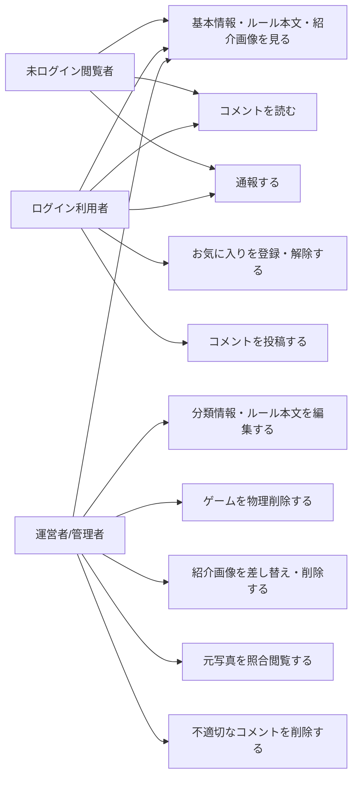

# 要件定義: ゲーム詳細

> ステータス: 仕様確認中(未実装)

## サマリ
1つのボードゲームについて、分類情報(人数・時間・ジャンル等)・ルール本文(簡単版/詳しい版のタブ)・紹介画像ギャラリー・コメント欄を表示する、[game-list/requirements.md](../game-list/requirements.md)の各項目からの遷移先画面。閲覧はログイン不要。お気に入り登録・コメント投稿のみログイン利用者限定([favorite/requirements.md](../favorite/requirements.md)、[comment/requirements.md](../comment/requirements.md))。通報はログイン不要([report/requirements.md](../report/requirements.md))。投稿された元写真は一般には一切表示せず、公開対象のゲーム紹介画像のみギャラリー表示する点が本specの主な設計判断。**方向B(2026-08-19合意)により、運営者(管理者)がログインしている場合は、この画面にゲームの編集・物理削除・紹介画像差し替え・元写真照合・コメント削除の管理者導線を表示する**(旧・管理画面のゲーム一覧を廃止し、モデレーション操作を対象ゲームの詳細画面に集約。[admin/requirements.md](../admin/requirements.md))。

このspecの利用者と主なユースケースは下記「[ユースケース図](#ユースケース図)」を参照。

## ユースケース図

- 閲覧(基本情報・ルール本文タブ・紹介画像ギャラリー・コメント閲覧)と通報はログイン不要(requirements.md#操作-8、[report/requirements.md](../report/requirements.md))。お気に入り操作は[favorite/requirements.md](../favorite/requirements.md)、コメント投稿は[comment/requirements.md](../comment/requirements.md)に従いログイン利用者限定
- 運営者(管理者)ログイン時のみ表示する管理者導線は下記「[運営者向けの操作(管理者ログイン時)](#運営者向けの操作管理者ログイン時)」。一般の閲覧者・ログイン利用者には一切表示しない(表示・実行の両面をアクセス制御する。requirements.md#運営者操作のアクセス制御)

## 概要
- 機能名: ゲーム詳細
- 目的: 1つのボードゲームについて、分類情報とルール本文(簡単版・詳しい版)、コメント欄を表示し、プレイ中のルール確認やゲーム選びの判断に使えるようにする
- 優先度: 高

## ユーザーストーリー
- 利用者として、ゲームの基本情報(人数・時間・ジャンル等)をまとめて確認したい
- 利用者として、まず簡単版で概要をつかみ、必要なら詳しい版で細かいルールを確認したい
- 利用者として、気になったゲームをお気に入り登録したり、コメントを読んだりしたい
- 閲覧者として、内容に誤りや不適切な点があれば通報したい
- 利用者として、ゲームの紹介画像を複数枚見てイメージをつかみたい
- 運営者として、誤りのある登録内容を、そのゲームの詳細画面を見ながらその場で修正したい
- 運営者として、不適切な登録・重複登録を、そのゲームの詳細画面から削除したい
- 運営者として、登録内容に疑義が出たとき、そのゲームの投稿された元写真を照合用に確認したい
- 運営者として、不適切なゲーム紹介画像を、そのゲームの詳細画面から差し替え・削除したい
- 運営者として、不適切なコメントを、コメント欄からその場で削除したい

## 機能要件

### 基本情報の表示
- [1] ゲームの分類情報(ゲーム名・対応人数・プレイ時間・ジャンル・対象年齢・難易度・メーカー/出版社・作者・言語依存度・受賞歴・発売年)を表示する。空欄(未登録)の任意項目は、その項目自体を表示しない(design.mdで確定。「未登録」ラベルは出さず、登録済みの情報だけを簡潔に見せる)

### ルール本文の表示
- [2] ルール本文を「簡単版」「詳しい版」の2つのタブで切り替えて表示する([game-registration/requirements.md#ルール本文の著作権への配慮](../game-registration/requirements.md)に従って運営者が生成する)
- [3] 詳しい版は、共通の章立て([admin/design.md#詳しい版の共通章立て(生成時の構造)](../admin/design.md))に沿って見出し付きで表示する
- [4] 初期表示では簡単版を選択状態にする(根拠: まず概要をつかむユーザーストーリーに合わせる)

### 操作
- [5] ログイン中の利用者は、このゲームをお気に入り登録・解除できる([favorite/requirements.md](../favorite/requirements.md)に従う)
- [6] このゲームのコメント欄を表示する([comment/requirements.md](../comment/requirements.md)に従う)
- [7] このゲームの内容を通報できる([report/requirements.md](../report/requirements.md)に従う)
- [8] 詳細画面はログイン不要で閲覧できる(お気に入り登録・コメント投稿にはログインが必要)

### 画像表示
- [9] このゲームに登録されているゲーム紹介画像を、複数枚まとめてギャラリー形式で表示する([game-registration/requirements.md#ゲーム紹介画像のアップロード](../game-registration/requirements.md)で登録される画像)。画像が1枚も登録されていない場合は、ギャラリー自体を表示しない

### 運営者向けの操作(管理者ログイン時)
運営者(管理者)がログインしている場合のみ、この詳細画面に以下の管理者導線を表示する。一般の閲覧者・ログイン利用者には表示しない(方向B。旧・管理画面のゲーム一覧を廃止し集約したもの。[admin/requirements.md](../admin/requirements.md))。
- [10] 表示中のゲームの分類情報・ルール本文(簡単版・詳しい版)を編集して上書き保存できる(登録時と同じ検証を通す。[game-registration/requirements.md](../game-registration/requirements.md))
- [11] 表示中のゲームを物理削除できる。削除後はゲーム本体と、そのゲームに紐づくコメント・お気に入り・通報・紹介画像の各レコードが消え、一覧・詳細・絞り込みの対象から外れる(削除ルールの詳細は下記[運営者による削除の方針](#運営者による削除の方針))。誤操作防止の確認ステップを挟む
- [12] 表示中のゲームの紹介画像を差し替え・削除できる(追加アップロード・不要画像の削除・メイン画像の並び替え。不適切な画像・著作権者からの削除要望への対応)
- [13] 表示中のゲームについて、投稿時にアップロードされた元写真を運営者だけが照合用に閲覧できる(一般表示では出さない[表示対象-2]の元写真を、運営者に限り取得・表示する。根拠: 登録内容の疑義の照合用。[game-registration/requirements.md#写真の取り扱い](../game-registration/requirements.md))
- [14] コメント欄の各コメントを削除できる(編集はしない。[comment/requirements.md#機能要件-10](../comment/requirements.md))

## ビジネスルール・制約

### 表示対象
- [1] 運営者が削除したゲームの詳細は表示しない。方向Bで削除は物理削除になったため、削除されたゲームはレコード自体が存在せず「見つかりません」表示になる([運営者による削除の方針](#運営者による削除の方針))
- [2] 投稿された元の写真は、一般の閲覧者・ログイン利用者には詳細画面に一切表示しない(根拠: [game-registration/requirements.md#写真の取り扱い](../game-registration/requirements.md))。運営者(管理者)ログイン時の照合閲覧([運営者向けの操作-13](#運営者向けの操作管理者ログイン時))は例外で、運営者本人のみ取得できる
- [3] ゲーム紹介画像は、上記[表示対象-2]のルールブック元写真(非公開)とは別物であり、公開対象である([game-registration/requirements.md#ゲーム紹介画像の取り扱い](../game-registration/requirements.md))

### 運営者による削除の方針
- [4] ゲームの削除は物理削除とする(方向B。論理削除=`deleted_at`は廃止)。削除後の追跡(通報・元写真の見返し)や誤削除の復元は行わない前提とする(2026-08-19合意。削除前の元の申請内容は、別テーブルの登録依頼レコード`board_game_rules_game_requests`が独立して残るため、緩いバックアップとして機能する)
- [5] ゲームを物理削除するとき、そのゲームに紐づく子レコード(コメント・お気に入り・通報・紹介画像の`intro_photo_paths`)も一緒に物理削除する(孤立した子レコードを残さない)
- [6] ただしStorageの実ファイル(非公開の元写真・公開の紹介画像の実体)は削除時に消さない。理由: 元写真の実ファイルは登録依頼レコードとStorageパスを共有しており、削除で消すと依頼側のバックアップ写真まで巻き添えになるため。参照されなくなったStorage実ファイル(孤児オブジェクト)の掃除は、将来の定期棚卸し運用(games・game_requestsの全参照と突き合わせ、どこからも参照されない実ファイルのみ一括削除)で対応する(本specスコープ外)

### 運営者操作のアクセス制御
- [7] 上記[運営者向けの操作](#運営者向けの操作管理者ログイン時)は、運営者本人のアカウントでログインしている場合のみ表示・実行できる。未ログイン・運営者以外のアカウントでは導線を表示せず、かつ実行もできないこと(表示の出し分けだけでなく、DB側のRLS・Storageアクセスポリシーで実行そのものを担保する。根拠: 静的サイトのため画面側の制御は迂回されうる。[admin/requirements.md#アクセス制御・権限](../admin/requirements.md)、[docs/adr/0006-admin-screen-oidc-rls.md](../../../docs/adr/0006-admin-screen-oidc-rls.md)・[docs/adr/0007-runtime-llm-server-and-writable-admin.md](../../../docs/adr/0007-runtime-llm-server-and-writable-admin.md))
- [8] 運営者判定・ログイン手段は管理画面と同一(共用の`admin_emails`許可リスト・Google OIDC。[admin/requirements.md#認証手段とパスキー](../admin/requirements.md))

## 依存関係
- 表示する分類情報・ルール本文の内容は[game-registration/requirements.md](../game-registration/requirements.md)で登録される内容に従う
- お気に入り操作は[favorite/requirements.md](../favorite/requirements.md)、コメント欄は[comment/requirements.md](../comment/requirements.md)、通報は[report/requirements.md](../report/requirements.md)に従う
- 一覧からの遷移元は[game-list/requirements.md](../game-list/requirements.md)
- ゲーム紹介画像の登録・並び順は[game-registration/requirements.md#ゲーム紹介画像のアップロード](../game-registration/requirements.md)に従う
- 運営者向けの操作(編集・物理削除・紹介画像差し替え・元写真照合・コメント削除)は方向Bで管理画面([admin/requirements.md](../admin/requirements.md))から移設したもの。運営者判定・認証・アクセス制御方針は[admin/requirements.md#アクセス制御・権限](../admin/requirements.md)・[docs/adr/0006-admin-screen-oidc-rls.md](../../../docs/adr/0006-admin-screen-oidc-rls.md)・[docs/adr/0007-runtime-llm-server-and-writable-admin.md](../../../docs/adr/0007-runtime-llm-server-and-writable-admin.md)に従う。コメント削除の権限は[comment/requirements.md](../comment/requirements.md)に従う
- 通報一覧([admin/requirements.md#通報の確認](../admin/requirements.md))から対象ゲームのこの詳細画面へ遷移してモデレーションを行う

## スコープ外
- ルール本文の版の追加(簡単版・詳しい版の2つに固定する)
- 一般利用者による詳細画面からのゲーム情報の編集(編集は運営者ログイン時のみ。[運営者向けの操作](#運営者向けの操作管理者ログイン時))
- 元写真の一般表示・ダウンロード(運営者ログイン時の照合閲覧のみ例外。[運営者向けの操作-13](#運営者向けの操作管理者ログイン時))
- 参照されなくなったStorage実ファイル(孤児オブジェクト)の即時削除・掃除(将来の定期棚卸し運用で対応。[運営者による削除の方針-6](#運営者による削除の方針))
- 削除操作の履歴管理(監査ログ)・誤削除の復元
