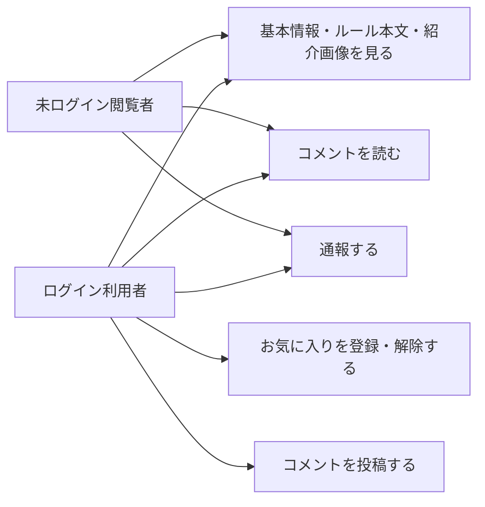

# 要件定義: ゲーム詳細

> ステータス: 仕様確認中(未実装)

## サマリ
1つのボードゲームについて、分類情報(人数・時間・ジャンル等)・ルール本文(簡単版/詳しい版のタブ)・紹介画像ギャラリー・コメント欄を表示する、[game-list/requirements.md](../game-list/requirements.md)の各項目からの遷移先画面。閲覧はログイン不要。お気に入り登録・コメント投稿のみログイン利用者限定([favorite/requirements.md](../favorite/requirements.md)、[comment/requirements.md](../comment/requirements.md))。通報はログイン不要([report/requirements.md](../report/requirements.md))。投稿された元写真は一切表示せず、公開対象のゲーム紹介画像のみギャラリー表示する点が本specの主な設計判断。

このspecの利用者と主なユースケースは下記「[ユースケース図](#ユースケース図)」を参照。

## ユースケース図

- 閲覧(基本情報・ルール本文タブ・紹介画像ギャラリー・コメント閲覧)と通報はログイン不要(requirements.md#操作-8、[report/requirements.md](../report/requirements.md))。お気に入り操作は[favorite/requirements.md](../favorite/requirements.md)、コメント投稿は[comment/requirements.md](../comment/requirements.md)に従いログイン利用者限定

## 概要
- 機能名: ゲーム詳細
- 目的: 1つのボードゲームについて、分類情報とルール本文(簡単版・詳しい版)、コメント欄を表示し、プレイ中のルール確認やゲーム選びの判断に使えるようにする
- 優先度: 高

## ユーザーストーリー
- 利用者として、ゲームの基本情報(人数・時間・ジャンル等)をまとめて確認したい
- 利用者として、まず簡単版で概要をつかみ、必要なら詳しい版で細かいルールを確認したい
- 利用者として、気になったゲームをお気に入り登録したり、コメントを読んだりしたい
- 閲覧者として、内容に誤りや不適切な点があれば通報したい
- 利用者として、ゲームの紹介画像を複数枚見てイメージをつかみたい

## 機能要件

### 基本情報の表示
- [1] ゲームの分類情報(ゲーム名・対応人数・プレイ時間・ジャンル・対象年齢・難易度・メーカー/出版社・作者・言語依存度・受賞歴・発売年)を表示する。空欄(未登録)の任意項目は、その項目自体を表示しない(design.mdで確定。「未登録」ラベルは出さず、登録済みの情報だけを簡潔に見せる)

### ルール本文の表示
- [2] ルール本文を「簡単版」「詳しい版」の2つのタブで切り替えて表示する([game-registration/requirements.md#ルール本文の著作権への配慮](../game-registration/requirements.md)に従って運営者が生成する)
- [3] 詳しい版は、共通の章立て([admin/design.md#詳しい版の共通章立て(生成時の構造)](../admin/design.md))に沿って見出し付きで表示する
- [4] 初期表示では簡単版を選択状態にする(根拠: まず概要をつかむユーザーストーリーに合わせる)

### 操作
- [5] ログイン中の利用者は、このゲームをお気に入り登録・解除できる([favorite/requirements.md](../favorite/requirements.md)に従う)
- [6] このゲームのコメント欄を表示する([comment/requirements.md](../comment/requirements.md)に従う)
- [7] このゲームの内容を通報できる([report/requirements.md](../report/requirements.md)に従う)
- [8] 詳細画面はログイン不要で閲覧できる(お気に入り登録・コメント投稿にはログインが必要)

### 画像表示
- [9] このゲームに登録されているゲーム紹介画像を、複数枚まとめてギャラリー形式で表示する([game-registration/requirements.md#ゲーム紹介画像のアップロード](../game-registration/requirements.md)で登録される画像)。画像が1枚も登録されていない場合は、ギャラリー自体を表示しない

## ビジネスルール・制約

### 表示対象
- [1] 運営者が削除したゲームの詳細は表示しない([admin/requirements.md](../admin/requirements.md)参照)
- [2] 投稿された元の写真は詳細画面に一切表示しない(根拠: [game-registration/requirements.md#写真の取り扱い](../game-registration/requirements.md))
- [3] ゲーム紹介画像は、上記[表示対象-2]のルールブック元写真(非公開)とは別物であり、公開対象である([game-registration/requirements.md#ゲーム紹介画像の取り扱い](../game-registration/requirements.md))

## 依存関係
- 表示する分類情報・ルール本文の内容は[game-registration/requirements.md](../game-registration/requirements.md)で登録される内容に従う
- お気に入り操作は[favorite/requirements.md](../favorite/requirements.md)、コメント欄は[comment/requirements.md](../comment/requirements.md)、通報は[report/requirements.md](../report/requirements.md)に従う
- 一覧からの遷移元は[game-list/requirements.md](../game-list/requirements.md)
- ゲーム紹介画像の登録・並び順は[game-registration/requirements.md#ゲーム紹介画像のアップロード](../game-registration/requirements.md)に従う

## スコープ外
- ルール本文の版の追加(簡単版・詳しい版の2つに固定する)
- 詳細画面からのゲーム情報の直接編集(修正は[admin/requirements.md](../admin/requirements.md)の運営者のみ)
- 元写真の表示・ダウンロード
