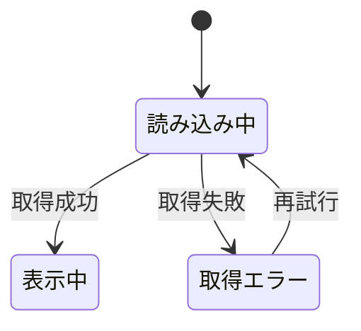

# 設計: ゲーム一覧・絞り込み

## サマリ
このアプリのトップ画面(`/board-game-rules`)。**Step0(UIデザイン確定)の要否宣言: 必要・実施済み**(共通chrome・トークンは[DESIGN.md](../DESIGN.md)で確定済みだが、絞り込みパネル・カード一覧というこの画面固有のコンテンツ構成は未確定だったため、既存のAnalog Hearthデザインシステム上でStitch画面を新規生成して確定した。詳細は下記「画面設計」参照)。登録済みゲームの一覧表示と、複数分類での絞り込み(AND条件)・作者のテキスト検索を行う。データは[game-registration/design.md#データベース設計](../game-registration/design.md)の`board_game_rules_games`から取得する。ゲームの型定義は`app/board-game-rules/lib/games.ts`を共有する(一覧は「詳しい版」の章立てを表示しないため`rulesChapters.ts`には依存しない)。主要な設計判断は、(1)件数が少ない前提で全件取得し絞り込みは取得済みデータへ画面側で適用すること(再取得しない)、(2)本画面をアプリのトップとして共通ナビ(`BoardGameNav`)に新設エントリを追加し、register/favoritesの既存パンくずリンクもあわせて更新すること、(3)取得エラー・絞り込み結果0件など正常系以外の表示を個別に定めること。取得状態の遷移は下記「[状態管理](#状態管理)」の状態遷移図を参照。

## 処理フロー

### 公開中のゲームを取得する処理
- 対象: 一覧・絞り込みの元になる`board_game_rules_games`のレコード
- 手順:
  1. `deleted_at is null`(公開中・削除されていない)のゲームを取得する(requirements.md#表示対象-1)。`photo_paths`(元写真パス)は選択せず、一覧・絞り込み・詳細に必要な列だけを取得する([game-registration/design.md#セキュリティ](../game-registration/design.md))
  2. 初期の並び順は登録日時の新しい順とする(並び替えの複数指定はスコープ外。requirements.md#スコープ外)
  3. 取得に失敗した場合は、一覧を表示せずエラーが分かる表示にする(後述エラーハンドリング)
- 補足: 現状は件数が少ない前提で全件取得し、絞り込みは取得済みデータに対して画面側で行う(ページネーションの詳細はスコープ外。requirements.md#スコープ外)。件数が増えた段階で取得の分割を別途検討する
- 関連するビジネスルール: requirements.md#一覧表示-1、requirements.md#表示対象-1

### 絞り込みを適用する処理
- 対象: 取得済みのゲーム一覧と、現在の絞り込み条件
- 手順(指定された条件をすべて満たすゲームに絞る。AND条件。requirements.md#絞り込み-6):
  1. **対応人数**: 「この人数で遊べる」を指定した場合、その人数がゲームの対応人数の下限〜上限の範囲に収まるゲームだけを残す
  2. **プレイ時間**: 希望する時間帯を指定した場合、その時間帯とゲームのプレイ時間の下限〜上限が重なるゲームだけを残す
  3. **ジャンル**: 指定したジャンルに一致するゲームだけを残す
  4. **対象年齢**: 「この年齢で遊べる」を指定した場合、その年齢がゲームの対象年齢(`min_age`=「◯歳以上」)を満たすゲーム、すなわち `指定年齢 ≥ min_age` のゲームだけを残す(対応人数の「この人数で遊べる」と同じ「その値で遊べるか」の考え方に揃える)。境界値(`指定年齢 = min_age`)は満たすものとして含む。`min_age`が未登録(NULL)のゲームは、この分類で絞り込みを指定したときは結果から除外する(原則。手順11)
  5. **難易度**: 指定した難易度に一致するゲームだけを残す
  6. **メーカー/出版社**: 指定したメーカーに一致するゲームだけを残す
  7. **言語依存度(日本語ルールの有無)**: 指定に合うゲーム(日本語ルールあり/なし)だけを残す
  8. **受賞歴**: 「受賞歴あり」を指定した場合、受賞歴が登録されている(空でない)ゲームだけを残す
  9. **作者(テキスト検索)**: 入力した文字列が作者名に部分一致するゲームだけを残す(他が選択式なのに対し、作者は表記ゆれ・数が多いためテキスト検索。requirements.md#絞り込み-7)
  10. いずれの分類でも、その項目が空欄(未登録)のゲームは、その分類で絞り込みを指定したときは結果から除外する(原則。requirements.md#未入力項目の扱い-3)。作者テキスト検索も、作者未登録のゲームは検索対象から外れる
- 補足: 絞り込み条件が変わるたびに、この処理を取得済みデータに適用し直し、一覧と件数表示の両方へ即座に反映する(requirements.md#絞り込み-9)
- 関連するビジネスルール: requirements.md#絞り込み、requirements.md#未入力項目の扱い-3

### 絞り込みの選択肢を用意する処理
- 対象: 選択式の分類(ジャンル・難易度・メーカー・対象年齢など)の選択肢
- 手順:
  1. 取得済みの公開中ゲームが実際に持つ値から、各分類の選択肢を組み立てる(登録されている値に基づく。requirements.md#表示対象-2)。値を持つゲームがない分類は選択肢が空になる
  2. 言語依存度・受賞歴は「あり/なし」または「該当のみ」の固定の選択肢とする
- 関連するビジネスルール: requirements.md#表示対象-2

### 件数を表示する処理
- 対象: 現在の絞り込み条件に一致した結果
- 手順: 絞り込み後のゲーム件数を表示する。絞り込み条件の変更に即座に追従させる(requirements.md#一覧表示-5、requirements.md#絞り込み-9)。絞り込み結果が0件の場合、件数は「0件」と表示し、一覧エリアにはカードを並べず「条件に合うゲームが見つかりませんでした」の案内を表示する(0件が「絞り込みすぎ」なのか「取得エラー」なのか区別できるよう、上記の取得エラー表示とは別の文言にする)
- 関連するビジネスルール: requirements.md#一覧表示-5

### 絞り込みをリセットする処理
- 対象: 現在の絞り込み条件
- 手順: すべての絞り込み条件を解除し、全公開ゲームを登録日時の新しい順で表示する状態に戻す(requirements.md#絞り込み-8)
- 関連するビジネスルール: requirements.md#絞り込み-8

## バリデーション
- 対応人数・プレイ時間の指定は、数値または時間帯の選択とする。不正な入力(範囲の逆転など)は指定を無効として扱い、絞り込みに反映しない(絞り込みは元データを壊さないため、厳密なエラー表示は不要)

## エラーハンドリング
- ゲーム一覧の取得が失敗した場合は、一覧を表示せず、取得に失敗した旨と再試行の手段を表示する(空の一覧を出すと「登録が0件」なのか「取得失敗」なのか区別できないため。管理画面のエラー方針と同じ考え方)
- お気に入りの登録・解除の失敗は[favorite/design.md](../favorite/design.md)の方針に従う(一覧の主機能である閲覧・絞り込みは止めない)

## 関連するファイル(抜粋)
```
app/board-game-rules/page.tsx (新規: 一覧・絞り込み画面の本体。取得→絞り込み→表示を持つクライアント画面)
app/board-game-rules/lib/games.ts (既存: game-registrationで作るゲーム型・取得関数を共有。一覧取得関数 fetchPublishedGames を追加)
app/board-game-rules/lib/filterGames.ts (新規: 取得済みゲームに絞り込み条件を適用する純粋関数、選択肢の組み立て)
app/board-game-rules/components/GameCard.tsx (新規: 一覧の1件。ゲーム名・対応人数・プレイ時間・ジャンル・お気に入り操作)
app/board-game-rules/components/FilterPanel.tsx (新規: 絞り込みの操作UI。各分類・作者テキスト検索・リセット)
app/board-game-rules/components/LoginStatus.tsx (既存: user-authの共通ログイン導線)
app/board-game-rules/components/FavoriteButton.tsx (favorite/design.mdで作るお気に入り操作。一覧の各カードから使う)
app/board-game-rules/components/BoardGameNav.tsx (既存: 修正。`BoardGameNavKey`に`list`を追加し、ナビ最上段に一覧項目を追加)
app/board-game-rules/register/page.tsx (既存: 修正。パンくずの「ボドゲのトリセツ」を`/board-game-rules`へのリンクに変更)
app/board-game-rules/favorites/page.tsx (既存: 修正。同上)
app/board-game-rules/layout.tsx (既存: 修正。title/description実装は変更せず、先頭コメントの参照先を本specのメタ情報-10に更新)
app/page.tsx (既存: 修正。ツールカード一覧にboard-game-rulesを追加。hub-site/requirements.md#機能要件-2)
app/lib/supabaseClient.ts (既存の共通クライアントを利用)
```

## 画面設計

**確定デザインの出所**: Google Stitchプロジェクト「ボドゲのトリセツ 登録依頼フォーム」(project ID `10756296516233709248`)の既存デザインシステム「Analog Hearth」(asset `assets/4c563e385f3f480d813033cba0bd22b7`)を土台に、本画面用のスクリーンを新規生成して確定した(共通chrome・トークンはこのシステムを踏襲、コンテンツ構成=絞り込みパネル・カード一覧はこの画面固有のためStitchで検討)。

- **採用スクリーン(デスクトップ)**: 「ボードゲーム一覧・絞り込み (共通ナビ適用) - ボドゲのトリセツ」(`projects/10756296516233709248/screens/9681c2520a3a44edbe1391c842b356d0`)。生成HTML(Tailwind)を実装の参照素材とする(register/favoritesと同方針)
- **採用スクリーン(モバイル)**: 「ボードゲーム一覧 (Mobile) - ボドゲのトリセツ」(`projects/10756296516233709248/screens/50288636a088448284524613bb7fb233`)。同様に実装の参照素材とする
- Stitchの生成結果のうち、以下は今回は採用しない(理由を付記):
  - **ページ送り**(デスクトップの「1 2 3 … 12」、モバイルの「さらに表示する」ボタン): requirements.md#スコープ外「ページネーションの詳細仕様(件数が増えた段階で別途検討する)」と矛盾するため実装しない。全件をそのまま一覧に並べる(処理フロー「公開中のゲームを取得する処理」の全件取得方針のまま)
  - **絞り込みパネルの「検索する」ボタン**: requirements.md#絞り込み-9「絞り込み条件を変更すると、一覧表示と件数表示の両方に即座に反映される」と矛盾する(即時反映であり、明示的な送信操作を挟まない)ため実装しない。`リセット`操作のみ設ける
  - **モバイル下部のタブバー**(Library/Search/Register/Settings): register/favoritesを含むアプリ全体のchrome変更になるため、本画面(game-list)のPRには含めない。別タスクとして切り出す(現状モバイルは`BoardGameNav`が`md`未満で非表示になり他画面への遷移導線が無い。この課題への対応として別途検討する)
  - **モバイルのジャンルのクイックフィルターチップ**(横スクロールの「すべて/戦略・ストラテジー/カードゲーム…」): デスクトップ・モバイルともジャンルは他の分類と同じドロップダウン形式に統一し、モバイル専用の別UIは作らない

### デザイントークン(Analog Hearth)
配色・フォント・角丸・階層表現(影を使わず1px罫線で階層を出す方針)・アクセシビリティの各トークンの定義は、アプリ共通の一元管理先 [DESIGN.md](../DESIGN.md) を参照する(値をここに書き写すと二重管理になるため。実体は`app/globals.css`の`bgr-*`)。

### ナビゲーション(左サイドバー共通ナビ)
board-game-rulesアプリ全体で共有する左サイドバー(`components/BoardGameNav.tsx`。[DESIGN.md#2-共通chromeルール](../DESIGN.md)、game-registration/favoriteで確定済み)を本画面にも適用する。

- 本画面はアプリのトップ(requirements.md#概要)のため、`BoardGameNavKey`に新しいキー`list`を追加し、ナビの最上段に「一覧」項目として配置する(表示順: 一覧→登録依頼→お気に入り。Stitch参照デザインのHome/Add Game/お気に入りの並びに準じる)。本画面を選択中は`aria-current="page"`でハイライトする
- 本画面の実装により、register・favoritesのパンくずで非リンクだった「ボドゲのトリセツ」の遷移先ができる。register/favoritesのコード上のコメント(「game-list未実装のため非リンク」)は古くなるため、本画面の実装にあわせて`/board-game-rules`へのリンクに更新する(対象: `app/board-game-rules/register/page.tsx`、`app/board-game-rules/favorites/page.tsx`)。あわせて、同じ注記が書かれている[game-registration/design.md#画面設計(登録依頼フォームのUI)](../game-registration/design.md)の「パンくず」の一文(「ボドゲのトリセツのトップはgame-list未実装のため非リンク」)も、リンク化された旨に更新する(`favorite/design.md`には同種の注記はない)
- 共通chromeの「唯一の真実の源」である[DESIGN.md#2-共通chromeルール](../DESIGN.md)の現況記述「ナビはロゴ...+実装済み画面へのリンク(登録依頼・お気に入り)」も、`list`追加後の実態(一覧・登録依頼・お気に入りの3リンク)に合わせて更新する

### パンくず
本画面はアプリのトップのため2階層: 「べんりやつーる(リンク`/`) › ボドゲのトリセツ(現在地・太字・非リンク)」。register/favoritesの3階層パンくずおよびstyleguideの見本([app/board-game-rules/styleguide/](../../app/board-game-rules/styleguide/))と同じマークアップパターン(`nav aria-label="パンくず"`)を用いる

### 共通部品
- `FilterPanel`・`GameCard`のレイアウト(何をどう並べるか)は上記の採用スクリーンに従う。個々のボタン・カードのトークンレベルの見た目(角丸・色・影なし1px罫線)はstyleguide([app/board-game-rules/styleguide/](../../app/board-game-rules/styleguide/))の見本マークアップと揃える(主要ボタン: `rounded-lg bg-bgr-primary`+白文字、押下は`bgr-primary-active`。カード: 影を使わず`rounded-lg border border-bgr-line bg-bgr-card`)
- お気に入りトグルは`FavoriteButton`(既存、[favorite/design.md](../favorite/design.md))をそのまま再利用する
- 任意ログインの状態表示は既存の`LoginStatus`を本文エリア上部(右寄せ)に置く(register/favoritesのうちLoginStatusを使うregisterと同方針。favoritesはログイン促し自体を本文の状態分岐で表現しており`LoginStatus`を使っていないが、本画面は常時閲覧可能でログイン状態が一覧の主機能を左右しないため、register型の常時表示に揃える)

### トップページ掲載(hub-site)
本画面はアプリのトップのため、[hub-site/requirements.md#機能要件-2](../../hub-site/requirements.md)の規約に従い、公開中アプリとして`app/page.tsx`(hubのトップページ本体、`/`用)のツールカード一覧にboard-game-rulesのカードを追加する(requirements.md#メタ情報-11)。カードはhub-siteの既存ツールカードと同じマークアップ(絵文字+タイトル+説明文、`border-gray-200`+`hover:border-orange-300`)を踏襲する(hubはアプリ横断のサイト共通chromeのため`bgr-*`トークンは使わない。[DESIGN.md#2-共通chromeルール](../DESIGN.md)の「トークンはアプリ単位」と整合)。絵文字はfaviconと合わせて🎲を使う。

`/board-game-rules`(本アプリ自身)のtitle/description(requirements.md#メタ情報-10)は、`app/board-game-rules/layout.tsx`に**実装済み**(値は現行のまま変更しない)。同ファイルの先頭コメントが「hub-site側に暫定定義・game-list実装時にそちらへ移設予定」という古い前提のままのため、参照先を本spec(requirements.md#メタ情報-10)に更新する(新たに`export const metadata`を作る作業ではない。一覧画面`page.tsx`は`'use client'`のためmetadataをexportできず、Next.jsの規約どおり親の`layout.tsx`側で持つ。register/favorites/adminの各画面も同じ理由で`layout.tsx`を共有する)

### 画面構成
- 共通ヘッダー: パンくず、`LoginStatus`(ログイン導線)。register/favoritesは本文ヘッダーに他画面への導線テキストリンクを持たない(左サイドバー共通ナビのみ。`md`未満ではナビ自体が非表示になり、モバイルでの他画面遷移導線が無い状態が既に残っている。[DESIGN.md#2-共通chromeルール](../DESIGN.md))。本画面もその既存方針に揃え、新規登録・お気に入り一覧への導線を本文ヘッダーには重複配置しない(ナビが唯一の遷移経路)
- 絞り込みパネル(`FilterPanel`): 対応人数・プレイ時間・ジャンル・対象年齢・難易度・メーカー/出版社・言語依存度・受賞歴の各絞り込み(ドロップダウン形式)と、作者のテキスト検索、リセット操作。採用スクリーンに合わせ、デスクトップは全項目(8分類のドロップダウン+作者テキスト検索+リセット)を本文上部に常時表示する。モバイルは画面幅が狭いため、**作者テキスト検索欄のみ常時表示**とし、その右のアイコンボタンで残り8分類のドロップダウン+リセットを開閉する(初期状態は閉じている。開いている間も作者テキスト検索欄は隠れず操作できる)
- 件数表示: 現在の条件に一致する件数
- 一覧(`GameCard`のカード形式): 各カードにゲーム名・対応人数・プレイ時間・ジャンルを最低限表示する。ログイン中はお気に入りの登録・解除操作を表示する(requirements.md#一覧表示-4、[favorite](../favorite/requirements.md))。カードから詳細画面へ遷移できる(requirements.md#一覧表示-2)
- 一覧・絞り込みはログイン不要で使える(requirements.md#一覧表示-3)

## 状態管理
- 一覧画面(`page.tsx`)は「取得したゲーム一覧」「現在の絞り込み条件」「取得状態(読み込み中/表示中/取得エラー)」「ログインセッション(お気に入り操作の可否判定に使う)」「画面内の自分のお気に入り集合(登録済みgame_idの集合)」をローカル状態として持つ
- お気に入り集合は、[favorite/design.md#画面内のお気に入り状態をまとめて取得する処理](../favorite/design.md)に従い、ログイン中に`fetchMyFavoriteGameIds`相当で1回まとめて取得し(各カードごとに個別取得しない)、各`GameCard`の`FavoriteButton`へ登録済み/未登録を渡す。取得完了まで・未ログイン・取得失敗時は一律「未登録」として扱う([favorite/design.md](../favorite/design.md)と同じ考え方。requirements.md#一覧表示-4、[favorite/requirements.md#お気に入りの登録・解除-3](../favorite/requirements.md))
- 絞り込み条件の初期値は「すべて未指定(=全公開ゲームを登録日時の新しい順)」とする
- 絞り込み条件が変わったら、取得済みデータに`filterGames`を適用し直して一覧・件数を更新する(再取得はしない)

上記のうち「取得状態」は3状態(読み込み中/表示中/取得エラー)を遷移する:



## セキュリティ
- 取得は公開中(`deleted_at is null`)のゲームに限られ、削除されたゲームは表示しない(RLSでも担保。requirements.md#表示対象-1)
- 一覧・絞り込みは`photo_paths`(元写真パス)を取得しない。加えて`anon`は列単位のSELECT権限から`photo_paths`が除外されており、細工したクライアントでも直接読み取れない(列秘匿のDB担保は[game-registration/design.md#データベース設計](../game-registration/design.md)を正とする)。元写真は一覧・詳細に一切出さない
- 作者テキスト検索は取得済みデータに対する画面側の部分一致で行い、任意の文字列がそのままDBクエリに渡ることはない(仮にDB側で検索する場合も、パラメータ化した問い合わせを使い、入力を埋め込まない)
- ゲーム名・ジャンル等の表示は、投稿者が修正しうる値であってもHTMLとして解釈しない形で描画する([game-registration/design.md#セキュリティ](../game-registration/design.md)と同方針)

## パフォーマンス
- 現状は全件取得+画面側絞り込みで足りる想定(小規模運用)。件数が増えた場合は、取得の分割(ページネーション)やDB側での絞り込みへの切り替えを別途検討する(requirements.md#スコープ外)。絞り込み条件変更のたびの再計算は取得済みデータへの適用に限り、DB再取得は行わない

## ログ
- ゲーム一覧の取得が想定外に失敗した場合は、原因究明のためブラウザのコンソールにエラー内容を出す(画面には定型のエラー表示)。通常の閲覧・絞り込み操作ではログを出さない

## 依存関係
- 一覧・絞り込みの対象データは[game-registration/design.md](../game-registration/design.md)で登録される内容に従う。ゲーム型は`app/board-game-rules/lib/games.ts`を共有する(共通章立て`rulesChapters.ts`は「詳しい版」を章見出し付きで表示する[game-detail](../game-detail/design.md)専用で、章立てを表示しない一覧は依存しない)
- 各カードからの遷移先は[game-detail/design.md](../game-detail/design.md)
- お気に入り操作は[favorite/design.md](../favorite/design.md)に従う(`FavoriteButton`を各カードで使う)
- 共通chrome・トークンは[DESIGN.md](../DESIGN.md)に従う(唯一の真実の源)。共通部品カタログは[design-system/design.md](../design-system/design.md)のstyleguideページを参照する
- トップページ掲載・メタ情報は[hub-site/requirements.md](../../hub-site/requirements.md)の規約に従う(requirements.md#メタ情報)
