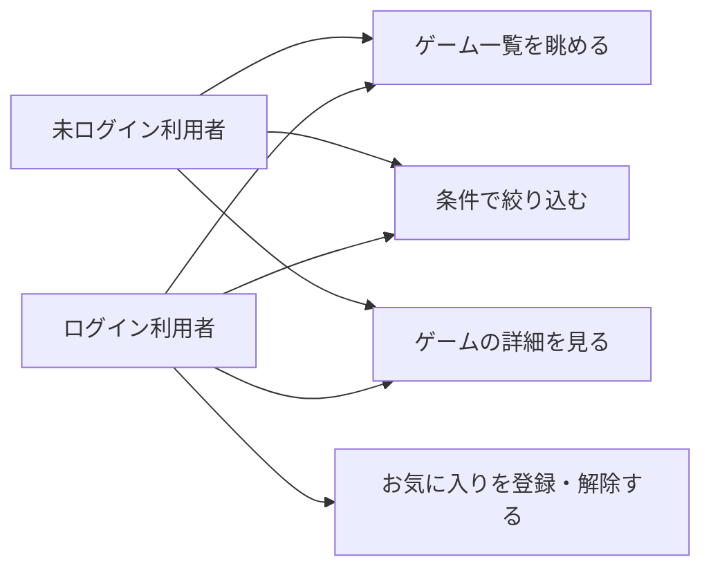

# 要件定義: ゲーム一覧・絞り込み

## サマリ
board-game-rules(ボドゲのトリセツ)アプリのトップ画面。登録済みゲームを一覧表示し、対応人数・プレイ時間・ジャンルなど8分類のAND条件絞り込み+作者のテキスト検索で、条件に合うゲームを未ログインでも探せるようにする。表示対象は公開中(削除されていない)ゲームに限る。分類ごとの選択肢は、あらかじめ用意した固定の代表値によるものと、登録済みゲームが実際に持つ値から組み立てるものがある(分類ごとの区別は設計で確定する)。全文検索・並び替えの複数指定・ページネーションはスコープ外。

このspecの利用者と主なユースケースは下記「[ユースケース図](#ユースケース図)」を参照。

## 概要
- 機能名: ゲーム一覧・絞り込み
- 目的: 登録されたボードゲームを一覧で表示し、プレイ人数・プレイ時間・ジャンルなど複数の分類で絞り込んで、条件に合うゲームを見つけられるようにする。このアプリのトップとなる画面
- 優先度: 高

## ユーザーストーリー
- 利用者として、登録されているボードゲームを一覧で眺めたい
- 利用者として、今日遊べる人数・時間・好みのジャンルなどで絞り込んで、条件に合うゲームを探したい
- 利用者として、絞り込んだ結果から気になったゲームの詳細を見たい
- 利用者として、ログインせずに一覧の閲覧・絞り込みを使いたい

## ユースケース図

- 一覧の閲覧・絞り込み・詳細への遷移はログイン不要(requirements.md#一覧表示-3)。お気に入り操作のみログイン利用者限定([favorite/requirements.md](../favorite/requirements.md))

## 機能要件

### 一覧表示
- [1] 登録済みのゲームをカード形式などで一覧表示する。各項目には少なくともゲーム名・対応人数・プレイ時間・ジャンルを表示する(表示項目の詳細は設計で確定する)
- [2] 各項目から、そのゲームの詳細画面([game-detail/requirements.md](../game-detail/requirements.md))へ遷移できる
- [3] 一覧・絞り込みはログイン不要で利用できる
- [4] ログイン中の場合、各項目にお気に入りの登録・解除操作を表示する([favorite/requirements.md](../favorite/requirements.md)に従う)
- [5] 現在の絞り込み条件に一致する件数を表示する

### 絞り込み
- [6] 次の分類で絞り込めること。複数の分類を同時に指定した場合は、すべての条件を満たすゲームに絞り込む(AND条件):
  - 対応人数(「この人数で遊べる」を指定すると、その人数が各ゲームの対応人数の下限〜上限の範囲に収まるゲームに絞り込む)
  - プレイ時間(希望する時間帯を指定すると、各ゲームのプレイ時間の下限〜上限と重なるゲームに絞り込む。時間帯の境界が接するだけの場合も重なりに含める)
  - ジャンル(1つ選ぶと、そのジャンルを持つゲームに絞り込む。1ゲームは複数ジャンルを持てるため、選んだジャンルを含む=他のジャンルも併せ持つゲームも対象になる)
  - 対象年齢(「この年齢で遊べる」を指定すると、その年齢が各ゲームの対象年齢(「◯歳以上」)を満たすゲーム=指定年齢がゲームの対象年齢以上であるゲームに絞り込む。境界値(指定年齢=対象年齢)は含む)
  - 難易度
  - メーカー/出版社
  - 言語依存度(日本語ルールの有無)
  - 受賞歴(受賞歴ありのゲームに絞り込む)
- [7] 作者はテキスト検索で絞り込めること(部分一致。他の分類が選択式であるのに対し、作者は表記ゆれ・数が多いためテキスト検索とする)
- [8] 絞り込み条件を解除・リセットできる
- [9] 絞り込み条件を変更すると、一覧表示と件数表示の両方に即座に反映される

### メタ情報
- [10] `/board-game-rules`のメタ情報(title/description)を設定する: title「ボードゲームのルール確認｜人数・時間・ジャンルで探せる無料データベース」、description「ボードゲームの説明書の写真からルールを自動生成して登録し、対応人数・プレイ時間・ジャンルなどで絞り込んで探せる無料のルール確認サービスです。」(元は[hub-site/requirements.md](../../hub-site/requirements.md)に暫定直接定義されていたものを本specの実装着手にあわせて移設。文言は変更しない)
- [11] トップページ([hub-site/requirements.md#機能要件-2](../../hub-site/requirements.md))のツールカード一覧に、本アプリ(ボドゲのトリセツ)のツールカードを追加する

## ビジネスルール・制約

### 表示対象
- [1] 一覧・絞り込みの対象は、公開中のゲーム(削除されていない登録)とする。運営者が削除したゲームは表示しない([admin/requirements.md](../admin/requirements.md)参照)
- [2] 絞り込みの各分類の選択肢は、あらかじめ用意した固定の代表値にするか、登録されているゲームが実際に持つ値から組み立てるかを分類ごとに設計で確定する

### 未入力項目の扱い
- [3] 絞り込みに使う項目が空欄のゲーム(例: 作者未登録)について、その項目で絞り込みを行った場合の扱い(結果に含めるか除外するか)は、分類ごとに設計で確定する。原則として、その分類での絞り込み指定時には値を持たないゲームは結果から除外する

## 依存関係
- 一覧・絞り込みの対象データ(各項目の値)は[game-registration/requirements.md#機能要件-3](../game-registration/requirements.md)で登録される内容に従う
- 各項目からの遷移先は[game-detail/requirements.md](../game-detail/requirements.md)
- お気に入り操作は[favorite/requirements.md](../favorite/requirements.md)に従う

## スコープ外
- フリーワードによる全文検索(ルール本文・コメントを対象とした検索)。絞り込みは上記の分類項目と作者テキスト検索に限定する
- 並び替え(人気順・登録順など)の複数指定(初期の並び順は設計で1つ決める)
- ページネーションの詳細仕様(件数が増えた段階で別途検討する)
