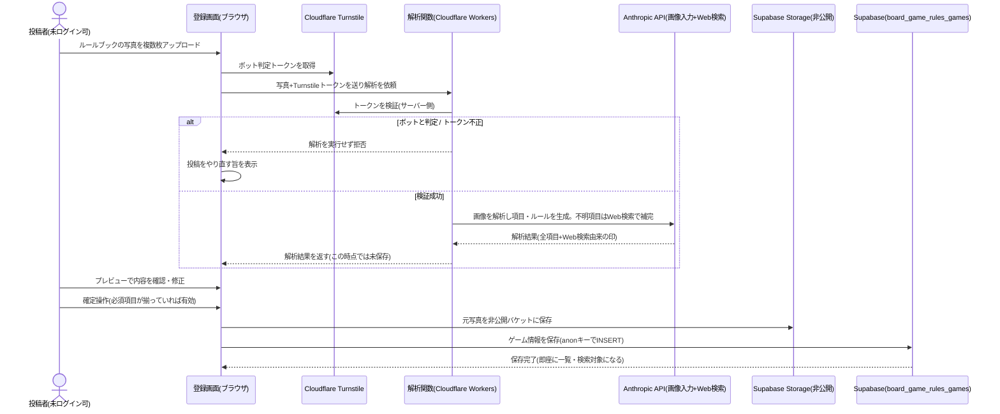
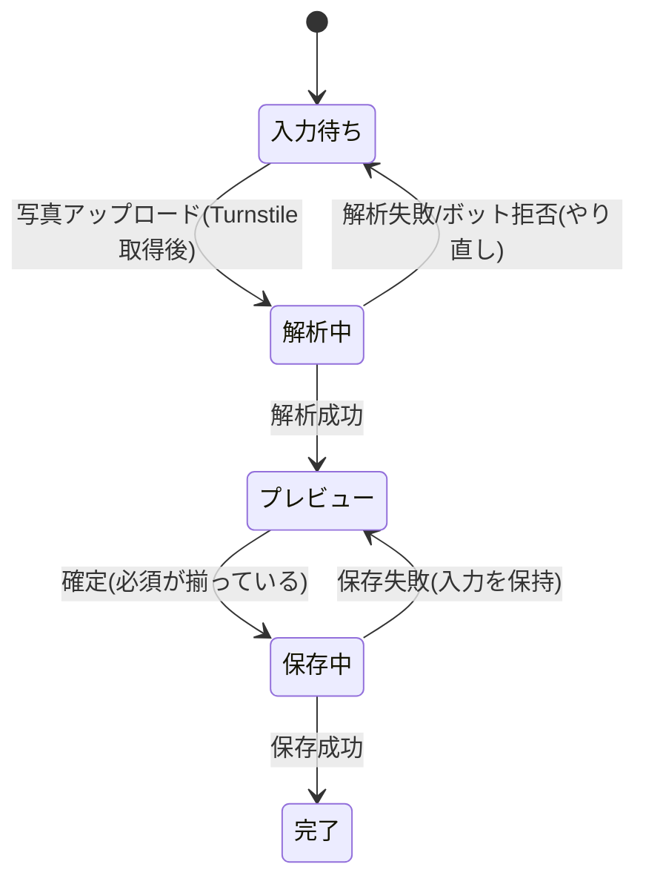

# 設計: ボードゲームの新規登録(写真からのルール生成)

サーバー関数の追加方針は[ADR-0007](../../../docs/adr/0007-runtime-llm-server-and-writable-admin.md)、DB/anonキー方針は[ADR-0001](../../../docs/adr/0001-user-input-database.md)にあるため重複させず、本specでは「写真→解析→プレビュー→確定保存」の処理フロー・データ構造・写真の非公開保存・ボット対策の具体を書く。写真解析用のLLM呼び出しは、サイトで初めて追加するCloudflare Workers関数(以下「解析関数」)で行う。確定保存自体はブラウザからSupabaseへanonキーで直接INSERTする(既存アプリと同じ構成)。

## 共通の章立て(詳しい版の構造)
「詳しい版」は次の固定した章立てに沿って生成・保存する(根拠: 将来、章単位で全ゲームを横断分析できるようにするため。requirements.md#LLMによる解析・生成-5)。各章は空でもよい(該当ルールがないゲームがあるため)。

1. 概要(overview)
2. 準備(setup)
3. 手番の流れ(turn_flow)
4. 勝利条件(victory)
5. 得点計算(scoring)
6. 特殊ルール・例外(special)

章キー(英語識別子)は将来の横断分析のためにDB側で固定し、表示見出し(日本語)は画面側で対応づける。簡単版は章立てを持たない単一のテキストとする。

## 処理フロー



### 写真をアップロードして解析を依頼する処理
- 対象: 登録画面で選択された複数枚の写真
- 手順:
  1. 投稿者が写真を複数枚(表紙・目次・各ページなど)まとめて選択する(requirements.md#写真のアップロード-1)
  2. Cloudflare Turnstileのボット判定トークンを取得する(requirements.md#ボット対策-15)
  3. 選択した写真とTurnstileトークンを解析関数へ送信し、解析中であることが分かる表示(進捗・待機の案内)に切り替える(requirements.md#写真のアップロード-2、requirements.md#非機能要件-1)
  4. 解析関数からの応答(解析結果、または拒否)を待つ。数十秒程度かかることを前提に、待機表示を継続する
- 関連するビジネスルール: requirements.md#写真のアップロード、requirements.md#ボット対策、requirements.md#非機能要件

### 解析関数がボット判定と画像解析を行う処理(サーバー側)
- 対象: 解析関数に届いた「写真+Turnstileトークン」のリクエスト
- 手順:
  1. 受け取ったTurnstileトークンをサーバー側で検証する。検証に失敗(ボット判定・トークン不正・欠落)した場合は、LLMを一切呼び出さずにリクエストを拒否して終える(requirements.md#ボット対策-15、コスト攻撃対策)
  2. 検証に成功した場合、写真を画像入力としてAnthropic APIに渡し、次を生成させる: ゲーム名・対応人数(下限/上限)・プレイ時間(下限/上限)・ジャンル・対象年齢・難易度・メーカー/出版社・作者・言語依存度(日本語ルールの有無)・受賞歴、および簡単版・詳しい版のルール本文(requirements.md#LLMによる解析・生成-3〜5)
  3. 写真だけでは判明しない項目(作者・受賞歴など)は、LLMのWeb検索で補完し候補として埋める。Web検索で補った項目には「Web検索由来」の印を付けて返す(requirements.md#LLMによる解析・生成-6〜7)
  4. ルール本文は「ルール本文の生成方針(著作権配慮)」に従い、原文の言い回しを使わず独自の言い回しで生成する。詳しい版は上記の共通の章立てに沿った構造で返す
  5. 生成結果(全項目+Web検索由来の印)を、DBには保存せずそのまま応答として返す(requirements.md#プレビュー・修正-10)
  6. 解析中に失敗した場合(LLM応答エラー・タイムアウト等)は、解析結果を返さずエラーを返す(後述エラーハンドリング)
- 補足(LLM呼び出し): モデルは`claude-opus-4-8`を使い、画像入力とWeb検索(サーバーツール`web_search_20260209`)を有効にする。項目とルール本文の生成は構造化した形式で受け取り、章立て(上記キー)とWeb検索由来フラグを機械的に扱えるようにする。長い応答を扱うためストリーミングで受ける。APIキーはWrangler Secretsで保持し、ブラウザには一切露出させない(ADR-0007、後述セキュリティ)
- 関連するビジネスルール: requirements.md#LLMによる解析・生成、requirements.md#ボット対策、requirements.md#ルール本文の著作権への配慮

### ルール本文の生成方針(著作権配慮)
- 対象: 簡単版・詳しい版のルール本文
- 手順(LLMへの指示として組み込む):
  1. 説明書原文の言い回しをそのまま転載・複製せず、独自の言い回しで再構成する(requirements.md#ルール本文の著作権への配慮-1)
  2. 「詳しい版」は言い回しを変えつつ、数値・勝利条件・例外処理などルールの実質的な内容を省略・改変しない「精密な言い換え」とする(意訳・大意のみの要約にしない。requirements.md#ルール本文の著作権への配慮-2)
  3. 「簡単版」は要点のみの要約とする
- 関連するビジネスルール: requirements.md#ルール本文の著作権への配慮-1〜2

### プレビューで確認・修正する処理
- 対象: 解析関数が返した解析結果
- 手順:
  1. 解析結果の全項目(分類情報+簡単版・詳しい版のルール本文)を編集可能な形でプレビュー表示する(requirements.md#プレビュー・修正-8)
  2. Web検索由来の印が付いた項目は、その旨が分かる表示にする(手入力・写真からの直接抽出より誤りの可能性が高いため、投稿者が重点的に確認できるようにする。requirements.md#LLMによる解析・生成-7)
  3. どの項目も投稿者が自由に書き換えられるようにする(requirements.md#プレビュー・修正-9)
  4. この時点ではまだDBに保存しない(requirements.md#プレビュー・修正-10)
- 関連するビジネスルール: requirements.md#プレビュー・修正

### 登録を確定して保存する処理
- 対象: プレビューで確認・修正した内容
- 手順:
  1. 必須項目(ゲーム名・対応人数(下限/上限)・プレイ時間(下限/上限))が入力されているか確認する。未入力なら確定操作を無効にする(requirements.md#登録の確定-11、後述バリデーション)
  2. 必須以外の項目(作者・受賞歴・言語依存度など)は空欄のままでも確定できる(requirements.md#登録の確定-12)
  3. ログイン中でかつ運営者本人の場合、そのゲームに「運営者登録」タグを付ける。未ログイン、または運営者以外の場合はタグを付けない(requirements.md#登録の確定-14。運営者判定は[user-auth/design.md](../user-auth/design.md))
  4. 確定操作で、まず元写真を非公開のStorageバケットに保存し、そのパスを控える(requirements.md#写真の取り扱い-4)
  5. 続いてゲーム情報(全項目+写真パス+運営者登録タグ)をDBにINSERTする。保存が成功すると即座に一覧・検索の対象になる(承認制にしない。requirements.md#登録の確定-13、requirements.md#公開ポリシー-5)
  6. 保存に成功したら、登録したゲームの詳細画面へ案内する(または登録完了を明示する)
  7. 写真保存またはDB保存に失敗した場合は、確定前の状態(入力内容を保持したプレビュー)に留め、失敗が分かる表示をする(後述エラーハンドリング)
- 補足(運営者登録タグの防御): 運営者登録タグは、DB側のRLSで「運営者本人のセッションでのみ真の値を保存できる」ように担保する。画面側の判定を迂回して未ログイン/非運営者がタグを付けることはできない(後述データベース設計・セキュリティ)
- 関連するビジネスルール: requirements.md#登録の確定、requirements.md#写真の取り扱い、requirements.md#公開ポリシー

## バリデーション
- ゲーム名・対応人数(下限/上限)・プレイ時間(下限/上限)は必須。いずれかが未入力のままでは確定操作を無効にする(requirements.md#登録の確定-11)
- 対応人数・プレイ時間は下限≤上限であること(下限が上限を超える入力は確定できない。境界値の下限=上限は許容。requirements.md#入力値の制約-9)。範囲の妥当性は画面側で検証し、DB側でもCHECK制約で担保する(画面側の入力制限だけに頼らない。後述データベース設計・セキュリティ)
- ルール本文(簡単版・詳しい版)には文字数の上限を設ける(requirements.md#入力値の制約-10)。上限値は実装時に、想定される説明書の分量から決める(画面側の入力制限に加え、DB側でもCHECK制約で担保する)

## エラーハンドリング
- Turnstile検証失敗は、解析関数がLLMを呼ばずに拒否する。画面は「もう一度お試しください」の趣旨の定型表示にとどめ、詳細な理由は画面に出さない(ボット・攻撃者に手がかりを与えないため)
- 解析関数のLLM呼び出しが失敗・タイムアウトした場合、解析結果を返さず、画面は「解析に失敗しました。写真を見直して再度お試しください」の趣旨を表示し、投稿者が再アップロードできるようにする。Supabase/LLMの生のエラーメッセージは画面に出さない
- 確定時の写真保存・DB保存の失敗は、投稿者が明示的に指示した操作の失敗のため、画面に失敗が分かる定型表示をする。入力内容(プレビュー)は保持し、やり直せるようにする。写真は保存できたがDB保存に失敗した、という中途半端な状態では、次の再試行で写真を保存し直しても実害はない(孤立した写真が残るだけ。運営者が[admin](../admin/requirements.md)で照合する対象は保存済みレコードに紐づくもののみ)
- 確定処理中は確定操作を無効化し、二重登録を防ぐ

## 関連するファイル(抜粋)
```
worker/index.ts (新規: Cloudflare Workers のエントリ。/board-game-rules のAPIパスへのPOSTを解析関数へ振り分け、それ以外は静的アセット(ASSETS)へフォールバックする)
worker/boardGameRules/analyze.ts (新規: 解析関数本体。Turnstile検証→画像解析(Anthropic API)→結果整形)
worker/boardGameRules/prompt.ts (新規: 解析用プロンプト・出力スキーマ・共通章立ての定義)
wrangler.toml (既存: main と [assets] の binding を追加し、静的配信を維持したままWorkers関数を同居させる)
app/board-game-rules/register/page.tsx (新規: 登録画面。アップロード→解析依頼→プレビュー→確定の一連を持つクライアント画面)
app/board-game-rules/lib/analyzeClient.ts (新規: 解析関数へ写真+Turnstileトークンを送り結果を受け取るラッパー)
app/board-game-rules/lib/games.ts (新規: ゲームの保存(写真Storage保存+INSERT)。game-list/game-detailと共有する型定義もここに置く)
app/board-game-rules/lib/rulesChapters.ts (新規: 共通章立てのキー↔表示見出し対応。game-detailと共有)
app/board-game-rules/components/Turnstile.tsx (新規: Turnstileウィジェットの読み込み・トークン取得)
app/board-game-rules/components/GamePreviewForm.tsx (新規: 解析結果の確認・修正フォーム。Web検索由来の印・必須検証を含む)
app/lib/supabaseClient.ts (既存の共通クライアントを利用)
app/lib/adminAuth.ts (既存: isAuthorizedAdmin で運営者判定)
app/legal/page.tsx (既存: 利用規約に知的財産の条項を追記)
```

### Cloudflare Workers関数の配置(サーバー機能の追加)
- 静的配信(`next.config.ts`の`output: "export"` → `./out`)は維持したまま、Workersのスクリプト(`main`)を追加し、`[assets]`に`binding`を与えて同居させる。Workerは`/board-game-rules`配下の解析APIパスへのPOSTだけを自前で処理し、それ以外のリクエストはすべて`ASSETS`(静的ファイル)へフォールバックする。これにより他アプリ・他ページの静的配信には一切影響しない(ADR-0007)
- 解析関数だけがAnthropic APIキー・Turnstileシークレットを保持する。いずれもWrangler Secretsで管理し、ビルド成果物・ブラウザに露出させない
- 実装着手前に`node_modules/next/dist/docs/`および[wrangler skill](../../../.claude/skills/)/Cloudflare公式ドキュメントで、Static Assets + Worker(`main`+`[assets] binding`)の最新の設定方法を確認する(AGENTS.mdの指示に従う)

## データベース設計

新規テーブル`board_game_rules_games`と、非公開のStorageバケットを作る。個人データそのものではないが、投稿写真は機微になりうる原本のため一般公開しない。

### board_game_rules_games(新規)
| カラム | 型 | 補足 |
|---|---|---|
| id | uuid, primary key, default gen_random_uuid() | ゲームID。お気に入り・コメント・通報から参照される |
| name | text, not null | ゲーム名(必須) |
| min_players | int, not null | 対応人数の下限(必須) |
| max_players | int, not null | 対応人数の上限(必須) |
| min_minutes | int, not null | プレイ時間の下限(分、必須) |
| max_minutes | int, not null | プレイ時間の上限(分、必須) |
| genre | text, nullable | ジャンル |
| min_age | int, nullable | 対象年齢(以上) |
| difficulty | text, nullable | 難易度 |
| publisher | text, nullable | メーカー/出版社 |
| author | text, nullable | 作者。作者はテキスト検索の対象([game-list](../game-list/design.md)) |
| has_japanese_rules | boolean, nullable | 言語依存度(日本語ルールの有無)。未判明はNULL |
| awards | text, nullable | 受賞歴。空(NULL)なら受賞歴なしとして扱う |
| rules_simple | text, not null | 簡単版(要約) |
| rules_detailed | jsonb, not null | 詳しい版。共通の章立ての配列 `[{ "key": "overview", "body": "..." }, ...]`。章キーは上記の固定値 |
| is_official | boolean, not null, default false | 運営者登録タグ。運営者本人が登録した場合のみtrue |
| photo_paths | text[], not null | 非公開Storageに保存した元写真のパス(照合用。一般には返さない) |
| created_at | timestamptz, not null, default now() | 登録日時。一覧の初期の並び順に使う |
| deleted_at | timestamptz, nullable | 運営者による削除日時。NULLなら公開中。論理削除にすることで、通報・元写真の照合レコードを保持する([admin/design.md](../admin/design.md)) |

- 制約: `check (min_players <= max_players)`、`check (min_minutes <= max_minutes)`。ルール本文の文字数上限も`check (char_length(...) <= N)`で担保する(上限値は実装時に確定)
- 一覧・検索・詳細が対象とするのは`deleted_at is null`の行のみ([game-list/design.md](../game-list/design.md)、[game-detail/design.md](../game-detail/design.md))

### 元写真のStorage(新規: 非公開バケット)
- 投稿された元写真を保存する非公開バケットを作る。一般の閲覧者・anon・authenticatedはダウンロードできず、運営者本人(`admin_emails`に載るアカウント)のみが照合用に取得できる(requirements.md#写真の取り扱い-4、[admin/design.md](../admin/design.md))
- バケット名・パス設計・Storageのアクセスポリシー(SELECTを運営者のみに絞る)は[admin/design.md](../admin/design.md)と揃えて確定する。バケット自体の作成・ポリシーはマイグレーション(またはStorage設定)として実装より先に用意する

### マイグレーション(実装より先に単独PRで適用)
`docs/adr/0003`に従い`supabase/migrations/`のSQLとしてコミットし、mainマージ時にCIが自動適用する。RLSポリシーが無い状態では登録・閲覧が全拒否になり実装確認ができないため、実装コードより先に適用する。

```sql
create table board_game_rules_games (
  id uuid primary key default gen_random_uuid(),
  name text not null,
  min_players int not null,
  max_players int not null,
  min_minutes int not null,
  max_minutes int not null,
  genre text,
  min_age int,
  difficulty text,
  publisher text,
  author text,
  has_japanese_rules boolean,
  awards text,
  rules_simple text not null,
  rules_detailed jsonb not null,
  is_official boolean not null default false,
  photo_paths text[] not null,
  created_at timestamptz not null default now(),
  deleted_at timestamptz,
  check (min_players <= max_players),
  check (min_minutes <= max_minutes)
);
alter table board_game_rules_games enable row level security;

-- 閲覧: 公開中(削除されていない)の行は誰でもSELECTできる。
-- photo_paths(元写真パス)は列単位のSELECT権限から除外し、anon が直接
-- `select photo_paths ...` できないようにする(列単位の秘匿をDB側で担保する。本specを正とする)。
-- 運営者は照合閲覧で photo_paths が必要なため authenticated には全列SELECTを付与し、
-- 行はRLSで制御する(admin/design.md)。
grant select (
  id, name, min_players, max_players, min_minutes, max_minutes,
  genre, min_age, difficulty, publisher, author, has_japanese_rules,
  awards, rules_simple, rules_detailed, is_official, created_at, deleted_at
) on board_game_rules_games to anon;
grant select on board_game_rules_games to authenticated;
create policy "anyone can select published games" on board_game_rules_games
  for select to anon, authenticated using (deleted_at is null);

-- 登録: 未ログイン(anon)は is_official=false でのみINSERTできる
grant insert on board_game_rules_games to anon, authenticated;
create policy "anon can insert non-official games" on board_game_rules_games
  for insert to anon with check (is_official = false and deleted_at is null);

-- 登録: ログイン中は、運営者本人のときのみ is_official=true を許可。
-- 運営者以外のログインユーザーは is_official=false でのみINSERTできる
create policy "authenticated can insert games" on board_game_rules_games
  for insert to authenticated with check (
    deleted_at is null
    and (is_official = false
         or (auth.jwt() ->> 'email') in (select email from admin_emails))
  );

-- 管理: 運営者本人は全行SELECT(削除済み含む)・UPDATE(編集・論理削除)ができる(admin/design.md)
create policy "admin can select all games" on board_game_rules_games
  for select to authenticated
  using ((auth.jwt() ->> 'email') in (select email from admin_emails));
grant update on board_game_rules_games to authenticated;
create policy "admin can update games" on board_game_rules_games
  for update to authenticated
  using ((auth.jwt() ->> 'email') in (select email from admin_emails))
  with check ((auth.jwt() ->> 'email') in (select email from admin_emails));

-- benriyatool_readonly はSELECTのみ(docs/adr/0004)
grant select on board_game_rules_games to benriyatool_readonly;
create policy "benriyatool_readonly can select games" on board_game_rules_games
  for select to benriyatool_readonly using (true);
```

- 元写真の非公開Storageバケットとそのアクセスポリシー(運営者のみSELECT)は[admin/design.md](../admin/design.md)のマイグレーションで作る(通報確認・照合閲覧と同じPRにまとめてよい)。本specの登録処理は、そのバケットへ写真を保存する側になる
- `photo_paths`列を一般に返さない扱いは、上記マイグレーションの**列単位のSELECT権限**でDB側に担保する(本specを担保の正とし、相互参照で宙吊りにしない)。`anon`には`photo_paths`を除く列のみSELECTを付与するため、細工したクライアントが`select photo_paths ...`を直接発行してもDBが拒否する。一覧・詳細・お気に入りの画面側クエリは従来どおり必要な列のみを選択する(挙動は変わらない)。運営者は`authenticated`の全列SELECT+admin RLSで`photo_paths`を取得する([admin/design.md](../admin/design.md))。なお、ログイン済みの一般利用者(`authenticated`)は`photo_paths`文字列を読みうるが、写真本体はStorageのSELECTを運営者に限定するため露出はパス文字列にとどまる(残余リスクは低。多層防御の一段はStorage側で担保)

T0(マイグレーション適用)の実機確認:
- 未ログイン(anon)で`is_official=false`のINSERTができ、`is_official=true`のINSERTは拒否されること
- 運営者以外のログインで`is_official=true`のINSERTが拒否されること、運営者本人では許可されること
- anon/authenticatedで`deleted_at is null`の行がSELECTでき、`deleted_at`が入った行はSELECトされないこと
- anonが`select photo_paths from board_game_rules_games`を発行すると権限エラーで拒否されること(列単位の秘匿)。一方で`photo_paths`を含まない必要列のSELECTは成功すること
- 下限>上限のINSERTがCHECK制約で拒否されること

## API設計(解析関数のエンドポイント)
本アプリで初めてサーバー側の処理(解析関数)を持つ。エンドポイントは1つだけで、写真解析専用とする。

- パス: `/board-game-rules` 配下の解析用パス(POST)。具体的なパス名は実装時に確定する
- リクエスト: 写真(複数)とTurnstileトークン
- レスポンス: 解析結果(全項目+Web検索由来の印)。DBには保存しない。失敗時はエラー
- 認可: Turnstile検証に成功したリクエストのみ処理する。ログインは要求しない(匿名投稿を許すため)

## コンポーネント設計

| コンポーネント | Props | 役割 |
|---|---|---|
| Turnstile | `onToken: (token: string) => void` | Turnstileウィジェットを表示し、取得したトークンを親へ渡す |
| GamePreviewForm | `initial: 解析結果, isOfficialCandidate: boolean, onConfirm: (game) => void` | 解析結果を編集可能に表示し、必須検証・Web検索由来の印を扱い、確定時に保存対象を親へ渡す |

## 状態管理
- 登録画面(`register/page.tsx`)は「入力待ち」「解析中」「プレビュー(確認・修正中)」「保存中」「完了」の状態をローカルに持つ。解析結果・修正中の各項目値・Turnstileトークンも画面のローカル状態として持つ(複数画面をまたがないためグローバルな状態管理は使わない)



## セキュリティ
- **APIキーの秘匿**: Anthropic APIキーとTurnstileシークレットは解析関数(Workers)のWrangler Secretsにのみ保持し、ビルド成果物・ブラウザに一切露出させない(ADR-0007)。解析関数のコードはキー露出につながる箇所を丁寧にレビューする
- **コスト攻撃対策**: 解析関数はTurnstile検証に成功したリクエストのみLLMを呼ぶ。検証前・検証失敗時はLLMを一切呼ばない(匿名投稿によるLLM費用の無制限消費を防ぐ。ADR-0007)。あわせて、1リクエストあたりの写真枚数・サイズの上限を設け、極端な入力での費用増を抑える(上限値は実装時に確定)
- **登録INSERT/写真アップロードの防御境界**: Turnstile・解析関数が守るのは「解析(LLMコスト)」だけである。確定保存のゲーム情報INSERT(anonキーで直接INSERT)と元写真のStorageアップロード(anonキーで直接アップロード)は解析関数もTurnstileも経由しないため、ボット対策の外にある。CHECK制約(必須・下限≤上限・文字数上限)を満たす限り、直接INSERTによるスパムゲームの即時公開は防げない。これはADR-0007が容認した割り切り(即時公開+事後モデレーション+通報)で、対応は[admin](../admin/requirements.md)のモデレーションと[report](../report/requirements.md)の通報で行う。元写真の直接アップロードによるStorage濫用への量的制約は[admin/design.md#元写真の非公開Storage](../admin/design.md)のバケットポリシー(サイズ・MIME・枚数上限)で担保する
- **運営者登録タグの改ざん防止**: `is_official=true`はDB側のRLSで運営者本人のセッションに限定する。画面側の運営者判定を迂回して未ログイン/非運営者がタグを付けることはできない(上記データベース設計)
- **元写真の非公開**: 投稿写真は原本の複製にあたるため一般公開しない。非公開バケットに保存し、SELECTを運営者のみに絞る([admin/design.md](../admin/design.md))。詳細画面・一覧は`photo_paths`を返さないうえ、`anon`は列単位のSELECT権限から`photo_paths`が除外され直接読み取りもDBで拒否される(上記データベース設計。requirements.md#写真の取り扱い、[game-detail/requirements.md#表示対象-2](../game-detail/requirements.md))
- **著作権配慮**: ルール本文は原文の逐語転載を避け独自の言い回しで生成する(上記「ルール本文の生成方針」)。加えて利用規約に、掲載が独自再構成であること・権利者からの申し出に速やかに対応する旨を追記する(requirements.md#利用規約への反映-8。[ai-dev-digest/content-generation](../../ai-dev-digest/content-generation/requirements.md)と同じパターン)
- **入力のサニタイズ**: プレビューで修正されうる全項目・ルール本文は、表示時にHTMLとして解釈されない形で描画する(Reactの標準描画に任せ、`dangerouslySetInnerHTML`は使わない)。これは詳細画面([game-detail/design.md](../game-detail/design.md))でも同じ方針

## パフォーマンス
- 解析(画像解析+Web検索)は数十秒程度かかる想定のため、解析関数の応答はストリーミングで受け、画面は待機中であることが分かる表示を継続する(requirements.md#非機能要件-1)。体感時間の許容とタイムアウト値は実装時に、実際の応答時間を見て確定する

## ログ
- 解析関数: リクエスト受付、Turnstile検証の結果(成功/拒否)、LLM呼び出しの開始・終了・失敗をログに出す。写真の中身・生成本文はログに含めず、件数・所要時間・失敗種別にとどめる(費用と失敗の監視のため)。APIキー・トークンはログに出さない
- 登録画面(ブラウザ): 解析失敗・保存失敗を、原因究明のためコンソールに出す(画面には定型表示のみ)。成功時はログを出さない(通常操作のため)

## 依存関係
- 写真解析のサーバー関数追加は[ADR-0007](../../../docs/adr/0007-runtime-llm-server-and-writable-admin.md)、DB/anonキー構成は[ADR-0001](../../../docs/adr/0001-user-input-database.md)に従う
- 登録されたゲームは[game-list](../game-list/design.md)・[game-detail](../game-detail/design.md)の対象になる。共通の型定義(ゲーム)は`app/board-game-rules/lib/games.ts`、共通章立ては`app/board-game-rules/lib/rulesChapters.ts`に置き、両specから使う
- 運営者判定は[user-auth/design.md](../user-auth/design.md)の`isAuthorizedAdmin`を使う
- 元写真の非公開Storageと運営者のみの照合閲覧は[admin/design.md](../admin/design.md)。通報を受けた事後対応は[admin](../admin/requirements.md)・[report](../report/requirements.md)
