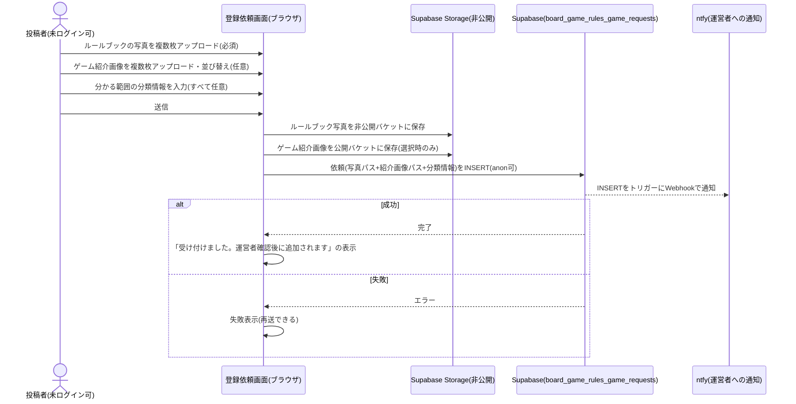
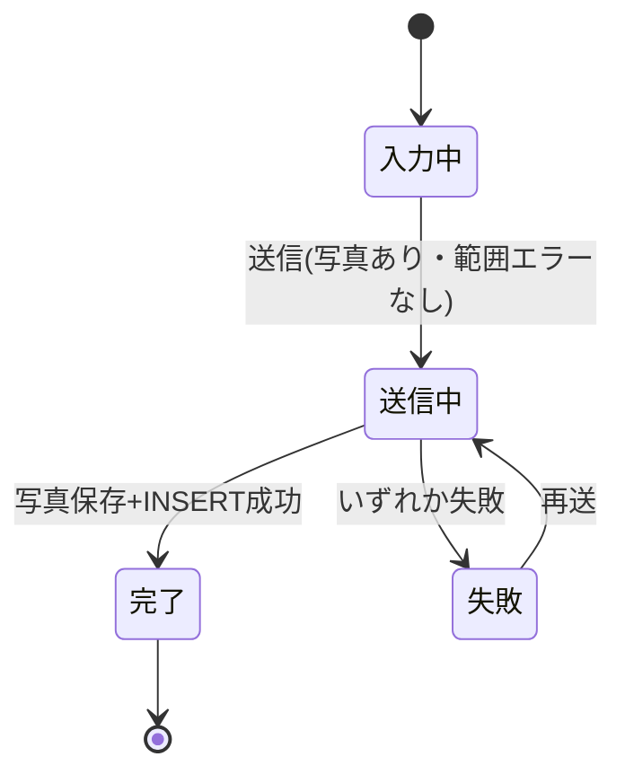

# 設計: ボードゲームの新規登録(写真からのルール生成)

DB/anonキー方針は[ADR-0001](../../../docs/adr/0001-user-input-database.md)にあるため重複させず、本specでは「写真+分類情報の依頼送信→保存→運営者への通知」という処理フローと、依頼の保存構造を書く。**LLM解析はこのWebアプリ(Cloudflare Workers)上では一切行わない**。利用者は写真+分類情報の依頼を送信するだけで、写真解析・ルール生成・登録は運営者のローカル環境で行う(背景は[docs/adr/0007](../../../docs/adr/0007-runtime-llm-server-and-writable-admin.md))。運営者による実際の登録処理は[admin/design.md](../admin/design.md)を参照。

## 処理フロー



### 依頼を送信する処理
- 対象: 登録依頼画面で入力された写真・ゲーム紹介画像・分類情報
- 手順:
  1. 投稿者が写真を複数枚(表紙・目次・各ページなど)選択する。最低1枚は必須(requirements.md#写真のアップロード-1)
  2. 投稿者は、ゲーム紹介画像を複数枚(任意、上限20枚)選択できる。0枚のまま送信してもよい(requirements.md#ゲーム紹介画像のアップロード-9)
  3. 分類情報(ゲーム名・対応人数・プレイ時間・ジャンル・対象年齢・難易度・メーカー・作者・言語依存度・受賞歴・発売年)を任意で入力する。ジャンルは固定の選択肢(下記「ジャンルの選択肢」)から複数選べる(requirements.md#分類情報の任意入力-4)
  4. 送信操作で、まずルールブック写真を非公開Storageバケットへ保存し、パスを控える(既存の[admin/design.md#元写真の非公開Storage](../admin/design.md)のバケットをそのまま使う)
  5. ゲーム紹介画像を選択していれば、続けて公開Storageバケット([admin/design.md#ゲーム紹介画像の公開Storage](../admin/design.md))へ、下記「ゲーム紹介画像を選択・並び替える処理」で確定した並び順どおりに保存し、パスを配列で控える(0枚の場合はこの手順をスキップし、空配列のまま次に進む)
  6. 続けて、ルールブック写真パス+ゲーム紹介画像パス(順序付き配列)+入力済み分類情報を`board_game_rules_game_requests`にINSERTする(未ログインでも送信できる。requirements.md#依頼の送信-5)
  7. 保存が成功したら、完了表示に切り替える(requirements.md#依頼の送信-6)。この時点ではゲームは一覧・検索の対象にならない(公開は運営者の登録作業を経てから。requirements.md#公開ポリシー-5)
  8. いずれかの保存(ルールブック写真・ゲーム紹介画像・DB)に失敗した場合は、入力内容を保持したまま失敗表示をし、再送できるようにする(requirements.md#依頼の送信-7)
- 関連するビジネスルール: requirements.md#写真のアップロード、requirements.md#ゲーム紹介画像のアップロード、requirements.md#分類情報の任意入力、requirements.md#依頼の送信

### ゲーム紹介画像を選択・並び替える処理
- 対象: 依頼フォームで選択したゲーム紹介画像(送信前、ブラウザ内のみで完結する操作)
- 手順:
  1. 投稿者はゲーム紹介画像を任意で複数枚(上限20枚。ルールブック写真とは別枠でカウントする)選択できる(requirements.md#ゲーム紹介画像のアップロード-9)
  2. 選択した各画像に「メイン画像にする」操作を用意する。押すとその画像が選択済み画像の先頭へ移動し、他の画像は選択順を保ったまま1つずつ後ろへずれる(requirements.md#ゲーム紹介画像のアップロード-11)
  3. 常に先頭の画像に「メイン画像」の印を表示し、どれが一覧・詳細のメイン画像になるかを投稿者が確認できるようにする(requirements.md#ゲーム紹介画像のアップロード-10)
  4. 画像は個別に削除できる(ルールブック写真の`PhotoUploader`と同様)
- 補足: 上限20枚に達した状態からの追加選択は切り捨てる(`PhotoUploader`の既存挙動と同じ)。並び替えの操作は「先頭へ移動」のみを提供し、任意の2枚を入れ替える汎用ドラッグ&ドロップは設けない(要件が求めるのは「どれをメイン画像にするか」の指定であり、それ以外の順序に業務上の意味を持たないため。シンプルさを優先する判断)
- 関連するビジネスルール: requirements.md#ゲーム紹介画像のアップロード

### 運営者へ通知する処理
- 対象: `board_game_rules_game_requests`への新規INSERT
- 手順: Supabase Database WebhooksでINSERTイベントを購読し、ntfyの**Message Templating機能**(インラインテンプレート`?tpl=yes`)を使って、届いた行のJSONペイロードからタイトル・本文・クリックURLを組み立ててHTTP POSTする(既存のClaude Codeセッション通知と同じntfy運用を流用。requirements.md#運営者への通知-8)
- 補足(通知の中身): タイトルは「新しい登録依頼」、本文はゲーム名(入力があれば)と写真枚数、クリックURLは管理画面(`/board-game-rules/admin`)への直リンクとする。中継サーバーは新設せず、Supabase Database Webhooksの送信先URLにntfyのテンプレート構文(Goテンプレート、`{{.record.xxx}}`でペイロードのフィールドを参照)を組み込むだけで実現する(ntfy公式のテンプレート機能。詳細は[tasks.md](tasks.md)の手動設定手順で確定する)
- 補足(トピック名の秘匿): ntfyのトピック名は非公開情報として扱い、マイグレーションSQLに平文で残さない(下記セキュリティ参照)
- 関連するビジネスルール: requirements.md#運営者への通知-8

## ジャンルの選択肢
一覧の絞り込み([game-list/design.md](../game-list/design.md))で選択肢を安定させるため、ジャンルは自由記述ではなく固定リストとし、**1ゲームにつき複数選択できる**(requirements.md#分類情報の任意入力-4)。選択画面(依頼フォーム・admin編集フォーム)では、各選択肢の横に説明を表示する。

投稿者が依頼フォームで選ぶジャンルはあくまで参考情報であり、最終的な値は運営者のローカル登録ツール(下記「登録依頼からゲームを登録するローカルツール」、[admin/design.md](../admin/design.md))が写真・ルール内容を踏まえてAI自身で判断し、投稿者の選択を鵜呑みにせず当てはまるジャンルを追加・修正できる。そのため選択肢数を絞る必要がなく、認知度の高いジャンルを広めに用意する(2026-08、ユーザーとの議論での判断。「選択肢が多いと投稿者が悩んで正確に選べない」という懸念は、AIが最終判断を担うことで実害にならないと整理した)。

| ジャンル | 説明 |
|---|---|
| 協力 | プレイヤー全員がチームとなり、共通の目標達成を目指す |
| 対戦 | プレイヤー同士が競い合い、勝敗を決める |
| 正体隠匿 | 自分の役職・陣営を隠しながら、味方を探したり相手を見破ったりする(人狼系) |
| 戦略 | 運要素が少なく、長期的な計画・判断力が問われる重量級のゲーム |
| パーティー | 大人数でわいわい盛り上がる、ルールが簡単なゲーム |
| ファミリー | 子供から大人まで気軽に遊べる、軽いルールのゲーム |
| カードゲーム | カードを中心に進行するゲーム |
| すごろく系 | サイコロを振ってマスを進み、指示に従って進行する(人生ゲーム的) |
| ワーカープレイスメント | 手持ちのコマをマスに配置してアクションを実行する |
| デッキ構築 | プレイしながら自分のカード山を強化していく |
| 推理・デダクション | 手がかりから答えを論理的に導き出す |
| 拡大再生産 | 資源を投資して資産をどんどん増やしていく |
| 陣取り・エリアマジョリティ | ボード上のエリアを取り合う |
| タイル配置 | タイルを場に並べて盤面を作っていく |
| ドラフト | 手元に回ってきたカードやタイルから選び取る |
| セットコレクション | 特定の組み合わせを集めて得点する |
| ハンドマネージメント | 手札をやりくりして最適なプレイを選ぶ |
| 競り・オークション | 品物を巡って入札し合う |
| ベッティング・予想 | 結果を予想して賭ける |
| トリックテイキング | 手札を出し合って勝敗を競うカード技法 |
| ダイスロール | サイコロの出目でゲームが進行する |
| ブラフ・心理戦 | 嘘や駆け引きで相手を欺く |
| アブストラクト | 運要素なしの純粋な実力勝負 |
| アクション | バランス・スピードなど身体動作を伴う |
| 表現・言葉遊び | お題を言葉や絵で伝える(ジェスチャー・お絵描き系) |
| レガシー | キャンペーン形式でシナリオが進行・変化していく |
| ウォーゲーム | 戦争・軍事をテーマにした重量級ゲーム |
| その他 | 上記に当てはまらないゲーム |

この一覧(値+説明)は`app/board-game-rules/lib/genres.ts`(新規)に定義し、依頼フォーム・game-list絞り込み・admin編集フォームで共有する。DB側もCHECK制約でこの一覧の値のみで構成されることを担保する(下記データベース設計)。

## バリデーション
- 写真: 最低1枚必須(requirements.md#写真のアップロード-1)、上限20枚(匿名アップロードの量的制約。[admin/design.md#元写真の非公開Storage](../admin/design.md)参照)
- ゲーム紹介画像: 0枚(任意)〜上限20枚(requirements.md#ゲーム紹介画像のアップロード-9。ルールブック写真とは別枠のカウント)
- 対応人数・プレイ時間: 下限・上限は個別に任意入力(片方のみの入力も許容する)。両方入力されている場合のみ下限≤上限であること(下限>上限は送信不可。requirements.md#入力値の制約-9)。DB側でも同じ条件のCHECK制約で担保する(どちらか一方でもnullならCHECKをスキップする)
- ジャンル: 選択する場合、上記固定リストの値のみで構成されること(0個・複数選択のいずれも可)

## 元写真のStorage
依頼の写真は[admin/design.md#元写真の非公開Storage](../admin/design.md)で定義済みの非公開バケット(`board-game-rules-photos`)にそのまま保存する。運営者が登録時に使う元写真もこのバケットを共有する(依頼時の写真パスをそのまま`board_game_rules_games.photo_paths`へ引き継ぐ想定。運営者側の登録処理で別の写真に差し替えることもできる)。

## ゲーム紹介画像のStorage
ゲーム紹介画像は、上記の元写真バケットとは別の**公開**Storageバケット(`board-game-rules-game-photos`)に保存する(定義は[admin/design.md#ゲーム紹介画像の公開Storage](../admin/design.md)。バケットを分ける理由は、元写真=非公開・紹介画像=公開という公開範囲そのものが異なるため。requirements.md#ゲーム紹介画像の取り扱い-10)。依頼時点ではゲームIDが未確定のため、元写真と同じ考え方でクライアント採番のアップロードUUID配下に保存する(`<アップロードUUID>/<並び順の連番>.<拡張子>`)。運営者のローカル登録ツールが依頼由来でゲームを登録する際は、このパス配列をそのまま`board_game_rules_games.intro_photo_paths`へ引き継ぐ(admin/design.md参照)。

## エラーハンドリング
- 依頼送信(写真保存・DB保存)の失敗は、投稿者が明示的に指示した操作の失敗のため、画面に失敗が分かる定型表示をする。入力内容は保持し、やり直せるようにする
- 送信中は送信操作を無効化し、二重送信を防ぐ

## 画面設計(登録依頼フォームのUI)

登録依頼画面(`/board-game-rules/register`)の見た目・操作を、Step0で確定したビジュアルデザインに沿って定める。上記の処理フロー・ロジックは変えず、レイアウト・配色・ジャンル選択のインタラクションを刷新する(実装済みの素朴版UIからの作り替え。PR #181でStep0が抜けていた分の後追い)。

**確定デザインの出所**: Google Stitchプロジェクト「ボドゲのトリセツ 登録依頼フォーム」(project ID `10756296516233709248`、デザインシステム「Analog Hearth」)。ナビゲーションは同プロジェクトの画面「登録依頼フォーム (共通ナビ適用)」を参照デザインとする。生成HTML(Tailwind)を実装の参照素材とする。方向性は「温かみのあるアナログ感」(MUJI風)、サービス名は「ボドゲのトリセツ」。この配色・雰囲気はboard-game-rulesアプリの視覚言語として他画面にも展開する(まずは本画面で確定し、[favorite/design.md](../favorite/design.md)の左サイドバー共通ナビと揃える)。

### デザイントークン(Analog Hearth)
配色・フォント・角丸・階層表現(影を使わず1px罫線で階層を出す方針と、写真サムネイルのポラロイド風の影の例外を含む)・アクセシビリティの各トークンの定義は、アプリ共通の一元管理先 [DESIGN.md](../DESIGN.md) を参照する(値をここに書き写すと二重管理になるため。実体は `app/globals.css` の `bgr-*`)。

### ナビゲーション(左サイドバー共通ナビ)
board-game-rulesアプリ全体で共有する左サイドバー(`components/BoardGameNav.tsx`)を本画面にも適用する([favorite/design.md](../favorite/design.md)「お気に入り一覧画面」で確定した共通ナビと同一)。
- **ブランディングブロック**: 上部にサービスの抽象ロゴ+「ボドゲのトリセツ」+サブテキスト「アナログゲームガイド」。ロゴはボードゲームの汎用モチーフ(駒/ミープルのシルエット)で、囲碁・将棋等の特定ゲームを連想させない
- **ナビゲーションリンク**: Stitch参照デザインではHome/Search/Add Game/お気に入り/Profileの5項目だが、遷移先画面が実装済みなのは「一覧(Home)」「登録依頼(Add Game)」「お気に入り」の3つのみ(game-detail/Profile等はまだ仕様のみで未実装)。存在しないURLへのリンクは404になるため、実装済みの3項目のみをリンクとして並べ、本画面(登録依頼)を選択中(`aria-current="page"`)でハイライトする。残りの項目は対応画面の実装時に追加する
- **モバイル(md未満)**: サイドバーは隠し、本文を優先する(favoriteと同方針)
- **パンくず**: 本文上部に「べんりやつーる › ボドゲのトリセツ › 登録依頼」を置く(ボドゲのトリセツのトップは[game-list](../game-list/design.md)の実装によりリンク化済み)
- **任意ログインの状態表示**: 既存の`LoginStatus`を本文エリア上部(右寄せ)に置く。共通ナビ自体はログイン状態に依存しない実装済み画面リンクのみで構成し、ログイン導線は各画面本文が持つ既存方針を踏襲する

### 表示項目・操作(上から)
- **写真アップロード(主役)**: 画面最上部に大きく配置。ドラッグ&ドロップ+クリック選択、「ルールブックの全ページを推奨」の補足、選択枚数(例 3/20枚)とサムネイル一覧・削除。必須(1枚以上)。選択済みサムネイルは**ポラロイド写真風**(白フチ・下側を厚めに・軽い影・1枚ずつわずかに傾ける)で見せ、アナログ感を演出する(ホバーで傾きを戻す)
- **ゲーム紹介画像アップロード(任意、写真アップロードの直後)**: 「パッケージ・コンポーネント・プレイ風景などがあれば」の補足付きで、ルールブック写真と同様のドラッグ&ドロップ+クリック選択・サムネイル一覧(枚数表示 例 2/20枚)・削除を提供する。各サムネイルに「メイン画像にする」ボタンを添え、先頭(=メイン画像)には「メイン」バッジを表示する(design.md「ゲーム紹介画像を選択・並び替える処理」)。任意項目のため未選択でも送信でき、必須のルールブック写真ほど強調しない(サムネイルサイズ・見出しの強さで写真アップロードと差をつける)
- **基本情報**: ゲーム名 / 対応人数(下限〜上限)/ プレイ時間(分、下限〜上限)。下限>上限のときインラインでエラー表示
- **ジャンル・メカニクス(アコーディオン折りたたみ)**: 既定は閉じた1行。開くと固定リスト(28種、`lib/genres.ts`)をチップで複数選択できる。**各ジャンルの説明文は、選択したチップの直下にだけ表示する**(全項目に常時表示しない=情報過多を避ける)
- **詳細情報(軽い区切り)**: 対象年齢 / 難易度 / メーカー・出版社 / 作者 / 言語依存度(わからない・日本語ルールあり・なし)/ 受賞歴 / 発売年。いずれも任意で、セクション見出しと淡い区切りのみでまとめる
- **送信ボタン**: モスグリーンの主要ボタン。写真未選択・範囲エラー・送信中は無効化(二重送信防止)
- **完了状態**: 送信成功で「受け付けました。運営者確認後に追加されます」の完了表示へ画面全体を切り替える(チェックのアイコン+ねぎらいの一文)
- **失敗状態**: 送信失敗時は入力を保持したまま失敗表示、再送できる

### 状態遷移図

図は俯瞰用の補助で、正は上記「表示項目・操作」の記述(状態管理は既存の`status`: idle/submitting/success/error を流用)。

### レスポンシブ
- モバイル(1カラム)を基本に、デスクトップは読みやすい単一カラム幅(最大720px前後)で中央寄せ。基本情報の下限〜上限は横並び、狭幅では折り返す

現行の素朴版UI(灰色ベース・ジャンル常時表示・説明常時表示)からの差分が今回の作り替え対象。ロジック(`createGameRequest`・バリデーション・状態遷移)は既存のまま流用する。

## 関連するファイル(抜粋)
```
app/board-game-rules/register/page.tsx (変更: 写真アップロード+分類情報の任意入力+送信のみのシンプルな画面に縮小。解析・プレビュー・確定の一連は撤廃。ナビゲーションは左サイドバー共通ナビに作り替え。ゲーム紹介画像アップロードを追加)
app/board-game-rules/components/BoardGameNav.tsx (新規: アプリ共通の左サイドバーナビ。register/favoritesで共有。実装済み画面のリンクのみをactiveハイライト付きで並べる)
app/board-game-rules/lib/gameRequests.ts (変更: createGameRequest。写真Storage保存+INSERT。ゲーム紹介画像の公開Storage保存を追加)
app/board-game-rules/lib/genres.ts (新規: ジャンルの固定選択肢定義。game-list/adminと共有)
app/board-game-rules/lib/gamePhotos.ts ([game-list/design.md](../game-list/design.md)で新規実装: ゲーム紹介画像の公開URL変換 getGamePhotoUrl。本specでは実装せずgame-list/game-detail/adminと共有利用のみ)
app/board-game-rules/components/PhotoUploader.tsx (新規: 複数枚の写真選択・プレビュー。ルールブック写真用)
app/board-game-rules/components/GamePhotoUploader.tsx (新規: ゲーム紹介画像用。複数枚選択・プレビュー・削除に加え「メイン画像にする」操作を持つ)
app/lib/supabaseClient.ts (既存の共通クライアントを利用)
app/legal/page.tsx (既存: 利用規約に知的財産の条項を追記)
```

### 撤廃したもの(旧設計からの変更点)
- `worker/`配下のCloudflare Workers関数(解析関数・プロンプト定義)。写真解析用のランタイムサーバー機能は本アプリで不要になった(`wrangler.toml`の`main`/`[assets] binding`追加も不要)
- Cloudflare Turnstile(ボット対策)。依頼送信自体がLLM呼び出しを伴わないため、コスト攻撃の対象がなくなった
- `GamePreviewForm`(解析結果の確認・修正フォーム)。解析結果自体が存在しないため撤廃
- Anthropic APIキー・Wrangler Secretsの管理

## データベース設計

`board_game_rules_games`はスキーマを変更する(`is_official`列の撤廃、`release_year`列の追加、`genre`(単一)から`genres`(複数、text[])への変更)。新規に`board_game_rules_game_requests`を追加する。今回さらに、両テーブルへ`intro_photo_paths`(ゲーム紹介画像、公開Storageバケットのパス配列)を追加する。

### board_game_rules_game_requests(新規)
| カラム | 型 | 補足 |
|---|---|---|
| id | uuid, primary key, default gen_random_uuid() | 依頼ID |
| photo_paths | text[], not null | 非公開Storageに保存した写真のパス(1枚以上) |
| intro_photo_paths | text[], not null, default '{}' | ゲーム紹介画像(公開Storageバケット)のパス。順序付きで先頭がメイン画像候補。0枚(任意)〜20枚 |
| name | text, nullable | ゲーム名(任意) |
| min_players | int, nullable | 対応人数の下限(任意) |
| max_players | int, nullable | 対応人数の上限(任意) |
| min_minutes | int, nullable | プレイ時間の下限(分、任意) |
| max_minutes | int, nullable | プレイ時間の上限(分、任意) |
| genres | text[], not null, default '{}' | ジャンル(複数選択可、任意。固定リストの値のみで構成) |
| min_age | int, nullable | 対象年齢(任意) |
| difficulty | text, nullable | 難易度(任意) |
| publisher | text, nullable | メーカー/出版社(任意) |
| author | text, nullable | 作者(任意) |
| has_japanese_rules | boolean, nullable | 言語依存度(任意) |
| awards | text, nullable | 受賞歴(任意) |
| release_year | int, nullable | 発売年(任意) |
| created_at | timestamptz, not null, default now() | 依頼日時 |
| processed_at | timestamptz, nullable | 運営者が登録処理を終えた日時。NULLは未処理([admin/design.md](../admin/design.md)の一覧で区別) |
| status | text, not null, default `'pending'` | 登録実行の進行状態。`pending`(未着手)/`queued`(ローカル処理待ち)/`running`(処理中)/`draft`(下書きあり)/`published`(公開済み)/`failed`(失敗)。CHECK制約でこの6値のみ許可する([admin/design.md#登録実行・下書きレビューの処理](../admin/design.md)) |
| draft_content | jsonb, nullable | 生成された下書き(`GameRegistrationInput`と同形。`scripts/board-game-rules/registerGame.ts`参照)。常に最新1件のみを保持し、再調整のたびに上書きする |
| revision_note | text, nullable | 運営者が「再調整を依頼」で入力した直近の要望。ローカル処理が消費すると空にする |
| revision_round | int, not null, default 0 | 完了した生成回数(初回生成で1、以降の再調整ごとに+1) |
| revision_history | jsonb, not null, default `'[]'` | 各回の要望テキストの履歴(`{round, note, created_at}`の配列。noteは初回はnull) |
| error_message | text, nullable | `status='failed'`のときの失敗理由 |
| published_game_id | uuid, nullable, references `board_game_rules_games(id)` on delete set null | 公開時にINSERTしたゲームのID。参照先のゲームが物理削除された場合はNULLに戻る(依頼レコード自体は残す) |

- 匿名投稿のため`auth.users`とのリレーションは持たない(reportsと同様)

### board_game_rules_games(変更)
- `is_official`列を撤廃する(全ゲームが運営者経由でのみ登録される前提になり、区別の意味がなくなったため)
- `release_year int`列を追加する(発売年、任意)
- `genre text`(単一)を`genres text[]`(複数)に変更し、CHECK制約で固定リストの値のみで構成されることを担保する
- `board_game_rules_games`へのINSERTを許可するのは、運営者のローカル登録ツール(service_role相当の権限)と、運営者本人のログインセッション(「公開する」操作。ポリシーは下記「追加マイグレーション(登録実行・下書きレビュー)」、根拠は[adr/0002](../adr/0002-operator-publish-insert.md))のみ。anon・運営者以外のauthenticatedからの直接INSERT経路は持たない(このマイグレーションで従来のanon向けINSERTポリシーをDROPする)
- `intro_photo_paths text[] not null default '{}'`列を追加する(ゲーム紹介画像、公開Storageバケットのパス。順序付きで先頭がメイン画像。requirements.md#ゲーム紹介画像の取り扱い-10)。`photo_paths`(元写真、非公開)とは異なり、この列は**公開列**としてanonのSELECT許可対象に含める(下記GRANT参照)。運営者は編集画面から差し替え・削除できる([admin/design.md](../admin/design.md))

### マイグレーション(実装より先に単独PRで適用)
```sql
-- board_game_rules_games テーブルの新設(is_officialを持たず、release_yearを持ち、
-- genresは複数選択可能な固定リスト(text[])に限定する)
create table board_game_rules_games (
  id uuid primary key default gen_random_uuid(),
  name text not null,
  min_players int not null,
  max_players int not null,
  min_minutes int not null,
  max_minutes int not null,
  genres text[] not null default '{}' check (genres <@ array[
    '協力', '対戦', '正体隠匿', '戦略', 'パーティー', 'ファミリー', 'カードゲーム', 'すごろく系',
    'ワーカープレイスメント', 'デッキ構築', '推理・デダクション', '拡大再生産', '陣取り・エリアマジョリティ',
    'タイル配置', 'ドラフト', 'セットコレクション', 'ハンドマネージメント', '競り・オークション',
    'ベッティング・予想', 'トリックテイキング', 'ダイスロール', 'ブラフ・心理戦', 'アブストラクト',
    'アクション', '表現・言葉遊び', 'レガシー', 'ウォーゲーム', 'その他'
  ]::text[]), -- <@ は「左辺の全要素が右辺の配列に含まれる」演算子。固定リスト外の値を1つでも含むと拒否される
  min_age int,
  difficulty text,
  publisher text,
  author text,
  has_japanese_rules boolean,
  awards text,
  release_year int,
  rules_simple text not null,
  rules_detailed jsonb not null,
  photo_paths text[] not null,
  created_at timestamptz not null default now(),
  check (min_players <= max_players),
  check (min_minutes <= max_minutes),
  -- ルール本文の防御上限(巨大データ投入対策)
  check (char_length(rules_simple) <= 4000),
  check (char_length(rules_detailed::text) <= 40000) -- jsonbは::text化した全体長で担保
);
alter table board_game_rules_games enable row level security;

-- 閲覧: 登録済みの行は誰でもSELECTできる(削除は物理削除でレコード自体が消えるため、削除済みを隠す条件は持たない)。photo_pathsは列単位のSELECT権限から除外する
grant select (
  id, name, min_players, max_players, min_minutes, max_minutes,
  genres, min_age, difficulty, publisher, author, has_japanese_rules,
  awards, release_year, rules_simple, rules_detailed, created_at
) on board_game_rules_games to anon;
grant select on board_game_rules_games to authenticated;
create policy "anyone can select published games" on board_game_rules_games
  for select to anon, authenticated using (true);

-- 登録: anon/authenticatedからのINSERTは許可しない(利用者は依頼のみ送信でき、直接ゲームを登録できない)。
-- 書き込みは運営者のローカル登録ツール(service_role相当の権限。RLSをバイパスする)のみが行う
-- (admin/design.md「登録依頼からゲームを登録するローカルツール」参照)。INSERTポリシーは設けない

-- 管理: 運営者本人は全行SELECT・UPDATE(編集)ができる。物理削除(DELETE)のポリシーは
-- game-detailの物理削除マイグレーションで追加する(game-detail/design.md「物理削除のDB設計」)
create policy "admin can select all games" on board_game_rules_games
  for select to authenticated
  using ((auth.jwt() ->> 'email') in (select email from admin_emails));
grant update on board_game_rules_games to authenticated;
create policy "admin can update games" on board_game_rules_games
  for update to authenticated
  using ((auth.jwt() ->> 'email') in (select email from admin_emails))
  with check ((auth.jwt() ->> 'email') in (select email from admin_emails));

-- benriyatool_readonly はSELECTのみ(docs/adr/0004)
grant select on board_game_rules_games to benriyatool_readonly;
create policy "benriyatool_readonly can select games" on board_game_rules_games
  for select to benriyatool_readonly using (true);

-- board_game_rules_game_requests テーブルの新設
create table board_game_rules_game_requests (
  id uuid primary key default gen_random_uuid(),
  photo_paths text[] not null,
  name text,
  min_players int,
  max_players int,
  min_minutes int,
  max_minutes int,
  genres text[] not null default '{}' check (genres <@ array[
    '協力', '対戦', '正体隠匿', '戦略', 'パーティー', 'ファミリー', 'カードゲーム', 'すごろく系',
    'ワーカープレイスメント', 'デッキ構築', '推理・デダクション', '拡大再生産', '陣取り・エリアマジョリティ',
    'タイル配置', 'ドラフト', 'セットコレクション', 'ハンドマネージメント', '競り・オークション',
    'ベッティング・予想', 'トリックテイキング', 'ダイスロール', 'ブラフ・心理戦', 'アブストラクト',
    'アクション', '表現・言葉遊び', 'レガシー', 'ウォーゲーム', 'その他'
  ]::text[]),
  min_age int,
  difficulty text,
  publisher text,
  author text,
  has_japanese_rules boolean,
  awards text,
  release_year int,
  created_at timestamptz not null default now(),
  processed_at timestamptz,
  check (min_players is null or max_players is null or min_players <= max_players),
  check (min_minutes is null or max_minutes is null or min_minutes <= max_minutes)
);
alter table board_game_rules_game_requests enable row level security;

-- 送信: 誰でも(anon含む)INSERTできる
grant insert on board_game_rules_game_requests to anon, authenticated;
create policy "anyone can insert game request" on board_game_rules_game_requests
  for insert to anon, authenticated with check (true);

-- 確認・status等の更新(登録実行/下書きレビュー/公開時のprocessed_at)・削除: 運営者本人のみ
grant select, update, delete on board_game_rules_game_requests to authenticated;
create policy "admin can select game requests" on board_game_rules_game_requests
  for select to authenticated
  using ((auth.jwt() ->> 'email') in (select email from admin_emails));
create policy "admin can update game requests" on board_game_rules_game_requests
  for update to authenticated
  using ((auth.jwt() ->> 'email') in (select email from admin_emails))
  with check ((auth.jwt() ->> 'email') in (select email from admin_emails));
create policy "admin can delete game requests" on board_game_rules_game_requests
  for delete to authenticated
  using ((auth.jwt() ->> 'email') in (select email from admin_emails));

-- benriyatool_readonly はSELECTのみ(docs/adr/0004)
grant select on board_game_rules_game_requests to benriyatool_readonly;
create policy "benriyatool_readonly can select game requests" on board_game_rules_game_requests
  for select to benriyatool_readonly using (true);
```

T0(マイグレーション適用)の実機確認:
- 未ログイン(anon)で依頼をINSERTできること(ジャンル複数選択・未選択どちらも成功すること)
- anon・運営者以外のログインでは依頼をSELECT/UPDATE/DELETEできないこと。運営者本人はSELECT/UPDATE/DELETEできること
- 下限>上限の依頼がCHECK制約で拒否されること(片方のみ入力・両方未入力は許容されること)
- 固定リスト外の値を含むジャンル配列がCHECK制約で拒否されること。固定リスト内の値を複数含む配列は成功すること
- anon/authenticated(運営者以外)から`board_game_rules_games`へのINSERTがすべて拒否されること(INSERTポリシーが存在しないため)。service_roleキーを使ったINSERT(ローカル登録ツール相当)は成功すること
- anon/authenticatedで登録済みのゲームがSELECTでき、`anon`が`select photo_paths from board_game_rules_games`を発行すると権限エラーで拒否されること(列単位の秘匿)
- 固定リスト外の値を含むジャンル配列・下限>上限・簡単版4000字超/詳しい版40000字超のINSERT(service_role経由)がCHECK制約で拒否されること
- 運営者本人で全行がSELECTでき、UPDATEができること

### 追加マイグレーション(ゲーム紹介画像、実装より先に単独PRで適用)
上記2テーブルは既に実装・適用済みのため、`intro_photo_paths`は新規マイグレーション(`ALTER TABLE`)として追加する(既存の`create table`文は変更しない)。

```sql
-- board_game_rules_game_requests へゲーム紹介画像のパス列を追加
alter table board_game_rules_game_requests
  add column intro_photo_paths text[] not null default '{}';

-- board_game_rules_games へゲーム紹介画像のパス列を追加
alter table board_game_rules_games
  add column intro_photo_paths text[] not null default '{}';

-- 閲覧: intro_photo_pathsはphoto_pathsと異なり公開列のため、既存のanon向け列単位GRANTに追加する
-- (既存GRANTを一度REVOKEしてから再GRANTする。列の追加GRANTのみを行うALTERは存在しないため)
revoke select on board_game_rules_games from anon;
grant select (
  id, name, min_players, max_players, min_minutes, max_minutes,
  genres, min_age, difficulty, publisher, author, has_japanese_rules,
  awards, release_year, rules_simple, rules_detailed, created_at,
  intro_photo_paths
) on board_game_rules_games to anon;
```

T0(追加マイグレーション適用)の実機確認:
- `anon`が`intro_photo_paths`を含む一覧取得クエリで公開列(旧列+`intro_photo_paths`)をSELECTでき、`photo_paths`のみは引き続き権限エラーで拒否されること(列単位の秘匿が`intro_photo_paths`追加後も崩れていないこと)
- `board_game_rules_game_requests`へのINSERT(anon)で`intro_photo_paths`に配列を渡せること、省略時は空配列がデフォルトになること

### 追加マイグレーション(登録実行・下書きレビュー、実装より先に単独PRで適用)
[admin/design.md#登録実行・下書きレビューの処理](../admin/design.md)が使う状態管理カラムを`board_game_rules_game_requests`へ追加し、公開時のINSERTを運営者本人のログインセッションから直接行えるよう`board_game_rules_games`にINSERTポリシーを追加する(このポリシーの根拠は[adr/0002](../adr/0002-operator-publish-insert.md))。`draft_content`・`revision_note`・`revision_history`には`board_game_rules_games`の`rules_simple`/`rules_detailed`のような文字数上限CHECKを設けない(書き込み主体がservice_role相当のローカル処理・運営者本人に限られ、匿名からの巨大データ投入という脅威が構造的にないため。公開時にINSERTされる`board_game_rules_games`側には既存の上限CHECKが引き続き適用される)。

```sql
-- board_game_rules_game_requests へ登録実行・下書きレビュー用のカラムを追加
alter table board_game_rules_game_requests
  add column status text not null default 'pending'
    check (status in ('pending', 'queued', 'running', 'draft', 'published', 'failed')),
  add column draft_content jsonb,
  add column revision_note text,
  add column revision_round int not null default 0,
  add column revision_history jsonb not null default '[]',
  add column error_message text,
  -- on delete set nullにする理由: デフォルト(no action)のままだと、依頼経由で公開したゲームを
  -- 運営者が物理削除しようとした際にFK違反で失敗し、既存の物理削除機能(game-detail/design.md
  -- 「物理削除のDB設計」)を壊す。games行が消えても依頼レコード自体は残したいためcascadeではなくset nullにする
  add column published_game_id uuid references board_game_rules_games(id) on delete set null;

-- 登録: 運営者本人による公開操作(下書きの内容でゲームをINSERT)を認める。
-- anon/authenticatedへの一般INSERT許可は行わず、admin_emailsに載る運営者本人のみに限定する
-- (根拠: specs/board-game-rules/adr/0002-operator-publish-insert.md)
grant insert on board_game_rules_games to authenticated;
create policy "admin can insert games" on board_game_rules_games
  for insert to authenticated
  with check ((auth.jwt() ->> 'email') in (select email from admin_emails));

-- status/draft_content等の新規カラムは、既存の
-- "admin can update game requests"(grant update on board_game_rules_game_requests to authenticated、
-- テーブル単位のUPDATE)がそのまま適用されるため、追加のGRANT・ポリシーは不要
```

T0(追加マイグレーション適用)の実機確認:
- `status`のデフォルトが`pending`になること、CHECK制約外の値のUPDATEが拒否されること
- 運営者本人が`board_game_rules_games`へINSERTでき、公開したゲームがanonからSELECTできること(下書きの内容がそのまま公開ゲームとして見えること)
- anon・運営者以外の認証ユーザーからの`board_game_rules_games`へのINSERTが拒否されること
- 運営者本人が`board_game_rules_game_requests`の`status`・`draft_content`・`revision_note`・`revision_history`をUPDATEできること(既存の運営者向けUPDATEポリシーが新カラムにも及ぶこと)
- `published_game_id`が指すゲームを運営者本人が物理削除([game-detail/design.md#物理削除のDB設計](../game-detail/design.md))してもFK違反にならず成功し、対応する依頼行の`published_game_id`がNULLに戻ること

### 運営者への通知(Supabase Database Webhooks + ntfy Message Templating)
`board_game_rules_game_requests`へのINSERTをSupabase Database Webhooks機能(ダッシュボードから設定、pg_net拡張ベース)で購読し、ntfyへHTTP POSTする。送信先URLに、ntfy公式の**インラインMessage Templating**(`?tpl=yes`、Goテンプレート構文)を組み込むことで、中継サーバーを新設せずに次を実現する:
- **タイトル**: 「新しい登録依頼」
- **本文**: ゲーム名(`{{.record.name}}`。未入力なら空欄のまま)+写真枚数(`{{len .record.photo_paths}}`)
- **クリックURL**: 管理画面(`https://benriyatool.com/board-game-rules/admin`)。通知をタップするとその場で依頼を確認できる

参考: `https://ntfy.sh/<トピック>?tpl=yes&t=<タイトル>&m=<本文テンプレート>&click=<クリックURL>`(正確なクエリパラメータ名・URLエンコードは実装時に[ntfy公式ドキュメント](https://docs.ntfy.sh/publish/)で確認する)。通知先URL(ntfyトピック)は非公開情報のため、マイグレーションSQLに平文で残さずSupabaseダッシュボードのWebhook設定画面で直接入力する(TDD対象外・手動設定。[tasks.md](tasks.md)参照)。

## セキュリティ
- **課金の発生しない設計**: このWebアプリ(Cloudflare Workers・Supabase)からはAnthropic APIを一切呼び出さない。写真解析・ルール生成は運営者のローカル環境で行う([admin/design.md](../admin/design.md))。匿名投稿による費用の無制限消費というリスク自体が構造的になくなる
- **元写真の非公開**: 依頼写真は一般公開しない。既存の非公開Storageバケットのアクセスポリシー(運営者のみSELECT、サイズ・MIME上限)をそのまま適用する([admin/design.md](../admin/design.md))
- **Storage濫用への量的制約**: 依頼送信はログイン不要なため、匿名の大量送信を防ぐボット対策(Turnstile)は設けない。量的な歯止めは既存のバケットポリシー(ファイルサイズ上限・許可MIME)に委ねる(残余リスクとして許容。急増した場合は[admin](../admin/requirements.md)で運営者が気付いて対応する)
- **games直接INSERTの制限**: `board_game_rules_games`へのINSERTポリシーは、anon・運営者以外のauthenticatedには一切与えない。書き込めるのは、運営者のローカル登録ツール(service_role相当の権限)と、運営者本人のログインセッション([admin/design.md#登録実行・下書きレビューの処理](../admin/design.md)「公開する」操作用、下記「追加マイグレーション(登録実行・下書きレビュー)」)のみ。これにより匿名からのスパムゲーム直接登録という残余リスク(旧設計で許容していたもの)自体がなくなる
- **ntfy通知先の非公開**: 通知先URL(トピック名)はリポジトリに含めず、Supabaseダッシュボードの設定として保持する
- **ゲーム紹介画像の著作権配慮は運用ルールであり技術的な強制はできない**: 「実物を撮影したもの、またはAI加工したものに限る」(requirements.md#ゲーム紹介画像の取り扱い-11)は、投稿者の申告・運営者の目視確認に委ねる運用ルールで、DB・Storageの仕組みで画像の出自を検証することはできない(通報([report/design.md](../report/design.md))・運営者の差し替え・削除([admin/design.md](../admin/design.md))で事後対応する)
- **ゲーム紹介画像バケットの量的制約**: 公開バケットも匿名アップロードを許すため、元写真バケットと同じ量的制約(ファイルサイズ上限・許可MIME・枚数上限20枚のクライアント側担保)を適用する([admin/design.md#ゲーム紹介画像の公開Storage](../admin/design.md))

## ログ
- 依頼送信の失敗は、原因究明のためコンソールにエラーを出す(画面には定型表示のみ)。成功時はログを出さない(通常操作のため)

## 依存関係
- 依頼を基にした登録・公開処理は[admin/design.md](../admin/design.md)(まとめて登録する処理)に委ねる
- 元写真の非公開Storageは[admin/design.md](../admin/design.md)で定義済みのものを使う
- ゲーム紹介画像の公開Storageも[admin/design.md#ゲーム紹介画像の公開Storage](../admin/design.md)で定義する。投稿者が未アップロードの依頼は、運営者のローカル登録ツールが画像検索(BoardGameGeek API)+AI画像加工(Google Gemini API)で自動補完する([admin/design.md](../admin/design.md)参照)
- ジャンルの固定リストは[game-list/design.md](../game-list/design.md)の絞り込みと共有する
- 登録されたゲームは[game-list](../game-list/design.md)・[game-detail](../game-detail/design.md)の対象になる。ゲーム紹介画像のメイン画像表示は[game-list/design.md](../game-list/design.md)、ギャラリー表示は[game-detail/design.md](../game-detail/design.md)を参照
