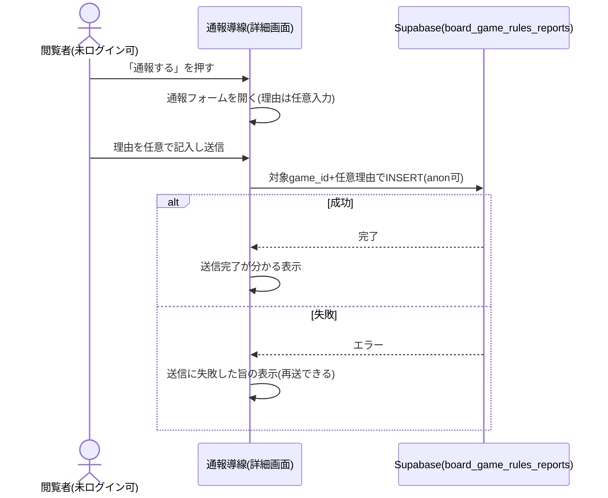

# 設計: 通報(ゲーム内容への気付き)

ゲーム詳細画面([game-detail/design.md](../game-detail/design.md))から、そのゲームを匿名で通報できる。通報しても自動非表示にはせず、運営者が[admin/design.md](../admin/design.md)で確認する。通報はLLM呼び出しを伴わない単純なDB書き込みで、通報者個人を特定する情報は保存しない。

## 処理フロー



### 通報を送信する処理
- 対象: 詳細画面で通報操作を行った対象ゲーム
- 手順:
  1. 通報導線(「通報する」)を押すと、通報フォームを開く。ログイン不要で誰でも行える(requirements.md#通報の送信-1〜2)
  2. 理由・補足を任意で入力できる(必須にしない。空でも送信できる。requirements.md#通報の送信-3)
  3. 送信すると、対象ゲームのgame_idと任意の理由テキストをINSERTする。通報者を特定する情報は保存しない(requirements.md#保存内容-2)
  4. 送信が完了したら、完了が分かる表示をする(requirements.md#通報の送信-4)
  5. 通報が行われても対象ゲームは自動的に非表示にしない。公開は維持したまま運営者が管理画面で確認する(requirements.md#通報後の扱い-5)
  6. 送信に失敗した場合は、失敗が分かる表示をし、再送できるようにする(後述エラーハンドリング)
- 補足(理由の文字数): 理由テキストには文字数上限を設ける(上限値は実装時に確定)。入力欄の`maxLength`+トリムに加え、DB側でもCHECK制約で担保する(後述セキュリティ)
- 関連するビジネスルール: requirements.md#通報の送信、requirements.md#通報後の扱い、requirements.md#保存内容

## バリデーション
- 理由テキストは任意入力(空でも送信可)。入力された場合は文字数上限を超えないこと(上限値は実装時に確定。DB側でもCHECK制約で担保)

## エラーハンドリング
- 通報送信の失敗は、閲覧者が明示的に行った操作のため、失敗が分かる定型表示をし再送できるようにする(Supabaseの生エラーは画面に出さない)
- 送信中は送信ボタンを無効化し、二重送信を抑える

## ボット対策・濫用防止(設計判断)
- 通報はログイン不要のため大量送信の余地があるが、投稿([game-registration](../game-registration/requirements.md))と異なりLLM呼び出し(課金)を伴わず、通報レコードは運営者のみが見る・自動では何も起こさない(requirements.md#通報後の扱い-5)ため、1件あたりの実害は小さい。よって**初期はCloudflare Turnstileを付けず**、次の軽い抑制にとどめる(requirements.md#ボット対策・濫用防止-1):
  - 送信中のボタン無効化による二重送信防止
  - 同一ブラウザから同一ゲームへ短時間に繰り返し送るのを抑える簡易な抑制(画面側。厳密な担保はしない)
- 濫用(スパム通報の増加)が実際に問題になった場合に、投稿フォームと同じTurnstile検証の導入を再検討する。その場合は解析関数のような専用サーバーは要さず、Turnstileトークンの検証をどこで行うか(通報も検証付きにするなら軽量な検証経路)を別途設計する
- 関連するビジネスルール: requirements.md#ボット対策・濫用防止-1

## 関連するファイル(抜粋)
```
app/board-game-rules/lib/reports.ts (新規: createReport)
app/board-game-rules/components/ReportButton.tsx (新規: 通報導線+通報フォーム(理由の任意入力)+送信完了表示)
app/lib/supabaseClient.ts (既存の共通クライアントを利用)
```

## データベース設計

### board_game_rules_reports(新規)
| カラム | 型 | 補足 |
|---|---|---|
| id | uuid, primary key, default gen_random_uuid() | 通報ID |
| game_id | uuid, not null, references board_game_rules_games(id) | 対象ゲーム |
| reason | text, nullable, check (reason is null or char_length(reason) <= N) | 任意の理由テキスト(上限N。実装時に確定)。未記入はNULL |
| created_at | timestamptz, not null, default now() | 通報日時 |

- 匿名通報のため`auth.users`とのリレーションは持たない。通報者を特定する情報は保存しない(requirements.md#保存内容-2)

### マイグレーション(実装より先に単独PRで適用)
```sql
create table board_game_rules_reports (
  id uuid primary key default gen_random_uuid(),
  game_id uuid not null references board_game_rules_games(id),
  reason text check (reason is null or char_length(reason) <= 1000), -- 上限は実装時に見直し
  created_at timestamptz not null default now()
);
alter table board_game_rules_reports enable row level security;

-- 送信: 誰でも(anon含む)INSERTできる。SELECTは付与しない(通報者・第三者は自分の通報も含め読めない)
grant insert on board_game_rules_reports to anon, authenticated;
create policy "anyone can insert report" on board_game_rules_reports
  for insert to anon, authenticated with check (true);

-- 確認: 運営者本人のみSELECTできる(admin/design.md)
grant select on board_game_rules_reports to authenticated;
create policy "admin can select reports" on board_game_rules_reports
  for select to authenticated
  using ((auth.jwt() ->> 'email') in (select email from admin_emails));

-- benriyatool_readonly はSELECTのみ(docs/adr/0004)
grant select on board_game_rules_reports to benriyatool_readonly;
create policy "benriyatool_readonly can select reports" on board_game_rules_reports
  for select to benriyatool_readonly using (true);
```

T0(マイグレーション適用)の実機確認:
- 未ログイン(anon)・ログイン中のいずれでも通報をINSERTできること
- anon・運営者以外のログインユーザーは通報をSELECTできないこと(運営者本人のみSELECTできること)
- `reason`が上限を超える行がCHECK制約で拒否されること

## 画面設計
- ゲーム詳細画面に通報導線(`ReportButton`)を置く。押すと通報フォーム(理由の任意入力欄+送信)を開く
- 送信完了後は完了が分かる表示をする。ログインの有無で導線の出し分けはしない(誰でも通報できる)

## 状態管理
- `ReportButton`は「閉じている」「フォーム表示中」「送信中」「送信完了」を持つ(局所的な状態。詳細画面のローカルに閉じる)

## セキュリティ
- 通報レコードは運営者本人のみSELECTできる(RLS)。通報者・第三者は自分の通報も含め読めない(SELECT権限を運営者に限定)。通報内容の悪用・晒しを防ぐ
- 通報者を特定する情報(IPアドレス・アカウント等)は保存しない(requirements.md#保存内容-2)。匿名の気付き導線という位置づけを保つ
- 理由テキストは、運営者が[admin](../admin/design.md)で表示する際にHTMLとして解釈しない形で描画する([comment/design.md](../comment/design.md)と同方針)。任意テキストのため悪意ある入力を前提にエスケープ描画する
- 理由テキストの文字数上限は画面側+DB側CHECK制約の両方で担保する。ログイン不要のためボット・いたずらで巨大な文字列を直接INSERTされうるため、1件あたりの上限をDB側でも防御的に持つ

## ログ
- 通報送信の失敗は、原因究明のためコンソールにエラーを出す(画面には定型表示)。理由テキストの中身はログに含めず、失敗の事実にとどめる。成功時はログを出さない(匿名の通常操作のため)

## 依存関係
- 通報対象ゲームの識別子は[game-registration/design.md](../game-registration/design.md)の`board_game_rules_games.id`に従う
- 通報の送信導線は[game-detail/design.md](../game-detail/design.md)で表示される
- 通報内容の確認・対応は[admin/design.md](../admin/design.md)で行う(運営者のみSELECT)
