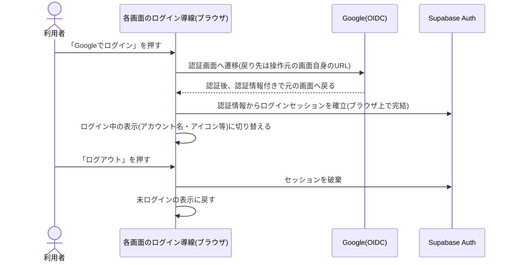

# 設計: 利用者ログイン(任意)

認証基盤(Supabase Auth・Google OIDC)の全体方針は[docs/adr/0006](../../../docs/adr/0006-admin-screen-oidc-rls.md)にあるため重複させず、本specでは「利用者全員にログインを開放する(許可リストによる権限確認をしない)」という本機能固有の扱いと、他機能へ運営者判定を提供する処理を書く。ログイン開始・ログアウト・セッション取得・運営者判定は既存の共通ライブラリ[app/lib/adminAuth.ts](../../../app/lib/adminAuth.ts)をそのまま利用する([ai-dev-digest/bookmark/design.md](../../ai-dev-digest/bookmark/design.md)と同じ踏襲方法)。

## 処理フロー



### ログイン状態を判定して導線を出し分ける処理
- 対象: 各画面のログイン導線(ヘッダー等の共通表示)を表示する時点、およびログイン状態が変化した時点
- 手順:
  1. ログインセッションがない場合は「Googleでログイン」の操作を表示する。この状態でも、閲覧・絞り込み・新規登録・通報の機能はすべて制限なく利用できる(requirements.md#ログイン・ログアウト-1)
  2. ログインセッションがある場合は、ログイン中であることが分かる表示(アカウント名・アイコン等)と「ログアウト」の操作を表示する(requirements.md#ログイン・ログアウト-3)
  3. ログイン状態の変化(ログイン完了・ログアウト)を購読し、変化があれば表示を更新する(OAuthリダイレクトで戻ってきた際のセッション確立にも反応する)
- 補足: 許可リスト(`admin_emails`)による権限確認は行わない。Googleアカウントを持つ人であれば誰でもログインできる(requirements.md#認証方式-1)
- 関連するビジネスルール: requirements.md#ログイン・ログアウト、requirements.md#認証方式

### Googleでログインする処理
- 対象: 「Googleでログイン」操作
- 手順:
  1. Google OIDCによるログインを開始し、Googleの認証画面へ遷移させる。認証後の戻り先は操作を行った画面自身のURLとする(`ikukyu/admin/design.md#Googleでログインする処理`と同一。戻り先だけ異なる)
  2. 戻ってきた際、URLに含まれる認証情報からログインセッションを確立する(サーバーを介さず、ブラウザ上で完結する)
- 関連するビジネスルール: requirements.md#ログイン・ログアウト-2

### ログアウトする処理
- 対象: ログイン中のセッション
- 手順: ログインセッションを破棄し、未ログインの導線表示に戻す(`ikukyu/admin/design.md#ログアウトする処理`と同一)
- 関連するビジネスルール: requirements.md#ログイン・ログアウト-4

### 運営者判定を他機能に提供する処理
- 対象: `game-registration`(運営者登録タグ付与)、`admin`(アクセス制御)、`comment`(運営者によるコメント削除)から参照される運営者判定
- 手順:
  1. ログイン中のアカウントが運営者本人かどうかを、既存の`isAuthorizedAdmin()`(`admin_emails`に自分のメールが登録されているかをDBに問い合わせる)で判定する。行が返れば運営者、0件なら運営者以外
  2. 各機能はこの判定結果に基づいて振る舞う(タグ付与・書き込み許可など)。実際のアクセス制御はDB側のRLSで担保し、この判定は画面側の出し分けのために使う
- 補足: `admin_emails`は`ikukyu/admin`・`life-money-sim/admin`と共用のものを使い、本アプリ用に新規テーブルは作らない
- 関連するビジネスルール: requirements.md#運営者判定-3

## エラーハンドリング
- ログイン開始・ログアウトはSupabase Authの標準的な失敗時挙動に委ねる(通信失敗時はセッションが変わらず、導線表示も変わらない)。ログインが必須の機能ではないため、失敗を大きなエラー画面として見せず、利用者は再度操作すればよい
- 運営者判定(`isAuthorizedAdmin()`)の問い合わせに失敗した場合、参照元の機能側で安全側に倒す(運営者ではないものとして扱う)。具体的な扱いは各参照元(`game-registration`・`admin`・`comment`)のdesign.mdに従う

## 関連するファイル(抜粋)
```
app/lib/adminAuth.ts (既存: getSession/onAuthChange/signInWithGoogle/signOut/isAuthorizedAdmin をそのまま利用。新規追加なし)
app/lib/supabaseClient.ts (既存の共通クライアントを利用)
app/board-game-rules/components/LoginStatus.tsx (新規: ログイン状態の表示とログイン/ログアウト導線。各画面の共通ヘッダーから使う)
app/board-game-rules/lib/useSession.ts (新規: セッションの取得と変化購読をまとめるフック。各画面がログイン状態を参照するのに使う)
```

## 画面設計

### ログイン導線(共通表示: `LoginStatus`)
- アプリ内の各画面の共通ヘッダーに配置する
- 未ログイン: 「Googleでログイン」の操作のみを表示する
- ログイン中: アカウント名(またはアイコン)と「ログアウト」の操作を表示する。あわせて「お気に入り一覧」への導線を表示する([favorite/design.md](../favorite/design.md)の入口)
- ログインの有無にかかわらず、閲覧・絞り込み・新規登録・通報の各導線は常に表示する(ログイン状態で出し分けない)

## 状態管理
- ログインセッションは各画面が`useSession`フック経由で保持する。セッション確立・破棄の変化を購読し、変化時に再描画する(複数画面をまたぐグローバルな状態管理は使わず、画面ごとにフックで取得する。`ai-dev-digest`の`LoginStatus`と同じ考え方)
- 運営者判定の結果は、それを必要とする画面(登録・管理・コメント)が各自で取得・保持する(本specでは判定手段の提供までを担う)

## セキュリティ
- 本機能は許可リストによる制限をかけず、Googleアカウントを持つ人全員のログインを意図的に開放する(requirements.md#認証方式-1)。ログインで得られるのはお気に入り・コメントという本人データ機能へのアクセスのみで、他人のデータはRLSにより本人以外に返らない(詳細は[favorite/design.md](../favorite/design.md)・[comment/design.md](../comment/design.md)の各セキュリティ節)
- 運営者判定は画面側の出し分けのためのものであり、実際の書き込み権限(運営者登録タグの付与、管理画面の編集・削除)はDB側のRLSで担保する。画面側の判定を迂回しても、運営者以外は保護された書き込みができない([admin/design.md](../admin/design.md)、[game-registration/design.md](../game-registration/design.md)参照)
- ログインにより新たに氏名・メールアドレス等の個人情報を取得するため、[specs/legal/requirements.md](../../legal/requirements.md)のプライバシーポリシーへの追記要否を確認する(本アプリ全体のログイン導入に伴う対応として、favorite・commentと合わせて確認する)

## ログ
- ログイン開始・ログアウト・運営者判定はSupabase Authおよび既存`adminAuth.ts`の挙動に委ね、本機能独自のログは出力しない(通常操作であり、失敗時も利用者が再操作すれば足りるため)。運営者判定の問い合わせが想定外に失敗した場合のログ出力は、判定を利用する各機能側(`admin`等)の方針に従う

## 依存関係
- ログイン基盤(`app/lib/adminAuth.ts`)は[docs/adr/0006](../../../docs/adr/0006-admin-screen-oidc-rls.md)を踏襲するが、許可リストによる権限確認(`isAuthorizedAdmin`)はログイン自体には課さない(利用者全員が対象のため)
- 本機能が提供するログイン状態・運営者判定は、[favorite](../favorite/requirements.md)・[comment](../comment/requirements.md)・[game-registration](../game-registration/requirements.md)・[admin](../admin/requirements.md)の前提となる
