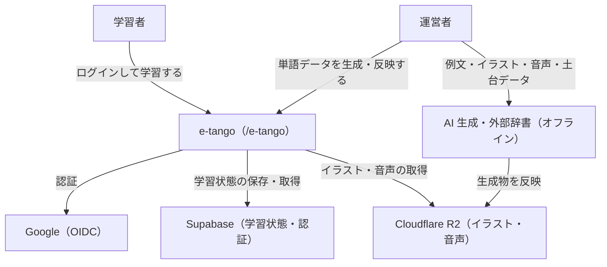
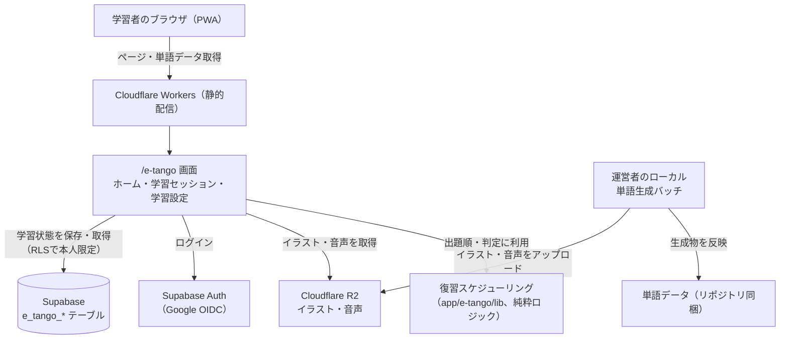
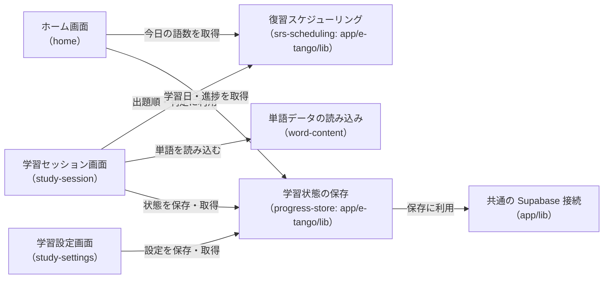
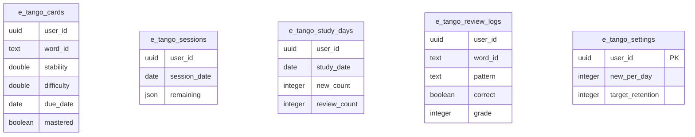

# アーキテクチャ: e-tango

## 0. サマリ

イラストと例文で TOEIC 頻出単語を覚える、間隔反復(SRS)ベースの学習アプリ。Next.js 静的エクスポートを Cloudflare Workers で配信し、学習状態は Supabase(ログイン必須・RLS で本人限定)、イラスト・音声は Cloudflare R2 に置く。単語データはオフラインのバッチで生成してリポジトリ／R2 に反映し、サイトのランタイムでは LLM・画像 API を呼ばない。spec は 7 つ(ログイン／単語コンテンツ／復習スケジューリング／学習セッション／ホーム／学習設定／学習状態の保存)。全体像は[4. コンテキスト図](#4-コンテキスト図)・[5. システム構成図](#5-システム構成図)。

## 1. 概要
画像で覚える TOEIC 英単語アプリ。学習者は Google ログイン後、ホームで「今日の新規◯・復習◯」を確認し、4択(英単語→画像／画像→英単語／例文穴埋め→画像)の学習セッションをこなす。復習タイミングは FSRS で最適化する。URL: `/e-tango`

## 2. アーキテクチャの目的
- 記憶の定着(SRS)を中核価値とするため、復習スケジューリングのロジックを UI・DB から切り離し、単体テストとパラメータ調整をしやすくする
- 数千点のイラスト・音声を扱いながら、個人開発の無料枠運用とサーバーレス構成を維持する
- 将来 iOS ネイティブ版に展開できるよう、学習ロジックとデータ層を framework 非依存に保つ

## 3. 設計方針
- 復習スケジューリング(`srs-scheduling`)は React・Supabase に依存しない純粋なロジックとして `app/e-tango/lib/` に置き、`__tests__/e-tango/lib/` で単体テストする。UI(`study-session`)と保存(`progress-store`)がこのロジックを呼び、逆向きの依存を作らない
- 単語データ(テキスト項目)はリポジトリにコミットし、イラスト・音声は Cloudflare R2 に置く。生成・更新はオフラインのバッチのみで行い、ランタイムで外部 API を呼ばない
- 学習状態は Supabase の利用者別テーブルに保存し、RLS で本人(`auth.uid()`)だけが読み書きできるようにする(ログイン必須)

## 4. コンテキスト図

この図は本アプリと外部との境界のみを表す。内部構成は[5. システム構成図](#5-システム構成図)、正となる文章は各 spec の requirements.md。

## 5. システム構成図

この図の正となる文章は[6. アーキテクチャ概要](#6-アーキテクチャ概要)と各 spec の設計書。プロジェクト共通インフラ(CI・デプロイ経路・無料枠の境界)は[docs/architecture/](../../docs/architecture/infrastructure.md)を参照。

## 6. アーキテクチャ概要
Next.js の静的エクスポートを Cloudflare Workers で配信し、サーバー処理は持たない。単語データ(テキスト項目)はリポジトリに同梱してビルドに含め、イラスト・音声は Cloudflare R2 から取得する。学習セッションの出題順・4 段階判定・セッション内リピート・1 日のキュー構成は、ブラウザ内の純粋ロジック(`srs-scheduling`)で決まる。学習状態(カード状態・セッション進行・学習日・出題ログ・設定)はログイン中の本人のみが RLS 経由で読み書きできる Supabase テーブルに保存する。単語データの生成・更新は運営者のローカル環境でのバッチ処理で行い、リポジトリ／R2 に反映する。

## 7. 採用技術
| 技術 | 用途 |
|---|---|
| Next.js(静的エクスポート) | `/e-tango` 画面の描画・単語データの同梱 |
| Supabase(`e_tango_*` テーブル) | 学習状態(カード状態・セッション・学習日・出題ログ・設定)の保存 |
| Supabase Auth(Google OIDC) | 学習者のログイン(必須) |
| Cloudflare R2 | イラスト・音声ファイルの配信 |
| FSRS(スケジューリングアルゴリズム) | 復習日の計算 |
| Tailwind CSS | スタイリング |

選定理由はプロジェクト横断のため[12. 関連ADR](#12-関連adr)を参照。

## 8. 機能一覧表(機能マップ)
| spec | 機能(利用者から見て) | 役割 | 依存 | 状態 |
|---|---|---|---|---|
| [user-auth](user-auth/requirements.md) | Google アカウントでログイン／ログアウトする | ログイン必須の認証基盤を提供し、学習状態をアカウントに紐づける | `docs/adr/0006` を踏襲 | 仕様のみ(未実装) |
| [word-content](word-content/requirements.md) | 学べる TOEIC 単語データがそろっている | 単語データ項目の定義と、TOEIC 全語彙分のオフライン一括生成 | `specs/legal`(出典・商標表示)、R2 | 仕様のみ(未実装) |
| [srs-scheduling](srs-scheduling/requirements.md) | 忘れる直前に復習が届き、新規・間違えた語はその場で繰り返す | 復習日の計算・4 段階判定・セッション内リピート・1 日のキュー構成 | word-content の単語、study-settings の設定値、progress-store のカード状態 | 仕様のみ(未実装) |
| [study-session](study-session/requirements.md) | 画像・例文の 4択で単語を学習し、答え合わせカードで確認する | 学習セッションの画面と操作(出題 3 パターン・4択・答え合わせ) | srs-scheduling のキュー／判定、word-content の単語、progress-store の保存、home の導線 | 仕様のみ(未実装) |
| [home](home/requirements.md) | 今日やる量と進捗・連続日数を見て学習を始める | ログイン後のトップ画面。`/e-tango` のメタ情報も定義 | srs-scheduling の今日の語数、progress-store の学習日・進捗、study-session の開始、user-auth | 仕様のみ(未実装) |
| [study-settings](study-settings/requirements.md) | 1 日の新規語数・目標保持率を変える | 学習ペースと忘れにくさの設定変更 | srs-scheduling(設定値の利用)、progress-store の保存、home の導線 | 仕様のみ(未実装) |
| [progress-store](progress-store/requirements.md) | 進捗が保存され、別端末でも続きから学習できる | 学習状態(カード状態・セッション・学習日・出題ログ・設定)の Supabase 保存・取得(RLS で本人限定) | user-auth のアカウント、`docs/adr/0001` | 仕様のみ(未実装) |

## 9. コンポーネント図
spec をまたいで共有されるコンポーネント・lib の依存関係。

この図の正となる文章は「[8. 機能一覧表](#8-機能一覧表機能マップ)」の依存列と、各 spec の requirements.md の依存関係。

## 10. ディレクトリ構成
CLAUDE.md の一般規約(`components/`,`lib/`)通り。復習スケジューリングと学習状態の保存は `app/e-tango/lib/` 配下に framework 非依存のモジュールとして置く(将来 iOS 版へ移植しやすくするため。[3. 設計方針](#3-設計方針)参照)。

## 11. 外部サービス
| サービス | 用途 |
|---|---|
| Supabase(`e_tango_*` テーブル) | 学習状態の保存。RLS で本人(`auth.uid()`)のみ読み書き可 |
| Supabase Auth(Google OIDC) | 学習者のログイン(必須) |
| Cloudflare R2 | イラスト・音声ファイルの配信。採用理由は専用 ADR にまとめる(`docs/adr/`) |

このアプリが使うテーブルのアプリ横断 ER 図。すべて `auth.users` に `user_id` で紐づき、テーブル間に外部キーはない。

各カラムの正となる文章は spec 単位のカラム表(各 spec の design.md、`/design` で作成)。

## 12. 関連ADR
- [0001-user-input-database.md](../../docs/adr/0001-user-input-database.md) — 学習状態保存の DB 選定(Supabase 採用)、ログイン必須アプリの RLS パターン
- [0006-admin-screen-oidc-rls.md](../../docs/adr/0006-admin-screen-oidc-rls.md) — Google OIDC 認証の技術方針(許可リストは本アプリには適用しない)

## 13. セキュリティ
学習データは本人専用のため、匿名(anon)ロールからの読み書きは許可しない。すべての `e_tango_*` テーブルに RLS を設定し、`auth.uid() = user_id` のときだけ SELECT／INSERT／UPDATE／DELETE を許可する。単語生成バッチは運営者のローカル環境でのみ実行し、生成用の API キーはリポジトリ・サイトに含めない。

## 14. 技術的制約
- サイトのランタイムで LLM・画像 API を呼ばない(`docs/adr/0001` のサーバーレス構成の維持、費用・濫用対策)。単語データの生成・更新はオフラインのバッチのみ
- イラスト・音声は全語で数百 MB 規模になるため、リポジトリに含めず R2 に置く

## 15. 用語集
| 用語 | 説明 |
|---|---|
| SRS(間隔反復) | 忘れる直前のタイミングで復習させ、記憶の定着を効率化する学習方式 |
| FSRS | 忘却曲線に基づき、カードごとに次の復習日を予測する現行のスケジューリングアルゴリズム |
| セッション内リピート | 新規語・間違えた語を、同じ学習セッションの中で他の語をはさんで数回再出題する仕組み |
| コアイメージ | 単語の中心的なイメージを一言で説明する日本語文。丸暗記でなく意味のつながりで覚えるための補助 |
| ディストラクター | 4択の誤答として並べる選択肢 |
| 習得済み | カードの安定度が 21 日以上に達し、当面は思い出せると見なせる状態 |

## 今後の拡張候補

MVP には含めないが、今後追加したい機能・データのメモ。優先度・実施可否は都度判断する。

### v1.1 以降で追加を検討
| 項目 | 内容 |
|---|---|
| 単語一覧(`word-list`) | 学習した単語の一覧・検索・絞り込み(学習中／習得済／お気に入り)、暗記モード(訳／英語を隠す)、音声の流し聞き |
| 学習記録カレンダー(`study-log`) | 連続日数だけでなく、月カレンダーでの学習履歴・合計学習日数 |
| 単語データの誤り報告(`word-report`) | 学習者が訳・例文・画像・音声の誤りを報告し、運営者がオフラインで修正に反映 |
| 使い方ガイド(`guide`) | SRS の仕組み・画面の見方の説明 |
| データ項目の追加 | UK 発音・発音のコツ・活用形・英英定義・類義語(答え合わせカード／単語詳細で表示) |
| お気に入り(★) | 語をお気に入り登録して見返す |
| オフライン学習 | ダウンロード済みの範囲を電波がなくても学習できる |
| 学習設定の拡張 | 復習の 1 日上限、出題パターンの選択、リマインダー通知、単語帳の学習計画(逆算表示) |
| アルゴリズム最適化 | 蓄積した出題ログ(`e_tango_review_logs`)から FSRS パラメータを学習者ごとに調整 |

### 現時点で対象外(将来必要になれば再検討)
| 項目 | 補足 |
|---|---|
| 有料プラン・課金・サブスク・広告 | 完全無料・広告なしで運用する(`/consult` で合意) |
| 複数コース(IELTS・英検・レベル別) | TOEIC 1 コースに絞る |
| ポイント・応援・スペシャルサンクス | 参考にした既存アプリにはあるが本アプリでは扱わない |
| iOS ネイティブ版 | 学習ロジック・データ層を framework 非依存に保ち、将来 Capacitor 等で展開できる余地は残す |
