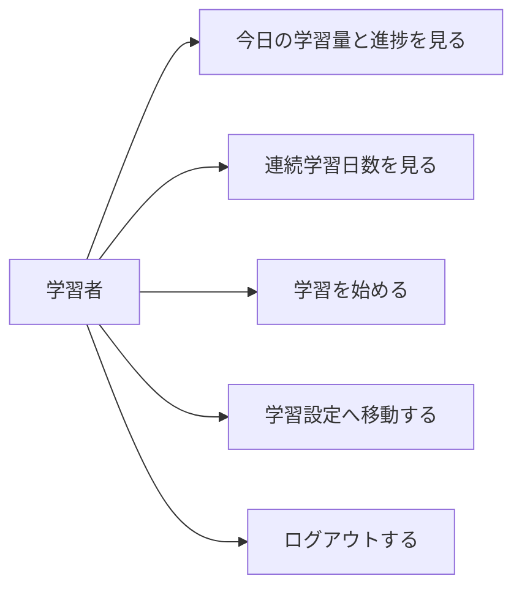

# 要件定義: ホーム

> ステータス: 仕様確認中(未実装)

## サマリ

ログイン後に最初に表示する画面。中央の進捗リングでコース全体の学習済み割合を示し、その下に今日の「新規◯語・復習◯語」、連続学習日数、最下部に学習開始ボタンを置く。ここから学習セッションを始め、学習設定へ移動できる。`/e-tango` のタブ名・検索結果の説明文(メタ情報)もこの画面で定義する。詳細は[ユースケース図](#ユースケース図)。

## 概要
- 機能名: ホーム
- 目的: アプリを開いた学習者に「今日やること」と「進み具合」をひと目で見せ、学習開始への導線を提供する
- 優先度: 高(アプリのトップ画面)

## ユーザーストーリー
- 学習者として、アプリを開いたらまず「今日やること(新規◯・復習◯)」と「どれくらい進んだか」がひと目で分かり、そこから学習を始めたい
- 学習者として、毎日続けられているか(連続学習日数)を見て、モチベーションにしたい

## ユースケース図

正となる仕様は[ユーザーストーリー](#ユーザーストーリー)・[機能要件](#機能要件)。

## 機能要件

### 表示
- [1] ログイン後の最初に表示する画面とする
- [2] コース全体の学習の進み具合を、進捗リングと「学習済み語数／総語数」で表示する
- [3] 今日の学習量を「新規◯語・復習◯語」で表示する(`srs-scheduling` が決めた値)
- [4] 連続学習日数を表示する
- [5] 学習を開始する操作を表示し、そこから `study-session` を始める
- [6] その日の分をすべて終えている場合は、その旨(今日の学習は完了)を表示する

### ナビゲーション
- [7] 画面から `study-settings`(学習設定)に移動できる
- [8] ログイン中であることが分かる表示とログアウト操作を配置する(`user-auth`)

### メタ情報
- [9] `/e-tango` のメタ情報(title/description)を設定する。title「画像で覚えるTOEIC英単語アプリ e-tango｜無料・記憶に残る間隔学習」、description「イラストと例文でTOEIC頻出単語を覚える無料アプリ。忘れる前に復習が届く間隔反復(SRS)で、記憶にしっかり定着します。」

## ビジネスルール・制約

### 連続学習日数
- [1] 「その日にセッションで 1 問以上回答した」日を学習日とする。学習日が途切れずに続いた日数を連続学習日数とする(根拠: 「開始しただけ」で連続を維持できると指標の意味が薄れるため、1 問以上の回答を条件にした。`/requirement` で合意)
- [2] 日付の区切りは端末のローカル日付とする

### 進捗の分母
- [1] 「総語数」はコース(TOEIC)の全単語数、「学習済み語数」は一度でも学習を開始した(セッションに登場した)語数とする

## 依存関係
- 今日の新規・復習の語数、キューの有無は `srs-scheduling/requirements.md#1日のキュー構成`
- 連続学習日数・学習済み語数は `progress-store/requirements.md#保存する内容`
- 学習開始・完了後の戻り先は `study-session/requirements.md#セッションの開始と進行`
- ログイン状態・ログアウトは `user-auth/requirements.md#ログイン`
- `/e-tango` のメタ情報は `specs/hub-site/requirements.md` の「各ページのメタ情報」から参照される

## スコープ外
- 学習記録のカレンダー表示、合計学習日数(今後の拡張候補。MVP は連続日数の数字のみ)
- 単語一覧への導線(MVP は `word-list` を持たない。今後の拡張候補)
- 複数コースの切り替え
