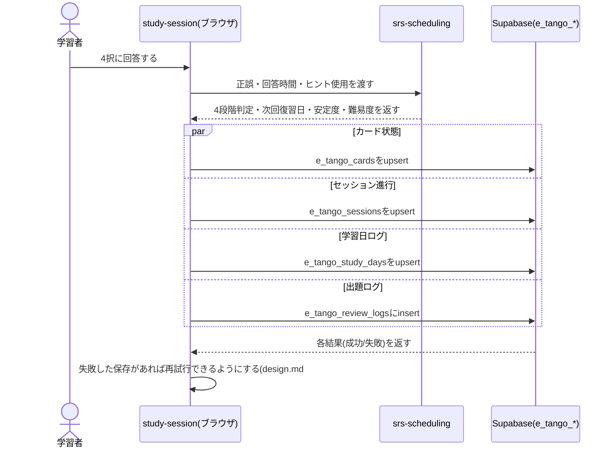

## サマリ
学習者ごとの学習状態(カード状態・セッション進行・学習日ログ・出題ログ・学習設定)を5つのSupabaseテーブル(`e_tango_cards`/`e_tango_sessions`/`e_tango_study_days`/`e_tango_review_logs`/`e_tango_settings`)に保存する。すべて`user_id`列を持ち、RLSで`auth.uid() = user_id`のときだけ本人が読み書きできる(`anon`ロールは一切アクセスできない)。保存はカード状態・セッション進行・出題ログ・設定をそれぞれ独立した処理として都度実行し、1回の保存失敗が他の状態の保存をブロックしないようにする。詳細は[データベース設計](#データベース設計)、[保存する処理のシーケンス図](#出題への回答を保存する処理)。

## 処理フロー

### ログイン時に学習状態を読み込む処理
- 対象: ログイン確立後(`user-auth/design.md#ログインする処理google-oidc`手順3)
- 手順:
  1. ログイン中のアカウントの`e_tango_cards`(全件)・`e_tango_study_days`(連続日数計算用に必要な範囲)・`e_tango_settings`(1行)・`e_tango_sessions`(その日の分、あれば1行)をそれぞれ取得する
  2. `e_tango_settings`に行がない場合(初回ログイン)は、既定値(新規10語・目標保持率90%)を画面表示用に使う(DBへの初期行作成は初回の設定変更時に行う。`study-settings/requirements.md#機能要件-5`と整合)
  3. 取得した内容をもとに、`home`は今日のキュー・進捗を計算し(`srs-scheduling/design.md`)、`study-session`は中断中のセッションがあれば復元する(`study-session/design.md#セッションを再開する処理`)

### カード状態を保存する処理
- 対象: 出題への回答直後(`srs-scheduling`が次回復習日・安定度・難易度を計算した後)、または答え合わせカードでの習得済み/学習中の手動切り替え
- 手順: 対象の`word_id`の行がなければINSERT、あれば安定度・難易度・次回復習日・直近の出題日・習得済み・手動切替フラグをUPDATEする(`upsert`)
- 関連するビジネスルール: requirements.md#保存する内容-1

### セッション進行を保存する処理
- 対象: 出題への回答直後、セッションの中断
- 手順: その日の`session_date`の行を`upsert`し、未消化の語の一覧・セッション内リピートの連続正解カウントを`remaining`(jsonb)に保存する。セッション完了時はこの行を削除する(翌日以降に再開対象として残さないため)
- 関連するビジネスルール: requirements.md#保存する内容-2

### 学習日ログを保存する処理
- 対象: その日はじめて出題に回答した時点
- 手順: 今日の日付(学習者の端末のローカル日付、`home/requirements.md#連続学習日数-2`)の`study_date`行がなければ新規/新規INSERT(new_count/review_countを0で初期化)、あれば取得する。回答した語が新規語か復習語かに応じて該当カウントを+1する
- 関連するビジネスルール: requirements.md#保存する内容-3、home/requirements.md#連続学習日数

### 出題ログを保存する処理
- 対象: 出題への回答直後
- 手順: 対象語・出題パターン・正誤・回答時間・ヒント使用有無・4段階判定を1行としてINSERTする(カード状態とは別テーブルのため、この保存の成否はカード状態の保存とは独立して扱う)
- 関連するビジネスルール: requirements.md#保存する内容-4、requirements.md#データの持ち方-2

### 学習設定を保存する処理
- 対象: `study-settings`画面での変更操作
- 手順: `e_tango_settings`の本人行を`upsert`する(初回変更時はINSERT、以降はUPDATE)
- 関連するビジネスルール: requirements.md#保存する内容-5

### 出題への回答を保存する処理(全体像)
- 対象: 4択への回答
- 手順: 上記の「カード状態」「セッション進行」「学習日ログ」「出題ログ」の4つの保存を並行して実行する(1つが失敗しても他3つの保存は継続する。理由は[エラーハンドリング](#エラーハンドリング)参照)
- シーケンス図:

- 関連するビジネスルール: requirements.md#保存する内容

## エラーハンドリング

### 保存失敗時の扱い
- 回答・設定変更の保存に失敗した場合は、日本語の定型メッセージ(例:「保存に失敗しました。もう一度お試しください。」)を画面に表示し、再試行できるようにする。技術的詳細は画面に出さず`console.error`に記録する(要件[保存失敗時 1])
- カード状態・セッション進行・学習日ログ・出題ログの4つの保存は独立して実行するため、一部が失敗しても他の保存はそのまま反映される。セッション途中の保存失敗で進捗が一部失われても、学習の続行自体はブロックしない(要件[保存失敗時 2])。失敗した保存の再試行は、次の出題への回答時に該当テーブルへの保存を再度試みることで機会を確保する(専用の再試行ボタンは設けない)
- ログイン時の読み込み(初回)が失敗した場合は、日本語の定型メッセージを表示し、再読み込み操作(画面のリロード)を促す

## 関連するファイル(抜粋)
```
app/e-tango/lib/progressStore.ts (新規: 5テーブルへの読み込み・upsert・delete)
app/lib/supabaseClient.ts (既存の共通クライアントを利用)
supabase/migrations/<timestamp>_create_e_tango_progress_tables.sql (新規: 5テーブル・RLS・benriyatool_readonly権限)
```

## データベース設計
テーブル名は`docs/adr/0001-user-input-database.md`の命名規約に従い`e_tango_`接頭辞とする。すべて`auth.users(id)`を参照する`user_id`列を持ち、RLSで本人のみ読み書き可能にする(`docs/adr/0001`のログイン必須アプリのパターン)。あわせて`benriyatool_readonly`ロール向けのSELECT専用ポリシーを付与する(`docs/adr/0004-agent-readonly-db-access.md`)。

### e_tango_cards
| カラム | 型 | 補足 |
|---|---|---|
| user_id | uuid, not null, references auth.users(id) | |
| word_id | text, not null | `word-content`の単語ID。DB外部キーは張らない(単語データはリポジトリ管理のため) |
| stability | double precision, not null | FSRSの安定度 |
| difficulty | double precision, not null | FSRSの難易度 |
| due_date | date, not null | 次回復習日 |
| last_reviewed_at | timestamptz, nullable | 直近の出題日時。未出題(新規未着手)ならNULL |
| mastered | boolean, not null, default false | 習得済みかどうか(`srs-scheduling/design.md#習得済みを判定する処理`が算出) |
| mastered_manual_override | boolean, not null, default false | 習得済み/学習中を学習者が手動で切り替えたかどうか(`study-session/requirements.md#答え合わせカード-15`) |

主キーは`(user_id, word_id)`の複合主キーとする。

### e_tango_sessions
| カラム | 型 | 補足 |
|---|---|---|
| user_id | uuid, not null, references auth.users(id) | |
| session_date | date, not null | この未消化キューが属する学習日 |
| remaining | jsonb, not null | 未消化の語の一覧・出題順・セッション内リピートの連続正解カウントを含む構造 |

主キーは`(user_id, session_date)`の複合主キーとする。

### e_tango_study_days
| カラム | 型 | 補足 |
|---|---|---|
| user_id | uuid, not null, references auth.users(id) | |
| study_date | date, not null | 学習日(`home/requirements.md#連続学習日数-1`の「1問以上回答した日」) |
| new_count | integer, not null, default 0 | その日回答した新規語の出題数 |
| review_count | integer, not null, default 0 | その日回答した復習語の出題数 |

主キーは`(user_id, study_date)`の複合主キーとする。連続学習日数は`home`がこのテーブルを日付降順で走査して計算する(`home/design.md#連続学習日数を計算する処理`)。

### e_tango_review_logs
| カラム | 型 | 補足 |
|---|---|---|
| id | uuid, primary key, default gen_random_uuid() | |
| user_id | uuid, not null, references auth.users(id) | |
| word_id | text, not null | |
| pattern | text, not null | 出題パターン(`英単語→画像`/`画像→英単語`/`例文穴埋め→画像`) |
| correct | boolean, not null | |
| response_time_ms | integer, not null | 回答にかかった時間 |
| used_hint | boolean, not null, default false | |
| grade | text, not null | 4段階判定(`もう一度`/`むずかしい`/`ふつう`/`かんたん`) |
| created_at | timestamptz, not null, default now() | |

分析用途で件数が増えるため、カード状態(`e_tango_cards`)とは別テーブルに持つ(要件[データの持ち方 2])。

### e_tango_settings
| カラム | 型 | 補足 |
|---|---|---|
| user_id | uuid, primary key, references auth.users(id) | |
| new_per_day | integer, not null, default 10 | 5〜30の範囲(`study-settings/requirements.md#設定値の範囲`)。`check (new_per_day between 5 and 30)`をDBレベルでも設定する(UI側の制約に加えた多層防御) |
| target_retention | integer, not null, default 90 | 80/85/90/95のいずれか(パーセント)。`check (target_retention in (80, 85, 90, 95))`をDBレベルでも設定する(UI側の制約に加えた多層防御) |

### RLS・権限方針(5テーブル共通)
```sql
alter table e_tango_xxx enable row level security;
grant select, insert, update, delete on e_tango_xxx to authenticated;

create policy "user can select own e_tango_xxx" on e_tango_xxx
  for select to authenticated using (auth.uid() = user_id);
create policy "user can insert own e_tango_xxx" on e_tango_xxx
  for insert to authenticated with check (auth.uid() = user_id);
create policy "user can update own e_tango_xxx" on e_tango_xxx
  for update to authenticated using (auth.uid() = user_id);
create policy "user can delete own e_tango_xxx" on e_tango_xxx
  for delete to authenticated using (auth.uid() = user_id);

-- benriyatool_readonly向け(docs/adr/0004)
grant select on e_tango_xxx to benriyatool_readonly;
create policy "benriyatool_readonly can select e_tango_xxx" on e_tango_xxx
  for select to benriyatool_readonly using (true);
```
`anon`ロールへのGRANT・ポリシーは一切作成しない(要件[アクセス制御 2])。`e_tango_sessions`はDELETEも本人操作(セッション完了時の削除)で使うため、他4テーブルと同じくINSERT/UPDATE/DELETEをすべて許可する。

## セキュリティ
- すべての`e_tango_*`テーブルに`auth.uid() = user_id`のRLSを適用し、`anon`ロールからのアクセスは許可しない(要件[アクセス制御 1][アクセス制御 2]、`docs/adr/0001`のログイン必須アプリのパターン)
- `service_role`キーはクライアント・CI・本番デプロイのいずれにも含めない(`docs/adr/0001`の既存方針を踏襲。書き込みは`anon`+ログイン済みJWTの`authenticated`ロールで行う)
- 出題ログ(`e_tango_review_logs`)はアルゴリズム調整用の分析データであり、氏名・メールアドレス等の直接個人情報は含めない(`user_id`のみで、Supabase Auth側のプロフィール情報とは結合しない設計とする)

## パフォーマンス
- `e_tango_cards`は`(user_id, word_id)`の複合主キーにより、ログイン時の全件取得・出題後のupsertともにインデックスが効く
- `e_tango_review_logs`は件数が増え続けるテーブルのため、`user_id`へのインデックスを別途作成し、将来の集計・パラメータ調整時の走査を軽くする

## ログ
- 各テーブルへの保存(upsert/insert/delete)の成功・失敗を`console.log`/`console.error`に出力する(対象テーブル名・成否のみ。学習内容の詳細は出力しない)
