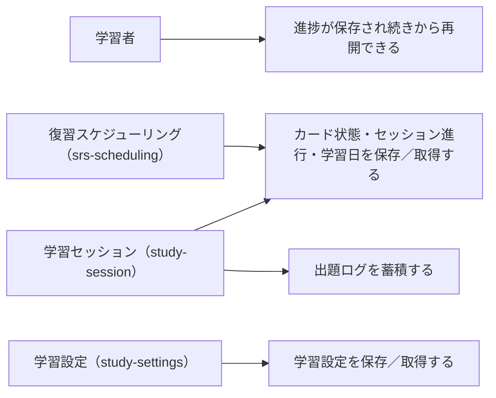

# 要件定義: 学習状態の保存

> ステータス: 仕様確認中(未実装)

## サマリ

学習者ごとの学習状態(カードごとの SRS 状態、セッションの未消化分、学習日ログ、出題ログ、学習設定)を Supabase に保存・取得する。行レベルセキュリティ(RLS)で本人だけが読み書きできる。匿名ロールからのアクセスは許可しない。出題ログはアルゴリズム調整に使えるよう、カード状態とは別に蓄積する。詳細は[ユースケース図](#ユースケース図)。

## 概要
- 機能名: 学習状態の保存
- 目的: 学習の進捗を本人のアカウントに紐づけて保存し、次回・別端末で続きから学習できるようにする。あわせて、アルゴリズム調整に使える学習実績のログを蓄積する
- 優先度: 高(学習継続の前提)

## ユーザーストーリー
- 学習者として、学習の進捗が保存され、次回ログイン時・別の端末でも続きから学習できるようにしたい
- 学習者として、自分の学習データは自分だけが読み書きできる状態であってほしい
- 運営者として、学習実績のログが、アルゴリズム調整に使える形でたまってほしい

## ユースケース図

正となる仕様は[ユーザーストーリー](#ユーザーストーリー)・[機能要件](#機能要件)。

## 機能要件

### 保存する内容
- [1] カードごとの状態: 対象語、安定度・難易度、次回復習日、直近の出題日、習得済み／学習中、習得済みを手動で切り替えたかどうか
- [2] セッションの進行状態: その日のキューのうち未消化の語、セッション内リピートの連続正解カウント
- [3] 学習日ログ: 学習した日付、その日の学習語数(新規・復習)
- [4] 出題ログ: 各出題の対象語・出題パターン・正誤・回答時間・ヒント使用・4 段階判定(アルゴリズム調整用)
- [5] 学習設定: 1 日の新規語数、目標記憶保持率

### 保存・取得
- [6] ログインしたアカウント単位で保存する
- [7] ログイン時、そのアカウントの学習状態を読み込む
- [8] 出題への回答、セッションの中断、設定変更のたびに、該当する状態を保存する

## ビジネスルール・制約

### アクセス制御
- [1] 保存データは、Supabase の行レベルセキュリティ(RLS)で、本人(`auth.uid()` が一致する行)だけが SELECT／INSERT／UPDATE／DELETE できるようにする(根拠: `docs/adr/0001-user-input-database.md` のログイン必須アプリのパターン。学習データは本人専用)
- [2] 匿名(anon)ロールからの読み書きは許可しない(本アプリはログイン必須のため)

### データの持ち方
- [1] テーブルはアプリ横断の DB(Supabase)に `e_tango_` 接頭辞で作成する(`docs/adr/0001-user-input-database.md` のテーブル命名規約)
- [2] 出題ログ(機能要件 [4])は分析用途で件数が増えるため、カード状態とは別に持つ

### 保存失敗時
- [1] 回答・設定変更の保存に失敗した場合は、日本語の定型メッセージで一時的な保存失敗を伝え、再試行できるようにする。技術的な詳細は画面に出さず `console.error` に記録する
- [2] セッション途中の保存失敗で進捗が一部失われても、学習の続行自体はブロックしない

## 依存関係
- 保存する状態の項目は `srs-scheduling/requirements.md`(カード状態・判定)、`study-session/requirements.md`(セッション進行・出題ログ)、`study-settings/requirements.md#設定値の範囲`(設定値)、`home/requirements.md#連続学習日数`(学習日ログ)で定義される
- ログイン状態・アカウント識別は `user-auth/requirements.md`
- DB・RLS の基盤方針は `docs/adr/0001-user-input-database.md`

## スコープ外
- 学習データのエクスポート／インポート、アカウント削除時のデータ削除フロー(今後の拡張候補)
- 複数端末間のリアルタイム同期(反映はログイン時・保存時。同時編集は想定しない)
- 運営者向けの学習データ集計画面(今後の拡張候補)
