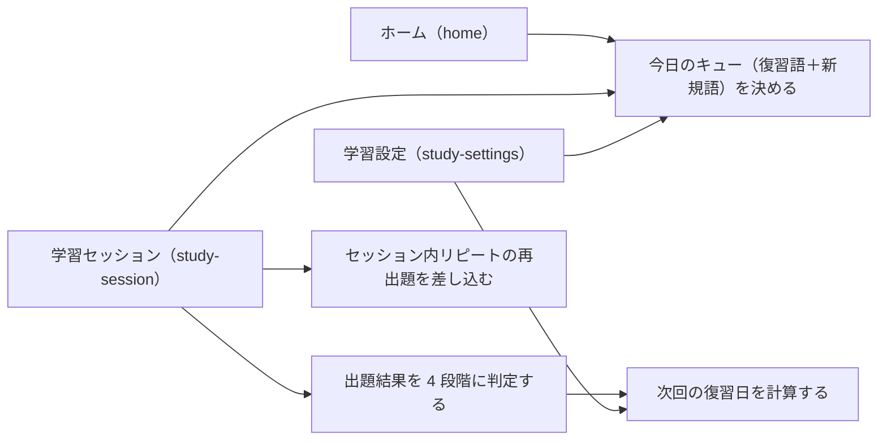

# 要件定義: 復習スケジューリング

> ステータス: 仕様確認中(未実装)

## サマリ

単語ごとの復習日を「忘れる直前」に予測して出題を並べる仕組み。長期の復習間隔は FSRS(忘却曲線に基づく現行の標準アルゴリズム)で決め、その前段の「セッション内リピート」で新規語・間違えた語をその日のうちに数回繰り返して短期記憶に載せる。出題結果は正誤・回答時間・ヒント使用から自動で 4 段階に判定する。1 日の学習量(新規◯・復習◯)と出題順もここで決まり、復習がたまっている日は新規語を自動で絞る。詳細は[ユースケース図](#ユースケース図)。

## 概要
- 機能名: 復習スケジューリング
- 目的: 記憶の定着を最大化するよう、単語ごとの復習タイミングと 1 日の学習キューを決める
- 優先度: 高(学習体験の中核ロジック)

## ユーザーストーリー
- 学習者として、覚えた語は間隔をあけて、あやふやな語は短い間隔で復習が回ってくるようにしたい
- 学習者として、新しく習う語や間違えた語は、その日のうちに何度か出題されて短期記憶に定着させたい
- 学習者として、復習がたまっている日は新規語を減らして、復習を優先してこなしたい

## ユースケース図

正となる仕様は[ユーザーストーリー](#ユーザーストーリー)・[機能要件](#機能要件)。

## 機能要件

### 復習日の計算
- [1] 単語(カード)ごとに、次に復習すべき日を管理する。ある日以前が復習日のカードを「復習対象」とする
- [2] 出題の結果を 4 段階(「もう一度」「むずかしい」「ふつう」「かんたん」)に判定し、その結果に応じて次の復習日を計算し直す
- [3] 正解を重ねるほど次の復習日の間隔を広げる。「もう一度」(不正解)なら間隔を大きく縮める

### 4 段階の判定
- [4] 4択の出題では、次のとおり自動で 4 段階を判定する: 不正解=「もう一度」、正解だが回答が遅い/ヒントを使った=「むずかしい」、正解=「ふつう」、素早い正解=「かんたん」
- [5] 学習者に 4 段階を手動で選ばせる操作は設けない

### セッション内リピート
- [6] 新規語、およびその日のセッション中に「もう一度」と判定された語は、同じセッションの中で、他の語を 2 問以上はさんでから再出題する
- [7] 再出題では出題形式(単語→画像/画像→単語/例文穴埋め→画像)を毎回変える
- [8] 新規語は、同じセッション中に連続 2 回正解したら「その日の分は完了」とし、通常の復習日計算(数日後)に乗せる
- [9] セッション中に不正解になったら、連続正解のカウントを 0 に戻し、間隔を詰めて再出題する
- [10] 復習対象の語は原則 1 回の出題とする。その出題で不正解なら、セッション内リピート(機能要件 [6])の対象に加える

### 1 日のキュー構成
- [11] その日に出題する語は「復習対象の語」と「新規語」で構成する
- [12] 復習対象の語は原則すべてその日に出題する(1 日の復習上限の設定があればそれに従う)
- [13] 新規語の数は学習者の設定(`study-settings`、既定 10 語)に従う。ただし復習対象が多くたまっている日は新規語を自動で減らし、一定量を超えたら新規語を 0 にする(復習優先)
- [14] 出題順は「復習日を大きく過ぎた語 → 新規語の導入 → セッション内リピートの再出題をあいだにはさむ」とする

## ビジネスルール・制約

### スケジューリングアルゴリズム
- [1] 復習日の計算は FSRS(Free Spaced Repetition Scheduler)による。カードごとに「安定度」「難易度」「想起率」を持ち、想起率が目標保持率まで下がる日を次の復習日とする(根拠: 忘却曲線に基づく現行の標準的アルゴリズムで、実装ライブラリが利用でき、学習者の実績から後で最適化できるため。`/consult` で選定)
- [2] 目標保持率の既定値は 90% とする。学習者が `study-settings` で変更できる。高いほど復習頻度が上がり、忘却が減る
- [3] アルゴリズムのパラメータは、まず公開されている初期値を用いる。学習実績のログ(`progress-store`)がたまったら、それを用いてパラメータを調整できる

### 習得済みの判定
- [1] カードの安定度が 21 日以上になったら、その語を「習得済み」とみなす。21 日未満は「学習中」とする(根拠: 「習得済み」を表示する目安として、約 3 週間思い出せる状態を基準にした。`/requirement` で合意)
- [2] 学習者が答え合わせカードで「習得済み/学習中」を手動で切り替えた場合は、手動の指定を優先する(`study-session/requirements.md#答え合わせカード`)

### セッション内リピートのパラメータ
- [1] 新規語のセッション内の目標正解回数は「連続 2 回」、再出題までの最小間隔は「2 問」を既定とする(根拠: 短期記憶から作業記憶への定着に、他の項目をはさんだ数回の想起が有効(expanding rehearsal)。`/requirement` で合意)

## 依存関係
- カードの状態(安定度・難易度・復習日・セッション内の進捗)の保存・取得は `progress-store/requirements.md#保存する内容` が担う
- 出題結果(正誤・回答時間・ヒント使用)は `study-session/requirements.md#回答と操作` から渡される
- 新規語数・目標保持率の設定値は `study-settings/requirements.md#設定値の範囲` を参照する
- 対象となる単語は `word-content/requirements.md#単語データの項目`

## スコープ外
- 学習者ごとのアルゴリズムパラメータの自動最適化(初期はログの蓄積のみ。今後の拡張候補)
- 復習日・キュー構成のカスタマイズ(出題順の変更、特定の語の除外など。今後の拡張候補)
- 複数コースの並行学習
