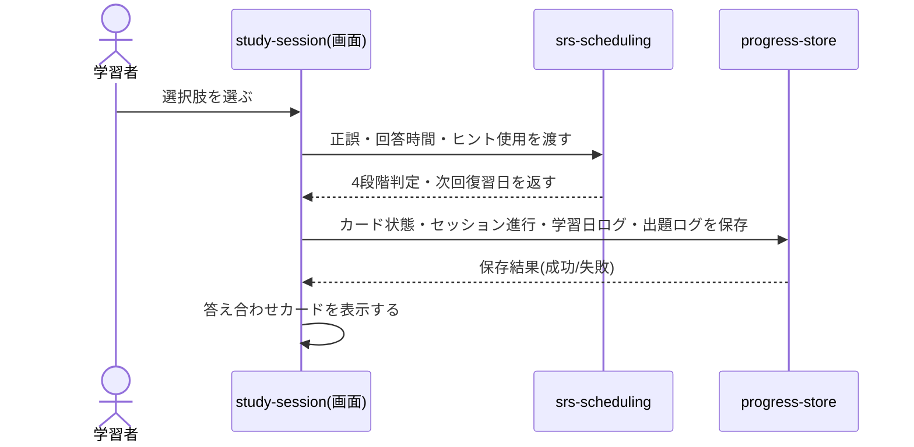
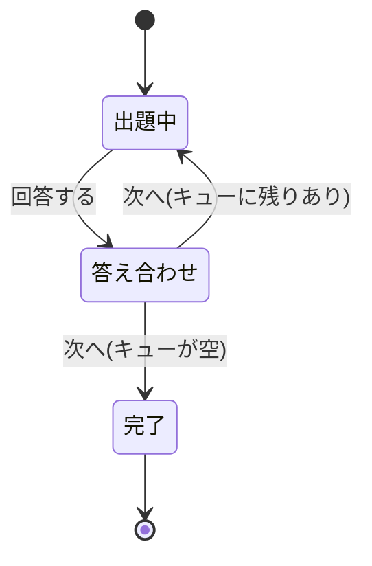

## サマリ
`srs-scheduling`が構成したその日のキューを1問ずつ4択で出題し、回答直後にフルの答え合わせカードを表示する画面。出題パターン(英単語→画像/画像→英単語/例文穴埋め→画像)は語ごと・出題回ごとに切り替え、セッション内リピートの再出題では前回と別パターンを出す。セッションは`progress-store`の未消化キューに都度保存するため、途中終了しても次回続きから再開できる。詳細は[出題〜保存のシーケンス図](#出題に回答する処理)、[画面遷移図](#画面遷移図)、[状態管理](#状態管理)。

## 処理フロー

### セッションを開始する処理
- 対象: `home`の学習開始操作
- 手順:
  1. `progress-store`から今日の未消化キュー(`e_tango_sessions`)があれば復元する(「セッションを再開する処理」参照)。既存の未消化キューがある日は、当日中に新規語数の設定を変更してもキューを再構築しないため、この日の新規語数はその日にセッションを開始した時点の値のまま進行する(`study-settings/requirements.md#変更の反映-2`)
  2. なければ、`srs-scheduling/design.md#今日のキューを構成する処理`でその日のキュー(復習語+新規語、出題順込み)を新規に組み立てる。この場合はその時点の新規語数の設定値がそのまま使われる
  3. キューが0件(その日の分をすべて終えている)の場合はセッションを開始せず、`home`にその旨を表示する(`home/requirements.md#表示-6`)
- 関連するビジネスルール: requirements.md#セッションの開始と進行-1

### セッションを再開する処理
- 対象: `progress-store`に保存済みの当日の未消化キューがある場合
- 手順: 保存されている未消化の語・出題順・セッション内リピートの連続正解カウントをそのまま復元し、その続きから出題する(要件[セッションの開始と進行-5])
- 関連するビジネスルール: requirements.md#セッションの開始と進行-5

### 1問を出題する処理
- 対象: キューの先頭の語
- 手順:
  1. 対象語の出題パターンを決める(セッション内リピートでの再出題は前回と別パターン。それ以外はランダムまたは順送りで3パターンから選ぶ)
  2. `word-content`の単語データから見出し語・画像・音声・例文・ディストラクター3語を取得し、4択(正解1+ディストラクター3)をランダムな順序で並べる(要件[出題パターン 7])
  3. 出題パターンに応じたレイアウトで表示する(要件[出題パターン 9]): 英単語→画像/例文穴埋め→画像は選択肢を2×2の画像で大きく表示、画像→英単語はお題画像を上部に大きく、選択肢は英単語4つのボタン
  4. 画面上部にセッション内の進捗(現在の問題数/総問題数)を表示する(要件[セッションの開始と進行-2])
- 関連するビジネスルール: requirements.md#出題パターン

### 出題に回答する処理
- 対象: 4択のいずれかの選択
- 手順:
  1. 選択と同時に回答を確定する(別途の決定操作はなし。要件[回答と操作-10])
  2. 正誤・回答にかかった時間・ヒント使用の有無を`srs-scheduling/design.md#4段階を自動判定する処理`に渡し、4段階判定と次回復習日・安定度・難易度を得る
  3. `progress-store/design.md#出題への回答を保存する処理`に、カード状態・セッション進行(未消化キューの更新)・学習日ログ・出題ログをまとめて保存させる
  4. 正誤を表示した後、続けて答え合わせカードを表示する(要件[答え合わせカード-14])
- シーケンス図:

- 関連するビジネスルール: requirements.md#回答と操作

### ヒントを表示する処理
- 対象: 出題中の「ヒント」操作
- 手順: 語の頭文字・日本語訳の一部などのヒントを表示する。ヒントを使ったことを保持し、回答確定時に「4段階を自動判定する処理」に渡す(要件[回答と操作-12])
- 関連するビジネスルール: requirements.md#回答と操作-12

### 音声を再生する処理
- 対象: お題・例文の音声再生操作
- 手順: `word-content`のR2音声URLを`<audio>`で再生する。再生中に別の音声操作をした場合は前の再生を止めて新しい音声を再生する
- 関連するビジネスルール: requirements.md#回答と操作-13

### 答え合わせカードで習得済みを切り替える処理
- 対象: 答え合わせカードの「習得済み/学習中」トグル
- 手順: 手動切替フラグ(`mastered_manual_override`)を立てた上で、指定した状態を`progress-store`に保存する。以後の`srs-scheduling`の自動判定はこの手動指定を上書きしない(要件[答え合わせカード-15]、`srs-scheduling/design.md#習得済みを判定する処理`)
- 関連するビジネスルール: requirements.md#答え合わせカード-15

### セッションを完了する処理
- 対象: キューをすべて消化した時点
- 手順: 完了画面(その日の学習語数など)を表示し、`home`に戻れる導線を表示する。あわせて`progress-store`の当日の未消化キュー行(`e_tango_sessions`)を削除する(要件[セッションの開始と進行-4])
- 関連するビジネスルール: requirements.md#セッションの開始と進行-4

### セッションを中断する処理
- 対象: セッション画面からの離脱・中断操作
- 手順: 出題への回答のたびに未消化キューを保存済みのため(「出題に回答する処理」手順3)、特別な保存操作は不要。離脱時点の未消化キューがそのまま次回の再開対象になる(要件[セッションの開始と進行-5])

## エラーハンドリング
- 保存の失敗時の扱いは`progress-store/design.md#保存失敗時の扱い`に従う(日本語の定型メッセージを表示し、再試行できるようにする。学習の続行はブロックしない)
- 単語データ(画像・音声)の取得に失敗した場合、画像は代替のプレースホルダー表示、音声は再生ボタンを無効化した上で日本語の定型メッセージ(例:「音声を読み込めませんでした」)を表示し、出題自体は継続する

## 関連するファイル(抜粋)
```
app/e-tango/study-session/page.tsx (新規: 画面本体。出題/答え合わせ/完了の状態を保持する)
app/e-tango/components/QuizCard.tsx (新規: 出題画面。3パターンのレイアウト出し分け)
app/e-tango/components/ChoiceGrid.tsx (新規: 4択の2×2画像グリッド、または4択ボタン)
app/e-tango/components/AnswerCard.tsx (新規: 答え合わせカード)
app/e-tango/components/ProgressBar.tsx (新規: 現在の問題数/総問題数の表示。homeの進捗リングとは別コンポーネント)
app/e-tango/lib/pickQuizPattern.ts (新規: 出題パターンの選定。前回と別パターンにする制御を含む)
app/e-tango/lib/words.ts (既存: word-contentが提供する単語データ読み込み)
app/e-tango/lib/gradeAnswer.ts, scheduleReview.ts, sessionRepeat.ts (既存: srs-scheduling)
app/e-tango/lib/progressStore.ts (既存: progress-store)
```

## 画面設計
Step0でStitch(プロジェクトID: `14003008640653655073`、デザインシステム「案4 Headspace風」`assets/2196654837768947775`)により出題画面・答え合わせカードを確定した。
- 出題画面(英単語→画像パターン): `projects/14003008640653655073/screens/4d8bf0e1edcc456e8756ccf6711746d3`
- 答え合わせカード: `projects/14003008640653655073/screens/a9011cdc1e59437a9b6b47050cc1aa19`

### 出題画面
- 上部: 進捗バー(現在の問題数/総問題数)、共通ヘッダーは表示しない(学習に集中させるため。閉じる操作でセッション中断→`home`に戻る)
- 中央: お題(英単語+発音記号+音声ボタン、または画像、または例文穴埋め+音声ボタン)
- 選択肢: 4つ(画像2×2、または英単語4ボタン)。画像を最大化することを優先する(要件[出題パターン 9])
- 下部: ヒント表示リンク

### 答え合わせカード
- 正誤バッジ
- 見出し語・US発音記号・音声ボタン・日本語訳
- 意味を表すイラスト
- 例文(英・日)と例文の音声ボタン
- コアイメージの一言説明
- 「学習中/習得済み」切り替えトグル
- 「次へ」の横幅いっぱいのCTAボタン

### 画面遷移図
```mermaid
flowchart TD
    quiz[出題画面]
    answer[答え合わせカード]
    complete[セッション完了画面]
    home[home]

    quiz -->|回答する| answer
    answer -->|次へ、キューに残りあり| quiz
    answer -->|次へ、キューが空| complete
    complete -->|homeへ戻る| home
    quiz -->|閉じる(中断)| home
```
正となる文章は上記の各処理フロー・画面設計の箇条書き。

## コンポーネント設計
| コンポーネント | Props | 役割 |
|---|---|---|
| QuizCard | `pattern: '英単語→画像' \| '画像→英単語' \| '例文穴埋め→画像'`, `word: Word`, `choices: Word[]`, `onAnswer: (choiceId: string, responseTimeMs: number, usedHint: boolean) => void` | 出題パターンに応じたレイアウトで1問を表示し、選択と同時に回答を確定する |
| ChoiceGrid | `choices: { id: string; label: string; imageUrl?: string }[]`, `layout: 'image' \| 'text'`, `onSelect: (id: string) => void` | 4択を画像2×2または4ボタンで表示する |
| AnswerCard | `word: Word`, `correct: boolean`, `mastered: boolean`, `onToggleMastered: (mastered: boolean) => void`, `onNext: () => void` | 答え合わせカードの表示・習得済み切り替え・次へ操作 |

## 状態管理
- セッションの進行状態(未消化キュー、現在の問題、出題/答え合わせ/完了のフェーズ、セッション内リピートの連続正解カウント)は`page.tsx`が保持し、回答のたびに`progress-store`へ保存する(画面をまたぐ共有はないため、グローバルな状態管理ライブラリは使わない)
- 状態遷移図:

正となる文章は上記の各処理フロー。

## セキュリティ
本画面が扱うデータ(単語データ・カード状態)はいずれも学習者本人のものか、リポジトリ/R2の静的コンテンツであり、他の利用者の入力を画面に表示することはない。`dangerouslySetInnerHTML`等の危険なDOM挿入は用いない。

## パフォーマンス
- 出題する画像・音声は、次の1〜2問分を先読み(プリロード)し、出題の切り替わりで読み込み待ちが発生しないようにする

## ログ
- 出題・回答(正誤・4段階判定)・セッション完了を`console.log`に、単語データ・保存の失敗を`console.error`に出力する(個々の単語内容は識別子のみ、翻訳文等は出力しない)
