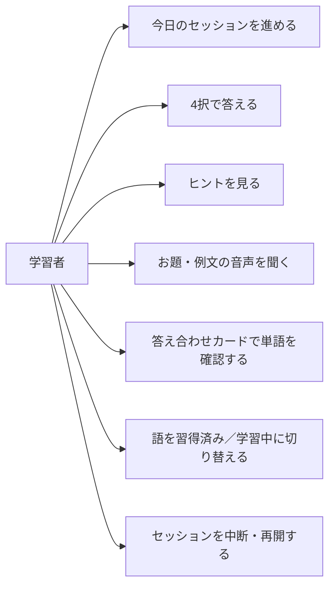

# 要件定義: 学習セッション

> ステータス: 仕様確認中(未実装)

## サマリ

その日のキュー(`srs-scheduling` が決めた復習語＋新規語)を 1 問ずつ 4択で出題する学習画面。出題は 3 パターン(英単語→画像／画像→英単語／例文穴埋め→画像)で、画像をできるだけ大きく見せる。回答するとすぐにフルの答え合わせカード(発音・音声・例文・コアイメージ・イラスト)が出る。新規語・間違えた語は同じセッション内で形式を変えて繰り返し出る。途中でやめても次回続きから再開できる。詳細は[ユースケース図](#ユースケース図)。

## 概要
- 機能名: 学習セッション
- 目的: 画像と例文の 4択で単語を思い出す練習をこなし、答え合わせカードで記憶に結びつける
- 優先度: 高(アプリの主機能)

## ユーザーストーリー
- 学習者として、今日の分の単語を 1 問ずつ 4択で解いて、テンポよく学習を進めたい
- 学習者として、英単語からイラストを選ぶ問題と、イラストから英単語を選ぶ問題の両方で覚えたい
- 学習者として、例文の空欄に合うイラストを選ぶ問題で、文脈の中での意味を覚えたい
- 学習者として、答えた直後にその単語の発音・例文・コアイメージ・イラストをまとめて見て、記憶に結びつけたい
- 学習者として、分からないときはヒントを見たい、単語や例文の音声を聞きたい
- 学習者として、セッションを途中でやめても、次回続きから再開したい

## ユースケース図

正となる仕様は[ユーザーストーリー](#ユーザーストーリー)・[機能要件](#機能要件)。

## 機能要件

### セッションの開始と進行
- [1] `home` の学習開始操作から、その日のキュー(`srs-scheduling` が決めた復習語＋新規語)を対象にセッションを始める
- [2] 画面上部に、セッション内の進捗(現在の問題数／その回の総問題数)を表示する
- [3] 1 問ずつ出題する。回答するごとに答え合わせを挟み、「次へ」で次の問題に進む
- [4] キューの語をすべて消化したらセッション完了とし、完了画面(その日の学習語数など)を表示して `home` に戻れる
- [5] セッションを途中で終了できる。次回開始時は、その日の未消化分から再開する

### 出題パターン
- [6] 出題は次の 3 パターンで、いずれも 4択とする:
  - 英単語→画像: お題に英単語(と音声)、選択肢に画像 4 つ。意味を表す画像を選ぶ
  - 画像→英単語: お題に画像、選択肢に英単語 4 つ。画像が表す語を選ぶ
  - 例文穴埋め→画像: お題に対象語を空欄にした例文(と音声)、選択肢に画像 4 つ。空欄に入る語の意味の画像を選ぶ
- [7] 選択肢の誤答 3 つは `word-content` のディストラクターを用いる
- [8] 出題パターンは語ごと・出題回ごとに切り替える。セッション内リピートでの再出題では前回と別のパターンを出す(`srs-scheduling/requirements.md#セッション内リピート`)
- [9] 画像を大きく見せることを優先する。選択肢が画像のパターンでは画像を 2×2 で大きく並べ、お題が画像のパターンではお題の画像を画面上部に大きく表示し、選択肢の英単語を 4 つのボタンで下に並べる

### 回答と操作
- [10] 選択肢を選ぶと即座に回答が確定する(別途の決定操作は設けない)
- [11] 正誤・回答にかかった時間・ヒント使用の有無を `srs-scheduling` に渡し、4 段階判定に用いる
- [12] ヒントを表示できる(例: 語の頭文字、日本語訳の一部など)。ヒントを使った回答は 4 段階判定で「むずかしい」以下になる
- [13] お題・例文の音声を再生できる

### 答え合わせカード
- [14] 回答直後に、正誤に続けて対象語の情報をまとめたカードを表示する。表示内容: 見出し語、US 発音記号、単語の音声、日本語訳、意味を表すイラスト、例文(英・日)と例文の音声、コアイメージ
- [15] 答え合わせカードから、その語を「習得済み／学習中」に手動で切り替えられる(既定は `srs-scheduling` の習得済み判定に従う)
- [16] 「次へ」で次の問題に進む

## ビジネスルール・制約

### 出題対象
- [1] 出題する語は、その日のキューにある語のみとする(`srs-scheduling/requirements.md#1日のキュー構成`)。キューにない語を学習者が自由に選んで出題することはしない(MVP では `word-list` を持たないため)
- [2] 1 つのセッションで扱う語数の上限は `srs-scheduling` のキュー構成に従う

### ヒント使用時の判定
- [1] ヒントを使った回答は、正解でも 4 段階判定を「むずかしい」とする(根拠: 自力で想起できていないため、次の復習間隔を大きく広げない。`srs-scheduling/requirements.md#4段階の判定` と整合)

## 非機能要件・UI/UX
- [1] ホーム画面は「リング進捗中心型」、出題画面は画像を最大化する骨格、答え合わせは「フルカード即表示」とする(`/requirement` のワイヤーフレーム選定)。詳細レイアウトは `design.md` で定める
- [2] オフラインでの学習は行わない(オンライン前提。オフライン対応は今後の拡張候補)

## 依存関係
- 出題するキュー・出題結果の判定・セッション内リピートのルールは `srs-scheduling/requirements.md`
- 単語データ(見出し・訳・発音・音声・例文・コアイメージ・イラスト・ディストラクター)は `word-content/requirements.md#単語データの項目`
- 学習の進捗(カード状態・セッションの未消化分・学習日・出題ログ)の保存は `progress-store/requirements.md#保存する内容`
- セッション開始の導線・完了後の戻り先は `home/requirements.md#表示`

## スコープ外
- 例文穴埋め→タイピング、音声→英単語 などの追加出題パターン(今後の拡張候補)
- キューにない語の自由学習、苦手な語だけの復習(今後の拡張候補)
- 答え合わせカードの英英定義・類義語・活用形の表示(データ項目が未対応。今後の拡張候補)
- オフライン学習
