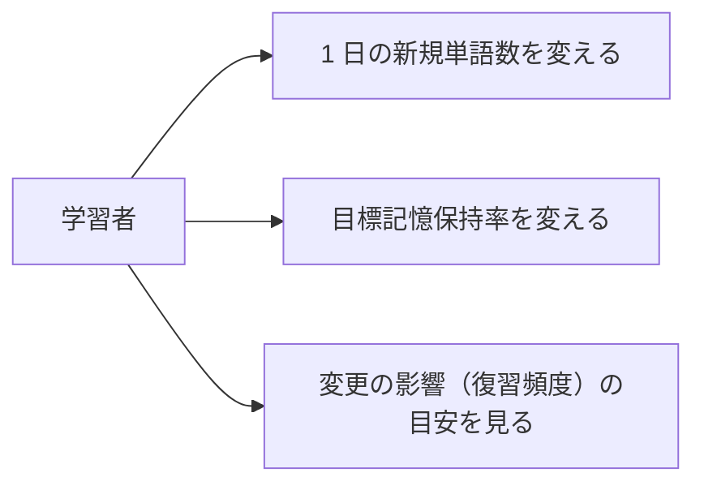

# 要件定義: 学習設定

> ステータス: 仕様確認中(未実装)

## サマリ

「1 日の新規単語数」と「目標記憶保持率」を、画面内で直接(ステッパー／セグメント)変更できる設定画面。変更は即時に保存し、次のセッション・キュー計算から反映する。目標保持率を変えると復習頻度がどう変わるかの目安をその場で表示する。詳細は[ユースケース図](#ユースケース図)。

## 概要
- 機能名: 学習設定
- 目的: 学習ペース(1 日の新規語数)と忘れにくさ(目標保持率)を学習者が自分で調整できるようにする
- 優先度: 中

## ユーザーストーリー
- 学習者として、1 日に増やす新規語の数を自分のペースに合わせて変えたい
- 学習者として、復習の多さ(忘れにくさ)を、目標保持率で調整したい

## ユースケース図

正となる仕様は[ユーザーストーリー](#ユーザーストーリー)・[機能要件](#機能要件)。

## 機能要件
- [1] `home` から移動できる設定画面を設ける
- [2] 「1 日の新規単語数」を変更できる。既定 10 語。画面内のステッパー(−／＋)で直接調整する
- [3] 「目標記憶保持率」を変更できる。既定 90%。画面内のセグメント(80／85／90／95%)で直接選ぶ
- [4] 目標保持率を変えると復習頻度がどう変わるかの目安を、その場で表示する(高いほど復習が増える)
- [5] 変更は即時に保存し、次のセッション・キュー計算から反映する
- [6] 各設定の意味を短い説明文で添える

## ビジネスルール・制約

### 設定値の範囲
- [1] 1 日の新規単語数は 5〜30 語の範囲で選べる(根拠: 少なすぎると学習が進まず、多すぎると復習が破綻するため、常識的な範囲に限定する。`/requirement` で設定。運用しながら見直す)
- [2] 目標記憶保持率は 80〜95% の範囲で選べる(根拠: FSRS で推奨される実用範囲。これを外れると復習が極端に増減する)
- [3] 既定値は新規 10 語・保持率 90%

### 変更の反映
- [1] 目標保持率の変更は、以後の復習日計算から反映する。すでに計算済みの各カードの復習日を即座に一括再計算し直すことはしない(根拠: 全カードの一括再計算は負荷が大きく、次回復習時に新しい保持率で計算すれば十分なため。`/requirement` で合意)
- [2] 新規語数の変更は、翌日以降のキューから反映する。その日すでに開始しているセッションの新規語数は変えない

## 依存関係
- 設定値は `srs-scheduling/requirements.md#1日のキュー構成`(新規語数)と `srs-scheduling/requirements.md#スケジューリングアルゴリズム`(目標保持率)で使われる
- 設定値の保存は `progress-store/requirements.md#保存する内容`
- 画面への導線は `home/requirements.md#ナビゲーション`

## スコープ外
- 復習の 1 日上限の設定、出題パターンの選択、通知・リマインダーの設定(今後の拡張候補)
- 単語帳の学習計画(「1 日◯語で◯日で完了」の逆算表示)(今後の拡張候補)
