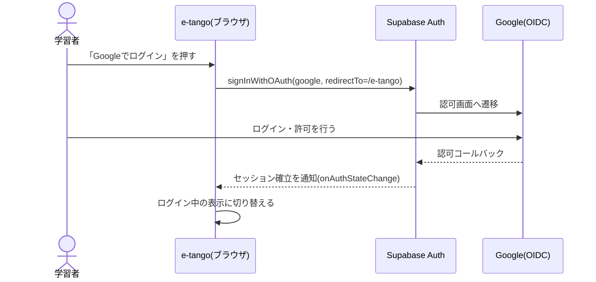
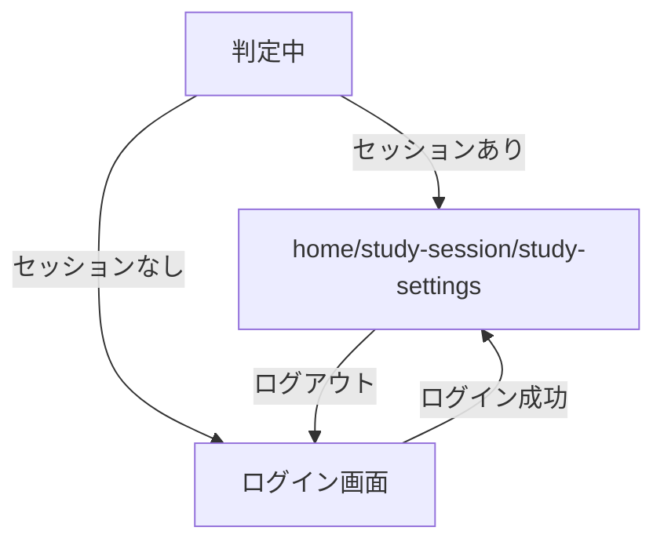

## サマリ
Supabase AuthのGoogle OIDCで学習者本人をログインさせ、未ログイン時はログイン画面のみを表示する(`docs/adr/0006-admin-screen-oidc-rls.md`の認証方式を踏襲するが、許可リストによるアクセス制御は行わない)。ログイン状態は`app/e-tango/lib/auth.ts`が一元管理し、`layout.tsx`が未ログイン時にログイン画面へ差し替えることで、`home`/`study-session`/`study-settings`の各画面はログイン中である前提で実装できる。詳細は[ログインする処理のシーケンス図](#ログインする処理google-oidc)、[画面遷移図](#画面遷移図)。

## 処理フロー

### ログイン状態を判定する処理(画面を開いた時点)
- 対象: `/e-tango`配下のいずれかのURLを開いた時点
- 手順:
  1. Supabase Authの現在のセッションを取得する
  2. セッションがあれば「ログイン中」とし、子画面(`home`等)をそのまま表示する
  3. セッションがなければ「未ログイン」とし、ログイン画面のみを表示する(要件[user-auth 1])
  4. 判定が完了するまでの間は、ログイン画面・子画面のどちらも表示せず、全画面のローディング表示のみとする(ログイン済みの再訪問者にログイン画面が一瞬ちらつくのを防ぐため)

### ログインする処理(Google OIDC)
- 対象: ログイン画面の「Googleでログイン」操作
- 手順:
  1. Supabase AuthのGoogle OIDCログインを開始する。リダイレクト先は`/e-tango`自身とする(静的サイトのためサーバーを介さず、戻り先ページでセッションが確立される)
  2. Google側での認証・許可が完了すると、`/e-tango`に戻ってきてセッションが確立される
  3. セッション確立を検知し、「ログイン状態を判定する処理」と同様に子画面の表示に切り替える。あわせて、そのアカウントに紐づく学習状態(`progress-store`)の読み込みが子画面側で始まる(要件[user-auth 3])
  4. 学習者がGoogle側で許可を拒否・中断した場合は、ログイン画面に留まる(エラー表示はしない。通常のキャンセル操作として扱う)
- シーケンス図:

- 関連するビジネスルール: requirements.md#ログイン

### ログアウトする処理
- 対象: ヘッダーのログアウト操作
- 手順: Supabase Authのセッションを破棄する。破棄を検知したら「ログイン状態を判定する処理」と同様にログイン画面の表示に切り替える(要件[user-auth 5])
- 関連するビジネスルール: requirements.md#ログイン

## エラーハンドリング
- Google側の認証開始リクエスト自体が通信エラーで失敗した場合、日本語の定型メッセージ(例:「ログインに失敗しました。時間をおいて再度お試しください。」)をログイン画面に表示し、技術的詳細は`console.error`に記録する
- セッション確立後に学習状態の読み込み(`progress-store`)が失敗した場合の扱いは`progress-store/design.md#エラーハンドリング`に従う(本機能の責務外)

## 関連するファイル(抜粋)
```
app/e-tango/layout.tsx (新規: ログイン状態の判定・ログイン画面/子画面の出し分け)
app/e-tango/lib/auth.ts (新規: getSession/onAuthChange/signInWithGoogle/signOutの薄いラッパー)
app/e-tango/components/LoginScreen.tsx (新規: 未ログイン時のログイン画面)
app/e-tango/components/Header.tsx (新規: ログイン中の表示・ログアウト操作。home/study-session/study-settingsで共用)
app/lib/supabaseClient.ts (既存の共通クライアントを利用)
```
`app/lib/adminAuth.ts`は運営者向け管理画面の許可リスト確認(`isAuthorizedAdmin`)を含む管理画面専用ロジックのため流用しない。e-tangoは誰でもログインできる一般利用者向けアプリのため、`app/e-tango/lib/auth.ts`に同等の薄いラッパー(セッション取得・状態変化購読・ログイン開始・ログアウト)を個別に用意する。

## 画面設計
Step0でStitch(プロジェクトID: `14003008640653655073`、デザインシステム「案4 Headspace風」`assets/2196654837768947775`、セージグリーン・ソフトブルーのパステル基調)によりログイン画面を確定した。
- ログイン画面: `projects/14003008640653655073/screens/47bebbdfe7d8416c8120c37d1c7bb028`

### ログイン画面
- 中央にアプリロゴ・キャッチコピー「イラストと例文でTOEIC頻出単語を覚える」
- 「Googleでログイン」ボタン(白背景・Googleロゴ)
- 画面下部に「本アプリはETSの承認・提携を受けたものではありません」の注記(`word-content/requirements.md#語彙リストの出所とライセンス表示`)
- 学習・ホーム・設定などの機能は表示しない(要件[user-auth 1])。共通ヘッダー(Header.tsx)もこの画面には表示しない

### ログイン中の共通ヘッダー(home/study-session/study-settingsで共用)
- ユーザーアバター(タップでログアウト操作)を表示する(要件[user-auth 4])。表示項目・配置は`home/design.md#画面設計`の共通chrome定義に従う

### 画面遷移図

正となる文章は上記の各処理フロー。

## 状態管理
- ログイン状態(判定中/未ログイン/ログイン中)は`app/e-tango/lib/auth.ts`が提供し、`layout.tsx`がフック経由で参照する。マウント直後は「判定中」で始まり、初期化処理の完了後に「未ログイン」または「ログイン中」に切り替わる

## セキュリティ
- 認証手段はGoogle OIDCの1本に絞り、パスワード認証・メールリンク等は用意しない(要件[認証方式 1]、`docs/adr/0006`踏襲)
- 管理画面と異なり許可リストは設けず、Googleアカウントを持つ人であれば誰でもログインできる(要件[認証方式 1])。学習データはRLSで本人専用に絞られるため、許可リストなしでも他人の学習データは閲覧・変更できない(`progress-store/design.md#セキュリティ`)
- ログイン状態はSupabase Authの標準セッション管理(ブラウザのlocalStorage)に従う。トークン自体をアプリ側で直接扱うことはしない(`@supabase/supabase-js`のクライアントに委譲)

## ログ
- ログイン成功・ログアウトは`console.log`に、ログイン開始失敗は`console.error`に出力する(PIIは含めず、成功/失敗の別のみを記録する)

## 依存関係
- ログイン後に読み込む学習状態は`progress-store/design.md`
- 共通ヘッダーの表示項目は`home/design.md#画面設計`
