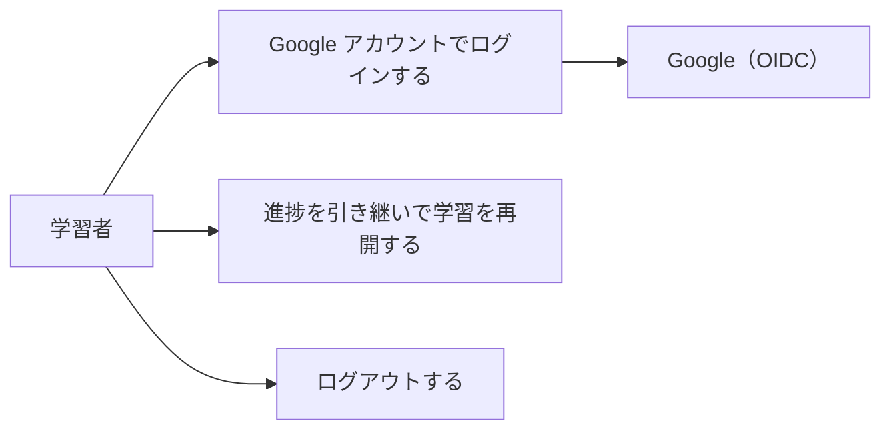

# 要件定義: ログイン

> ステータス: 仕様確認中(未実装)

## サマリ

e-tango は学習の進捗を長期にわたり本人に紐づけて保存・同期するため、Google アカウントによるログインを必須とする。未ログインではログインを促す画面のみを表示し、学習・ホーム・設定は使えない。認証基盤は既存アプリと同じ Supabase Auth 経由の Google OIDC を使い、管理画面のような許可リストは設けず、Google アカウントを持つ人は誰でもログインできる。詳細は[ユースケース図](#ユースケース図)。

## 概要
- 機能名: ログイン
- 目的: 学習者が Google アカウントでログインし、学習の進捗を端末をまたいで引き継げるようにする
- 優先度: 高(全機能の前提)

## ユーザーストーリー
- 学習者として、Google アカウントでログインして、学習の進捗を端末をまたいで引き継ぎたい
- 学習者として、別のスマホや PC でも同じアカウントでログインすれば、同じ進捗の続きから学習したい
- 学習者として、ログアウトできるようにしたい

## ユースケース図

正となる仕様は[ユーザーストーリー](#ユーザーストーリー)・[機能要件](#機能要件)。

## 機能要件

### ログイン
- [1] アプリの利用には Google アカウントによるログインを必須とする。未ログインでは、ログインを促す画面のみを表示し、学習・ホーム・設定などの機能は利用できない
- [2] ログイン操作で Google アカウントによる OIDC ログインを開始できる
- [3] ログイン後、そのアカウントに紐づく学習状態(`progress-store`)を読み込み、続きから学習できる
- [4] ログイン中は、ログイン中であることが分かる表示(アカウント名・アイコン等)とログアウト操作を表示する
- [5] ログアウトできる。ログアウト後は未ログイン状態(ログインを促す画面)に戻る

## ビジネスルール・制約

### 認証方式
- [1] 認証は Supabase Auth 経由の Google OIDC とする。ログインが必要なアプリで Supabase Auth を使うという一般方針は `docs/adr/0001-user-input-database.md` に基づき、Google OIDC の技術方針は `docs/adr/0006-admin-screen-oidc-rls.md` を踏襲する。ただし管理画面と異なり、許可リスト(`admin_emails`)によるアクセス制御は適用せず、Google アカウントを持つ人であれば誰でもログインできる
- [2] 本アプリはログインを必須とする(根拠: 学習の進捗を長期にわたり本人のアカウントに紐づけて保存・同期する必要があり、匿名のレコード単位 ID では端末変更・再訪時に進捗を引き継げないため。`/consult` で合意)

### アカウントと学習データ
- [1] 学習状態はログインした Google アカウント単位で 1 つ持つ。同じアカウントで複数の端末からログインした場合、同じ学習状態を共有する
- [2] 別の Google アカウントでログインした場合は、別の学習状態として扱う。アカウント間でのデータ統合・引き継ぎは行わない

## 非機能要件
- [1] ログイン状態は Supabase Auth の標準セッション管理に従い、ページをリロードしてもログイン状態を維持する

## 依存関係
- ログイン状態は `home` / `study-session` / `study-settings` / `progress-store` の各機能の前提となる
- 認証基盤(Supabase Auth・Google OIDC)は `docs/adr/0001-user-input-database.md`(Supabase Auth 採用の一般方針)・`docs/adr/0006-admin-screen-oidc-rls.md`(Google OIDC の技術方針)を踏襲する(許可リストによるアクセス制御は本機能には適用しない)
- Google アカウントによるログイン(氏名・メールアドレス等の個人情報の取得)を新設するため、`specs/legal/requirements.md` のプライバシーポリシーの更新要否を確認する

## スコープ外
- Google 以外のログイン手段(パスワード認証・メールリンクなど)
- 複数の Google アカウントの統合、アカウント削除機能
- 運営者による利用者アカウント一覧の閲覧・管理
