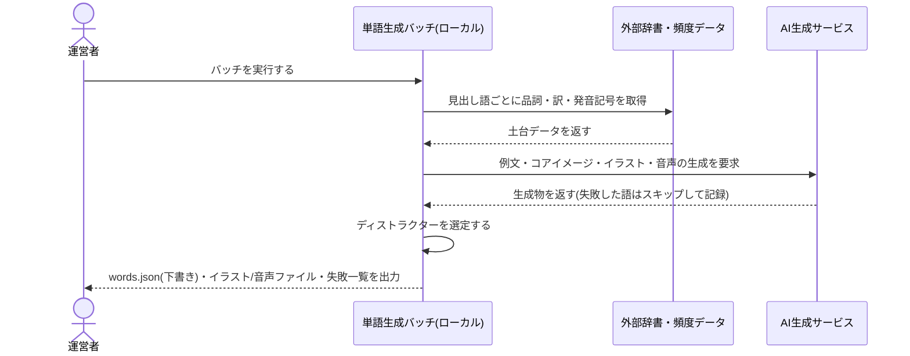

## サマリ
運営者のローカル環境で「語彙リスト用意→辞書・頻度データで土台作成→AIで例文・コアイメージ・イラスト・音声を一括生成→全件確認→反映」の順にバッチ処理し、単語データ本体(テキスト項目)を`data/e-tango/words.json`としてリポジトリにコミット、イラスト・音声をCloudflare R2にアップロードする。サイトのランタイムはこのJSONと確定済みR2 URLを静的に読み込むだけで、LLM・画像APIは呼ばない。詳細は[単語データを生成する処理のシーケンス図](#単語データを一括生成する処理)。

## 処理フロー

### 対象語彙リストを用意する処理
- 対象: TOEIC頻出語(想定1,000〜1,500語)
- 手順: パブリックドメインの頻度データ等から対象語彙のリスト(見出し語のみ)を作る。自前編集または出典表示不要なパブリックドメイン由来のものに限る(要件[語彙リストの出所とライセンス表示 1])。市販の単語集の単語選定・配列をそのまま複製しない(要件[語彙リストの出所とライセンス表示 3])
- 関連するビジネスルール: requirements.md#語彙リストの出所とライセンス表示

### 辞書・頻度データから土台を作る処理
- 対象: 対象語彙リストの各見出し語
- 手順:
  1. パブリックドメインの英和辞書・発音辞書から、品詞・日本語訳(1〜2個)・US発音記号を取得する
  2. 同一の綴りで品詞違いが複数ある場合は、TOEICでの出現頻度が高い品詞を優先して1エントリを採用する(複数品詞を学習させたい場合は将来の拡張候補とし、MVPでは1見出し語=1カードとする)
  3. 取得できなかった項目がある見出し語は、この時点でリストから除外し、除外理由(取得元データに項目がない等)を記録する

### 単語データを一括生成する処理(AI生成)
- 対象: 土台が揃った各見出し語
- 手順:
  1. 見出し語・品詞・日本語訳を入力に、例文(英語)・例文の日本語訳・コアイメージ(語のイメージを一言で説明する日本語文)をAIで生成する
  2. 例文の内容をもとに、意味を表すイラスト(全単語で画風を統一するプロンプト雛形を使用)をAIで生成する
  3. 見出し語・例文それぞれの音声をAIで生成する
  4. ディストラクター(4択の誤答用単語)3語を、同じコース内の別の単語から、品詞が近く意味・イラストが紛らわしすぎないものを選ぶ(要件[単語データの項目 4])。この時点で語彙リスト全体が確定している必要があるため、本処理は「辞書・頻度データから土台を作る処理」が全語彙分完了した後に実行する
  5. 生成に失敗した項目(タイムアウト・フィルタ拒否等)がある見出し語は、その語をスキップして次に進み、失敗した見出し語の一覧を最後にまとめて記録する(要件[データの用意方法 5]、`エラーハンドリング`参照)
- シーケンス図:

- 関連するビジネスルール: requirements.md#データの用意方法

### 全件を確認して公開データに反映する処理
- 対象: バッチが出力した下書きデータ
- 手順:
  1. 運営者が例文・日本語訳・イラストを全件目視で確認する(要件[データの用意方法 7])
  2. コアイメージ・ディストラクターは抜き取りで確認する(要件[データの用意方法 7])
  3. 修正が必要な項目があれば、該当語だけ再生成するか手動で書き換える
  4. 確認済みのテキスト項目を`data/e-tango/words.json`としてリポジトリにコミットし、イラスト・音声ファイルをCloudflare R2にアップロードする(要件[データの格納 8])
  5. 確認を経ていないデータは公開しない(要件[生成AIの利用 1])
- 関連するビジネスルール: requirements.md#データの用意方法-7、requirements.md#生成AIの利用

## エラーハンドリング
- AI生成(例文・イラスト・音声)が失敗した見出し語は、その語をバッチ全体の失敗としてではなく個別にスキップし、成功した語だけで下書きデータを進める。失敗一覧はバッチ実行後にコンソール出力・ファイル出力し、運営者が個別に再実行するか対象から除外するか判断する
- 辞書データに必要な項目(品詞・訳・発音記号)が欠けている見出し語は、土台作成の時点で除外し、AI生成には進めない(不正確なデータで生成を進めないため)
- バッチはローカル実行のため、実行時エラーは標準出力・スタックトレースをそのまま運営者に見せてよい(利用者向けの日本語定型メッセージは不要。本要件は運営者専用ツール)

## 関連するファイル(抜粋)
```
scripts/e-tango/generate-words.mjs (新規: バッチ本体。土台作成→AI生成→ディストラクター選定→下書き出力)
scripts/e-tango/lib/dictSource.mjs (新規: パブリックドメイン辞書・頻度データの読み込み)
scripts/e-tango/lib/aiGenerate.mjs (新規: 例文・コアイメージ・イラスト・音声の生成呼び出し)
scripts/e-tango/lib/distractors.mjs (新規: ディストラクター選定ロジック)
data/e-tango/words.json (新規: 確認済みの単語データ本体。リポジトリにコミット)
app/e-tango/lib/words.ts (新規: words.jsonを型付きで読み込むモジュール。study-session/home/srs-schedulingが利用)
```

## データベース設計
単語データ本体はDB(Supabase)ではなくリポジトリの`data/e-tango/words.json`に置く(要件[データの格納 8]、`docs/adr/0001`のサーバーレス構成の維持)。イラスト・音声はCloudflare R2に`e-tango/images/<word_id>.png`・`e-tango/audio/<word_id>-word.mp3`・`e-tango/audio/<word_id>-sentence.mp3`の命名規則で格納し、`words.json`側は`word_id`のみを持つ(R2の実URLはアプリ側で`word_id`から組み立てる。Cloudflare R2の採用自体は`docs/architecture/infrastructure.md`・専用ADRで扱う)。

`words.json`の1要素(1単語)の構造:
| フィールド | 型 | 補足 |
|---|---|---|
| id | string | 見出し語を元にした一意なID(小文字英字、重複時は連番を付与。例: `abandon`) |
| headword | string | 見出し語(英語) |
| partOfSpeech | string | 品詞 |
| translations | string[] | 日本語訳(1〜2個) |
| phoneticUs | string | US発音記号 |
| exampleEn | string | 例文(英語) |
| exampleJa | string | 例文の日本語訳 |
| coreImage | string | コアイメージ(日本語の一言説明) |
| distractorIds | string[] | ディストラクターに使う単語の`id`3件 |

## セキュリティ
- 生成AI・画像APIのAPIキーは運営者のローカル環境の環境変数(`.env.local`相当)にのみ置き、リポジトリ・サイトのビルド成果物には一切含めない(要件[データの用意方法 5]、`docs/adr/0001`のサーバーレス構成の維持)
- サイトのランタイムはLLM・画像APIを一切呼ばないため、公開サイト経由でのAPI濫用・費用発生の経路自体が存在しない(要件[データの用意方法 5])

## ログ
- バッチ実行時、処理した見出し語数・成功数・失敗数と、失敗した見出し語の一覧(見出し語+失敗理由)を標準出力に記録する
