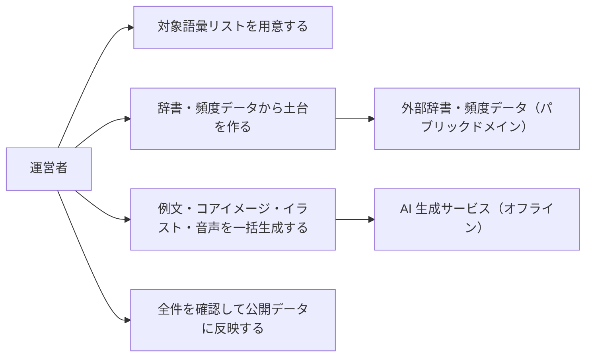

# 要件定義: 単語コンテンツ

> ステータス: 仕様確認中(未実装)

## サマリ

運営者が TOEIC 頻出語をひととおりカバーする単語データ(見出し・品詞・和訳・US 発音記号・音声・例文・コアイメージ・意味を表すイラスト・4択の誤答候補)を用意し、アプリに搭載する。土台にはパブリックドメインの辞書・発音辞書・頻度データを使い、例文・コアイメージ・イラスト・音声は AI で一括生成する。生成・更新はすべてオフラインのバッチ処理で行い、サイトのランタイムでは LLM・画像 API を呼ばない。テキスト項目はリポジトリ、イラスト・音声は Cloudflare R2 に置く。詳細は[ユースケース図](#ユースケース図)。

## 概要
- 機能名: 単語コンテンツ
- 目的: 画像で覚える TOEIC 英単語学習を成立させるだけの単語データを、サイトのランタイムに費用・負荷をかけずに用意する
- 優先度: 高(学習機能の前提データ)

## ユーザーストーリー
- 運営者として、TOEIC でよく出る語をひととおり学習できるだけの単語データを用意したい
- 運営者として、各単語に「意味を表すイラスト」「例文」「コアイメージ」を持たせ、画像で覚える学習を成立させたい
- 運営者として、単語データの生成・更新を、サイトのランタイムに負荷や費用をかけずに行いたい
- 学習者として、表示される訳・例文・画像が正確で、学習の妨げにならないでほしい

## ユースケース図

正となる仕様は[ユーザーストーリー](#ユーザーストーリー)・[機能要件](#機能要件)。

## 機能要件

### 単語データの項目
- [1] 1 単語ごとに次の項目を持つ: 見出し語(英語)、品詞、日本語訳(1〜2 個)、US 発音記号、単語の音声、例文(英語)、例文の日本語訳、例文の音声、コアイメージ(語のイメージを一言で説明する日本語文)、意味を表すイラスト 1 枚、4択の誤答に使う単語(ディストラクター)3 語
- [2] 対象語彙は TOEIC 頻出語をひととおりカバーする(想定 1,000〜1,500 語)。コースは「TOEIC」1 つのみ
- [3] イラストは、その単語の意味または例文の場面を表す絵とする。全単語で画風を統一する
- [4] ディストラクターは、同じコース内の別の単語から選ぶ。品詞が近く、意味・イラストが紛らわしすぎないものを選ぶ

### データの用意方法
- [5] 単語データの生成・更新は、サイトのランタイムではなくオフラインのバッチ処理(運営者のローカル環境)で行い、成果物をリポジトリまたはアセット配信先に反映する。サイトはできあがったデータを静的に読み込むだけとする(根拠: `docs/adr/0001-user-input-database.md` のサーバーレス構成の維持、および公開サイトからの LLM・画像 API 濫用・費用発生の回避。`/consult` で合意)
- [6] 見出し語・訳・発音などの土台には、再利用が許諾された外部データ(パブリックドメインの英和辞書・発音辞書、頻度データ)を用いる。例文・コアイメージ・イラスト・音声は AI で一括生成する
- [7] 例文・日本語訳・イラストは、公開前に運営者が全件目視で確認する。コアイメージ・ディストラクターは抜き取りで確認する

### データの格納
- [8] 単語データ本体(テキスト項目)はリポジトリにコミットする。イラスト・音声ファイルは Cloudflare R2 に格納し、アプリから静的に参照する(根拠: 画像・音声は全語で数百 MB 規模になり、リポジトリに含めると肥大化し、再生成のたびに履歴が膨らむため。`/consult` で合意)

## ビジネスルール・制約

### 語彙リストの出所とライセンス表示
- [1] 対象語彙のリストは、自前で編集したもの、またはパブリックドメイン由来のものを用いる。この場合、アプリ内に出典表示は不要
- [2] 出典表示が必要なライセンス(例: CC BY-SA)の語彙リストを用いる場合は、アプリ内に帰属表示のページを設ける
- [3] 市販の単語集の単語選定・配列・例文・訳語をそのまま複製しない(根拠: 単語そのものに著作権はないが、選定・配列には編集著作権が及びうる。例文・訳語は著者の表現。`/consult` で整理)
- [4] "TOEIC" は ETS の登録商標であり、記述的な範囲で用い、ETS との提携・公認を示唆しない。アプリ内に「本アプリは ETS の承認・提携を受けたものではない」旨を表示する

### 生成 AI の利用
- [1] 生成 AI で作成した例文・イラスト・音声・コアイメージは、学習教材としての正確性の責任を運営者が負う。機能要件 [7] の確認を経ていないデータは公開しない

## 依存関係
- 単語データは `study-session` の出題、`home` の進捗表示、`srs-scheduling` のカード単位の計算の入力になる
- 語彙リストの出所・ETS 商標の表示・生成物のライセンス表示について、`specs/legal/requirements.md` の更新要否を確認する
- イラスト・音声を置く Cloudflare R2 の採用はアプリ横断のインフラ変更であり、`docs/architecture/infrastructure.md` および専用 ADR で扱う

## スコープ外
- 複数コース(IELTS・英検・レベル別など)
- データ項目の追加: UK 発音・発音のコツ・活用形・英英定義・類義語(今後の拡張候補)
- 学習者による単語データの誤り報告(今後の拡張候補)
- アプリ内・管理画面からの単語データ編集(生成・修正はすべてオフラインバッチで行う)
