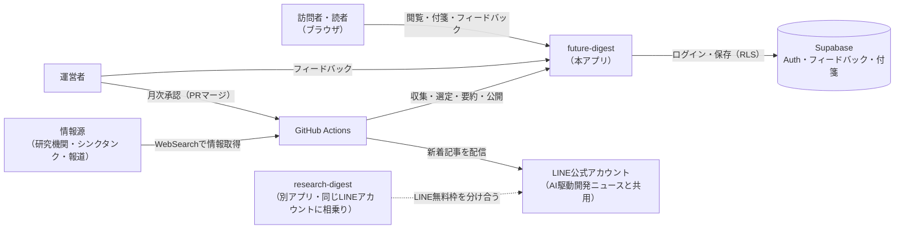
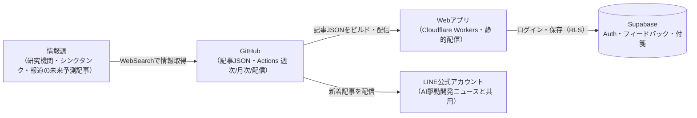
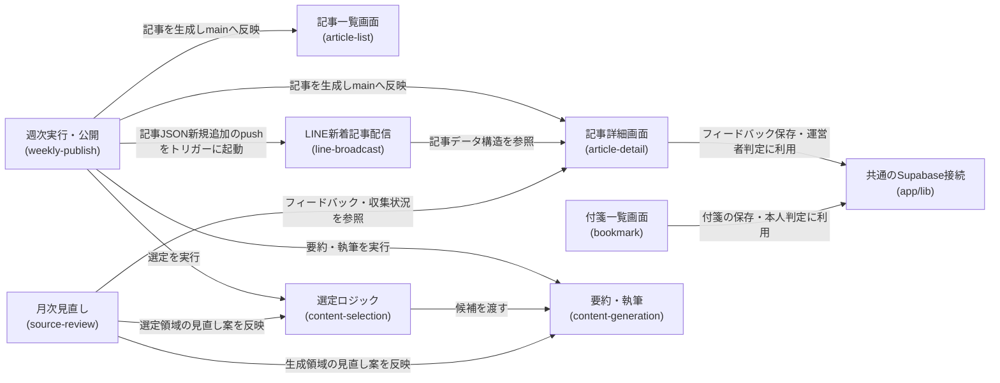
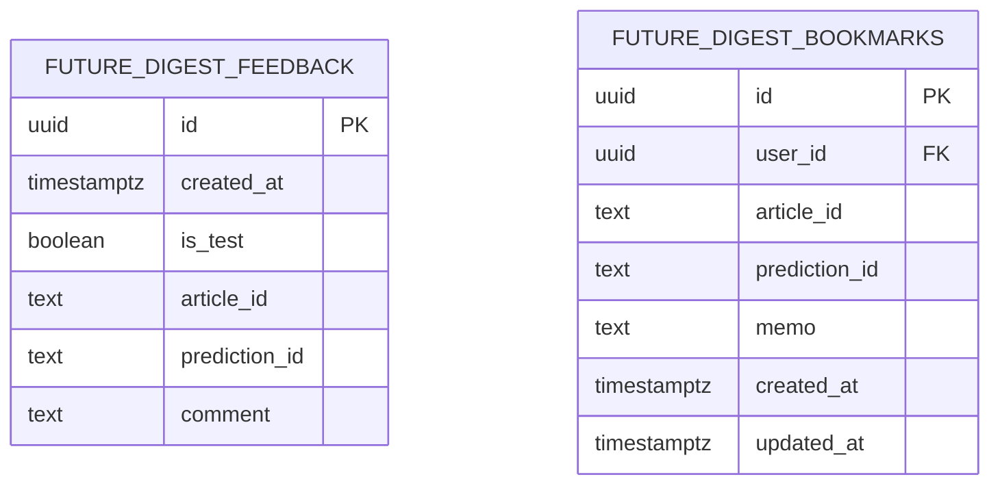

# アーキテクチャ: future-digest

## サマリ
未来予測記事を毎週木曜に配信するアプリ。有効なジャンル数×その回の時間軸2区分(現在は10ジャンル×2区分=20枠)ごとに、公開されている未来予測・考察記事を影響度付きで1本選び、GitHub Actionsが収集・選定・要約・公開・LINE配信を自動で行う。8つのspec(content-selection・content-generation・weekly-publish・line-broadcast・article-list・article-detail・bookmark・source-review)からなり、いずれも仕様のみ(未実装)。運用パターンはtrend-digestを踏襲する(下記「コンテキスト図」「システム構成図」参照)。

## 1. 概要
有効なジャンル(現在は10ジャンル)について、公開されている未来予測・考察記事を近未来・中期未来・長期未来・超長期未来の4つの時間軸ごとに選び、影響度(大・中・小)付きで要約して毎週木曜に公開するアプリ。時間軸の区分は[content-selection/requirements.md#時間軸](content-selection/requirements.md)に従う。URL: `/future-digest`

## 2. アーキテクチャの目的
- 既存のdigestアプリが配信していない木曜を埋め、trend-digestと同じ運用パターン(GitHub Actionsによる週次の自動生成・完全自動マージ、LINE配信、月次の人の承認込み見直し)をそのまま使い、新しい運用パターンを増やさない
- 4つの時間軸を配信回ごとに2つずつ交互に扱い(奇数回=近未来+長期未来、偶数回=中期未来+超長期未来)、1回あたりの掲載件数を有効なジャンル数×2枠(現在は20枠)に抑える

## 3. 設計方針
- 記事本文はDBに保存せず、ビルド時に取り込む静的コンテンツ(JSON)として管理する(ai-dev-digest・trend-digestと同じ)
- ジャンル・個人的注目分野のテーマは設定ファイル(コンテンツデータ)で管理し、追記だけで増やせるようにする
- 運営者フィードバックは[ADR-0001](../../docs/adr/0001-user-input-database.md)の`authenticated`ロールINSERT専用パターンを踏襲するが、INSERTは運営者本人(`admin_emails`)に限定し、画面の表示切り替えだけに頼らずDB側(RLS)でも守る。運営者判定は既存の`isAuthorizedAdmin()`([ADR-0006](../../docs/adr/0006-admin-screen-oidc-rls.md))を再利用する
- 読者の付箋はnews-digest・ai-dev-digestと同じ、本人だけが読み書きできるRLSパターンをとる
- LINE配信は既存の「AI駆動開発ニュース」のLINE公式アカウントに相乗りし、見出しに「【週刊未来予測】」を付けて区別する

## 4. コンテキスト図

この図の正となる文章は「[6. アーキテクチャ概要](#6-アーキテクチャ概要)」と各specの要件定義。

## 5. システム構成図

この図の正となる文章は「[6. アーキテクチャ概要](#6-アーキテクチャ概要)」と各specの要件定義。

## 6. アーキテクチャ概要
Next.jsの静的エクスポートをCloudflare Workersで配信する構成は他アプリと同じ。記事本文は`content/future-digest/`配下のJSONとして管理する。対象は有効なジャンル数×その回の2時間軸(現在は20枠)で、枠ごとに影響度の最も大きい未配信の記事を1本選ぶ。毎週木曜の朝にGitHub Actionsが起動し、Claude Code CLIのヘッドレス実行でWebSearchによる収集・影響度の判定・配信済みとの重複除外・要約を行い([content-selection](content-selection/requirements.md)・[content-generation](content-generation/requirements.md))、記事JSONを追加するPRを作ってCI成功後に自動マージする([weekly-publish](weekly-publish/requirements.md))。このマージをきっかけに別のワークフローが起動し、記事ページが本番で開けることを確認してからLINEで配信する([line-broadcast](line-broadcast/requirements.md))。訪問者は一覧・詳細ページ([article-list](article-list/requirements.md)・[article-detail](article-detail/requirements.md))を未ログインで閲覧でき、詳細ページでは影響度順・ジャンル順を切り替えられる。ログインした読者は記事ごとに付箋を貼れ([bookmark](bookmark/requirements.md))、運営者本人はフィードバックを残せる。月次のワークフローがフィードバックと収集状況から見直し案をPRで出し、運営者の承認を経て反映する([source-review](source-review/requirements.md))。

## 7. 採用技術
| 技術 | 用途 |
|---|---|
| Next.js(静的エクスポート) | 記事一覧・詳細・付箋一覧ページの描画 |
| Supabase | 運営者フィードバック・読者の付箋の保存 |
| Supabase Auth(Google OIDC) | 読者のログイン(付箋)、運営者判定(フィードバック欄の表示切り替え・INSERT権限) |
| GitHub Actions | 週次の記事生成・月次見直し・LINE配信の実行基盤 |
| Claude Code(ヘッドレス実行) | WebSearchによる収集、影響度の判定、重複の判定、要約・記事執筆、月次見直し案の検討 |
| LINE Messaging API | 既存LINE公式アカウントからの新着記事の配信 |
| Tailwind CSS | スタイリング |

## 8. 機能マップ
| spec | 機能(利用者から見て) | 役割 | 依存 | 状態 |
|---|---|---|---|---|
| [content-selection](content-selection/requirements.md) | ジャンル・時間軸ごとに影響の大きい未来予測を選ぶ | 有効なジャンル数×その回の2時間軸の枠ごとに、影響度が最も大きく未配信の未来予測記事を1本選ぶ | weekly-publishの実行タイミングに従う | 仕様のみ(未実装) |
| [content-generation](content-generation/requirements.md) | 予測の要約を読む | 選ばれた記事の要約・影響度の根拠の執筆ルール(著作権への配慮を含む)を定める | content-selectionの選定結果を受け取る | 仕様のみ(未実装) |
| [weekly-publish](weekly-publish/requirements.md) | 毎週木曜に新しい記事が並ぶ | 毎週木曜の収集・選定・要約・公開を自動で行い、完全自動マージする | content-selection・content-generationの結果を公開する | 仕様のみ(未実装) |
| [line-broadcast](line-broadcast/requirements.md) | LINEで新着記事の通知を受け取る | 記事ページの公開を確認してから、既存LINE公式アカウントで新着記事を配信する | weekly-publishのマージタイミング、article-detailの記事データに従う | 仕様のみ(未実装) |
| [article-list](article-list/requirements.md) | 過去の回を一覧で探す | 記事を日付リストで一覧表示し、影響度順の先頭3件の見出しを添える | article-detailの記事データを参照 | 仕様のみ(未実装) |
| [article-detail](article-detail/requirements.md) | 記事を読む・意見を残す | 記事を影響度順・ジャンル順で切り替えて表示し、運営者フィードバック欄を出す | content-selection・content-generationの結果に従う | 仕様のみ(未実装) |
| [bookmark](bookmark/requirements.md) | 気になった予測を付箋で残す | ログインした読者が記事ごとにメモ付きの付箋を貼り、一覧で見返す | article-detailの記事識別子に従う | 仕様のみ(未実装) |
| [source-review](source-review/requirements.md) | (運営者専用)基準を月次で見直す | 月次でジャンル・採用基準・執筆ルールの見直し案を作り、人の承認を経て反映する | article-detailのフィードバック、content-selectionの収集状況を参照 | 仕様のみ(未実装) |

### 実装順
未実装のためこれから実装に着手する場合は、依存関係の浅い順に次の順で進める(spec間の依存は上表「依存」列が正):
1. content-selection・content-generation(記事データの元となる選定・要約ルール)
2. article-detail(記事データの共有スキーマを定義するspec。他のUI specはこのスキーマに依存する)
3. weekly-publish(選定・生成・公開の自動実行)
4. article-list・bookmark・line-broadcast(article-detailのデータ構造を使う周辺機能。この3つの間に依存はなく並行できる)
5. source-review(記事データ・フィードバックの蓄積を前提とする月次見直し)

## 9. コンポーネント図

この図の正となる文章は「[8. 機能マップ](#8-機能マップ)」の依存列と、各specのrequirements.mdの依存関係。

## 10. ディレクトリ構成
CLAUDE.mdの一般規約(`components/`,`lib/`)どおり。trend-digestと同じ考え方で、次のように置く(各ファイルの役割は各specのdesign.md「関連するファイル」参照)。
- `content/future-digest/genres.json` — ジャンル・個人的注目分野の設定(運営者が追記して増やす)
- `content/future-digest/articles/<発行日>.json` — 1回分の記事データ(型は[article-detail/design.md](article-detail/design.md)で定義)
- `app/future-digest/` — 一覧・詳細・付箋一覧のページと`components/`・`lib/`
- `scripts/future-digest/` — 収集・選定、生成、記事の書き出し、LINE配信、月次見直しの材料収集のCLI
- `.github/workflows/future-digest-weekly.yml`・`future-digest-line-broadcast.yml`・`future-digest-monthly.yml` — 週次公開・配信・月次見直し

## 11. 外部サービス
| サービス | 用途 |
|---|---|
| Supabase(`future_digest_feedback`・`future_digest_bookmarks`テーブル) | 運営者フィードバック・読者の付箋の保存 |
| Supabase Auth(Google OIDC) | 読者のログイン(付箋)、運営者判定(フィードバック欄の表示切り替え・INSERT権限) |
| GitHub Actions | 週次の記事生成・月次見直し・LINE配信の実行基盤 |
| Claude Code CLI(運営者個人のPro/Maxサブスクリプション認証) | WebSearchによる収集・影響度判定・重複判定・要約執筆・月次見直し案の検討、いずれもヘッドレス起動で使用 |
| LINE Messaging API(既存の「AI駆動開発ニュース」公式アカウントに相乗り) | 新着記事の配信 |

使用テーブルは2つ(`future_digest_feedback`・`future_digest_bookmarks`)で、両テーブルとも記事JSON(DB外)の`article_id`・`prediction_id`を参照するのみでテーブル間の外部キー関係はない。

カラムの詳細・RLSは[article-detail/design.md](article-detail/design.md)・[bookmark/design.md](bookmark/design.md)の「データベース設計」を参照(こちらは索引)。

## 12. 関連ADR
- [0001-user-input-database.md](../../docs/adr/0001-user-input-database.md) — フィードバック(INSERT専用)・付箋(本人のみRLS)の保存パターン
- [0006-admin-screen-oidc-rls.md](../../docs/adr/0006-admin-screen-oidc-rls.md) — ログイン・運営者判定の基盤
- [0004-agent-readonly-db-access.md](../../docs/adr/0004-agent-readonly-db-access.md) — source-reviewが`benriyatool_readonly`でフィードバックを読む際の権限方針

## 13. セキュリティ
運営者フィードバックの保存は`authenticated`ロールによるINSERT専用とし、SELECT/UPDATE/DELETEは許可しない。INSERTできるのは運営者本人(`admin_emails`)に限り、画面の表示切り替えだけに頼らずデータベース側(RLS)でも守る(ai-dev-digest・trend-digestより一段厳しい制約。[article-detail/design.md](article-detail/design.md)参照)。読者の付箋は本人のみが読み書きできるRLSで守る([bookmark/design.md](bookmark/design.md))。月次のsource-reviewがClaude Code CLIをヘッドレス実行する際は、DB接続情報・GitHub PATをそのステップに渡さず、材料収集・コミット/push/PR作成の各ステップに分離する([source-review/design.md](source-review/design.md))。

## 14. 技術的制約
他者の記事・論文を要約して載せるため、著作権(翻案権)のリスクがある。ai-dev-digest・trend-digestと同じく、要約の分量を抑え、独自に書き直し、出典を明記し、利用規約に条項を追記してリスクを下げる([content-generation](content-generation/requirements.md))。性・恋愛ジャンルは、記事を書くClaude Code CLIの利用規約の範囲(官能的・扇情的な描写をしない)で率直に書き、LINE配信には見出しを載せない([content-generation](content-generation/requirements.md#性恋愛ジャンルの書き方)・[line-broadcast](line-broadcast/requirements.md))。3アプリ(未来予測・研究発見・既存アプリ)分をまとめて利用規約を変更する場合は、先に実装するアプリのPRで残り2アプリ分の条項も追記してよい(未公開のアプリ名が利用規約に一時的に載ることを許容する。根拠: /requirementでの決定)。

## 15. 用語集
| 用語 | 説明 |
|---|---|
| 枠 | ジャンル×時間軸の組。1回の配信であてはめる記事1本の入れ物。[content-selection](content-selection/requirements.md)で定義 |
| 近未来・中期未来・長期未来・超長期未来 | 配信日を基準点にした4つの時間軸区分。[content-selection/requirements.md#時間軸](content-selection/requirements.md)で定義 |
| 候補なし | 採用基準を満たし配信済みでない候補が0件だった状態(収集の処理自体は完了している)。[content-selection/requirements.md#候補が見つからない枠](content-selection/requirements.md)で定義 |
| 収集失敗 | 情報収集の処理自体が完了しなかった状態(候補なしとは区別する)。[content-selection/requirements.md#収集失敗](content-selection/requirements.md)で定義 |
