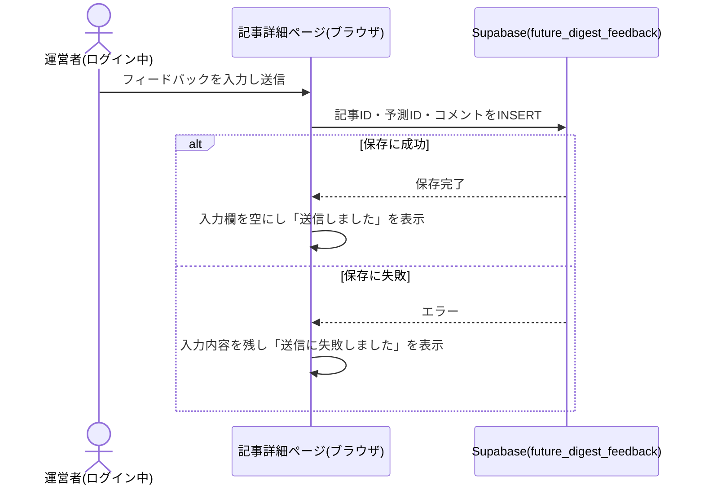
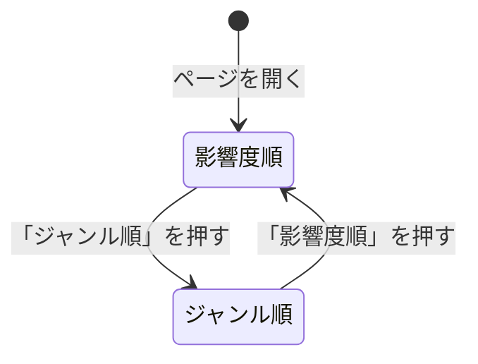

# 設計: 記事詳細ページ

## サマリ
その回の未来予測記事(10ジャンル×その回の2時間軸=20枠。ジャンル数は設定ファイルに従う)を、初期表示は影響度順、切り替えでジャンル順に並べて表示する。候補が見つからなかった枠も「候補が見つかりませんでした」として必ず表示し、20枠すべてが画面に現れる状態を保つ。運営者本人がログイン中の場合のみ、各記事の下にフィードバック入力欄を出し、`future_digest_feedback`テーブルへINSERT専用で保存する(trend-digestと同じ`authenticated`ロールのINSERT専用パターン)。記事データの型・置き場所は本specが定義し、他specが共通して従う(下記「前提: 記事データの形式」)。

主要な設計判断:
- 記事データは`content/future-digest/articles/<date>.json`の静的JSON。回数(何回目の配信か)を記事データに持たせ、時間軸の組み合わせ(奇数回=近未来+長期未来、偶数回=中期未来+超長期未来)との整合をビルド時に検証する
- 並び順の切り替えはURLを変えず画面内の状態(`useState`)で行う。並べ替えは決定的な純粋関数`sortSlots`で行う
- UIはStep0を簡易実施する(trend-digestの実装済みレイアウトを流用し、アクセントカラーのみインディゴ系に変える。下記「画面設計」)
- 図: 「フィードバックを送信する処理」のシーケンス図、「状態管理」の状態遷移図

## 前提: 記事データの形式(この機能が定義する共有スキーマ)

記事本文はDBではなく、ビルド時に取り込む静的コンテンツファイルとして管理する(architecture.md#3-設計方針)。この記事データの型・置き場所は本specで定義し、[article-list](../article-list/design.md)・[content-selection](../content-selection/design.md)・[content-generation](../content-generation/design.md)・[weekly-publish](../weekly-publish/design.md)・[line-broadcast](../line-broadcast/design.md)・[bookmark](../bookmark/design.md)・[source-review](../source-review/design.md)は共通してこの形式に従う。

- 格納場所: `content/future-digest/articles/<id>.json`(`<id>`は発行日`YYYY-MM-DD`。週1回の配信のため日付だけで一意になる。URLの`[id]`と一致させる)
- 1ファイル=1回分の記事。週次のGitHub Actionsワークフロー([weekly-publish](../weekly-publish/design.md))がこのファイルを新規追加する。公開をスキップした回はファイル自体を作らない
- なぜJSONか: 枠ごとの予測(ジャンル・時間軸・影響度・出典など)を構造化フィールドとして持ち、フィールド単位でビルド時に検証するため(trend-digestと同じ考え方)

```ts
// app/future-digest/lib/types.ts

// ジャンルはコードに固定せず、設定ファイル content/future-digest/genres.json から読み込む
// (content-selection/requirements.md#機能要件-1「設定ファイルへの追記だけで増やせる」。ファイルの形式は content-selection/design.md「データ設計」)
export type Genre = string // genres.jsonのid(例: "technology-ai")

// ジャンル順の並び替え・LINE配信・一覧の見出し選びで共通に使う表示順(genres.jsonの記載順。廃止したジャンルも過去記事の表示用に含む)
export const GENRE_ORDER: Genre[]
export const GENRE_LABELS: Record<Genre, string> // 例: { "technology-ai": "テクノロジー・AI", ... }

// 時間軸(content-selection/requirements.md#時間軸)。配列順=「時間軸の近い順」
export type Horizon = 'near' | 'mid' | 'long' | 'ultra-long'
export const HORIZON_ORDER: Horizon[] = ['near', 'mid', 'long', 'ultra-long']
export const HORIZON_LABELS: Record<Horizon, string> = {
  near: '近未来', mid: '中期未来', long: '長期未来', 'ultra-long': '超長期未来',
}

// 回数から扱う時間軸2区分を決める(content-selection/requirements.md#時間軸の切り替え-1。奇数回=近未来+長期未来、偶数回=中期未来+超長期未来)
export function horizonsForIssue(issueNumber: number): [Horizon, Horizon]

// 影響度(content-selection/requirements.md#影響度-1)。配列順=影響度の大きい順
export type Impact = 'high' | 'medium' | 'low'
export const IMPACT_ORDER: Impact[] = ['high', 'medium', 'low']
export const IMPACT_LABELS: Record<Impact, string> = { high: '大', medium: '中', low: '小' }

export type Prediction = {
  id: string // 記事内で一意。`<genre>--<horizon>`(例: "technology-ai--near")。フィードバック・付箋の紐付けに使う
  genre: Genre
  horizon: Horizon
  heading: string // content-generationが生成する見出し
  body: string // content-generationが生成する本文(160〜480字、目安200〜400字)
  impact: Impact
  impactReason: string // 影響度の根拠(1文)
  targetPeriod: string // 予測が対象とする時期(例: "2030年まで")。時間軸判定の根拠として保存し、画面ではバッジの横に小さく出す
  sourceTitle: string // 元記事のタイトル(配信済み判定の突合に使う。画面では出典リンクの文言として使う)
  sourceName: string // 情報源名
  sourceUrl: string // 元記事のURL
}

// 掲載できなかった枠。reasonで表示文言を出し分ける
export type EmptySlot = {
  genre: Genre
  horizon: Horizon
  reason: 'no-candidate' | 'generation-failed' // 候補が見つからなかった / 候補はあったが要約の生成に失敗した
}

export type Article = {
  id: string // ファイル名と一致(= date)
  date: string // YYYY-MM-DD。発行日
  issueNumber: number // 何回目の配信か(1始まり。公開をスキップした回は数えない)
  predictions: Prediction[]
  emptySlots: EmptySlot[]
}
```

- 扱う時間軸2区分は記事データに別フィールドとして持たず、`horizonsForIssue(issueNumber)`で常に導出する(二重管理による食い違いを防ぐため)
- 記事タイトルはJSONに保存せず、`date`から`buildArticleTitle(date)`([content-generation/design.md](../content-generation/design.md))で導出する
- `emptySlots`の`reason`は、候補が見つからなかった枠(requirements.md#記事本文の表示-3)と、候補はあったが要約の生成に失敗して除いた枠([weekly-publish/requirements.md#掲載件数の保証-2](../weekly-publish/requirements.md))を区別するために持つ。後者を「候補が見つかりませんでした」と表示すると事実と異なるため、「今回は記事を用意できませんでした」と表示する

## 処理フロー

### 記事データを読み込む処理
- 対象: `content/future-digest/articles/`配下のJSONファイル
- 手順:
  1. 指定されたIDのファイルを読み込む。ファイルが存在しない場合は「記事なし」として扱う(例外にしない)
  2. JSONとしてパースできない、または下記「バリデーション」を満たさない場合は例外を投げる
  3. 一覧用に全記事を読み込む場合は、発行日の新しい順に並べて返す
- 関連するビジネスルール: requirements.md#記事本文の表示-1〜2

### 表示する枠の一覧を組み立てる処理
- 対象: 読み込んだ1回分の記事
- 手順:
  1. 掲載した予測と掲載できなかった枠を、1つの「枠」の一覧にまとめる(予測がある枠は予測を、ない枠は掲載できなかった理由を持つ)
  2. 並び順が影響度順の場合は、予測がある枠を影響度の大きい順(大→中→小)に並べ、同じ影響度の中では下記ジャンル順の規則で並べる。掲載できなかった枠は、その後ろにジャンル順の規則で並べる(requirements.md#記事本文の表示-3、requirements.md#並び順の切り替え-5)
  3. 並び順がジャンル順の場合は、ジャンルの定義順に並べ、同じジャンルの中では時間軸の近い順に並べる。掲載できなかった枠も本来の位置に置く(requirements.md#並び順の切り替え-6)
- 関連するビジネスルール: requirements.md#記事本文の表示-3、requirements.md#並び順の切り替え-5〜6

### その回の記事本文を表示する処理
- 対象: 組み立てた枠の一覧
- 手順:
  1. 記事タイトル・公開日・その回の時間軸2区分(例:「近未来/長期未来」)を見出しとして表示する(requirements.md#記事本文の表示-1)
  2. ページを開いた時点では影響度順で表示する(requirements.md#並び順の切り替え-7)
  3. 予測がある枠は、ジャンル・時間軸・影響度のバッジ、見出し、本文、影響度の根拠、出典(情報源名・元記事タイトル・元URLへのリンク。新規タブで開く)を表示する(requirements.md#記事本文の表示-2)
  4. 候補が見つからなかった枠は、ジャンル・時間軸のバッジと「候補が見つかりませんでした」を表示する。生成に失敗した枠は、同じバッジと「今回は記事を用意できませんでした」を表示する(requirements.md#記事本文の表示-3)
  5. 並び順の切り替え操作が行われたら、同じ記事データから枠の一覧を組み立て直して表示し直す。スクロール位置は先頭に戻さない(requirements.md#並び順の切り替え-4)
- 関連するビジネスルール: requirements.md#記事本文の表示-1〜3、requirements.md#並び順の切り替え-4〜7、requirements.md#表示分量・著作権への配慮-1

### ログイン状態に応じてフィードバック入力欄の表示を切り替える処理
- 対象: Supabase Authのログインセッション
- 手順:
  1. ページ表示時に現在のログインセッションを取得する(`app/lib/adminAuth.ts`の`getSession`)
  2. ログイン中の場合、運営者本人かどうかを`isAuthorizedAdmin()`で確認し、許可対象と判定された場合のみ、予測がある各枠の下にフィードバック入力欄を表示する。未ログイン・許可対象外の場合は表示しない(requirements.md#運営者向けフィードバック-8、requirements.md#フィードバックの保存・権限-3)
  3. 確認中・確認に失敗した場合は「未許可」として扱い、入力欄を出さない。失敗はブラウザのコンソールにだけ出す(記事の閲覧という主機能を妨げないため。trend-digestと同じ)
  4. ログイン状態の変化を購読し、変化のたびに1〜3をやり直す
- 関連するビジネスルール: requirements.md#運営者向けフィードバック-8、requirements.md#フィードバックの保存・権限-3〜4

### フィードバックを送信する処理
- 対象: フィードバック入力欄に入力された自由記述
- 手順:
  1. 入力内容の前後の空白を除いた結果が空の場合は、送信ボタンを押せないようにする(requirements.md#運営者向けフィードバック-10)
  2. 送信時、記事ID・予測ID・入力内容を1件のレコードとして`future_digest_feedback`に保存する(ログイン中のセッションによる`authenticated`ロールでのINSERT)
  3. 保存に成功した場合は、入力欄を空にし「送信しました」を数秒表示する(requirements.md#運営者向けフィードバック-9)
  4. 保存に失敗した場合は、入力内容を残したまま「送信に失敗しました。もう一度お試しください」を表示する
- シーケンス図(俯瞰用。正は上記の手順の文章):


- 関連するビジネスルール: requirements.md#運営者向けフィードバック-9〜10、requirements.md#フィードバックの保存・権限-2

## バリデーション

記事データ(JSONファイル)のスキーマ検証(`parseArticle`):
- `id`がファイル名と一致し、`date`と同じ`YYYY-MM-DD`形式であること
- `issueNumber`が1以上の整数であること
- 各予測: `horizon`・`impact`が定義済みの値であること、`horizon`が`horizonsForIssue(issueNumber)`の2区分のどちらかであること、`id`が`<genre>--<horizon>`と一致すること、`heading`・`body`・`impactReason`・`targetPeriod`・`sourceTitle`・`sourceName`・`sourceUrl`が空でないこと、`sourceUrl`が`http`/`https`の絶対URLであること、`body`が160〜480字であること([content-generation/design.md](../content-generation/design.md)「本文の分量を検証する処理」)
- 各掲載できなかった枠: `genre`・`horizon`・`reason`が定義済みの値で、`horizon`がその回の2区分のどちらかであること
- `genre`が`genres.json`に存在するジャンル(廃止済みを含む)であること
- 同じ枠(ジャンル×時間軸)が2回現れないこと。記事に現れるジャンルは、その回の2時間軸の両方が予測または掲載できなかった枠として揃っていること(枠が黙って消える事故をビルド時に検知するため。content-selection/requirements.md#機能要件-3)。その回に有効だった全ジャンルが揃っていることは、記事を組み立てる時点で[weekly-publish/design.md](../weekly-publish/design.md)の`assembleArticle`が保証する(ジャンルを後から追加・廃止しても過去記事の検証が壊れないよう、ビルド時の検証は「その記事の中での整合」に限る)
- 予測が1件以上あること(全枠で採用できなかった回は公開しない。weekly-publish/requirements.md#掲載件数の保証-1)
- フィードバックの入力内容は、前後の空白を除いて空でないことのみ確認する(長さ・文字種の制限は設けない。requirements.md#運営者向けフィードバック-10)

## エラーハンドリング

- 記事データのスキーマ違反はビルド時(`next build`)に例外として検知させ、ビルドを失敗させる。週次記事PRのCIがこれで壊れたデータを弾き、不正な記事が公開されるのを防ぐ
- フィードバック送信の失敗(通信エラー・RLS拒否など)は、原因を区別せず定型の失敗文言を表示する(Supabaseのエラーメッセージをそのまま画面に出さない)
- 送信中は送信ボタンを無効にし、連続クリックによる二重送信を防ぐ

## 関連するファイル(抜粋)

```
app/future-digest/lib/types.ts (新規: Genre/Horizon/Impact/Prediction/EmptySlot/Article、各種ラベル・順序、horizonsForIssue。GENRE_ORDER/GENRE_LABELSはgenres.jsonから組み立てる)
content/future-digest/genres.json (content-selectionで新規: ジャンル・注目テーマの設定ファイル)
app/future-digest/lib/articleSchema.ts (新規: parseArticle。記事JSONの検証)
app/future-digest/lib/articles.ts (新規: getAllArticles/getArticleById。article-list・line-broadcast・bookmarkと共有)
app/future-digest/lib/sortSlots.ts (新規: 枠の一覧の組み立てと影響度順・ジャンル順の並べ替え)
app/future-digest/lib/saveFeedback.ts (新規: フィードバック保存)
app/future-digest/[id]/page.tsx (新規: 記事詳細ページ。generateStaticParamsで全IDを列挙)
app/future-digest/components/ArticleDetailView.tsx (新規: ログイン状態・並び順の状態を持つクライアントコンポーネント)
app/future-digest/components/SortToggle.tsx (新規: 影響度順/ジャンル順の切り替え)
app/future-digest/components/PredictionCard.tsx (新規: 1枠分の表示)
app/future-digest/components/SlotBadges.tsx (新規: ジャンル・時間軸・影響度のバッジ)
app/future-digest/components/FeedbackForm.tsx (新規)
app/future-digest/components/LoginStatus.tsx (新規: bookmarkで付箋一覧リンクを持つ)
app/lib/adminAuth.ts (既存: getSession/onAuthChange/signInWithGoogle/signOut/isAuthorizedAdminを利用)
app/lib/supabaseClient.ts (既存の共通クライアントを利用)
supabase/migrations/<timestamp>_create_future_digest_feedback.sql (新規)
content/future-digest/articles/*.json (新規: 記事本文データ)
```

## データベース設計

### future_digest_feedback(新規テーブル)
| カラム | 型 | 補足 |
|---|---|---|
| id | uuid | 共通カラム(docs/adr/0001)。DB側で自動採番 |
| created_at | timestamptz | 共通カラム。DB側で自動設定 |
| is_test | boolean, not null, default false | 共通カラム(docs/adr/0001)。開発環境またはURLに`?test=1`が付いている場合にtrue |
| article_id | text, not null | 対象記事の`Article.id` |
| prediction_id | text, not null | 対象予測の`Prediction.id` |
| comment | text, not null | 自由記述のフィードバック |

RLSはtrend-digestの`trend_digest_feedback`と同じINSERT専用の最小権限パターンとし、[ADR-0004](../../../docs/adr/0004-agent-readonly-db-access.md)の`benriyatool_readonly`向けSELECTをマイグレーションに含める(source-reviewの月次見直しがこのロールで読む):

```sql
create table future_digest_feedback (
  id uuid primary key default gen_random_uuid(),
  created_at timestamptz not null default now(),
  is_test boolean not null default false,
  article_id text not null,
  prediction_id text not null,
  comment text not null
);

alter table future_digest_feedback enable row level security;

-- authenticatedはINSERTのみ許可(入力欄はログイン中の運営者本人にのみ表示される)
grant insert on future_digest_feedback to authenticated;
create policy "authenticated can insert" on future_digest_feedback
  for insert to authenticated with check (true);

-- benriyatool_readonlyはSELECTのみ許可(ADR-0004。source-reviewの月次見直しが読む)
grant select on future_digest_feedback to benriyatool_readonly;
create policy "benriyatool_readonly can select" on future_digest_feedback
  for select to benriyatool_readonly using (true);
```

## 画面設計

Step0: 簡易実施。trend-digestの記事詳細ページ(`app/trend-digest/[id]/page.tsx`)の配色・レイアウトパターンを流用し、アクセントカラーのみインディゴ系(未来・先の見通しを表す寒色)に変える。最終的な見た目の確認は実装後のlocalhostでの画面レビューで行う。具体的な色はTailwindの既存パレットから選ぶ。

- パンくず(べんりやつーる › 週刊未来予測 › 記事タイトル)
- 記事タイトル・公開日・その回の時間軸2区分(例:「今回の時間軸: 近未来(1〜5年後)/長期未来(20〜50年後)」)
- 並び順の切り替え(「影響度順」「ジャンル順」の2つのボタン。選択中のものが分かる表示。初期は影響度順)
- 枠のカード一覧(ジャンル数×2枠。現在は20枠):
  - 予測がある枠: ジャンル・時間軸・影響度のバッジ(影響度は大・中・小を文字でも表示し、色だけに意味を持たせない)、対象時期、見出し、本文、「影響度の根拠: 〜」、出典(情報源名・元記事タイトルを文言にした元URLへのリンク。新規タブで開く)
  - 候補が見つからなかった枠: ジャンル・時間軸のバッジと「候補が見つかりませんでした」(カードは淡い配色にして、予測がある枠と区別する)
  - 生成に失敗した枠: 同じバッジと「今回は記事を用意できませんでした」
- 予測がある枠の下: 付箋の操作領域([bookmark/design.md](../bookmark/design.md))、運営者本人のみフィードバック入力欄(テキストエリア+送信ボタン)
- ページ下部: ログイン状態表示(未ログインは「ログイン」ボタン、ログイン中はメールアドレス・付箋一覧リンク・ログアウトボタン)

画面遷移図は、並び順の切り替えが同一画面内の表示の切り替えで、画面間の遷移は[article-list/design.md](../article-list/design.md#画面遷移図)の図で扱うため、ここでは下記「状態管理」の状態遷移図で表す。

## コンポーネント設計

| コンポーネント | Props | 役割 |
|---|---|---|
| ArticleDetailView | `article: Article` | ログインセッション・運営者判定・並び順の状態を持ち、枠のカード一覧を描画する |
| SortToggle | `order: 'impact' \| 'genre'`, `onChange: (order) => void` | 並び順の切り替えボタン |
| PredictionCard | `slot: Slot`, `articleId: string`, `isAdmin: boolean`, `session: Session \| null`, `bookmark` | 1枠分の表示。予測がない枠は理由の文言だけを出す |
| SlotBadges | `genre: Genre`, `horizon: Horizon`, `impact?: Impact` | ジャンル・時間軸・影響度のバッジ |
| FeedbackForm | `articleId: string`, `predictionId: string` | フィードバックの入力・送信・結果表示 |

## 状態管理

- `ArticleDetailView`が並び順(`'impact' | 'genre'`、初期値`'impact'`)を`useState`で持つ。URLには出さない(共有・ブックマーク時は常に影響度順で開けば足りるため)
- ログインセッション・運営者判定(`isAdmin`)も`ArticleDetailView`で持ち、各カードへpropsで渡す
- 各`FeedbackForm`の送信状態(未送信/送信中/送信済み/失敗)はコンポーネント内で完結させる


上記は俯瞰用の図。正は「その回の記事本文を表示する処理」の文章。

## セキュリティ

- フィードバックの`comment`は公開画面のどこにも表示しない(requirements.md#フィードバックの保存・権限-4)。表示起因のXSSのリスクは発生しない
- `article_id`・`prediction_id`はブラウザから送信される値をそのまま保存する。存在しないIDでも意味を持たないだけで、INSERT専用のため他データへの影響はない
- 記事データは開発者・エージェントがリポジトリにコミットするコンテンツで、訪問者入力ではない。表示はReactの標準エスケープに任せ、`dangerouslySetInnerHTML`は使わない。`sourceUrl`は`http`/`https`だけを許可し(バリデーション)、`javascript:`などのリンクを生成しない。外部リンクには`rel="noopener noreferrer"`を付ける
- 性・恋愛ジャンルの記事も他のジャンルと同じく未ログインで閲覧できる(requirements上の制限はない)。内容の安全性は[content-generation/design.md](../content-generation/design.md)の執筆ルールで担保する
- `isAuthorizedAdmin()`は`admin_emails`のRLS(自分の行だけ見える。ADR-0006)により、誰が呼んでも他人のメールアドレスは漏れない

## ログ

- `isAuthorizedAdmin()`の確認が失敗した場合は、ブラウザのコンソールにエラーを出す(画面には出さない)
- フィードバックの送信失敗はブラウザのコンソールにエラーの種類だけを出す(コメント本文はログに含めない)。成功時はログを出さない
- 記事データのスキーマ違反は、どのファイルのどの項目が不正かをエラーメッセージに含めてビルド時に例外とし、CIのログに残す
